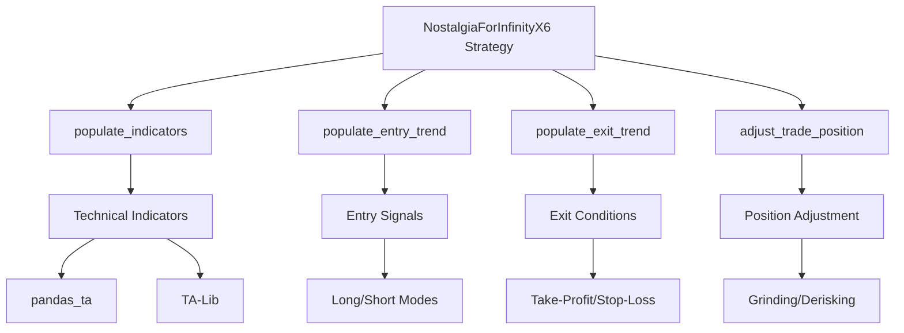
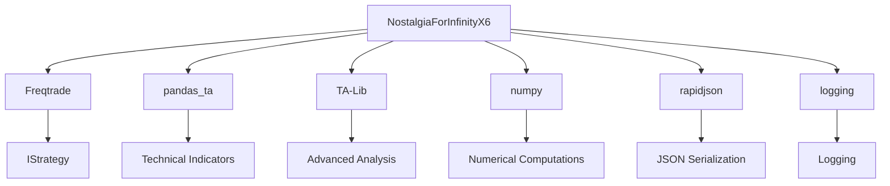

# API Reference

<cite>
**Referenced Files in This Document**
- [NostalgiaForInfinityX6.py](file://NostalgiaForInfinityX6.py)
</cite>

## Table of Contents
1. [Introduction](#introduction)
2. [Project Structure](#project-structure)
3. [Core Components](#core-components)
4. [Architecture Overview](#architecture-overview)
5. [Detailed Component Analysis](#detailed-component-analysis)
6. [Dependency Analysis](#dependency-analysis)
7. [Performance Considerations](#performance-considerations)
8. [Troubleshooting Guide](#troubleshooting-guide)
9. [Conclusion](#conclusion)

## Introduction
The NostalgiaForInfinityX6 strategy is a sophisticated trading algorithm designed for the Freqtrade bot, supporting both long and short positions across multiple trading modes such as normal, pump, quick, rebuy, rapid, grind, top coins, and scalp. It leverages technical indicators from pandas_ta and TA-Lib to generate entry and exit signals, with advanced features like position adjustment, derisking, grinding, and trailing stops. The strategy is optimized for 5-minute timeframes and supports futures and spot trading modes on various exchanges. It includes comprehensive risk management, customizable stake amounts, and integration with external systems for enhanced performance.

## Project Structure
The project structure is organized into several directories, each serving a specific purpose:
- **configs**: Contains configuration files for different exchanges and trading modes.
- **tests**: Includes backtesting scripts and unit tests for validating strategy performance.
- **tools**: Houses utility scripts for data management.
- **user_data/strategies**: Contains the main strategy file, NostalgiaForInfinityX6.py.
- **README.md**: Provides an overview of the project and setup instructions.
- **docker-compose.yml**: Configuration for Docker deployment.
- **mkdocs.yml**: Configuration for documentation generation.
- **pyproject.toml**: Project metadata and dependencies.

The strategy file is located at `NostalgiaForInfinityX6.py` and is the primary component responsible for implementing the trading logic.

## Core Components
The core components of the NostalgiaForInfinityX6 strategy include:
- **populate_indicators**: Calculates technical indicators using pandas_ta and TA-Lib.
- **populate_entry_trend**: Determines entry signals based on various conditions.
- **populate_exit_trend**: Defines exit conditions including take-profit, stop-loss, and trailing mechanisms.
- **adjust_trade_position**: Manages position adjustments for grinding, derisking, and rebuy.
- **is_during_bull_trend**: Checks if the market is in a bull trend.
- **should_grind**: Determines if grinding should be applied.
- **calculate_derisk_price**: Calculates the price for derisking.

These components work together to provide a robust trading strategy with advanced risk management and position adjustment capabilities.

**Section sources**
- [NostalgiaForInfinityX6.py](file://NostalgiaForInfinityX6.py#L1-L65286)

## Architecture Overview
The architecture of the NostalgiaForInfinityX6 strategy is modular and extensible, designed to support multiple trading modes and configurations. It integrates with the Freqtrade bot through the IStrategy interface, overriding key methods to customize behavior. The strategy uses a combination of technical indicators, market conditions, and user-defined parameters to make trading decisions. It supports both spot and futures trading, with configurable leverage and risk settings.

**Diagram sources**
- [NostalgiaForInfinityX6.py](file://NostalgiaForInfinityX6.py#L1-L65286)

## Detailed Component Analysis

### populate_indicators Method
The `populate_indicators` method calculates a wide range of technical indicators using pandas_ta and TA-Lib. These indicators include RSI, EMA, SMA, BB, MFI, CMF, Williams %R, Stochastic RSI, KST, ROC, AROON, UO, OBV, and more. The method processes data from multiple timeframes (5m, 15m, 1h, 4h, 1d) and merges them into a single DataFrame for analysis.

**Section sources**
- [NostalgiaForInfinityX6.py](file://NostalgiaForInfinityX6.py#L3449-L8683)

### populate_entry_trend Method
The `populate_entry_trend` method determines entry signals based on various conditions defined in the `long_entry_signal_params` and `short_entry_signal_params` dictionaries. It evaluates market conditions, technical indicators, and user-defined parameters to decide when to enter a trade. The method supports multiple trading modes, each with its own set of conditions.

**Section sources**
- [NostalgiaForInfinityX6.py](file://NostalgiaForInfinityX6.py#L1-L65286)

### populate_exit_trend Method
The `populate_exit_trend` method defines exit conditions for trades, including take-profit, stop-loss, and trailing mechanisms. It uses the `custom_exit` method to evaluate profit and loss thresholds, market conditions, and technical indicators to determine when to exit a trade. The method supports different exit strategies for various trading modes.

**Section sources**
- [NostalgiaForInfinityX6.py](file://NostalgiaForInfinityX6.py#L1600-L2399)

### adjust_trade_position Method
The `adjust_trade_position` method manages position adjustments for grinding, derisking, and rebuy. It evaluates the current trade status, market conditions, and user-defined parameters to decide whether to adjust the position. The method supports different adjustment strategies for long and short positions, including rebuy, grind, and derisk.

**Section sources**
- [NostalgiaForInfinityX6.py](file://NostalgiaForInfinityX6.py#L2400-L3199)

### Custom Methods
The strategy includes several custom methods for specific functionalities:
- **is_during_bull_trend**: Checks if the market is in a bull trend based on technical indicators.
- **should_grind**: Determines if grinding should be applied based on market conditions and user-defined parameters.
- **calculate_derisk_price**: Calculates the price for derisking based on profit and loss thresholds.

These methods enhance the strategy's ability to adapt to changing market conditions and manage risk effectively.

**Section sources**
- [NostalgiaForInfinityX6.py](file://NostalgiaForInfinityX6.py#L1-L65286)

## Dependency Analysis
The NostalgiaForInfinityX6 strategy depends on several external libraries and modules:
- **Freqtrade**: Provides the IStrategy interface and core trading functionalities.
- **pandas_ta**: Used for calculating technical indicators.
- **TA-Lib**: Used for advanced technical analysis.
- **numpy**: Used for numerical computations.
- **rapidjson**: Used for JSON serialization.
- **logging**: Used for logging and debugging.

The strategy also integrates with external systems such as Freqtrade bot for trade execution and market data retrieval.

**Diagram sources**
- [NostalgiaForInfinityX6.py](file://NostalgiaForInfinityX6.py#L1-L65286)

## Performance Considerations
The NostalgiaForInfinityX6 strategy is optimized for performance, with efficient use of technical indicators and market data. It supports parallel processing for indicator calculations using the `num_cores_indicators_calc` parameter. The strategy also includes performance logging to monitor execution time and identify bottlenecks. However, users should be aware of the computational overhead associated with processing multiple timeframes and indicators, especially in backtesting scenarios.

## Troubleshooting Guide
Common issues and their solutions:
- **Indicator Calculation Errors**: Ensure that all required libraries are installed and up-to-date.
- **Trade Execution Failures**: Check the Freqtrade bot configuration and ensure that the API keys are correct.
- **Performance Bottlenecks**: Optimize the number of cores used for indicator calculations and reduce the number of timeframes if necessary.
- **Configuration Issues**: Verify that the configuration files are correctly formatted and all required parameters are set.

For further assistance, refer to the project's GitHub repository and community forums.

**Section sources**
- [NostalgiaForInfinityX6.py](file://NostalgiaForInfinityX6.py#L1-L65286)

## Conclusion
The NostalgiaForInfinityX6 strategy is a powerful and flexible trading algorithm that leverages advanced technical analysis and risk management techniques. It is well-suited for both spot and futures trading on various exchanges, with support for multiple trading modes and customizable parameters. By following the documentation and best practices outlined in this guide, users can effectively deploy and optimize the strategy for their trading needs.
