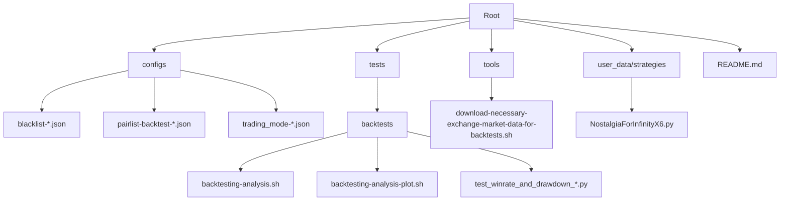
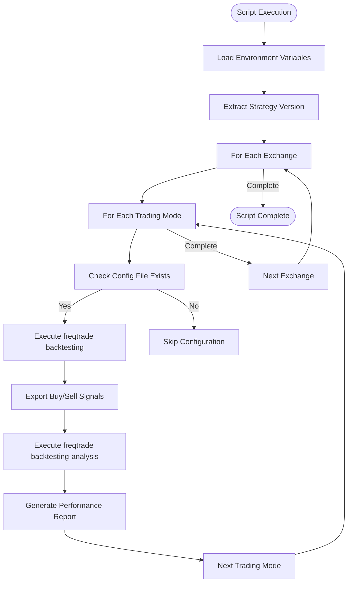
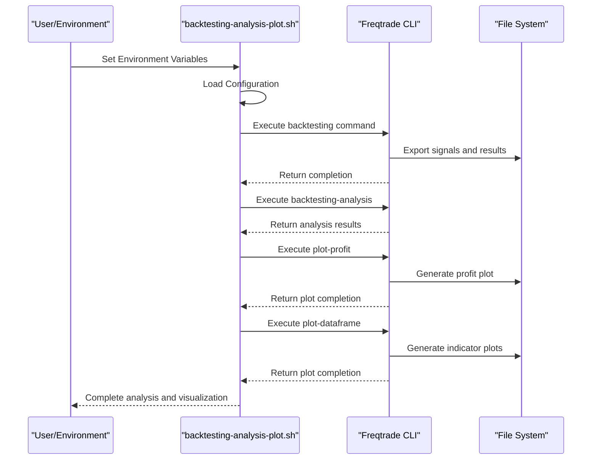

# Backtesting Analysis and Visualization

<cite>
**Referenced Files in This Document**   
- [backtesting-analysis.sh](file://tests/backtests/backtesting-analysis.sh)
- [backtesting-analysis-plot.sh](file://tests/backtests/backtesting-analysis-plot.sh)
- [README.md](file://README.md)
- [NostalgiaForInfinityX6.py](file://NostalgiaForInfinityX6.py)
- [test_winrate_and_drawdown_week.py](file://tests/backtests/test_winrate_and_drawdown_week.py)
- [test_winrate_and_drawdown_quarter.py](file://tests/backtests/test_winrate_and_drawdown_quarter.py)
- [test_winrate_and_drawdown_year.py](file://tests/backtests/test_winrate_and_drawdown_year.py)
</cite>

## Table of Contents
1. [Introduction](#introduction)
2. [Project Structure](#project-structure)
3. [Core Components](#core-components)
4. [Backtesting Analysis Script Functionality](#backtesting-analysis-script-functionality)
5. [Backtesting Analysis and Plotting Script](#backtesting-analysis-and-plotting-script)
6. [Performance Testing Across Time Granularities](#performance-testing-across-time-granularities)
7. [Statistical Interpretation and Strategy Robustness](#statistical-interpretation-and-strategy-robustness)
8. [Overfitting Detection and Validation Techniques](#overfitting-detection-and-validation-techniques)
9. [Parameter Optimization and Risk Management](#parameter-optimization-and-risk-management)
10. [Common Backtesting Pitfalls](#common-backtesting-pitfalls)
11. [Conclusion](#conclusion)

## Introduction
This document provides a comprehensive analysis of the backtesting framework used in the NostalgiaForInfinity trading strategy repository. The focus is on understanding how backtesting results are analyzed and visualized to evaluate trading strategy performance. The system leverages Freqtrade, an open-source cryptocurrency trading bot, to conduct backtests and generate performance metrics. The analysis tools help users interpret results, identify potential issues like overfitting, and optimize strategy parameters for improved risk-adjusted returns.

**Section sources**
- [README.md](file://README.md#L1-L57)

## Project Structure
The repository follows a modular structure organized by functionality. Configuration files are stored in the `configs/` directory, test scripts in `tests/backtests/`, and the core trading strategy in `user_data/strategies/`. The `tests/backtests/` directory contains shell scripts for executing backtests and analyzing results, along with Python test files for validating performance across different time periods. Pair lists are organized by exchange and trading mode (spot vs futures), enabling targeted testing on specific market conditions. The presence of both static and volume-based pair lists allows for flexibility in backtesting scenarios.

**Diagram sources**
- [configs](file://configs)
- [tests/backtests](file://tests/backtests)
- [user_data/strategies](file://user_data/strategies)

## Core Components
The core components of the backtesting analysis system include the main strategy file `NostalgiaForInfinityX6.py`, the analysis scripts `backtesting-analysis.sh` and `backtesting-analysis-plot.sh`, and a suite of Python test files for time-based performance validation. The strategy implements technical indicators and trading logic for cryptocurrency markets. The shell scripts automate the execution of Freqtrade commands for backtesting, analysis, and visualization. The test files validate key performance metrics across different time granularities, ensuring consistency in strategy behavior.

**Section sources**
- [NostalgiaForInfinityX6.py](file://NostalgiaForInfinityX6.py)
- [backtesting-analysis.sh](file://tests/backtests/backtesting-analysis.sh)
- [backtesting-analysis-plot.sh](file://tests/backtests/backtesting-analysis-plot.sh)

## Backtesting Analysis Script Functionality
The `backtesting-analysis.sh` script automates the process of running backtests and analyzing results for the NostalgiaForInfinityX6 strategy. It supports configurable parameters through environment variables such as `EXCHANGE`, `TRADING_MODE`, `STRATEGY_NAME`, `STRATEGY_VERSION`, and `TIMERANGE`. The script dynamically determines the appropriate configuration files based on these parameters and executes Freqtrade backtesting with detailed signal export. Key features include:

- **Dynamic Configuration**: Uses environment variables to determine exchange, trading mode, and time range
- **Comprehensive Signal Export**: Runs backtesting with `--export signals` and high-resolution timeframe detail (1m)
- **Aggressive Testing Parameters**: Uses `--dry-run-wallet 100000`, `--stake-amount 100`, and `--max-open-trades 1000` to capture all possible buy signals
- **Automated Analysis**: Executes `freqtrade backtesting-analysis` with analysis groups 0-5 to evaluate performance across different metrics
- **Version Tracking**: Extracts strategy version from the Python file for result labeling

The script processes each combination of exchange and trading mode, generating backtest results and analysis reports. It creates log files and JSON exports in designated directories for later review. The analysis phase evaluates performance metrics such as win rate, drawdown, profit factor, and Sharpe ratio across different time periods and market conditions.

**Diagram sources**
- [backtesting-analysis.sh](file://tests/backtests/backtesting-analysis.sh#L1-L150)

**Section sources**
- [backtesting-analysis.sh](file://tests/backtests/backtesting-analysis.sh#L1-L150)

## Backtesting Analysis and Plotting Script
The `backtesting-analysis-plot.sh` script extends the functionality of `backtesting-analysis.sh` by adding visualization capabilities. In addition to running backtests and performance analysis, it generates graphical representations of trading results using Freqtrade's plotting functionality. The script executes three key visualization commands:

- **Equity Curve**: Uses `freqtrade plot-profit` to visualize the equity curve over time, showing the growth or decline of the trading account balance
- **Indicator Visualization**: Uses `freqtrade plot-dataframe` to display technical indicators alongside price data, helping to understand the relationship between signals and market conditions
- **Trade Distribution**: Implicitly supports analysis of trade frequency and distribution through the exported signals

The script plots key technical indicators such as EMA_200, RSI at multiple timeframes (3 and 14 periods at 15m, 1h, 4h, and 1d intervals), and CCI at multiple timeframes. These visualizations help traders understand how the strategy responds to different market conditions and whether signals are generated consistently across timeframes. The plotting functionality is particularly valuable for identifying periods of poor performance and understanding the context in which buy and sell signals are generated.

**Diagram sources**
- [backtesting-analysis-plot.sh](file://tests/backtests/backtesting-analysis-plot.sh#L1-L183)

**Section sources**
- [backtesting-analysis-plot.sh](file://tests/backtests/backtesting-analysis-plot.sh#L1-L183)

## Performance Testing Across Time Granularities
The repository includes a suite of Python test files designed to validate strategy performance across different time granularities: weekly, quarterly, and annual periods. These tests (`test_winrate_and_drawdown_week.py`, `test_winrate_and_drawdown_quarter.py`, `test_winrate_and_drawdown_year.py`) systematically evaluate key performance metrics to assess strategy consistency. The testing framework likely uses pytest to organize test cases and assertions.

The time-based testing approach enables the detection of seasonal patterns, market regime changes, and periods of strategy degradation. By breaking down performance analysis into different time windows, traders can identify whether a strategy performs consistently across market cycles or if it is overly dependent on specific market conditions. This granular analysis is crucial for assessing strategy robustness and avoiding overfitting to particular historical periods.

**Section sources**
- [test_winrate_and_drawdown_week.py](file://tests/backtests/test_winrate_and_drawdown_week.py)
- [test_winrate_and_drawdown_quarter.py](file://tests/backtests/test_winrate_and_drawdown_quarter.py)
- [test_winrate_and_drawdown_year.py](file://tests/backtests/test_winrate_and_drawdown_year.py)

## Statistical Interpretation and Strategy Robustness
Interpreting backtesting results requires careful analysis of multiple performance metrics to assess strategy robustness. Key metrics include:

- **Win Rate**: Percentage of winning trades, indicating the strategy's accuracy in predicting price movements
- **Drawdown**: Maximum peak-to-trough decline, measuring risk and potential losses
- **Profit Factor**: Ratio of gross profits to gross losses, indicating the strategy's profitability efficiency
- **Sharpe Ratio**: Risk-adjusted return metric, measuring excess return per unit of risk
- **Expectancy**: Average profit per trade, combining win rate and average win/loss sizes

A robust strategy should demonstrate consistent performance across different market conditions and time periods. High win rates with low drawdowns and strong profit factors indicate a potentially viable strategy. However, these metrics must be evaluated in context, considering market volatility and the specific characteristics of cryptocurrency markets. The analysis scripts in this repository enable comprehensive evaluation of these metrics across multiple exchanges and trading modes.

## Overfitting Detection and Validation Techniques
The repository implements several techniques to detect and prevent overfitting:

- **Out-of-Sample Testing**: The use of different time ranges (via `TIMERANGE` parameter) allows testing on unseen data
- **Walk-Forward Analysis**: Testing across multiple time periods (week, quarter, year) simulates walk-forward optimization
- **Multi-Exchange Validation**: Testing on multiple exchanges (Binance, GateIO, OKX) ensures the strategy isn't overfitted to a single market's characteristics
- **Multi-Mode Testing**: Evaluation on both spot and futures markets tests robustness across different trading environments

The "focus group" testing approach, as indicated by the pairlist files, suggests targeted testing on specific subsets of pairs to identify edge cases and potential weaknesses. The aggressive testing parameters (`--max-open-trades 1000`, `--dry-run-wallet 100000`) are designed to surface all possible buy signals, making it easier to identify "bad buys" that could indicate overfitting or flawed logic.

## Parameter Optimization and Risk Management
The backtesting framework supports parameter optimization by enabling systematic testing of different configurations. The environment variable system allows for easy modification of key parameters such as trading mode, exchange, and time range. This facilitates A/B testing of different strategy versions and parameter sets.

For risk management, the analysis provides insights into maximum drawdown, which is critical for position sizing and risk allocation. The high-resolution signal export (1m timeframe detail) enables detailed analysis of trade entry and exit timing, helping to refine risk parameters. The visualization tools support identification of periods of high volatility or poor performance, informing risk management decisions such as position sizing adjustments or temporary strategy deactivation.

## Common Backtesting Pitfalls
Several common backtesting pitfalls are addressed or could be mitigated using this framework:

- **Survivorship Bias**: The use of historical pair lists (e.g., `pairs-available-binance-spot-usdt-2017.json`) that reflect actually available pairs at specific times helps reduce survivorship bias
- **Curve Fitting**: The multi-period, multi-exchange testing approach helps detect overfitting to specific market conditions
- **Look-Ahead Bias**: Freqtrade's backtesting engine prevents look-ahead bias by processing data sequentially
- **Transaction Cost Neglect**: The framework allows configuration of fees and slippage through the example configuration files
- **Short-Term Performance Misinterpretation**: The long-term testing capability (back to 2017 for some exchanges) provides context for evaluating performance beyond short-term results

The repository's emphasis on comprehensive, long-duration testing across multiple market conditions helps mitigate these common pitfalls and provides a more realistic assessment of strategy performance.

## Conclusion
The backtesting analysis and visualization framework in the NostalgiaForInfinity repository provides a comprehensive system for evaluating trading strategy performance. By automating backtests, analysis, and visualization across multiple exchanges, trading modes, and time periods, it enables thorough assessment of strategy robustness and risk characteristics. The integration of statistical testing, visualization tools, and multi-granularity validation creates a powerful environment for strategy development and optimization. This systematic approach to backtesting helps traders make informed decisions about strategy viability, parameter optimization, and risk management, ultimately leading to more robust and reliable trading systems.