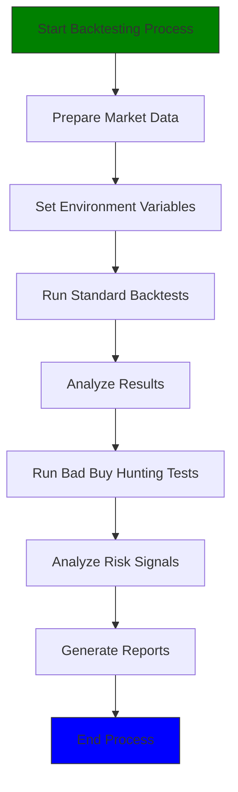
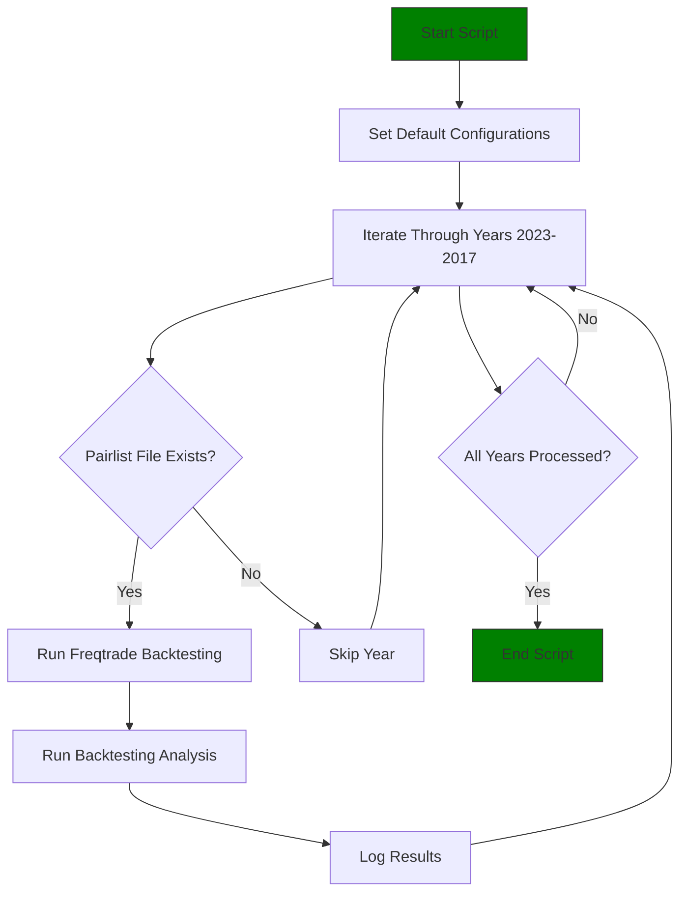
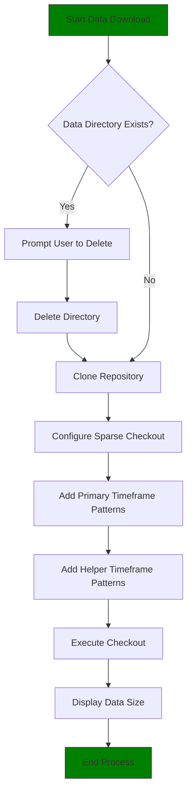
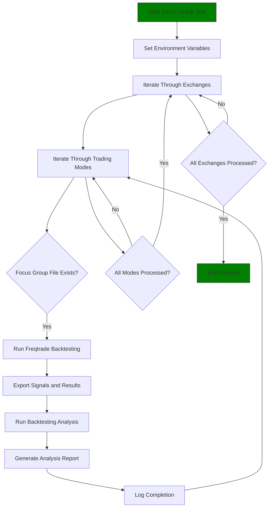
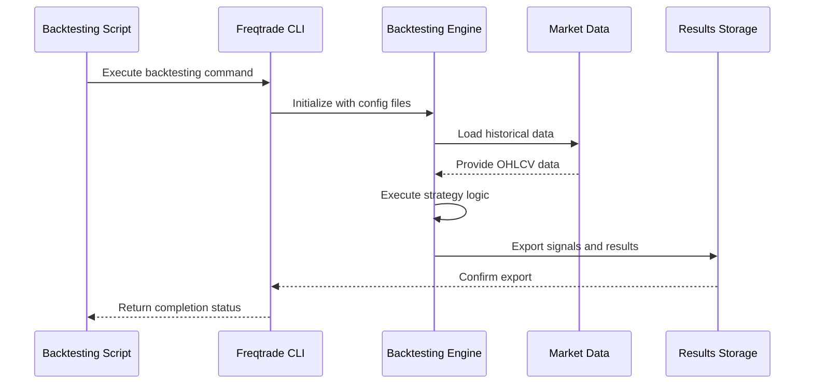

# Backtesting Execution

<cite>
**Referenced Files in This Document**   
- [backtesting-all.sh](file://tests/backtests/backtesting-all.sh)
- [backtesting-all-years-all-pairs.sh](file://tests/backtests/backtesting-all-years-all-pairs.sh)
- [backtesting-for-hunting-bad-buys.sh](file://tests/backtests/backtesting-for-hunting-bad-buys.sh)
- [backtesting-focus-group.sh](file://tests/backtests/backtesting-focus-group.sh)
- [download-necessary-exchange-market-data-for-backtests.sh](file://tools/download-necessary-exchange-market-data-for-backtests.sh)
- [exampleconfig.json](file://configs/exampleconfig.json)
- [NostalgiaForInfinityX6.py](file://NostalgiaForInfinityX6.py)
- [pairlist-backtest-static-focus-group-binance-futures-usdt.json](file://tests/backtests/pairlist-backtest-static-focus-group-binance-futures-usdt.json)
- [pairs-available-binance-futures-usdt-2019.json](file://tests/backtests/pairs-available-binance-futures-usdt-2019.json)
</cite>

## Table of Contents
1. [Introduction](#introduction)
2. [Backtesting Workflow Overview](#backtesting-workflow-overview)
3. [Core Backtesting Scripts](#core-backtesting-scripts)
4. [Data Preparation and Market Data Management](#data-preparation-and-market-data-management)
5. [Execution of Comprehensive Backtesting Cycles](#execution-of-comprehensive-backtesting-cycles)
6. [Focus Group Analysis for High-Potential Pairs](#focus-group-analysis-for-high-potential-pairs)
7. [Bad Buy Signal Detection and Risk Mitigation](#bad-buy-signal-detection-and-risk-mitigation)
8. [Command-Line Usage and Parameter Customization](#command-line-usage-and-parameter-customization)
9. [Integration with Freqtrade Backtesting Engine](#integration-with-freqtrade-backtesting-engine)
10. [Common Execution Issues and Troubleshooting](#common-execution-issues-and-troubleshooting)
11. [Performance Considerations and Resource Allocation](#performance-considerations-and-resource-allocation)

## Introduction
This document provides a comprehensive guide to the backtesting execution process within the NostalgiaForInfinity repository. It details how shell scripts orchestrate backtesting workflows across various exchanges, trading modes (spot and futures), and timeframes. The system is designed to rigorously evaluate trading strategies using Freqtrade's backtesting engine, ensuring robustness before live deployment. The backtesting framework includes scripts for full-scale strategy evaluation, multi-year and multi-pair analysis, and focused testing on high-potential trading pairs. A dedicated market data download tool ensures historical data integrity. This documentation covers step-by-step execution, parameter customization, integration details, common issues, and performance optimization strategies.

## Backtesting Workflow Overview
The backtesting workflow is orchestrated through a series of shell scripts that automate the execution of Freqtrade backtesting commands across different configurations. The primary workflow begins with data preparation, followed by strategy simulation, result analysis, and reporting. The system supports testing on multiple exchanges including Binance, Kucoin, OKX, and Gate.io, in both spot and futures trading modes. The workflow is designed to be exhaustive, capable of running tests over all available historical periods and trading pairs. Two main testing phases are implemented: standard backtesting to evaluate overall strategy performance, and bad buy hunting to identify and mitigate potential risks. The workflow leverages environment variables for configuration, allowing flexible parameter customization without modifying script files.



**Diagram sources**
- [backtesting-all.sh](file://tests/backtests/backtesting-all.sh#L1-L50)
- [download-necessary-exchange-market-data-for-backtests.sh](file://tools/download-necessary-exchange-market-data-for-backtests.sh#L1-L20)

**Section sources**
- [backtesting-all.sh](file://tests/backtests/backtesting-all.sh#L1-L50)
- [backtesting-all-years-all-pairs.sh](file://tests/backtests/backtesting-all-years-all-pairs.sh#L1-L30)

## Core Backtesting Scripts

### backtesting-all.sh
The `backtesting-all.sh` script serves as the master orchestrator for comprehensive strategy evaluation. It systematically executes backtests across all supported exchanges and trading modes. The script first runs standard backtests in futures and spot modes on Binance, Kucoin, OKX, and Gate.io. After completing the standard evaluation, it initiates a second phase focused on detecting bad buy signals using a more aggressive testing configuration. The script uses environment variables to configure the exchange, trading mode, strategy name, and version. It calls the `backtesting-all-years-all-pairs.sh` script for standard testing and `backtesting-for-hunting-bad-buys.sh` for risk detection. The script is designed to be resource-intensive, requiring a powerful multi-core CPU and at least 96GB of RAM for complete execution, which can take up to four days.

**Section sources**
- [backtesting-all.sh](file://tests/backtests/backtesting-all.sh#L50-L475)

### backtesting-all-years-all-pairs.sh
The `backtesting-all-years-all-pairs.sh` script performs comprehensive backtesting across all available historical periods and trading pairs. It iterates through years from 2023 to 2017, running backtests for each year using the corresponding pairlist file (e.g., `pairs-available-binance-futures-usdt-2019.json`). The script configures the testing environment based on environment variables, defaulting to Binance spot trading if not specified. For each year, it executes a Freqtrade backtesting command with signal export, using the specified strategy and configuration files. After the backtest, it runs backtesting analysis to evaluate performance metrics. The script supports custom timeranges through the TIMERANGE environment variable, allowing focused testing on specific periods to reduce execution time.



**Diagram sources**
- [backtesting-all-years-all-pairs.sh](file://tests/backtests/backtesting-all-years-all-pairs.sh#L30-L143)

**Section sources**
- [backtesting-all-years-all-pairs.sh](file://tests/backtests/backtesting-all-years-all-pairs.sh#L1-L143)

### backtesting-for-hunting-bad-buys.sh
The `backtesting-for-hunting-bad-buys.sh` script is designed to identify potential bad buy signals in the trading strategy. It runs backtests with aggressive parameters to expose weaknesses in the strategy's entry logic. The script uses a 1-minute timeframe detail (`--timeframe-detail 1m`) to capture high-frequency trading signals that might be missed in standard 5-minute timeframe testing. It configures the backtest with a large dry-run wallet (`--dry-run-wallet 100000`), small stake amount (`--stake-amount 100`), and high maximum open trades (`--max-open-trades 1000`) to simulate aggressive trading behavior. The `--eps` flag enables entry price simulation for more accurate signal evaluation. This script is crucial for risk mitigation, helping to identify and fix problematic entry conditions before live deployment.

**Section sources**
- [backtesting-for-hunting-bad-buys.sh](file://tests/backtests/backtesting-for-hunting-bad-buys.sh#L1-L147)

## Data Preparation and Market Data Management
Proper market data preparation is critical for accurate backtesting results. The repository includes the `download-necessary-exchange-market-data-for-backtests.sh` script to automate data acquisition from the HistoricalDataForTradeBacktest repository. This script uses Git sparse checkout to efficiently download only the required data, minimizing bandwidth and storage usage. It supports configuration of exchanges, trading modes, and timeframes through environment variables. By default, it downloads 5-minute primary data and helper timeframes (1-day, 4-hour, 1-hour, 15-minute, and 1-minute) for Binance and Kucoin spot markets. The script first checks if the user_data/data directory exists and prompts for deletion if present, ensuring a clean data state. After configuring sparse checkout patterns, it clones the repository and checks out the specified data files.



**Diagram sources**
- [download-necessary-exchange-market-data-for-backtests.sh](file://tools/download-necessary-exchange-market-data-for-backtests.sh#L1-L90)

**Section sources**
- [download-necessary-exchange-market-data-for-backtests.sh](file://tools/download-necessary-exchange-market-data-for-backtests.sh#L1-L90)

## Execution of Comprehensive Backtesting Cycles
Executing a full backtesting cycle involves several sequential steps, beginning with data preparation and culminating in comprehensive analysis. First, ensure market data is downloaded by running the data download script: `bash tools/download-necessary-exchange-market-data-for-backtests.sh`. Once data is available, initiate the comprehensive backtesting process by executing `bash tests/backtests/backtesting-all.sh`. This master script will automatically run through all exchanges and trading modes. For faster testing on a specific timeframe, set the TIMERANGE environment variable before execution: `export TIMERANGE=20230101-20230501`. After the backtests complete, results are stored in the user_data/backtest_results directory as JSON files, while logs are saved in user_data/logs. The process includes both standard evaluation and bad buy hunting phases, providing a complete assessment of strategy performance and risk profile.

**Section sources**
- [backtesting-all.sh](file://tests/backtests/backtesting-all.sh#L1-L475)
- [backtesting-all-years-all-pairs.sh](file://tests/backtests/backtesting-all-years-all-pairs.sh#L1-L143)

## Focus Group Analysis for High-Potential Pairs
The repository includes specialized scripts for focus group analysis, allowing targeted testing on high-potential trading pairs. The `backtesting-focus-group.sh` script enables concentrated evaluation of specific pairlists defined in focus group configuration files (e.g., `pairlist-backtest-static-focus-group-binance-futures-usdt.json`). This approach is valuable for in-depth analysis of promising trading pairs without the computational overhead of testing all available pairs. The script supports multiple exchanges and trading modes through environment variables. It runs backtests with detailed parameters including 1-minute timeframe analysis and comprehensive signal export. After testing, it automatically performs backtesting analysis on the results. Focus group testing is particularly useful during strategy optimization, allowing rapid iteration on a curated set of high-performing pairs.



**Diagram sources**
- [backtesting-focus-group.sh](file://tests/backtests/backtesting-focus-group.sh#L30-L150)

**Section sources**
- [backtesting-focus-group.sh](file://tests/backtests/backtesting-focus-group.sh#L1-L150)
- [pairlist-backtest-static-focus-group-binance-futures-usdt.json](file://tests/backtests/pairlist-backtest-static-focus-group-binance-futures-usdt.json#L1-L10)

## Bad Buy Signal Detection and Risk Mitigation
The bad buy signal detection process is a critical component of the backtesting framework, designed to identify and mitigate potential risks in the trading strategy. This process is executed through the `backtesting-for-hunting-bad-buys.sh` script, which runs after the standard backtesting phase in the master `backtesting-all.sh` script. The detection methodology involves running backtests with parameters that maximize the exposure of entry signals: a large virtual wallet, small stake amounts, and a high limit on open trades. The 1-minute timeframe detail ensures that even brief market conditions triggering entries are captured. The `--eps` flag enables precise entry price simulation, revealing potential slippage issues. By analyzing the exported signals, developers can identify patterns of poor entry timing, excessive trading frequency, or vulnerability to market manipulation, allowing for targeted strategy improvements.

**Section sources**
- [backtesting-all.sh](file://tests/backtests/backtesting-all.sh#L300-L475)
- [backtesting-for-hunting-bad-buys.sh](file://tests/backtests/backtesting-for-hunting-bad-buys.sh#L1-L147)

## Command-Line Usage and Parameter Customization
The backtesting scripts support extensive parameter customization through environment variables, allowing flexible configuration without modifying script files. Key customizable parameters include:
- **EXCHANGE**: Specifies the exchange (e.g., binance, kucoin, okx, gateio)
- **TRADING_MODE**: Sets the trading mode (spot or futures)
- **STRATEGY_NAME**: Defines the strategy file name (default: NostalgiaForInfinityX6)
- **STRATEGY_VERSION**: Overrides the strategy version identifier
- **TIMERANGE**: Limits the backtesting period (e.g., 20230101-20230501)

To customize a backtest, set environment variables before script execution:
```bash
export EXCHANGE=binance
export TRADING_MODE=futures
export TIMERANGE=20230101-
bash tests/backtests/backtesting-all-years-all-pairs.sh
```

The scripts include default values for all parameters, making them immediately executable without configuration. Advanced users can also modify Freqtrade configuration through environment variables prefixed with FREQTRADE__, such as FREQTRADE__EXCHANGE__CCXT_CONFIG__RATELIMIT for rate limiting adjustments.

**Section sources**
- [backtesting-all-years-all-pairs.sh](file://tests/backtests/backtesting-all-years-all-pairs.sh#L30-L80)
- [backtesting-for-hunting-bad-buys.sh](file://tests/backtests/backtesting-for-hunting-bad-buys.sh#L30-L80)

## Integration with Freqtrade Backtesting Engine
The backtesting scripts integrate seamlessly with the Freqtrade backtesting engine through command-line interface calls. Each script constructs and executes Freqtrade commands with specific parameters tailored to the testing objective. The integration uses multiple configuration files loaded via the `-c` flag, including trading mode configurations, example configurations, and pairlist specifications. Strategy files are referenced by name and located in the specified strategy path. Results are exported in JSON format for programmatic analysis, while logs provide detailed execution information. The `--cache none` parameter ensures fresh data loading for each test, preventing cached results from affecting accuracy. The integration also supports detailed breakdowns by day (`--breakdown day`) and signal export (`--export signals`) for comprehensive post-test analysis.



**Diagram sources**
- [backtesting-all-years-all-pairs.sh](file://tests/backtests/backtesting-all-years-all-pairs.sh#L100-L130)
- [exampleconfig.json](file://configs/exampleconfig.json#L1-L108)

**Section sources**
- [backtesting-all-years-all-pairs.sh](file://tests/backtests/backtesting-all-years-all-pairs.sh#L1-L143)
- [exampleconfig.json](file://configs/exampleconfig.json#L1-L108)

## Common Execution Issues and Troubleshooting
Several common issues may arise during backtesting execution, along with established solutions:

**Missing Dependencies**: Ensure Freqtrade is properly installed and accessible in the system path. Verify Python dependencies by checking the requirements.txt files in the tests directory.

**Incorrect Paths**: The scripts assume a specific directory structure. Ensure the repository is cloned to the expected location and that relative paths in the scripts match the actual structure. The user_data directory must exist for logs and results.

**Insufficient Historical Data**: If backtests fail due to missing data, run the market data download script and verify the required feather files exist in user_data/data. Check that the sparse checkout included the necessary timeframes and exchanges.

**Connection Errors**: For exchange connection issues, particularly with Binance, adjust the rate limit: `export FREQTRADE__EXCHANGE__CCXT_CONFIG__RATELIMIT=400`. For users behind proxies, configure proxy settings using FREQTRADE__EXCHANGE_CONFIG__CCXT_CONFIG__AIOHTTP_PROXY.

**Memory Exhaustion**: Given the resource-intensive nature of comprehensive backtesting, ensure adequate RAM (96GB minimum recommended). Consider running tests on smaller timeranges or specific exchanges to reduce memory usage.

**Strategy Version Issues**: The version extraction logic may fail if the strategy file format changes. Verify the version string in the strategy file matches the expected format (return "version" pattern).

**Section sources**
- [backtesting-all.sh](file://tests/backtests/backtesting-all.sh#L1-L475)
- [download-necessary-exchange-market-data-for-backtests.sh](file://tools/download-necessary-exchange-market-data-for-backtests.sh#L1-L90)

## Performance Considerations and Resource Allocation
The backtesting framework is designed for thoroughness rather than speed, requiring significant computational resources. A complete execution of `backtesting-all.sh` can take up to four days and requires a powerful multi-core CPU and minimum 96GB of RAM. To optimize performance, consider the following strategies:

**Selective Testing**: Use the TIMERANGE environment variable to focus on specific periods of interest rather than testing all historical data.

**Targeted Exchanges**: Modify the master script to test only specific exchanges rather than all supported platforms.

**Parallel Execution**: Run backtests for different exchanges or time periods on separate machines or in parallel processes if system resources allow.

**Hardware Optimization**: Use SSD storage for faster data access, and ensure sufficient cooling for sustained CPU performance during long-running tests.

**Incremental Testing**: Begin with focus group testing on high-potential pairs before committing to full-scale comprehensive testing.

The resource requirements reflect the comprehensive nature of the testing process, which is essential for identifying edge cases and potential failures before live deployment.

**Section sources**
- [backtesting-all.sh](file://tests/backtests/backtesting-all.sh#L20-L50)
- [backtesting-all-years-all-pairs.sh](file://tests/backtests/backtesting-all-years-all-pairs.sh#L20-L40)