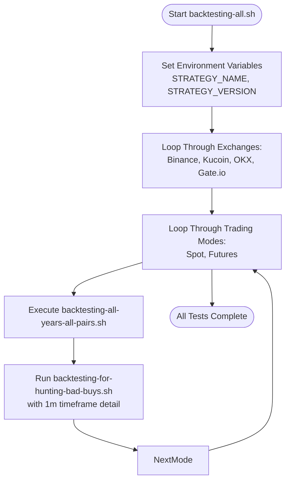
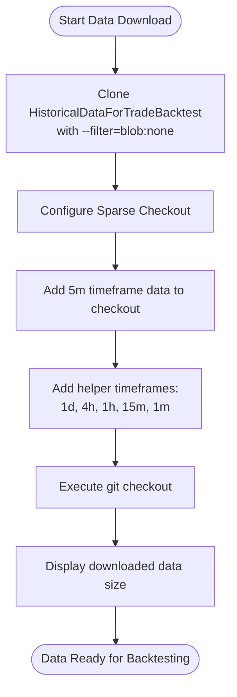
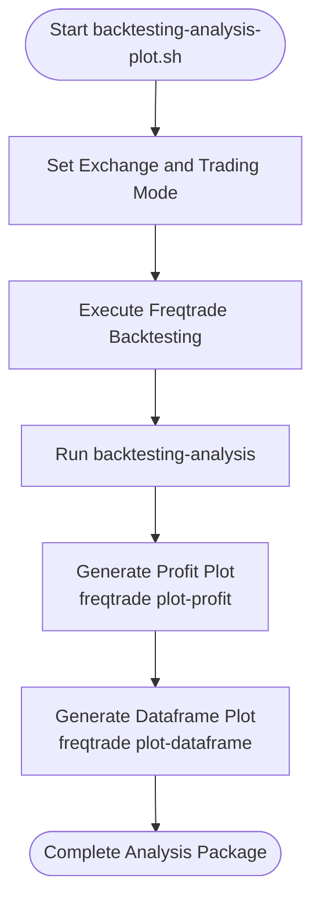
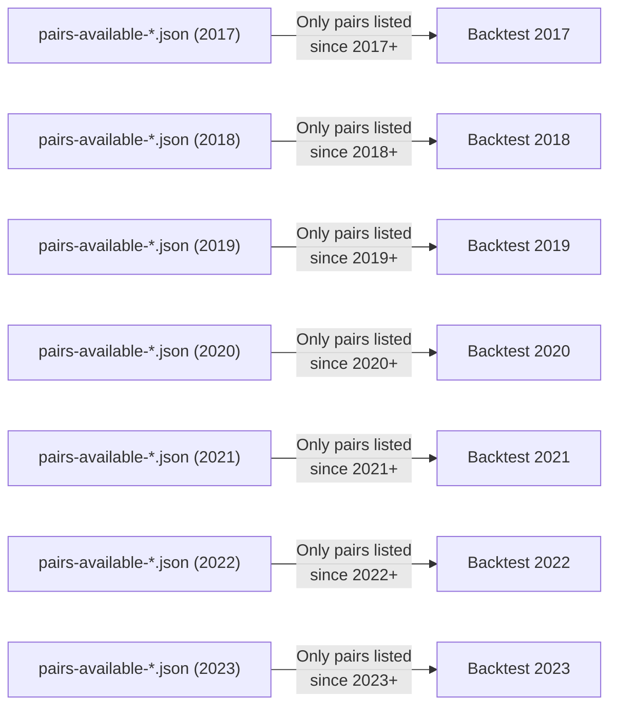

# Backtesting

<cite>
**Referenced Files in This Document**   
- [backtesting-all.sh](file://tests/backtests/backtesting-all.sh)
- [backtesting-all-years-all-pairs.sh](file://tests/backtests/backtesting-all-years-all-pairs.sh)
- [backtesting-focus-group.sh](file://tests/backtests/backtesting-focus-group.sh)
- [backtesting-analysis.sh](file://tests/backtests/backtesting-analysis.sh)
- [backtesting-analysis-plot.sh](file://tests/backtests/backtesting-analysis-plot.sh)
- [download-necessary-exchange-market-data-for-backtests.sh](file://tools/download-necessary-exchange-market-data-for-backtests.sh)
- [pairs-available-binance-futures-usdt-2023.json](file://tests/backtests/pairs-available-binance-futures-usdt-2023.json)
- [pairlist-volume-binance-usdt.json](file://configs/pairlist-volume-binance-usdt.json)
- [trading_mode-futures.json](file://configs/trading_mode-futures.json)
- [NostalgiaForInfinityX6.py](file://NostalgiaForInfinityX6.py)
</cite>

## Table of Contents
1. [Backtesting Infrastructure Overview](#backtesting-infrastructure-overview)
2. [Running Comprehensive Backtests](#running-comprehensive-backtests)
3. [Helper Scripts and Data Preparation](#helper-scripts-and-data-preparation)
4. [Analyzing Results and Visualization](#analyzing-results-and-visualization)
5. [Year-Specific Pair Availability Files](#year-specific-pair-availability-files)
6. [Step-by-Step Example: Binance Futures Backtest](#step-by-step-example-binance-futures-backtest)
7. [Best Practices for Reliable Backtesting](#best-practices-for-reliable-backtesting)
8. [Common Issues and Troubleshooting](#common-issues-and-troubleshooting)
9. [Optimization with Hyperopt](#optimization-with-hyperopt)
10. [Configuration and Parameter Tuning](#configuration-and-parameter-tuning)

## Backtesting Infrastructure Overview

The backtesting infrastructure in the NostalgiaForInfinity repository is designed for comprehensive strategy validation across multiple exchanges, trading modes, and time periods. It leverages Freqtrade's backtesting engine through a suite of shell scripts that automate testing workflows, ensure data accuracy, and support detailed analysis.

The system supports both spot and futures trading modes on major exchanges including Binance, Kucoin, OKX, and Gate.io. It includes specialized scripts for exhaustive testing, focused group analysis, bad buy signal detection, and result visualization. The architecture emphasizes reproducibility, time-consistent testing, and avoidance of lookahead bias through carefully curated pair lists and historical data management.

**Section sources**
- [backtesting-all.sh](file://tests/backtests/backtesting-all.sh#L1-L475)
- [backtesting-all-years-all-pairs.sh](file://tests/backtests/backtesting-all-years-all-pairs.sh#L1-L143)

## Running Comprehensive Backtests

### Primary Backtesting Scripts

The repository provides two main scripts for executing comprehensive backtests:

**`backtesting-all.sh`**: This master script orchestrates full backtesting across all configured exchanges and trading modes. It runs tests in two phases:
- Standard configuration tests (mimicking live trading conditions)
- "Bad Buy Hunting Mode" with high-resolution 1m timeframe analysis



**Diagram sources**
- [backtesting-all.sh](file://tests/backtests/backtesting-all.sh#L1-L475)

**`backtesting-all-years-all-pairs.sh`**: This script performs year-by-year backtesting using time-specific pair availability files. It iterates from 2023 back to 2017, running separate tests for each year to ensure historical accuracy.

Key features:
- Automatic strategy version detection from file modification time
- Configurable timerange via `TIMERANGE` environment variable
- Integration with Freqtrade's backtesting and analysis commands
- Detailed logging and result export

**Section sources**
- [backtesting-all-years-all-pairs.sh](file://tests/backtests/backtesting-all-years-all-pairs.sh#L1-L143)

### Command-Line Arguments and Environment Variables

The backtesting scripts use environment variables for configuration rather than command-line arguments:

| Environment Variable | Default Value | Purpose |
|----------------------|-------------|-------|
| `EXCHANGE` | binance | Target exchange for testing |
| `TRADING_MODE` | spot | Trading mode (spot/futures) |
| `STRATEGY_NAME` | NostalgiaForInfinityX6 | Strategy class name |
| `STRATEGY_VERSION` | auto-detected | Version identifier for results |
| `TIMERANGE` | none | Time period for testing (e.g., 20230101-) |

Example usage:
```bash
export EXCHANGE=binance
export TRADING_MODE=futures
export TIMERANGE=20230101-20231231
./tests/backtests/backtesting-all-years-all-pairs.sh
```

**Section sources**
- [backtesting-all-years-all-pairs.sh](file://tests/backtests/backtesting-all-years-all-pairs.sh#L1-L143)

## Helper Scripts and Data Preparation

### Data Download Script

The `download-necessary-exchange-market-data-for-backtests.sh` script automates the retrieval of historical market data from a dedicated repository. It uses Git's sparse checkout feature to download only required data, minimizing storage and bandwidth usage.



**Diagram sources**
- [download-necessary-exchange-market-data-for-backtests.sh](file://tools/download-necessary-exchange-market-data-for-backtests.sh#L1-L90)

Key configuration options:
- `MAIN_DATA_DIRECTORY`: Location for storing downloaded data
- `TIMEFRAME`: Primary timeframe for backtesting (default: 5m)
- `HELPER_TIME_FRAMES`: Additional timeframes for indicator calculations
- `TRADING_MODE`: Trading mode(s) to download data for
- `EXCHANGE`: Exchange(s) to download data for

The script supports both spot and futures markets and can be customized by modifying the environment variables at the top of the file.

**Section sources**
- [download-necessary-exchange-market-data-for-backtests.sh](file://tools/download-necessary-exchange-market-data-for-backtests.sh#L1-L90)

## Analyzing Results and Visualization

### Analysis Scripts

The repository includes several scripts for analyzing backtesting results:

**`backtesting-analysis.sh`**: Performs statistical analysis on backtesting results using Freqtrade's built-in analysis tools. It groups trades by various criteria and provides detailed performance metrics.

**`backtesting-analysis-plot.sh`**: Extends the analysis script by adding visualization capabilities:
- Profit plots over time
- Dataframe plots with technical indicators
- Trade entry/exit visualization



**Diagram sources**
- [backtesting-analysis-plot.sh](file://tests/backtests/backtesting-analysis-plot.sh#L1-L182)

The analysis scripts use the same configuration pattern as the backtesting scripts, relying on environment variables for flexibility. They automatically detect the strategy version and generate appropriately named output files.

**Section sources**
- [backtesting-analysis-plot.sh](file://tests/backtests/backtesting-analysis-plot.sh#L1-L182)

## Year-Specific Pair Availability Files

### Purpose and Structure

The year-specific pair availability files (e.g., `pairs-available-binance-spot-usdt-2023.json`) are critical for time-consistent backtesting. These files contain lists of trading pairs that were actually available on the exchange during the specified year, preventing lookahead bias.

Each file follows this structure:
```json
{
  "pairlists": [
    {
      "method": "StaticPairList",
      "allow_inactive": true,
      "pairs": ["BTC/USDT:USDT", "ETH/USDT:USDT", ...]
    }
  ]
}
```

**Section sources**
- [pairs-available-binance-futures-usdt-2023.json](file://tests/backtests/pairs-available-binance-futures-usdt-2023.json)

### Role in Backtesting

These files ensure that:
1. Only pairs available during the test period are included
2. New pairs introduced in later years don't influence earlier backtests
3. Delisted pairs are properly excluded from historical tests
4. Results are reproducible and realistic

The `backtesting-all-years-all-pairs.sh` script automatically selects the appropriate file based on the current year in its loop, ensuring temporal accuracy.



**Diagram sources**
- [pairs-available-binance-futures-usdt-2023.json](file://tests/backtests/pairs-available-binance-futures-usdt-2023.json)
- [backtesting-all-years-all-pairs.sh](file://tests/backtests/backtesting-all-years-all-pairs.sh#L1-L143)

## Step-by-Step Example: Binance Futures Backtest

This example demonstrates running a backtest for Binance futures with volume-based pair selection:

### Step 1: Prepare the Environment
```bash
# Set environment variables
export EXCHANGE=binance
export TRADING_MODE=futures
export STRATEGY_NAME=NostalgiaForInfinityX6
```

### Step 2: Ensure Data Availability
```bash
# Download necessary data
./tools/download-necessary-exchange-market-data-for-backtests.sh
```

### Step 3: Configure Volume-Based Pair Selection
Use the `pairlist-volume-binance-usdt.json` configuration which includes:
- Volume-based ranking (top 100 by quote volume)
- Age filter (minimum 60 days listed)
- Price filter (minimum 0.003 low price ratio)
- Spread filter (maximum 0.005 spread ratio)
- Range stability filter

```json
{
  "pairlists": [
    {
      "method": "VolumePairList",
      "number_assets": 100,
      "sort_key": "quoteVolume",
      "refresh_period": 1800
    },
    { "method": "FullTradesFilter" },
    { "method": "AgeFilter", "min_days_listed": 60 },
    {
      "method": "PriceFilter",
      "low_price_ratio": 0.003
    },
    {
      "method": "SpreadFilter",
      "max_spread_ratio": 0.005
    }
  ]
}
```

**Section sources**
- [pairlist-volume-binance-usdt.json](file://configs/pairlist-volume-binance-usdt.json#L1-L40)

### Step 4: Run the Backtest
```bash
# Set timerange for 2023
export TIMERANGE=20230101-20231231

# Run backtest with volume-based pairlist
freqtrade backtesting \
  --timerange 20230101-20231231 \
  --strategy NostalgiaForInfinityX6 \
  --strategy-path . \
  -c configs/trading_mode-futures.json \
  -c configs/exampleconfig.json \
  -c configs/exampleconfig_secret.json \
  -c configs/pairlist-volume-binance-usdt.json \
  --export-filename user_data/backtest_results/NostalgiaForInfinityX6-binance-futures-2023.json
```

### Step 5: Analyze Results
```bash
# Run analysis
freqtrade backtesting-analysis \
  --timerange 20230101-20231231 \
  -c configs/trading_mode-futures.json \
  -c configs/exampleconfig.json \
  -c configs/exampleconfig_secret.json \
  -c configs/pairlist-volume-binance-usdt.json

# Generate visualizations
freqtrade plot-profit --timerange 20230101-20231231 \
  --strategy NostalgiaForInfinityX6 \
  -c configs/trading_mode-futures.json \
  -c configs/pairlist-volume-binance-usdt.json
```

## Best Practices for Reliable Backtesting

### Avoiding Lookahead Bias
- Always use year-specific pair availability files
- Never include pairs that weren't available during the test period
- Use historical data that matches the backtest timeframe
- Validate that your pairlist doesn't contain future information

### Configuring Realistic Fees
Ensure your configuration files include accurate fee structures:
```json
{
  "fee": 0.001,
  "exchange": {
    "name": "binance",
    "sandbox": false
  }
}
```

### Validating Results Across Market Cycles
Test your strategy across multiple market conditions:
- Bull markets (e.g., 2017, 2021)
- Bear markets (e.g., 2018-2019, 2022)
- Sideways markets
- High volatility periods

Use the comprehensive testing scripts to cover multiple years automatically.

### Performance Considerations
- The full backtesting suite can take several days to complete
- Requires minimum 96GB RAM and multi-core CPU
- Consider using `TIMERANGE` to limit scope during development
- Use focused group testing for quicker iterations

**Section sources**
- [backtesting-all.sh](file://tests/backtests/backtesting-all.sh#L1-L475)
- [backtesting-all-years-all-pairs.sh](file://tests/backtests/backtesting-all-years-all-pairs.sh#L1-L143)

## Common Issues and Troubleshooting

### Missing Data
**Symptoms**: Backtest fails with "No data found" errors
**Solutions**:
- Run `download-necessary-exchange-market-data-for-backtests.sh`
- Verify data directory exists: `user_data/data`
- Check that required timeframes are downloaded
- Ensure correct exchange and trading mode configuration

### Incorrect Timeframe Alignment
**Symptoms**: Indicator calculations appear incorrect
**Solutions**:
- Verify all required timeframes are available (5m, 15m, 1h, 4h, 1d)
- Check that data spans the entire timerange
- Ensure consistent data format (feather)
- Validate timezone handling

### Performance Overfitting
**Symptoms**: Excellent backtest results but poor live performance
**Prevention**:
- Test across multiple market cycles
- Use out-of-sample testing
- Avoid excessive parameter optimization
- Focus on robustness rather than maximum profit
- Use walk-forward analysis

### Connection Issues
For Binance connection errors, add rate limiting:
```bash
export FREQTRADE__EXCHANGE__CCXT_CONFIG__RATELIMIT=400
```

Or configure proxy settings:
```bash
export FREQTRADE__EXCHANGE_CONFIG__CCXT_CONFIG__AIOHTTP_PROXY=http://proxy:port
```

**Section sources**
- [download-necessary-exchange-market-data-for-backtests.sh](file://tools/download-necessary-exchange-market-data-for-backtests.sh#L1-L90)
- [backtesting-all.sh](file://tests/backtests/backtesting-all.sh#L1-L475)

## Optimization with Hyperopt

While not directly covered in the provided scripts, the repository structure supports Freqtrade's hyperopt functionality for parameter optimization. (Hyperopt is not necessary actually but if you have changed with your own rules) To implement hyperopt:

1. Create a hyperopt configuration file
2. Define parameter spaces in your strategy
3. Run hyperopt with appropriate timerange and pairlist

Example command:
```bash
freqtrade hyperopt \
  --hyperopt-loss SharpeHyperOptLossDaily \
  --timerange 20210101-20221231 \
  --strategy NostalgiaForInfinityX6 \
  -c configs/trading_mode-futures.json \
  -c configs/exampleconfig.json \
  --custom-data-provider "user_data/data"
```

Best practices:
- Use longer time periods for optimization
- Validate results on out-of-sample data
- Avoid over-optimization (curse of dimensionality)
- Focus on stable parameter regions rather than single optimal points

## Configuration and Parameter Tuning

Before backtesting, review and adjust configuration files:

### Trading Mode Configuration
The `trading_mode-futures.json` file sets critical parameters:
```json
{
  "trading_mode": "futures",
  "margin_mode": "isolated",
  "dataformat_ohlcv": "feather",
  "dataformat_trades": "feather"
}
```

**Section sources**
- [trading_mode-futures.json](file://configs/trading_mode-futures.json#L1-L6)

### Strategy Configuration
Ensure your strategy parameters in `NostalgiaForInfinityX6.py` are appropriate for the market conditions you're testing. Key areas to review:
- Entry/exit conditions
- Position sizing
- Stop-loss and take-profit levels
- Indicator timeframes and parameters

### Pair List Configuration
Select the appropriate pairlist configuration based on your testing goals:
- `pairlist-volume-*.json`: Volume-based dynamic selection
- `pairlist-backtest-static-*.json`: Fixed list for consistency
- `pairs-available-*-*.json`: Time-specific historical availability

Link to configuration files in the `configs/` directory for parameter tuning before backtesting.

**Section sources**
- [trading_mode-futures.json](file://configs/trading_mode-futures.json#L1-L6)
- [pairlist-volume-binance-usdt.json](file://configs/pairlist-volume-binance-usdt.json#L1-L40)
- [NostalgiaForInfinityX6.py](file://NostalgiaForInfinityX6.py)