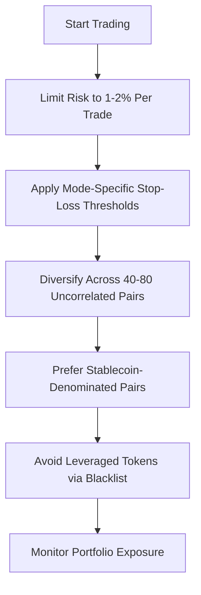
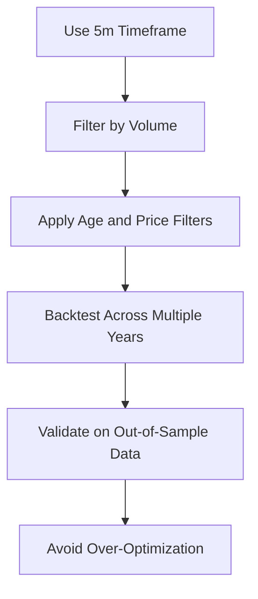
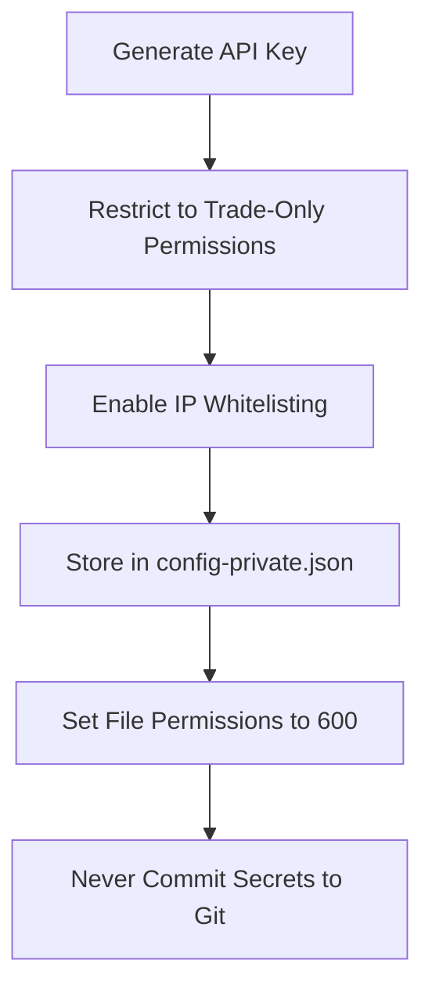

# Best Practices

<cite>
**Referenced Files in This Document**   
- [NostalgiaForInfinityX6.py](file://NostalgiaForInfinityX6.py)
- [recommended_config.json](file://configs/recommended_config.json)
- [trading_mode-spot.json](file://configs/trading_mode-spot.json)
- [pairlist-volume-binance-usdt.json](file://configs/pairlist-volume-binance-usdt.json)
- [blacklist-binance.json](file://configs/blacklist-binance.json)
- [README.md](file://README.md)
</cite>

## Table of Contents
1. [Risk Management Principles](#risk-management-principles)
2. [Performance Optimization Techniques](#performance-optimization-techniques)
3. [Monitoring and Maintenance Guidelines](#monitoring-and-maintenance-guidelines)
4. [Security Best Practices](#security-best-practices)
5. [Psychological Aspects and Intervention Protocols](#psychological-aspects-and-intervention-protocols)
6. [Configuration and Implementation Guidance](#configuration-and-implementation-guidance)

## Risk Management Principles

Effective risk management is essential when deploying the NostalgiaForInfinityX6 strategy to protect capital and ensure sustainable performance. The following principles should be strictly observed:

**Position Sizing**: Never risk more than 1-2% of your total trading capital on any single trade. This conservative approach ensures that even a series of losing trades will not significantly deplete your account. For example, with a $10,000 account, the maximum risk per trade should be limited to $100–$200.

**Stop-Loss Placement**: The strategy uses dynamic stop-loss mechanisms based on market conditions and trade modes. Key thresholds are defined in the configuration:
- Normal mode: stop threshold of 10% for both spot and futures
- Doom mode: increased stop threshold of 20%
- Rebuy mode: stop threshold set to 100%, allowing for strategic re-entry
- Rapid and scalp modes: stop threshold of 20%

These values are configured via parameters such as `stop_threshold_spot`, `stop_threshold_futures`, and mode-specific variants like `stop_threshold_rapid_spot`.

**Portfolio Diversification**: To reduce correlation risk, the strategy should be applied across a diversified set of 40–80 uncorrelated cryptocurrency pairs. Stablecoin-denominated pairs (e.g., USDT, USDC) are preferred over BTC or ETH pairs to minimize exposure to broad market swings. The volume-based pairlist (e.g., `pairlist-volume-binance-usdt.json`) helps maintain a dynamic, high-liquidity universe of assets.



**Section sources**
- [NostalgiaForInfinityX6.py](file://NostalgiaForInfinityX6.py#L116-L173)
- [blacklist-binance.json](file://configs/blacklist-binance.json#L1-L21)

## Performance Optimization Techniques

Optimizing the performance of NostalgiaForInfinityX6 involves careful selection of timeframes, filtering low-volume assets, and avoiding overfitting during backtesting.

**Timeframe Selection**: The strategy is designed to operate exclusively on the 5-minute (`timeframe = "5m"`) candle. This short-term timeframe enables rapid response to market movements but requires high-frequency data processing. Using any other timeframe may invalidate the signal logic and lead to poor performance.

**Low-Volume Pair Filtering**: The use of `VolumePairList` in the configuration ensures that only the most liquid pairs are traded. For example, `pairlist-volume-binance-usdt.json` selects the top 80–100 pairs by quote volume, refreshed every 30 minutes. This reduces slippage and improves execution quality.

**Avoiding Overfitting**: Backtesting must be conducted across multiple market cycles and diverse conditions. The repository includes comprehensive backtesting scripts (e.g., `backtesting-all.sh`, `backtesting-analysis.sh`) that test performance across all years and pairs. To prevent overfitting:
- Use walk-forward analysis
- Test across bull, bear, and sideways markets
- Validate results on out-of-sample data
- Avoid excessive parameter optimization



**Section sources**
- [NostalgiaForInfinityX6.py](file://NostalgiaForInfinityX6.py#L140-L145)
- [pairlist-volume-binance-usdt.json](file://configs/pairlist-volume-binance-usdt.json#L2-L40)

## Monitoring and Maintenance Guidelines

Proper monitoring and regular maintenance are critical for reliable operation of the NostalgiaForInfinityX6 strategy.

**Dry-Run Mode**: Always begin with at least two weeks of dry-run (paper trading) mode. This allows you to validate trade execution logic, monitor signal frequency, and assess risk exposure without financial risk. Set `"dry_run": true` in your configuration until consistent performance is observed.

**Trade Execution Alerts**: Set up real-time alerts for entry and exit signals. This can be achieved through Freqtrade’s messaging system (Telegram, Discord, etc.). Immediate notification enables manual verification and intervention if needed.

**Log Review**: Regularly review strategy logs to detect anomalies, failed API calls, or unexpected behavior. Logs are stored in the `user_data/logs/` directory and should be inspected daily during live trading.

**Codebase Updates**: The strategy is actively maintained, and updates may introduce new features or bug fixes. Regularly pull the latest version from the repository and test changes in dry-run mode before deployment.

**Parameter Reviews**: Market conditions evolve, and static parameters may become suboptimal. Schedule weekly or monthly reviews of key settings such as stop thresholds, stake multipliers, and pairlist filters to ensure alignment with current volatility and trends.

**Section sources**
- [NostalgiaForInfinityX6.py](file://NostalgiaForInfinityX6.py#L__init__)
- [recommended_config.json](file://configs/recommended_config.json#L10-L18)

## Security Best Practices

Security is paramount when running automated trading systems that interact with exchange APIs.

**API Key Permissions**: Use API keys with the minimum required permissions:
- Allow **only** trading operations
- Disable withdrawal permissions entirely
- Enable **IP whitelisting** to restrict API access to trusted servers
- Use separate keys for different bots or environments

**Secure Secret Storage**: Never store API keys in plaintext within configuration files. Instead:
- Use `config-private.json` for sensitive data
- Store secrets in environment variables or encrypted vaults
- Ensure file permissions restrict access (e.g., `chmod 600 config-private.json`)

**Exchange Configuration**: The `ccxt_config` in `recommended_config.json` includes broker options that should be left unset unless explicitly needed. Avoid exposing unnecessary endpoints or partner IDs.



**Section sources**
- [recommended_config.json](file://configs/recommended_config.json#L1-L18)
- [NostalgiaForInfinityX6.py](file://NostalgiaForInfinityX6.py#L__init__)

## Psychological Aspects and Intervention Protocols

Automated trading removes emotional decision-making, but human oversight remains essential.

**Disciplined Intervention**: Define clear rules for manual intervention:
- Only intervene during extreme market events (e.g., flash crashes, exchange outages)
- Never override stop-losses or exit signals based on emotion
- Maintain a log of all interventions for post-mortem analysis

**Avoid Over-Optimization Bias**: Resist the temptation to constantly tweak parameters after every loss. The strategy is designed to have losing trades as part of its statistical edge. Focus on long-term expectancy rather than short-term results.

**Maintain Process Discipline**: Follow a consistent operational routine:
- Daily log review
- Weekly performance assessment
- Monthly parameter audit
- Quarterly strategy health check

This structured approach prevents reactive decision-making and supports long-term success.

**Section sources**
- [README.md](file://README.md#L15-L30)
- [NostalgiaForInfinityX6.py](file://NostalgiaForInfinityX6.py#L130-L135)

## Configuration and Implementation Guidance

To implement the NostalgiaForInfinityX6 strategy correctly, follow the configuration structure provided in the repository.

The `recommended_config.json` serves as the base configuration and includes:
- Strategy name: `"NostalgiaForInfinityX6"`
- Modular configuration via `add_config_files` that combines:
  - Trading mode (spot/futures)
  - Dynamic pairlist
  - Exchange-specific blacklist
  - Core and secret settings

Example configuration structure:
```json
{
  "strategy": "NostalgiaForInfinityX6",
  "add_config_files": [
    "../configs/trading_mode-futures.json",
    "../configs/pairlist-volume-binance-usdt.json",
    "../configs/blacklist-binance.json",
    "../configs/exampleconfig.json",
    "../configs/exampleconfig_secret.json"
  ]
}
```

Ensure that:
- `use_exit_signal = true`
- `exit_profit_only = false`
- `ignore_roi_if_entry_signal = true`
- Timeframe remains at 5m
- Blacklists are updated regularly

For implementation details, refer to the [Configuration](#configuration-and-implementation-guidance), [Trading Modes](#performance-optimization-techniques), and [Backtesting](#performance-optimization-techniques) sections.

**Section sources**
- [recommended_config.json](file://configs/recommended_config.json#L1-L18)
- [trading_mode-spot.json](file://configs/trading_mode-spot.json#L1-L6)
- [README.md](file://README.md#L20-L30)