# Blacklist Management

<cite>
**Referenced Files in This Document**   
- [blacklist-binance.json](file://configs/blacklist-binance.json)
- [blacklist-kucoin.json](file://configs/blacklist-kucoin.json)
- [blacklist-okx.json](file://configs/blacklist-okx.json)
- [recommended_config.json](file://configs/recommended_config.json)
- [NostalgiaForInfinityX6.py](file://NostalgiaForInfinityX6.py)
</cite>

## Table of Contents
1. [Introduction](#introduction)
2. [Blacklist Structure and Functionality](#blacklist-structure-and-functionality)
3. [Exchange-Specific Blacklist Patterns](#exchange-specific-blacklist-patterns)
4. [Integration with Freqtrade Pair Filtering](#integration-with-freqtrade-pair-filtering)
5. [Best Practices for Blacklist Maintenance](#best-practices-for-blacklist-maintenance)
6. [Troubleshooting Common Issues](#troubleshooting-common-issues)
7. [Conclusion](#conclusion)

## Introduction
The NostalgiaForInfinityX6 trading strategy employs a comprehensive blacklist system to exclude high-risk or problematic trading pairs from consideration. This mechanism prevents trades on volatile, illiquid, or manipulated markets by filtering out undesirable assets before entry signals are evaluated. The blacklists are implemented as JSON configuration files, one per exchange, and are integrated into the Freqtrade framework's pair selection process. These files contain regular expression patterns that match against trading pairs to identify and exclude them based on various risk factors such as leverage tokens, stablecoins, fan tokens, and known scam coins.

**Section sources**
- [blacklist-binance.json](file://configs/blacklist-binance.json)
- [blacklist-kucoin.json](file://configs/blacklist-kucoin.json)
- [blacklist-okx.json](file://configs/blacklist-okx.json)

## Blacklist Structure and Functionality

The blacklist files follow a standardized JSON structure that defines an array of regular expressions under the `pair_blacklist` key within the `exchange` object. Each entry in the array represents a pattern that, when matched, will exclude a trading pair from consideration.

```json
{
  "exchange": {
    "pair_blacklist": [
      "(BNB)/.*",
      ".*(_PREMIUM|BEAR|BULL|HALF|HEDGE|UP|DOWN|[1235][SL])/.*",
      "(ARS|AUD|BIDR|BRZ|BRL|CAD|CHF|EUR|GBP|HKD|IDRT|JPY|NGN|PLN|RON|RUB|SGD|TRY|UAH|USD|ZAR)/.*",
      "(AEUR|FDUSD|BUSD|CUSD|CUSDT|DAI|PAXG|SUSD|TUSD|USDC|USDN|USDP|USDT|VAI|UST|USTC|AUSD|FDUSD|EURI|USDS|XUSD|USD1)/.*"
    ]
  }
}
```

The structure includes commented sections that categorize the types of pairs being excluded:
- **Exchange Tokens**: Native tokens of the exchange (e.g., BNB for Binance, OKB for OKX)
- **Leverage Tokens**: Tokens designed for leveraged trading (e.g., 3L, 3S, BULL, BEAR)
- **Fiat Pairs**: Trading pairs involving traditional fiat currencies
- **Stable Tokens**: Various stablecoins that may be redundant or problematic
- **FAN Tokens**: Sports and entertainment fan tokens
- **Other Coins**: Known scam coins, low-volume tokens, or historically problematic assets
- **Delisting**: Tokens that are in the process of being delisted

These patterns are processed by Freqtrade during the pair filtering stage, where they are applied as the final layer of filtering after other pairlist mechanisms have generated the initial candidate list.

**Section sources**
- [blacklist-binance.json](file://configs/blacklist-binance.json#L1-L21)
- [blacklist-kucoin.json](file://configs/blacklist-kucoin.json#L1-L20)
- [blacklist-okx.json](file://configs/blacklist-okx.json#L1-L20)

## Exchange-Specific Blacklist Patterns

### Binance Blacklist Pattern
The Binance blacklist contains specific patterns tailored to Binance's market structure:

```mermaid
flowchart TD
A["Binance Blacklist"] --> B["Exchange Tokens"]
A --> C["Leverage Tokens"]
A --> D["Fiat Pairs"]
A --> E["Stable Tokens"]
A --> F["FAN Tokens"]
A --> G["Other Problematic Coins"]
B --> B1["(BNB)/.*"]
B --> B2["(1000.*).*/.*"]
C --> C1[".*(_PREMIUM|BEAR|BULL|HALF|HEDGE|UP|DOWN|[1235][SL])/.*"]
D --> D1["(ARS|AUD|BIDR|BRZ|BRL|CAD|CHF|EUR|GBP|HKD|IDRT|JPY|NGN|PLN|RON|RUB|SGD|TRY|UAH|USD|ZAR)/.*"]
E --> E1["(AEUR|FDUSD|BUSD|CUSD|CUSDT|DAI|PAXG|SUSD|TUSD|USDC|USDN|USDP|USDT|VAI|UST|USTC|AUSD|FDUSD|EURI|USDS|XUSD|USD1)/.*"]
F --> F1["(ACM|AFA|ALA|ALL|ALPINE|APL|ASR|ATM|BAR|CAI|CHZ|CITY|FOR|GAL|GOZ|IBFK|JUV|LEG|LOCK-1|NAVI|NMR|NOV|PFL|PSG|ROUSH|STV|TH|TRA|UCH|UFC|YBO)/.*"]
G --> G1["(1EARTH|ILA|BOBA|CWAR|OMG|DMTR|MLS|TORN|LUNA|BTS|QKC|ACA|FTT|SRM|YFII|SNM|ANC|AION|MIR|WABI|QLC|NEBL|AUTO|VGX|DREP|PNT|PERL|LOOM|ID|NULS|TOMO|WTC|1000SATS|ORDI|XMR|ANT|MULTI|VAI|DREP|MOB|PNT|BTCDOM|WAVES|WNXM|XEM|ZEC|ELF|ARK|MDX|BETA|KP3R|AKRO|AMB|BOND|FIRO|OAX|EPX|OOKI|ONDO|TRUMP|MAGA|MAGAETH|TREMP|BODEN|STRUMP|TOOKER|TMANIA|BOBBY|BABYTRUMP|PTTRUMP|DTI|TRUMPIE|MAGAPEPE|PEPEMAGA|HARD|MBL|GAL|DOCK|POLS|CTXC|JASMY|BAL|SNT|CREAM|REN|LINA|REEF|UNFI|IRIS|CVP|GFT|KEY|WRX|BLZ|DAR|TROY|STMX|FTM|URO|FRED|DOGEGOV|LIT|RUNE|ZEREBRO|TST|CLV|VITE|BAN|AVAAI|ARC|BNX|MELANIA|BURGER|AERGO|ALPACA|AST|BADGER|COMBO|NULS|STPT|UFT|VIDT|GPS|HAPPY|LAIKA|DAPP|FURY|AUCTION|JELLYJELLY|DF|ACT|PROS|JAILSTOOL|OM|IRL|AURY|ZKF|LAI|ARX|MPC|PUMLX|ISME|LOOM|LUCE|FLT|REAL|PDA|WING|VIB|ARDR|NKN|LTO|FLM|BSW|MOVE|LEVER|PORTAL|REI|HIFI|ALPHA|MEMEFI|AB|BROCCOLI.*|XYRO|FMB|QAI|WCT|HYPERSKIDS|AMC|ZKJ|SNS|KMD|PFVS|BAKE|IDEX|SLF|CATS|ALU|BANANAS31|MYX|AGT|ELDE|RIZE|FRAG|BBQ|FHE|SAROS|XNY|AMR|TREE|MBG|TA|BOOM|WLFI|NEIROETH|RION|NEIRO|IMT|FLY|ZCX|NUTS|XAR|MINT|PAWS|WELL|APU|CRETA|GSWIFT|PEPECOIN|PIRATE|BRIC|EARNM|OIK|AIOT|IKA)/.*"]
style A fill:green,stroke:#333
style B fill:#bbf,stroke:#333
style C fill:#bbf,stroke:#333
style D fill:#bbf,stroke:#333
style E fill:#bbf,stroke:#333
style F fill:#bbf,stroke:#333
style G fill:#bbf,stroke:#333
```



**Diagram sources**
- [blacklist-binance.json](file://configs/blacklist-binance.json)

### Kucoin Blacklist Pattern
The Kucoin blacklist reflects Kucoin's specific token offerings:

```mermaid
flowchart TD
A["Kucoin Blacklist"] --> B["Exchange Tokens"]
A --> C["Leverage Tokens"]
A --> D["Fiat Pairs"]
A --> E["Stable Tokens"]
A --> F["FAN Tokens"]
A --> G["Other Problematic Coins"]
B --> B1["KCS/.*"]
C --> C1[".*(3L|3S|5L|5S|UP|DOWN)/.*"]
D --> D1["(AUD|BRZ|CAD|CHF|EUR|GBP|HKD|IDRT|JPY|NGN|RUB|SGD|TRY|UAH|USD|ZAR)/.*"]
E --> E1["(BUSD|CUSD|CUSDT|DAI|PAXG|SUSD|TUSD|USDC|USDN|USDP|USDT|VAI|UST|USDD|USDJ|USTC|AUSD|OUSD|FDUSD|EURI|USDS|XUSD|USD1)/.*"]
F --> F1["(ACM|AFA|ALA|ALL|ALPINE|APL|ASR|ATM|BAR|CAI|CITY|FOR|GAL|GOZ|IBFK|JUV|LEG|LOCK-1|NAVI|NMR|NOV|PFL|PORTO|PSG|ROUSH|STV|TH|TRA|UCH|UFC|YBO)/.*"]
G --> G1["(1EARTH|ILA|MEM|AMPL|BOBA|CWAR|OMG|XYM|POLX|CARR|SKEY|KLV|KRL|KOK|DMTR|CHMB|CPOOL|MLS|RBS|SRBS|SYLO|VR|KARA|LUNA|SRBP|PSL|AI|QKC|EPK|BAX|UQC|ZBC|PLATO|ACA|XCN|MC|FTT|SRM|PRMX|SWP|XWG|PIAS|KICKS|TIME|WEMIX|HI.*|ALBT|ANC|CIX100|GLCH|MIR|CELT|TEM|ZKT|MVP|ADB|AXPR|H2O|FT|RLY|MARS4|DRGN|WXT|ROSN|KYL|FRR|STARLY|RBP|UNB|ARNM|NGC|CARE|REAP|EDG|GOM2|GRIN|INDI|LOVE|NGM|SHFT|ASTRA|SOLVE|SUKU|ECOX|PNT|BASIC|LMWR|VEGA|COCOS|PKF|SHX|DAPPT|BOB|ID|ZPAY|XHV|PCX|MODEFI|PEPE2|RFUEL|SIN|UBX|NOM|QUARTZ|XED|DG|SLCL|PLGR|OPCT|GMB|COV|TAUM|HAWK|LAVAX|CPC|AOA|EFX|FKX|JAR|NRG|REV|OXEN|LOC|IXS|FORESTPLUS|BNS|MNET|EQZ|LACE|VID|H3RO3S|2CRZ|RACEFI|WOM|DERO|MAKI|LTX|NULS|STRONG|ERSDL|KOL|COOHA|ROAR|SDL|CARD|BUY|CLUB|PLD|NDAU|PRIMAL|URUS|OMN|ARRR|ETN|SWINGBY|GENS|ACOIN|BUX|WAL|MOOV|AFK|LOCUS|PLY|DPX|GOVI|MNST|P00LS|SYNR|SOS|ENQ|KAT|SKU|KDON|LOCG|WSIENNA|IHC|POSI|TONE|PIKA|KAR|ISLM|CGG|FORM|DFA|PEEL|VEED|FALCONS|SATS|ORDI|PHNX|ANT|SOLS|YFDAI|SOLR|XPLL|ASD|SHA|CMP|WAVES|XEM|ZEC|ELF|ARK|MDX|BETA|KP3R|AKRO|AMB|BOND|FIRO|OAX|EPX|OOKI|GME|PDEX|EGAME|SQUAD|STC|VLX|TRUMP|MAGA|MAGAETH|TREMP|BODEN|STRUMP|TOOKER|TMANIA|BOBBY|BABYTRUMP|PTTRUMP|DTI|TRUMPIE|MAGAPEPE|PEPEMAGA|HARD|MBL|YLD|GAL|LFT|DOCK|POLS|TXA|PMON|FSN|RMRK|CTXC|JASMY|BAL|SNT|CREAM|REN|LINA|REEF|UNFI|IRIS|CVP|BMX|MSN|SAVM|RFD|DSLA|UTXO|HAKA|BOLT|HGP||KMA|OOFP|ZOOA|ETGM|ALT|NEER|ZERO|WEST|BIIS|NORD|IRON|GFT|KEY|KING|INFRA|GRAPE|XCUR|SUTER|WRX|BLZ|DAR|FTM|URO|FRED|DOGEGOV|LIT|RUNE|ZEREBRO|TST|CLV|VITE|BAN|AVAAI|ARC|M3M3|BNX|MELANIA|BURGER|AERGO|ALPACA|AST|BADGER|COMBO|NULS|STPT|UFT|VIDT|GPS|HAPPY|LAIKA|DAPP|FURY|QUILL|ZEND|AUCTION|JELLYJELLY|DF|ACT|ACTSOL|PROS|JAILSTOOL|OM|IRL|AURY|ZKF|LAI|ARX|BIDP|PRE|MPC|PUMLX|ISME|LOOM|LUCE|FLT|REAL|PDA|WING|VIB|ARDR|NKN|LTO|FLM|BSW|MOVE|LEVER|PORTAL|REI|HIFI|ALPHA|MEMEFI|AB|BROCCOLI.*|XYRO|FMB|QAI|WCT|HYPERSKIDS|AMC|ZKJ|IGU|LENDS|ANALOS|SUIA|GLS|PATEX|HLO|ODDZ|AIEPK|FTON|PONCH|FRM|LITH|SNS|KOS|NOOB|1CAT|TURT|GOAL|CTRL|HALO|BRWL|DIGIMON|HAI|KMD|M3M3|BONDLY|CTI|FINC|UNIO|SPOT|SMH|PFVS|BAKE|IDEX|SLF|CATS|ALU|BANANAS31|TSUGT|MYX|AGT|ELDE|RIZE|FRAG|BBQ|FHE|SAROS|XNY|AMR|TREE|MBG|TA|BOOM|WLFI|NEIROETH|RION|NEIRO|IMT|FLY|ZCX|NUTS|XAR|MINT|PAWS|WELL|APU|CRETA|GSWIFT|PEPECOIN|PIRATE|BRIC|EARNM|OIK|AIOT|IKA)/.*"]
style A fill:green,stroke:#333
style B fill:#bbf,stroke:#333
style C fill:#bbf,stroke:#333
style D fill:#bbf,stroke:#333
style E fill:#bbf,stroke:#333
style F fill:#bbf,stroke:#333
style G fill:#bbf,stroke:#333
```



**Diagram sources**
- [blacklist-kucoin.json](file://configs/blacklist-kucoin.json)

### OKX Blacklist Pattern
The OKX blacklist is designed for OKX's market characteristics:

```mermaid
flowchart TD
A["OKX Blacklist"] --> B["Exchange Tokens"]
A --> C["Leverage Tokens"]
A --> D["Fiat Pairs"]
A --> E["Stable Tokens"]
A --> F["FAN Tokens"]
A --> G["Other Problematic Coins"]
B --> B1["OKB/.*"]
C --> C1[".*(3L|3S|5L|5S)/.*"]
D --> D1["(AUD|BRZ|CAD|CHF|EUR|GBP|HKD|IDRT|JPY|NGN|RUB|SGD|TRY|UAH|USD|ZAR)/.*"]
E --> E1["(BUSD|CUSD|CUSDT|DAI|PAXG|SUSD|TUSD|USDC|USDN|USDP|USDT|VAI|UST|USTC|AUSD|FDUSD|EURI|USDS|XUSD|USD1)/.*"]
F --> F1["(ACM|AFA|ALA|ALL|ALPINE|APL|ASR|ATM|BAR|CAI|CITY|FOR|GAL|GOZ|IBFK|JUV|LEG|LOCK-1|NAVI|NMR|NOV|PFL|PORTO|PSG|ROUSH|STV|TH|TRA|UCH|UFC|YBO|ARG)/.*"]
G --> G1["(1EARTH|ILA|MEM|AMPL|BOBA|CWAR|OMG|XYM|POLX|CARR|SKEY|KLV|KRL|DMTR|MLS|CEL|TORN|DOME|LUNA|ZBC|AZY|ACA|FTT|SRM|YFII|WEMIX|ANC|MIR|CELT|REP|WXT|SWRV|ID|RFUEL|PLS|NULS|KOL|MOVEZ|OMN|SATS|ORDI|XEM|ZEC|ELF|ARK|MDX|BETA|KP3R|AKRO|AMB|BOND|FIRO|OAX|EPX|OOKI|STC|TRUMP|MAGA|MAGAETH|TREMP|BODEN|STRUMP|TOOKER|TMANIA|BOBBY|BABYTRUMP|PTTRUMP|DTI|TRUMPIE|MAGAPEPE|PEPEMAGA|HARD|MBL|GAL|DOCK|POLS|CTXC|JASMY|BAL|SNT|CREAM|REN|LINA|REEF|UNFI|IRIS|CVP|ZERO|GFT|KEY|FTM|URO|FRED|DOGEGOV|LIT|RUNE|ZEREBRO|TST|CLV|VITE|BAN|AVAAI|ARC|BNX|MELANIA|BURGER|AERGO|ALPACA|AST|BADGER|COMBO|NULS|STPT|UFT|VIDT|GPS|HAPPY|LAIKA|DAPP|FURY|AUCTION|JELLYJELLY|DF|ACT|PROS|JAILSTOOL|OM|IRL|AURY|ZKF|LAI|ARX|MPC|PUMLX|ISME|LOOM|LUCE|FLT|REAL|PDA|WING|VIB|ARDR|NKN|LTO|FLM|BSW|MOVE|LEVER|PORTAL|REI|HIFI|ALPHA|MEMEFI|AB|BROCCOLI.*|XYRO|FMB|QAI|WCT|HYPERSKIDS|AMC|ZKJ|SNS|KMD|PFVS|BAKE|IDEX|SLF|CATS|ALU|BANANAS31|MYX|AGT|ELDE|RIZE|FRAG|BBQ|FHE|SAROS|XNY|AMR|TREE|MBG|TA|BOOM|WLFI|NEIROETH|RION|NEIRO|IMT|FLY|ZCX|NUTS|XAR|MINT|PAWS|WELL|APU|CRETA|GSWIFT|PEPECOIN|PIRATE|BRIC|EARNM|OIK|AIOT|IKA)/.*"]
style A fill:green,stroke:#333
style B fill:#bbf,stroke:#333
style C fill:#bbf,stroke:#333
style D fill:#bbf,stroke:#333
style E fill:#bbf,stroke:#333
style F fill:#bbf,stroke:#333
style G fill:#bbf,stroke:#333
```



**Diagram sources**
- [blacklist-okx.json](file://configs/blacklist-okx.json)

## Integration with Freqtrade Pair Filtering

The blacklist functionality is integrated into the Freqtrade framework through the configuration system. The recommended configuration file includes the blacklist as part of the `add_config_files` array:

```json
{
  "strategy": "NostalgiaForInfinityX6",
  "add_config_files": [
    "../configs/trading_mode-spot.json",
    "../configs/pairlist-volume-binance-usdt.json",
    "../configs/blacklist-binance.json",
    "../configs/exampleconfig.json",
    "../configs/exampleconfig_secret.json"
  ]
}
```

The blacklists are applied as the final filter layer during pair selection. The process follows this sequence:

```mermaid
flowchart TD
A["Start"] --> B["Load Base Pairlist"]
B --> C["Apply Volume Filters"]
C --> D["Apply Exchange-Specific Blacklist"]
D --> E["Final Pair Selection"]
E --> F["Strategy Evaluation"]
style A fill:green,stroke:#333
style B fill:#bbf,stroke:#333
style C fill:#bbf,stroke:#333
style D fill:#f96,stroke:#333
style E fill:#bbf,stroke:#333
style F fill:#bbf,stroke:#333
note right of D
Blacklist is applied as
the final filtering layer
to remove high-risk pairs
end note
```

**Diagram sources**
- [recommended_config.json](file://configs/recommended_config.json)
- [NostalgiaForInfinityX6.py](file://NostalgiaForInfinityX6.py)

The rationale for maintaining separate blacklists per exchange is due to differing market structures and token availability. Each exchange has unique tokens (exchange tokens, leveraged tokens, etc.) that need to be filtered out, and the blacklist patterns are tailored to these specific characteristics.

## Best Practices for Blacklist Maintenance

Maintaining effective blacklists requires ongoing monitoring and updates. Best practices include:

1. **Regular Review**: Periodically review the blacklist entries to ensure they remain relevant
2. **Community Curation**: Leverage community knowledge to identify new scam coins or problematic tokens
3. **Monitoring Tools**: Use market monitoring tools to detect unusual volume spikes or price manipulation
4. **Exchange Announcements**: Stay informed about exchange announcements regarding delistings or new token listings
5. **Backtesting Validation**: Test blacklist changes against historical data to ensure they improve performance

The blacklists should be updated when:
- New scam coins emerge in the market
- Exchanges introduce new leveraged products
- Tokens are announced for delisting
- Stablecoin depegging events occur
- Market conditions change significantly

## Troubleshooting Common Issues

When blacklisted pairs still appear in trades, consider these troubleshooting scenarios:

### Configuration Loading Errors
Ensure the blacklist file is properly referenced in the configuration:

```json
"add_config_files": [
    "../configs/blacklist-binance.json"
]
```

Verify the file path is correct relative to the main configuration file.

### Syntax Issues
Check for JSON syntax errors in the blacklist file:

```json
{
  "exchange": {
    "pair_blacklist": [
      "(BNB)/.*",
      ".*(_PREMIUM|BEAR|BULL|HALF|HEDGE|UP|DOWN|[1235][SL])/.*"
    ]
  }
}
```

Ensure:
- Proper JSON formatting with correct brackets and commas
- Valid regular expressions
- No trailing commas
- Proper escaping of special characters

### Pattern Matching Issues
Test regular expressions to ensure they match the intended pairs. For example, the pattern `"(BNB)/.*"` will match any pair with BNB as the base currency.

### Cache Issues
Clear any caching mechanisms that might be storing old pair lists. Restart the trading bot after blacklist modifications.

**Section sources**
- [recommended_config.json](file://configs/recommended_config.json)
- [blacklist-binance.json](file://configs/blacklist-binance.json)

## Conclusion
The blacklist system in the NostalgiaForInfinityX6 strategy provides a critical layer of risk management by filtering out high-risk trading pairs. By maintaining exchange-specific blacklists with comprehensive patterns for leveraged tokens, stablecoins, fiat pairs, and known scam coins, the strategy avoids volatile and manipulated markets. The integration with Freqtrade's pair filtering system ensures that these exclusions are applied consistently as the final step in pair selection. Regular maintenance and community-driven curation are essential for keeping the blacklists effective against evolving market risks.