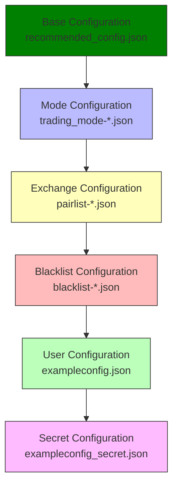
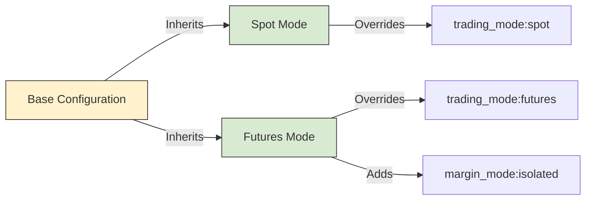

# Configuration Hierarchy

<cite>
**Referenced Files in This Document**   
- [recommended_config.json](file://configs/recommended_config.json)
- [trading_mode-futures.json](file://configs/trading_mode-futures.json)
- [trading_mode-spot.json](file://configs/trading_mode-spot.json)
- [exampleconfig.json](file://configs/exampleconfig.json)
- [NostalgiaForInfinityX6.py](file://NostalgiaForInfinityX6.py)
</cite>

## Table of Contents
1. [Introduction](#introduction)
2. [Configuration Hierarchy Overview](#configuration-hierarchy-overview)
3. [Base Configuration: recommended_config.json](#base-configuration-recommended_configjson)
4. [Mode-Specific Overrides](#mode-specific-overrides)
5. [Cascading Override Mechanism](#cascading-override-mechanism)
6. [Template and Customization: exampleconfig.json](#template-and-customization-exampleconfigjson)
7. [Best Practices for Configuration Management](#best-practices-for-configuration-management)
8. [Common Issues and Debugging](#common-issues-and-debugging)

## Introduction
This document provides a comprehensive analysis of the configuration hierarchy system used in the NostalgiaForInfinity trading strategy. The system is built on Freqtrade's configuration framework and implements a layered approach to manage trading parameters across different environments and modes. The configuration system enables flexible customization while maintaining a consistent base setup, allowing traders to adapt the strategy for spot, futures, and various exchange-specific scenarios.

## Configuration Hierarchy Overview
The configuration system follows a cascading override model where base settings are defined in a primary configuration file and selectively overridden by mode-specific and environment-specific configuration files. This hierarchical approach allows for modular configuration management, enabling users to maintain a clean separation between core strategy parameters and environment-specific settings.

The system uses Freqtrade's `add_config_files` mechanism to load multiple configuration files in a specific order, with later files taking precedence over earlier ones. This enables a powerful yet predictable configuration cascade that supports complex trading scenarios while minimizing configuration conflicts.



**Diagram sources**
- [recommended_config.json](file://configs/recommended_config.json)
- [trading_mode-futures.json](file://configs/trading_mode-futures.json)
- [trading_mode-spot.json](file://configs/trading_mode-spot.json)

**Section sources**
- [recommended_config.json](file://configs/recommended_config.json)
- [trading_mode-futures.json](file://configs/trading_mode-futures.json)
- [trading_mode-spot.json](file://configs/trading_mode-spot.json)

## Base Configuration: recommended_config.json
The `recommended_config.json` file serves as the foundation of the configuration hierarchy, defining the core parameters that apply to all trading scenarios. This file contains the essential settings that should remain consistent across different trading environments.

Key parameters defined in the base configuration include:
- **strategy**: Specifies the trading strategy to be used ("NostalgiaForInfinityX6")
- **add_config_files**: Lists the configuration files to be loaded in sequence, establishing the override order

The base configuration acts as the "single source of truth" for the strategy, ensuring that critical settings like the strategy name are consistently applied across all deployments. It also defines the loading order for additional configuration files, which determines the override priority in the cascading system.

```json
{
  "strategy": "NostalgiaForInfinityX6",
  "add_config_files": [
    "../configs/trading_mode-spot.json",
    "../configs/pairlist-volume-binance-usdt.json",
    "../configs/blacklist-binance.json",
    "../configs/exampleconfig.json",
    "../configs/exampleconfig_secret.json"
  ]
}
```

**Section sources**
- [recommended_config.json](file://configs/recommended_config.json#L0-L17)

## Mode-Specific Overrides
The configuration system supports different trading environments through mode-specific configuration files. These files selectively override parameters from the base configuration to accommodate the unique requirements of different trading modes.

### Futures Trading Mode
The `trading_mode-futures.json` file configures the system for futures trading, setting parameters specific to this trading mode:

```json
{
  "trading_mode": "futures",
  "margin_mode": "isolated",
  "dataformat_ohlcv": "feather",
  "dataformat_trades": "feather"
}
```

Key parameters:
- **trading_mode**: Set to "futures" to enable futures trading functionality
- **margin_mode**: Configured to "isolated" for risk management
- **dataformat_ohlcv** and **dataformat_trades**: Set to "feather" for efficient data storage and retrieval

### Spot Trading Mode
The `trading_mode-spot.json` file configures the system for spot trading:

```json
{
  "trading_mode": "spot",
  "dataformat_ohlcv": "feather",
  "dataformat_trades": "feather"
}
```

Key parameters:
- **trading_mode**: Set to "spot" to enable spot trading functionality
- **dataformat_ohlcv** and **dataformat_trades**: Set to "feather" for efficient data storage and retrieval

The mode-specific files demonstrate the selective override principle, where only parameters that differ from the base configuration are specified. This approach minimizes configuration redundancy and makes it clear which settings are being modified for each trading mode.



**Diagram sources**
- [trading_mode-futures.json](file://configs/trading_mode-futures.json)
- [trading_mode-spot.json](file://configs/trading_mode-spot.json)

**Section sources**
- [trading_mode-futures.json](file://configs/trading_mode-futures.json#L0-L6)
- [trading_mode-spot.json](file://configs/trading_mode-spot.json#L0-L5)

## Cascading Override Mechanism
The configuration system implements a cascading override mechanism where settings from later-loaded configuration files take precedence over those from earlier-loaded files. This allows for a flexible and modular configuration approach.

### Override Flow
When multiple configuration files define the same parameter, the value from the last file in the `add_config_files` list takes precedence. This creates a predictable override hierarchy:

1. Base configuration (`recommended_config.json`)
2. Trading mode configuration (`trading_mode-*.json`)
3. Pair list configuration (`pairlist-*.json`)
4. Blacklist configuration (`blacklist-*.json`)
5. User configuration (`exampleconfig.json`)
6. Secret configuration (`exampleconfig_secret.json`)

### Real-World Example
Consider the configuration loading sequence defined in `recommended_config.json`:

```json
"add_config_files": [
  "../configs/trading_mode-spot.json",
  "../configs/pairlist-volume-binance-usdt.json",
  "../configs/blacklist-binance.json",
  "../configs/exampleconfig.json",
  "../configs/exampleconfig_secret.json"
]
```

If both `trading_mode-spot.json` and `exampleconfig.json` define the `trading_mode` parameter, the value from `exampleconfig.json` will be used because it is loaded later in the sequence.

This mechanism enables users to:
- Start with a solid base configuration
- Apply mode-specific settings
- Customize parameters for their specific needs
- Override any setting without modifying the base configuration

The cascading system also supports environment-specific configurations through scripts like `backtesting-analysis-plot.sh`, which dynamically load different trading mode configurations:

```bash
freqtrade plot-profit $TIMERANGE_CONFIG --strategy $STRATEGY_NAME_CONFIG \
  -c configs/trading_mode-$TRADING_MODE_CONFIG.json \
  -c configs/exampleconfig.json -c configs/exampleconfig_secret.json \
  -c $EXCHANGE_CONFIG_FILE
```

**Section sources**
- [recommended_config.json](file://configs/recommended_config.json#L0-L17)
- [trading_mode-futures.json](file://configs/trading_mode-futures.json#L0-L6)
- [trading_mode-spot.json](file://configs/trading_mode-spot.json#L0-L5)
- [tests/backtests/backtesting-analysis-plot.sh](file://tests/backtests/backtesting-analysis-plot.sh#L149-L181)

## Template and Customization: exampleconfig.json
The `exampleconfig.json` file serves as a template for user customization, providing a comprehensive set of configurable parameters with sensible defaults. This file is designed to be copied and modified by users to create their personalized trading configurations.

### Core Parameters
The template defines essential trading parameters:

```json
{
  "dry_run": true,
  "dry_run_wallet": 10000,
  "max_open_trades": 6,
  "stake_currency": "USDT",
  "stake_amount": "unlimited",
  "timeframe": "5m",
  "stoploss": -0.99
}
```

### Entry and Exit Configuration
The file includes detailed settings for order execution:

```json
"order_types": {
  "entry": "limit",
  "exit": "limit",
  "stoploss": "limit",
  "stoploss_on_exchange": false
},
"entry_pricing": {
  "price_side": "same",
  "use_order_book": false,
  "order_book_top": 1
},
"exit_pricing": {
  "price_side": "same",
  "use_order_book": false,
  "order_book_top": 1
}
```

### Exchange Configuration
Exchange-specific settings are also included:

```json
"exchange": {
  "name": "",
  "key": "",
  "password": "",
  "secret": "",
  "ccxt_config": {
    "enableRateLimit": true,
    "rateLimit": 60
  }
}
```

The `exampleconfig.json` file plays a crucial role in the configuration hierarchy by:
- Providing a starting point for user customization
- Documenting available configuration options
- Ensuring users don't miss critical settings
- Separating public configuration from secret credentials

Users are expected to copy this file to `user_data/config.json` and modify it according to their needs, while keeping sensitive information in a separate `config-private.json` file.

**Section sources**
- [exampleconfig.json](file://configs/exampleconfig.json#L0-L108)

## Best Practices for Configuration Management
To ensure reliable and predictable trading operations, follow these best practices for configuration management:

### Configuration Layering
Organize configurations in a logical hierarchy:
- **Base layer**: Core strategy settings that rarely change
- **Mode layer**: Trading mode-specific settings (spot, futures)
- **Exchange layer**: Exchange-specific configurations
- **User layer**: Personal preferences and risk parameters
- **Secret layer**: Credentials and sensitive information

### Version Control
Implement version control for configuration files:
- Track changes to configuration files in version control
- Use descriptive commit messages for configuration changes
- Maintain separate branches for different trading environments
- Document the rationale for significant configuration changes

### Environment-Specific Configuration
Use different configuration sets for various environments:
- **Backtesting**: Use historical data settings and dry run mode
- **Paper trading**: Simulate real trading with current market data
- **Live trading**: Production settings with appropriate risk controls

### Configuration Validation
Always validate configurations before deployment:
- Test configurations in dry run mode first
- Verify that all required parameters are set
- Check for parameter conflicts or contradictions
- Ensure that override priorities are correctly established

### Security Practices
Follow security best practices:
- Never commit secret credentials to version control
- Use separate files for sensitive information
- Set appropriate file permissions on configuration files
- Regularly rotate API keys and credentials

## Common Issues and Debugging
Several common issues can arise when working with the configuration hierarchy. Understanding these issues and their solutions is crucial for maintaining reliable trading operations.

### Parameter Shadowing
**Issue**: A parameter in an earlier configuration file is unintentionally overridden by a later file.

**Solution**: Use Freqtrade's logging system to trace configuration loading:
```bash
freqtrade --loglevel DEBUG
```
This will show which configuration files are loaded and in what order, helping identify unexpected overrides.

### Incorrect File Loading Order
**Issue**: Configuration files are loaded in the wrong order, leading to incorrect parameter values.

**Solution**: Verify the `add_config_files` array in `recommended_config.json`:
- Ensure files are listed in the desired override order
- Test the configuration with different file sequences
- Use consistent naming conventions to avoid confusion

### Missing Required Parameters
**Issue**: Critical parameters are not defined in any configuration file.

**Solution**: Check the strategy code for required parameters:
- Review the `NostalgiaForInfinityX6.py` file for hardcoded requirements
- Ensure that `timeframe` is set to "5m" as required by the strategy
- Verify that `use_exit_signal` is properly configured

### Debugging Tips
Use these techniques to troubleshoot configuration issues:
1. Enable verbose logging to see configuration loading details
2. Use the `freqtrade list-config` command to view the final merged configuration
3. Test configurations in dry run mode before live deployment
4. Compare working and non-working configurations to identify differences
5. Use version control to track and revert problematic changes

The configuration system's modular design makes it easier to isolate and resolve issues by testing individual configuration layers independently.

**Section sources**
- [recommended_config.json](file://configs/recommended_config.json#L0-L17)
- [exampleconfig.json](file://configs/exampleconfig.json#L0-L108)
- [NostalgiaForInfinityX6.py](file://NostalgiaForInfinityX6.py#L0-L799)
- [tests/backtests/backtesting-analysis-plot.sh](file://tests/backtests/backtesting-analysis-plot.sh#L149-L181)