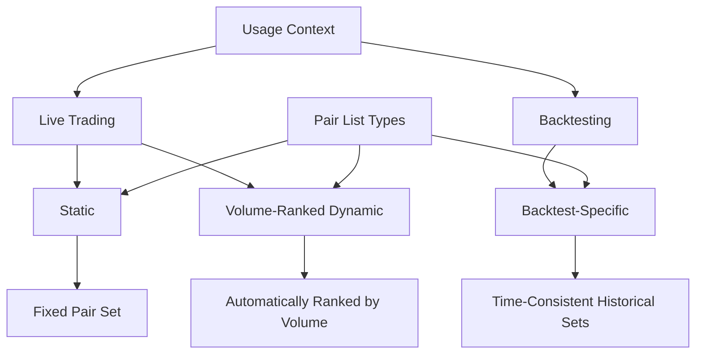
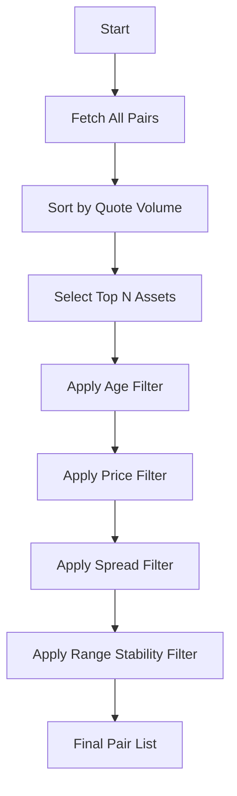
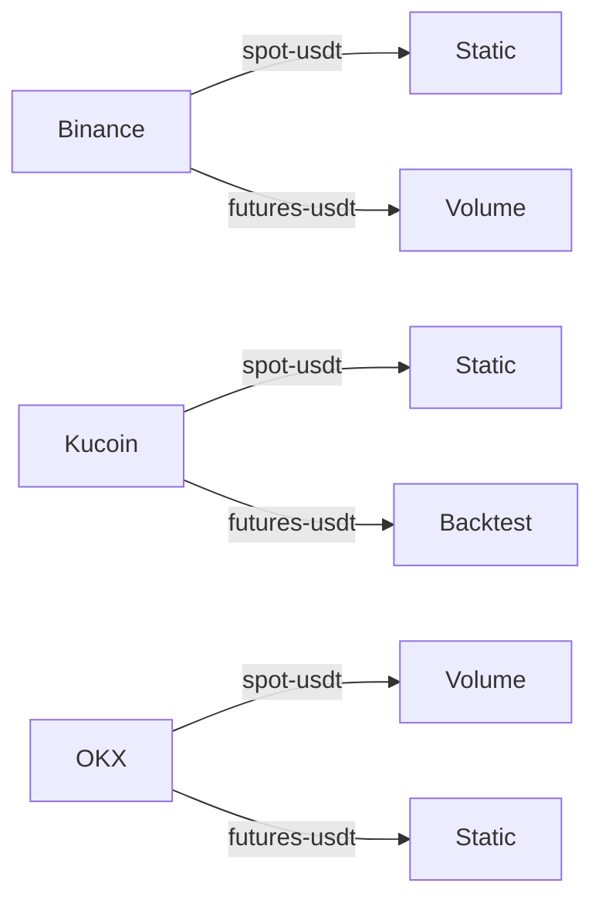

# Pair List Management

<cite>
**Referenced Files in This Document**   
- [pairlist-static-binance-spot-usdt.json](file://configs/pairlist-static-binance-spot-usdt.json)
- [pairlist-volume-binance-usdt.json](file://configs/pairlist-volume-binance-usdt.json)
- [pairlist-backtest-static-binance-spot-usdt.json](file://configs/pairlist-backtest-static-binance-spot-usdt.json)
- [NostalgiaForInfinityX6.py](file://NostalgiaForInfinityX6.py)
</cite>

## Table of Contents
1. [Introduction](#introduction)
2. [Pair List Types and Usage](#pair-list-types-and-usage)
3. [Static Pair Lists](#static-pair-lists)
4. [Volume-Ranked Dynamic Pair Lists](#volume-ranked-dynamic-pair-lists)
5. [Backtest-Specific Pair Lists](#backtest-specific-pair-lists)
6. [Implementation Examples Across Exchanges](#implementation-examples-across-exchanges)
7. [Strategy Integration and Dynamic Loading](#strategy-integration-and-dynamic-loading)
8. [Creating Custom Pair Lists](#creating-custom-pair-lists)
9. [Common Pitfalls and Best Practices](#common-pitfalls-and-best-practices)
10. [Performance Considerations and Optimization](#performance-considerations-and-optimization)

## Introduction
This document provides a comprehensive guide to pair list management within the NostalgiaForInfinityX6 trading strategy framework. It details the three primary types of pair lists: static, volume-ranked dynamic, and backtest-specific configurations. These mechanisms enable traders to control which cryptocurrency trading pairs are considered for entry signals, ensuring alignment with liquidity requirements, risk profiles, and testing consistency. The system leverages Freqtrade's pairlist functionality to filter and rank assets based on exchange-specific criteria.

**Section sources**
- [NostalgiaForInfinityX6.py](file://NostalgiaForInfinityX6.py#L1-L100)

## Pair List Types and Usage
The pair list system supports three distinct modes of operation, each designed for specific use cases in live trading and historical analysis.

### Static Pair Lists
Static pair lists define a fixed set of trading pairs that remain unchanged during strategy execution. They are ideal for maintaining consistent exposure to a curated selection of high-quality assets. These lists are typically used when traders want full control over the universe of tradable pairs without automatic adjustments.

### Volume-Ranked Dynamic Pair Lists
Dynamic pair lists automatically select and rank trading pairs based on real-time market data, primarily trading volume. This approach enhances liquidity by prioritizing the most actively traded assets, improving trade execution quality and reducing slippage. The system periodically refreshes the list to reflect current market conditions.

### Backtest-Specific Pair Lists
Backtest-specific pair lists ensure reproducible historical testing by using predefined sets of pairs from specific time periods. This prevents look-ahead bias and allows for accurate performance evaluation across different market cycles. These lists are essential for validating strategy robustness under varying market conditions.



**Diagram sources**
- [pairlist-static-binance-spot-usdt.json](file://configs/pairlist-static-binance-spot-usdt.json)
- [pairlist-volume-binance-usdt.json](file://configs/pairlist-volume-binance-usdt.json)
- [pairlist-backtest-static-binance-spot-usdt.json](file://configs/pairlist-backtest-static-binance-spot-usdt.json)

## Static Pair Lists
Static pair lists are implemented as JSON configuration files containing a predefined whitelist of trading pairs. These files follow a naming convention that includes the exchange name, market type (spot/futures), and quote currency.

### Configuration Structure
The static pair list configuration includes:
- **exchange.name**: Specifies the target exchange (e.g., binance)
- **pair_whitelist**: Array of trading pairs in "BASE/QUOTE" format
- **pairlists**: Array of filtering methods applied to the whitelist

### Example: Binance Spot USDT Pairs
The file `pairlist-static-binance-spot-usdt.json` defines a static list for Binance spot trading with USDT as the quote currency. It contains 80 major cryptocurrency pairs including BTC/USDT, ETH/USDT, and various altcoins.

```json
{
  "exchange": {
    "name": "binance",
    "pair_whitelist": [
      "BTC/USDT",
      "ETH/USDT",
      "ADA/USDT",
      "SOL/USDT"
    ]
  },
  "pairlists": [
    {
      "method": "StaticPairList"
    }
  ]
}
```

This configuration ensures that only the specified pairs are considered for trading, providing stability and predictability in portfolio composition.

**Section sources**
- [pairlist-static-binance-spot-usdt.json](file://configs/pairlist-static-binance-spot-usdt.json)

## Volume-Ranked Dynamic Pair Lists
Volume-ranked dynamic pair lists automatically select trading pairs based on their trading volume, ensuring that the strategy focuses on the most liquid markets.

### Implementation Details
The dynamic pair list configuration uses the `VolumePairList` method with key parameters:
- **number_assets**: Number of top pairs to include in the list
- **sort_key**: Metric used for ranking (typically "quoteVolume")
- **refresh_period**: Interval (in seconds) for updating the list

### Example: Binance USDT Volume List
The file `pairlist-volume-binance-usdt.json` configures a dynamic pair list that:
- Selects the top 100 pairs by quote volume
- Applies additional filters including age, price, spread, and range stability
- Refreshes the list every 1800 seconds (30 minutes)

```json
{
  "pairlists": [
    {
      "method": "VolumePairList",
      "number_assets": 100,
      "sort_key": "quoteVolume",
      "refresh_period": 1800
    },
    {
      "method": "AgeFilter",
      "min_days_listed": 60
    },
    {
      "method": "PriceFilter",
      "low_price_ratio": 0.003
    },
    {
      "method": "SpreadFilter",
      "max_spread_ratio": 0.005
    }
  ]
}
```

The configuration applies multiple filters in sequence, first selecting high-volume pairs and then applying quality filters to ensure only suitable pairs are traded.



**Diagram sources**
- [pairlist-volume-binance-usdt.json](file://configs/pairlist-volume-binance-usdt.json)

## Backtest-Specific Pair Lists
Backtest-specific pair lists enable reproducible historical testing by using fixed sets of trading pairs from specific time periods.

### Purpose and Benefits
These lists address the challenge of changing market availability over time. By using historical snapshots of available pairs, they prevent:
- **Look-ahead bias**: Trading pairs that didn't exist during the backtest period
- **Survivorship bias**: Only including pairs that survived to the present
- **Inconsistent results**: Different pair availability affecting performance metrics

### Example: Binance Spot Backtest Configuration
The file `pairlist-backtest-static-binance-spot-usdt.json` contains a comprehensive list of 172 trading pairs available on Binance spot market with USDT quote currency. This list represents a historical snapshot used for backtesting purposes.

```json
{
  "exchange": {
    "name": "binance",
    "pair_whitelist": [
      "BTC/USDT",
      "ETH/USDT",
      "ADA/USDT",
      "SOL/USDT",
      "XRP/USDT"
    ]
  },
  "pairlists": [
    {
      "method": "StaticPairList"
    }
  ]
}
```

The naming convention `pairlist-backtest-static-{exchange}-{market}-{quote}.json` clearly identifies these files as backtest-specific static configurations.

**Section sources**
- [pairlist-backtest-static-binance-spot-usdt.json](file://configs/pairlist-backtest-static-binance-spot-usdt.json)

## Implementation Examples Across Exchanges
The pair list system supports multiple exchanges with exchange-specific configurations.

### Exchange Coverage
The repository includes pair list configurations for:
- **Binance**: Multiple configurations for spot and futures markets
- **Kucoin**: Spot and futures configurations
- **OKX**: Spot and futures configurations
- **Gate.io**: Spot and futures configurations
- **Bybit**: Spot configurations
- **Bitget**: Spot configurations
- **Kraken**: Spot configurations

### Naming Convention Pattern
All pair list files follow a consistent naming pattern:
`pairlist-{type}-{exchange}-{market}-{quote}.json`

Where:
- **type**: static, volume, or backtest-static
- **exchange**: Exchange name (binance, kucoin, okx, etc.)
- **market**: spot or futures
- **quote**: Quote currency (usdt, btc, busd, etc.)

### Example: Cross-Exchange Comparison


This standardized approach enables consistent configuration management across different trading venues.

**Section sources**
- [pairlist-static-binance-spot-usdt.json](file://configs/pairlist-static-binance-spot-usdt.json)
- [pairlist-volume-binance-usdt.json](file://configs/pairlist-volume-binance-usdt.json)
- [pairlist-backtest-static-binance-spot-usdt.json](file://configs/pairlist-backtest-static-binance-spot-usdt.json)

## Strategy Integration and Dynamic Loading
The NostalgiaForInfinityX6 strategy dynamically loads pair lists based on trading mode and exchange context.

### Configuration-Driven Loading
The strategy reads pair list configurations from the `configs/` directory, with selection determined by:
- **Exchange name**: Configured in the main strategy settings
- **Trading mode**: Spot vs. futures
- **Quote currency**: USDT, BTC, or other base currencies

### Context-Aware Selection
The system automatically selects the appropriate pair list file based on the current trading environment. For example:
- When trading on Binance spot with USDT: `pairlist-static-binance-spot-usdt.json`
- When backtesting on OKX futures: `pairlist-backtest-static-okx-futures-usdt.json`
- When using volume ranking on Gate.io: `pairlist-volume-gateio-usdt.json`

### Exchange-Specific Adjustments
The strategy implementation includes exchange-specific adjustments for:
- **Startup candle count**: Different exchanges provide varying amounts of historical data per API call
- **Trading mode detection**: Futures mode enables shorting capabilities
- **Leverage settings**: Exchange-specific leverage configurations

```python
if self.config["exchange"]["name"] in ["okx", "okex"]:
    self.startup_candle_count = 480
elif self.config["exchange"]["name"] in ["kraken"]:
    self.startup_candle_count = 710
elif ("trading_mode" in self.config) and (self.config["trading_mode"] in ["futures", "margin"]):
    self.is_futures_mode = True
    self.can_short = True
```

**Section sources**
- [NostalgiaForInfinityX6.py](file://NostalgiaForInfinityX6.py#L1000-L1100)

## Creating Custom Pair Lists
Creating custom pair lists involves following established patterns and conventions.

### Formatting Rules
Custom pair lists must adhere to the following structure:
- **File format**: JSON
- **Root keys**: "exchange" and/or "pairlists"
- **Pair format**: "BASE/QUOTE" (e.g., "BTC/USDT")
- **Case sensitivity**: Uppercase for ticker symbols

### Step-by-Step Creation
1. **Choose the type**: Determine if the list should be static, dynamic, or backtest-specific
2. **Select the exchange**: Identify the target trading platform
3. **Define the market**: Specify spot or futures trading
4. **Choose quote currency**: Select the pricing currency (USDT, BTC, etc.)
5. **Name the file**: Follow the naming convention
6. **Populate pairs**: Add trading pairs to the whitelist or configure filtering rules

### Example: Creating a New Static List
To create a static pair list for Kraken spot trading with USD:
1. Create file: `pairlist-static-kraken-spot-usd.json`
2. Add content:
```json
{
  "exchange": {
    "name": "kraken",
    "pair_whitelist": [
      "BTC/USD",
      "ETH/USD",
      "LTC/USD"
    ]
  },
  "pairlists": [
    {
      "method": "StaticPairList"
    }
  ]
}
```

**Section sources**
- [pairlist-static-binance-spot-usdt.json](file://configs/pairlist-static-binance-spot-usdt.json)

## Common Pitfalls and Best Practices
Effective pair list management requires awareness of common issues and adherence to best practices.

### Common Pitfalls
- **Stale pair data**: Using outdated lists that include delisted tokens
- **Delisted tokens**: Trading pairs that are no longer available on the exchange
- **Misconfigured base currencies**: Incorrect quote currency specifications
- **Overly broad lists**: Including low-liquidity pairs that increase slippage
- **Insufficient filtering**: Failing to apply quality filters for dynamic lists

### Best Practices
- **Regular updates**: Refresh static lists periodically to remove delisted pairs
- **Consistent naming**: Follow the established naming convention
- **Appropriate sizing**: Use 40-80 pairs for optimal performance
- **Quality filtering**: Apply age, price, and spread filters for dynamic lists
- **Exchange alignment**: Ensure pair lists match the target exchange's available pairs

### Blacklist Integration
The system works in conjunction with blacklist files (e.g., `blacklist-binance.json`) to exclude undesirable pairs such as:
- Leveraged tokens (*BULL, *BEAR, *UP, *DOWN)
- Low-quality or scam tokens
- Pairs with known issues

**Section sources**
- [NostalgiaForInfinityX6.py](file://NostalgiaForInfinityX6.py#L50-L100)

## Performance Considerations and Optimization
Pair list configuration significantly impacts strategy performance and resource usage.

### Performance Implications
- **Large pair lists**: Increase memory usage and processing time
- **Frequent refreshes**: Generate more API calls and network traffic
- **Complex filtering**: Require additional computational resources

### Optimization Techniques
- **Caching**: Store previously calculated pair lists to avoid redundant processing
- **Pre-validation**: Verify pair availability before strategy execution
- **Selective loading**: Load only necessary pair lists based on current trading mode
- **Efficient filtering**: Order filters from fastest to slowest for optimal performance

### Recommended Settings
Based on the strategy documentation:
- **Optimal pair count**: 40-80 pairs
- **Preferred quote currencies**: Stablecoins (USDT, USDC) over BTC/ETH
- **Trading pairs**: Unlimited stake with 6-12 open trades recommended
- **Timeframe**: 5-minute candles for optimal performance

The system's design balances comprehensive market coverage with efficient resource utilization, ensuring reliable operation across different hardware configurations.

**Section sources**
- [NostalgiaForInfinityX6.py](file://NostalgiaForInfinityX6.py#L20-L50)