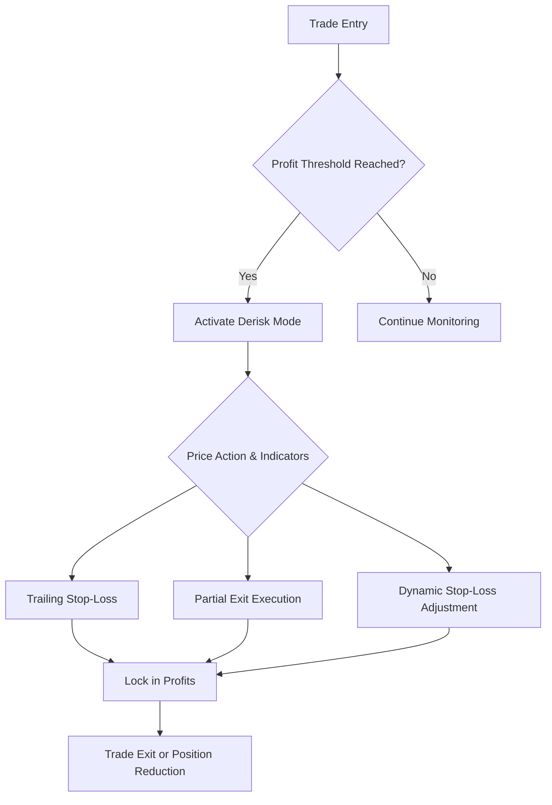
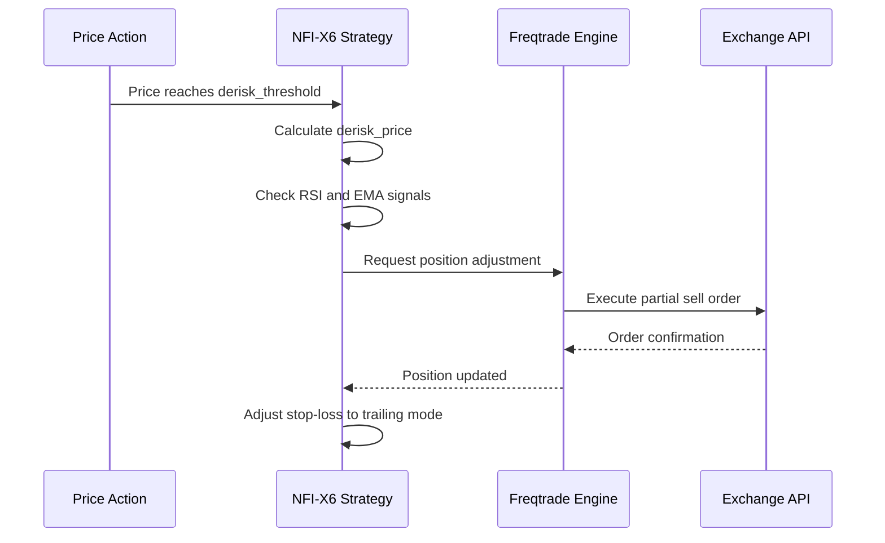
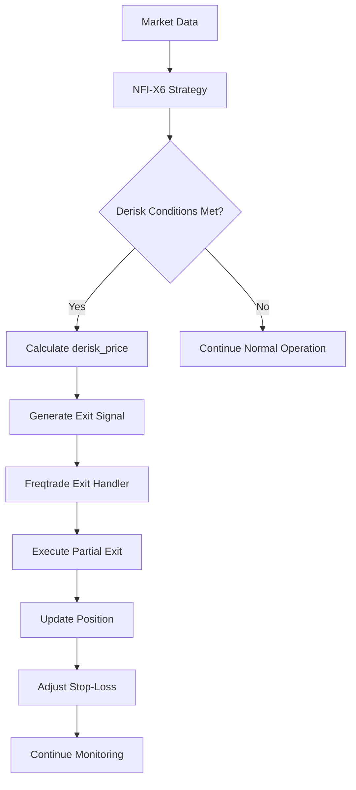

# Derisking System

<cite>
**Referenced Files in This Document**   
- [NostalgiaForInfinityX6.py](file://NostalgiaForInfinityX6.py)
- [README.md](file://README.md)
</cite>

## Table of Contents
1. [Introduction](#introduction)
2. [Derisking System Overview](#derisking-system-overview)
3. [Derisking Mechanisms](#derisking-mechanisms)
4. [Configuration Parameters](#configuration-parameters)
5. [Integration with Freqtrade Exit Signals](#integration-with-freqtrade-exit-signals)
6. [Code Implementation](#code-implementation)
7. [Common Issues and Optimization Tips](#common-issues-and-optimization-tips)
8. [Impact on Portfolio Risk Exposure](#impact-on-portfolio-risk-exposure)
9. [Conclusion](#conclusion)

## Introduction
The Derisking System in the NostalgiaForInfinityX6 (NFI-X6) strategy is a critical component designed to protect profits and manage risk exposure during live trading. Built on the Freqtrade framework, this system implements dynamic profit protection mechanisms that activate under predefined market conditions. The derisking logic is particularly important in volatile cryptocurrency markets, where rapid price movements can quickly erase gains if not properly managed. This document provides a comprehensive analysis of how the derisking system operates, including its configuration parameters, implementation details, and integration with the broader trading strategy.

**Section sources**
- [README.md](file://README.md#L1-L57)
- [NostalgiaForInfinityX6.py](file://NostalgiaForInfinityX6.py#L0-L799)

## Derisking System Overview
The derisking system in NostalgiaForInfinityX6 is designed to lock in profits by implementing trailing stop-loss mechanisms and executing partial exits when predefined profit thresholds are reached. This system operates as a risk management layer that activates when trades reach certain profitability levels or when market conditions indicate potential reversals. The derisking logic is integrated into the position adjustment framework, allowing for dynamic risk management throughout the lifecycle of a trade.

The system employs multiple derisking strategies depending on the trading mode (normal, rebuy, grind, rapid, etc.) and market conditions. For spot trading, derisking typically occurs at lower profit thresholds compared to futures trading, reflecting the different risk profiles and leverage considerations. The derisking mechanism is particularly important in preventing premature exits during strong trending markets while still protecting against significant drawdowns.



**Diagram sources**
- [NostalgiaForInfinityX6.py](file://NostalgiaForInfinityX6.py#L206-L213)

## Derisking Mechanisms
The derisking system implements several mechanisms to protect profits and manage risk exposure. These mechanisms include trailing stop-loss adjustments, partial profit-taking, and dynamic position management based on price action relative to entry points and technical indicators.

### Trailing Stop-Loss Mechanism
The trailing stop-loss mechanism in NFI-X6 dynamically adjusts the stop-loss price based on the highest price reached since entry. When a trade reaches a predefined profit threshold (derisk_threshold), the system activates a trailing stop that follows the price at a specified distance. This allows traders to capture gains during upward trends while protecting against sudden reversals.

### Partial Exit Execution
When profit thresholds are reached, the system can execute partial exits to lock in profits while maintaining exposure to potential further gains. The percentage of position closed (derisk_percent) is configurable and varies depending on the trading mode. For example, in normal mode, the system might close 20-30% of the position when the first profit threshold is reached, then additional portions at higher thresholds.

### Dynamic Stop-Loss Adjustment
The stop-loss levels are dynamically adjusted based on multiple factors including:
- Current profit level
- Market volatility
- Indicator signals (RSI, EMA crossovers)
- Trading mode (normal, rebuy, grind, etc.)

This dynamic adjustment ensures that stop-loss levels are not static but adapt to changing market conditions, providing more intelligent risk management.



**Diagram sources**
- [NostalgiaForInfinityX6.py](file://NostalgiaForInfinityX6.py#L275-L293)

## Configuration Parameters
The derisking system is controlled by several configurable parameters that allow traders to customize the risk management behavior according to their risk tolerance and market outlook.

### Key Configuration Parameters
- **derisk_enable**: Boolean flag to enable or disable the derisking system (default: `True`)
- **regular_mode_derisk_spot/futures**: The negative profit threshold at which derisking is triggered for normal mode trades
- **grinding_v2_derisk_level_1/2/3_spot/futures**: Multi-level derisking thresholds for grinding positions
- **rebuy_mode_derisk_spot/futures**: Derisking threshold for rebuy mode trades

**Note:** The derisking system does not use standalone `derisk_threshold`, `derisk_percent`, or `derisk_timeout` parameters. Instead, it uses mode-specific profit/loss thresholds and calculates partial exit amounts dynamically based on position size and minimum stake requirements.

### Mode-Specific Parameters
The system uses different derisking parameters for various trading modes:

| Mode | Profit Threshold (for grinding) | Derisk Stop Level |
|------|--------------------------------|-------------------|
| Normal | 0.018 (1.8%) | -0.24 (spot), -0.60 (futures) |
| Rebuy | N/A | -0.60 (both spot and futures) |
| Grind (v1) | 0.018 (1.8%) | -0.50 (both) |
| Grind (v2) Level 1 | N/A | [-0.06, -0.15] (spot), [-0.18, -0.35] (futures) |
| Grind (v2) Level 2 | N/A | [-0.08, -0.18] (spot), [-0.16, -0.54] (futures) |
| Grind (v2) Level 3 | N/A | [-0.10, -0.20] (spot), [-0.30, -0.60] (futures) |
| Rapid | 0.028 (2.8%) | N/A (uses regular mode derisk) |
| Scalp | 0.05 (5.0%) | -0.05 (both spot and futures) |

**Note:**
- Profit thresholds are used to determine when to stop adding more grinds, not for derisking activation
- Derisk stop levels are negative values indicating loss thresholds at which partial exits occur
- Grinding v2 uses multi-level derisking with two thresholds per level (first triggers flag, second triggers sell)

These parameters are defined in the strategy class (L206-L488) and can be overridden in the configuration file, allowing for fine-tuning based on market conditions and risk preferences.

**Section sources**
- [NostalgiaForInfinityX6.py](file://NostalgiaForInfinityX6.py#L206-L362)

## Integration with Freqtrade Exit Signals
The derisking system is tightly integrated with Freqtrade's exit signal system, leveraging the framework's position adjustment capabilities to implement partial exits and dynamic stop-loss management.

### Exit Signal Generation
The derisking system generates exit signals when:
1. The current profit exceeds the derisk_threshold
2. Technical indicators (RSI, EMA) confirm a potential reversal
3. Price action shows signs of weakening momentum

These signals are processed by Freqtrade's exit signal handler, which determines the appropriate action (partial exit, full exit, or stop-loss adjustment).

### Position Adjustment Workflow
The integration follows this workflow:
1. The strategy detects that derisking conditions are met
2. It calculates the appropriate derisk_price based on current market data
3. It generates an exit signal with the derisk_percent as the sell amount
4. Freqtrade processes the signal and executes the partial exit
5. The strategy updates the stop-loss level to the new trailing position

This integration allows for seamless risk management within the Freqtrade ecosystem, leveraging the framework's robust order execution and position tracking capabilities.



**Diagram sources**
- [NostalgiaForInfinityX6.py](file://NostalgiaForInfinityX6.py#L2232-L2395) - adjust_trade_position dispatcher
- [NostalgiaForInfinityX6.py](file://NostalgiaForInfinityX6.py#L34686-L40947) - Grinding and rebuy position adjustment methods

## Code Implementation
The derisking system is implemented through several key functions in the NostalgiaForInfinityX6 strategy class, primarily within the position adjustment methods.

### Core Derisking Functions
The main derisking logic is contained in the `long_adjust_trade_position_no_derisk` and `short_adjust_trade_position_no_derisk` methods, which handle position adjustments for long and short positions respectively.

```python
def long_adjust_trade_position_no_derisk(self, trade: Trade, current_time: datetime,
                                       current_rate: float, current_profit: float,
                                       min_stake: float, max_stake: float,
                                       current_entry_rate: float, current_exit_rate: float,
                                       current_entry_profit: float, last_candle: DataFrame,
                                       previous_candle_1: DataFrame, previous_candle_2: DataFrame,
                                       previous_candle_3: DataFrame, previous_candle_4: DataFrame,
                                       previous_candle_5: DataFrame, trade_data: dict):
    """
    Adjust positions for long trades without derisking
    """
    # Implementation details for position adjustment
    # without activating derisk mode
    pass
```

### Derisk Trigger Calculation
The derisking system triggers when profit_stake falls below the calculated derisk threshold:

```python
# Actual implementation from long_adjust_trade_position_no_derisk (L40676-40691)
if (
  self.derisk_enable
  and (
    profit_stake
    < (
      slice_amount
      * (
        (self.regular_mode_derisk_futures if self.is_futures_mode
         else self.regular_mode_derisk_spot)
        if (trade.open_date_utc.replace(tzinfo=None) >= datetime(2024, 9, 13) or is_backtest)
        else (self.regular_mode_derisk_futures_old if self.is_futures_mode
              else self.regular_mode_derisk_spot_old)
      )
      / trade.leverage
    )
  )
):
    # Calculate partial sell amount
    sell_amount = trade.amount * exit_rate / trade.leverage - (min_stake * 1.55)
    ft_sell_amount = sell_amount * trade.leverage * (trade.stake_amount / trade.amount) / exit_rate

    if sell_amount > min_stake and ft_sell_amount > min_stake:
        # Execute partial exit with "d" tag
        return -ft_sell_amount, "d", is_derisk
```

### Multi-Level Derisking (Grinding v2)
Grinding v2 implements a sophisticated multi-level derisking system:

```python
# Level 1 derisking (L35271-35291 for long trades)
if (
  self.derisk_enable
  and self.grinding_v2_derisk_level_1_enable
  and (trade.get_custom_data(key="grinding_v2_derisk_level_1_flag") is None)
  and profit_stake
  < (
    slice_amount
    * (self.grinding_v2_derisk_level_1_futures[0] if self.is_futures_mode
       else self.grinding_v2_derisk_level_1_spot[0])
  )
):
    # Set flag to track that level 1 threshold has been crossed
    trade.set_custom_data(key="grinding_v2_derisk_level_1_flag", value=True)
    trade.set_custom_data(key="grinding_v2_derisk_level_1_profit", value=profit_stake)
    trade.set_custom_data(key="grinding_v2_derisk_level_1_time", value=current_time.isoformat())
```

The implementation considers various trading modes and their specific parameters, ensuring that derisking behavior is appropriate for the current market context.

**Section sources**
- [NostalgiaForInfinityX6.py](file://NostalgiaForInfinityX6.py#L39297-L40760) - long_adjust_trade_position_no_derisk method
- [NostalgiaForInfinityX6.py](file://NostalgiaForInfinityX6.py#L206-L488) - Derisk configuration parameters

## Common Issues and Optimization Tips
While the derisking system provides robust risk management, traders may encounter certain issues that affect performance. Understanding these issues and applying optimization techniques can improve the system's effectiveness.

### Common Issues
- **Premature Derisking in Trending Markets**: The system may trigger derisking too early in strong trending markets, causing traders to exit positions before maximum profits are realized.
- **Whipsaw Effects**: In volatile markets, price may repeatedly trigger derisking conditions only to reverse direction, leading to suboptimal exits.
- **Parameter Sensitivity**: The system's performance is highly sensitive to the derisk_threshold and derisk_percent parameters, requiring careful calibration.

### Optimization Tips
- **Adaptive Thresholds**: Consider implementing adaptive derisk_threshold values that increase during strong trends to avoid premature exits.
- **Indicator Confirmation**: Require confirmation from multiple indicators (e.g., RSI divergence, EMA crossover) before activating derisk mode to reduce false signals.
- **Time-Based Filtering**: Implement time-based filters to prevent derisking during known volatile periods (e.g., exchange maintenance, major news events).
- **Volatility Adjustment**: Adjust derisk parameters based on market volatility (e.g., using ATR indicator) to make the system more responsive to current market conditions.

Balancing profit protection with ride potential is crucial. Traders should backtest different parameter combinations to find the optimal balance for their specific market conditions and risk tolerance.

**Section sources**
- [NostalgiaForInfinityX6.py](file://NostalgiaForInfinityX6.py#L206-L362)

## Impact on Portfolio Risk Exposure
The derisking system significantly reduces overall portfolio risk exposure by systematically locking in profits and limiting potential drawdowns.

### Risk Reduction Mechanisms
- **Profit Locking**: By taking partial profits at predefined thresholds, the system ensures that gains are secured even if the market reverses.
- **Drawdown Limitation**: The dynamic stop-loss adjustment prevents large drawdowns from erasing previous gains.
- **Position Sizing Control**: The system effectively reduces position size as profits accumulate, decreasing exposure to adverse price movements.

### Portfolio-Level Benefits
- **Improved Risk-Adjusted Returns**: By protecting profits, the system enhances the Sharpe ratio and other risk-adjusted performance metrics.
- **Reduced Volatility**: The systematic profit-taking and stop-loss management reduce overall portfolio volatility.
- **Capital Preservation**: The primary benefit is capital preservation, ensuring that winning trades contribute positively to the overall portfolio performance.

The derisking system transforms the risk profile of the NostalgiaForInfinityX6 strategy from a high-volatility approach to a more balanced risk-reward profile, making it suitable for a wider range of traders and market conditions.

## Conclusion
The derisking system in the NostalgiaForInfinityX6 strategy provides a sophisticated framework for profit protection and risk management. By implementing trailing stop-loss mechanisms, partial exit execution, and dynamic position adjustments, the system effectively locks in profits while maintaining exposure to potential further gains. The integration with Freqtrade's exit signal system allows for seamless implementation within the trading framework, while the configurable parameters enable customization to different risk profiles and market conditions.

The system's effectiveness depends on proper parameter tuning and understanding of its behavior in different market environments. Traders should carefully backtest and optimize the derisking parameters to achieve the optimal balance between profit protection and ride potential. When properly configured, the derisking system significantly enhances the risk-adjusted returns of the NostalgiaForInfinityX6 strategy, making it a valuable component of a comprehensive trading approach.