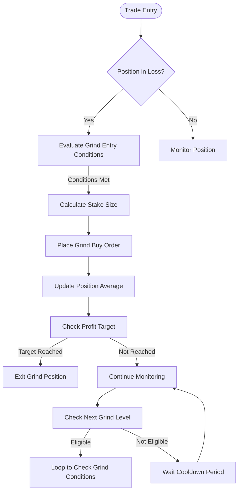
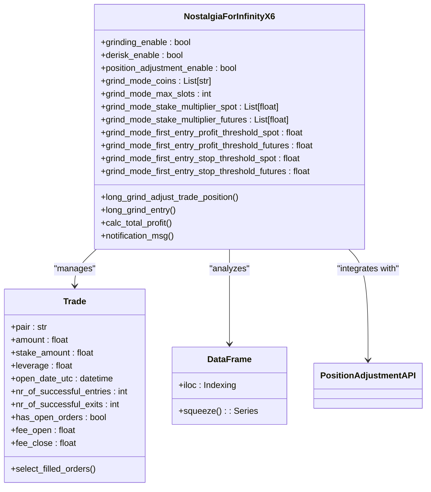
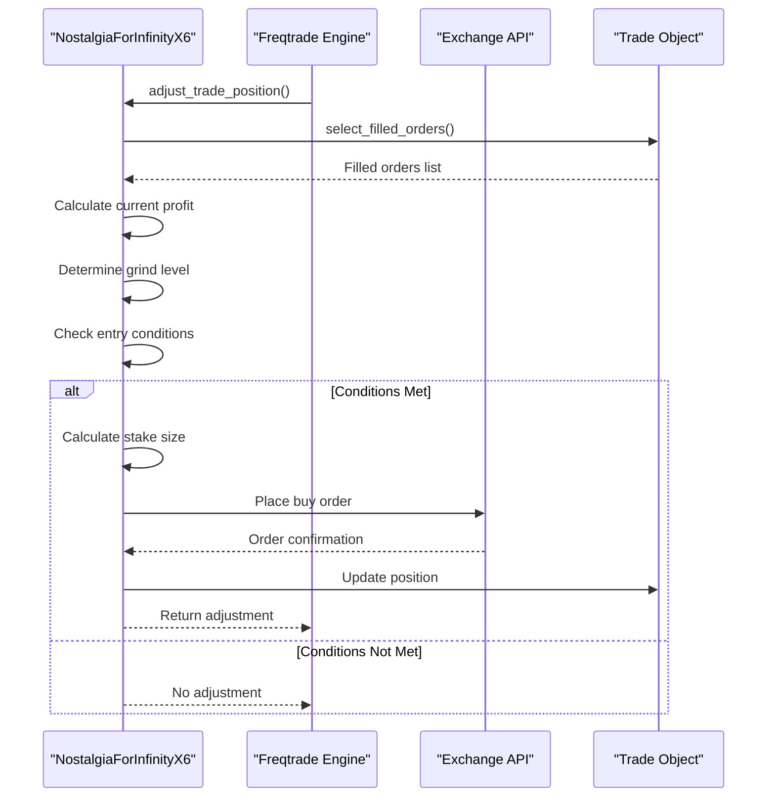
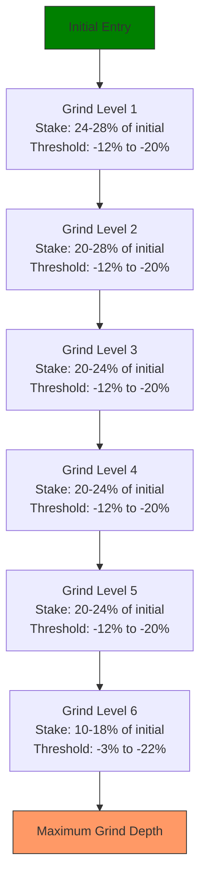
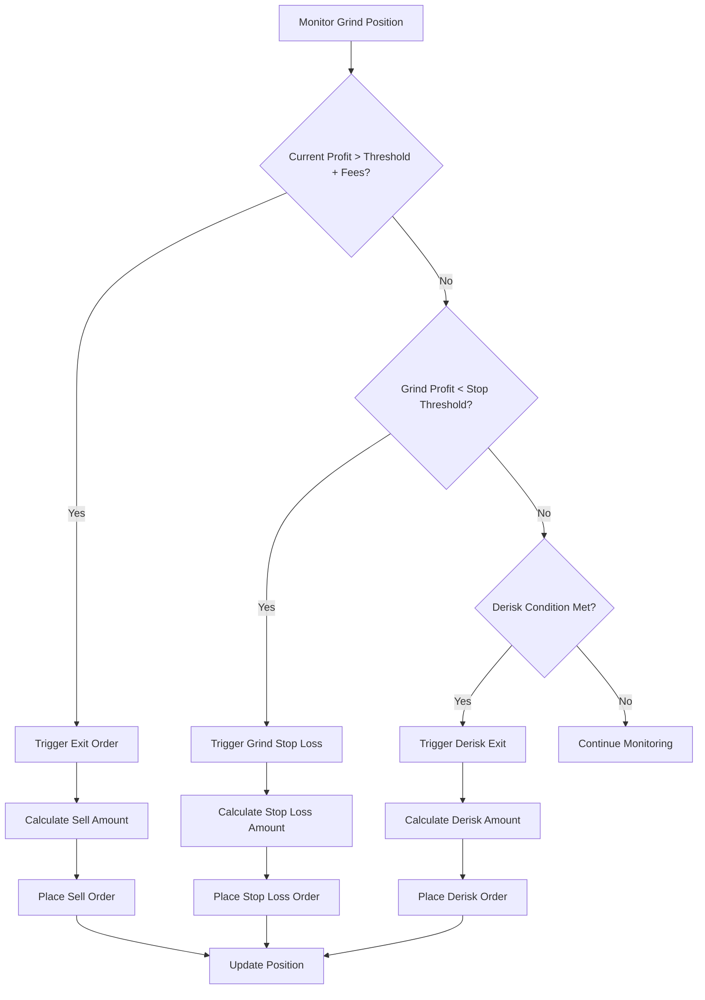
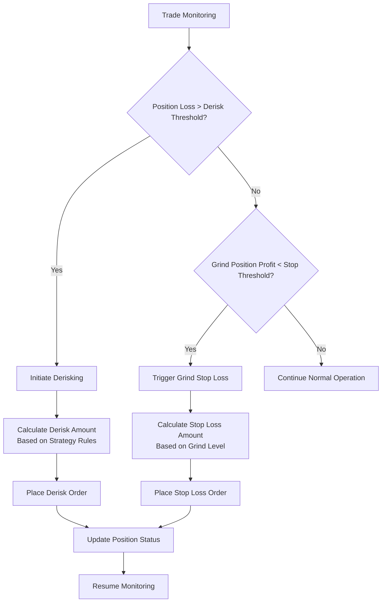

# Grinding Mechanism

<cite>
**Referenced Files in This Document**   
- [NostalgiaForInfinityX6.py](file://NostalgiaForInfinityX6.py#L1-L65286)
- [test_NFIX6.py](file://tests/unit/test_NFIX6.py#L59-L125)
</cite>

## Table of Contents
1. [Introduction](#introduction)
2. [Grinding Mechanism Overview](#grinding-mechanism-overview)
3. [Core Components and Configuration](#core-components-and-configuration)
4. [Position Adjustment Workflow](#position-adjustment-workflow)
5. [Grinding Levels and Dynamic Sizing](#grinding-levels-and-dynamic-sizing)
6. [Profit Thresholds and Exit Conditions](#profit-thresholds-and-exit-conditions)
7. [Risk Management and Derisking](#risk-management-and-derisking)
8. [Configuration Parameters](#configuration-parameters)
9. [Performance and Exchange Considerations](#performance-and-exchange-considerations)
10. [Best Practices and Tuning](#best-practices-and-tuning)

## Introduction
The Grinding Mechanism in the NostalgiaForInfinityX6 strategy is a sophisticated position averaging system designed to reduce the average entry price of losing trades through controlled, incremental buying. This approach aims to improve profitability by systematically lowering the break-even point while maintaining strict risk controls. The mechanism leverages Freqtrade's position adjustment API to dynamically manage open trades, allowing for multiple entries and exits based on predefined thresholds and market conditions.

This document provides a comprehensive analysis of the grinding system, focusing on its implementation, configuration options, and operational logic. It explains how the strategy handles different market scenarios, manages risk exposure, and interacts with exchange APIs to execute trades safely and efficiently.

## Grinding Mechanism Overview
The grinding mechanism in NostalgiaForInfinityX6 enables the strategy to average down on losing positions using progressively smaller position sizes. This approach reduces the average entry price while managing risk through predefined thresholds and position sizing rules. The system is activated when a trade enters a loss zone and meets specific entry conditions based on technical indicators and price action.

The mechanism operates through a series of "grind levels," each with its own stake size, entry threshold, and profit target. When a trade reaches a predefined loss threshold, the system places a new buy order with a stake size determined by the current grind level. The stake sizes decrease progressively across levels, preventing excessive capital allocation to a single losing position.

The grinding process is tightly integrated with Freqtrade's position adjustment API, which allows for dynamic modification of open trades without closing them. This enables the strategy to add to positions incrementally while maintaining accurate profit calculations and risk management. The system also implements cooldown periods between entries to prevent over-trading during volatile market conditions.

**Diagram sources**
- [NostalgiaForInfinityX6.py](file://NostalgiaForInfinityX6.py#L34686-L39203)

**Section sources**
- [NostalgiaForInfinityX6.py](file://NostalgiaForInfinityX6.py#L34686-L39203)

## Core Components and Configuration
The grinding mechanism is implemented through several key components and configuration parameters that work together to manage position adjustments. The core functionality is contained in the `long_grind_adjust_trade_position` method, which handles all aspects of the grinding process for long positions.

The system uses a tagging mechanism to identify trades that should be subject to grinding. Trades with specific entry tags (such as "120" for long grind mode) are eligible for position adjustments. The strategy maintains separate configuration parameters for spot and futures trading modes, allowing for different risk profiles and position sizing rules.

Key configuration elements include:
- **grind_wallets**: Not explicitly defined as a parameter, but position sizing is controlled through stake multipliers and thresholds
- **grind_levels**: Implemented through multiple grind level configurations (grind_1 through grind_6)
- **Dynamic position sizing**: Calculated based on account balance, risk parameters, and current market conditions

The system also supports different grinding modes, including regular grinding, derisk grinding, and specialized modes for rebuy and rapid trading scenarios. Each mode has its own set of parameters controlling stake sizes, entry thresholds, and profit targets.

**Diagram sources**
- [NostalgiaForInfinityX6.py](file://NostalgiaForInfinityX6.py#L2265-L2265)
- [NostalgiaForInfinityX6.py](file://NostalgiaForInfinityX6.py#L34686-L39203)

**Section sources**
- [NostalgiaForInfinityX6.py](file://NostalgiaForInfinityX6.py#L34686-L39203)

## Position Adjustment Workflow
The position adjustment workflow in the grinding mechanism follows a systematic process to evaluate and execute additional entries on losing positions. The workflow begins when the `adjust_trade_position` method is called by Freqtrade's position adjustment system, which triggers the appropriate adjustment function based on the trade's entry tags.

The workflow starts with validation checks to ensure the trade is eligible for adjustment. The system verifies that the trade has completed its initial entry and does not have any open orders that could conflict with new entries. It then calculates the current profit/loss ratio and determines the appropriate grind level based on the current market conditions and the trade's performance.

Key steps in the workflow include:
1. **Data Collection**: Retrieve the latest market data and trade information
2. **Eligibility Check**: Verify the trade meets all conditions for grinding
3. **Stake Calculation**: Determine the appropriate stake size based on the current grind level
4. **Entry Condition Evaluation**: Assess technical indicators and price action for entry signals
5. **Order Execution**: Place the grind buy order with appropriate tagging
6. **Position Update**: Update the trade's average entry price and profit calculations

The system implements several safety checks to prevent over-leveraging and ensure compliance with exchange requirements. These include minimum stake amount validation, maximum position size limits, and cooldown periods between entries. The workflow also handles partial fills and adjusts subsequent orders accordingly.

**Diagram sources**
- [NostalgiaForInfinityX6.py](file://NostalgiaForInfinityX6.py#L34686-L39203)
- [test_NFIX6.py](file://tests/unit/test_NFIX6.py#L59-L86)

**Section sources**
- [NostalgiaForInfinityX6.py](file://NostalgiaForInfinityX6.py#L34686-L39203)

## Grinding Levels and Dynamic Sizing
The grinding mechanism implements multiple levels of position adjustments, each with progressively smaller stake sizes. This approach allows the strategy to average down on losing positions while reducing risk exposure with each subsequent entry. The system supports up to six grind levels (grind_1 through grind_6), with each level having its own configuration for stake sizes, entry thresholds, and profit targets.

Dynamic position sizing is calculated based on several factors:
- **Account balance**: Stake sizes are proportional to the initial entry amount
- **Risk parameters**: Maximum stake ratios prevent over-allocation to single positions
- **Market conditions**: Volatility and price action influence entry decisions
- **Exchange requirements**: Minimum stake amounts ensure order validity

The stake sizes for each grind level are defined in configuration parameters such as `grind_1_stakes_spot`, `grind_2_stakes_futures`, etc. These values represent ratios of the initial entry stake, allowing for consistent position sizing across different account sizes. For example, grind_1 typically uses stake ratios around 0.24-0.28 (24-28% of initial entry), while later levels use smaller ratios like 0.10-0.18.

The system automatically adjusts stake sizes when they fall below the exchange's minimum requirement. If a calculated stake would be too small, the system scales up all stakes for that grind level to ensure the first entry meets the minimum threshold. This prevents order rejection due to insufficient stake amounts.

**Diagram sources**
- [NostalgiaForInfinityX6.py](file://NostalgiaForInfinityX6.py#L34686-L39203)

**Section sources**
- [NostalgiaForInfinityX6.py](file://NostalgiaForInfinityX6.py#L34686-L39203)

## Profit Thresholds and Exit Conditions
The grinding mechanism employs specific profit thresholds and exit conditions to determine when to close grind positions and realize gains. Each grind level has its own profit threshold that must be exceeded before an exit is triggered, accounting for trading fees to ensure profitability.

The primary profit threshold for most grind levels is set at 0.018 (1.8%), with some levels using higher thresholds like 0.048 (4.8%) for grind_5. These thresholds are adjusted by the sum of opening and closing fees to ensure the net profit is positive. For example, if fees total 0.005 (0.5%), the effective profit must exceed 0.023 (2.3%) to trigger an exit.

Exit conditions are evaluated based on the current profit of the grind position relative to its average entry price. The system calculates the profit ratio as (current_rate - average_entry_price) / average_entry_price and compares it to the configured threshold. When the profit exceeds the threshold plus fees, a sell order is placed to close the grind position.

Additional exit conditions include:
- **Grind stop losses**: Triggered when the grind position's profit falls below a specified threshold
- **Derisk exits**: Activated when the overall trade reaches a de-risk condition
- **Partial exits**: Executed when there are remaining unfilled amounts from previous exit orders

The system also implements a cooldown period between entries and exits to prevent rapid-fire trading during volatile market conditions. This helps reduce transaction costs and prevents over-trading.

**Diagram sources**
- [NostalgiaForInfinityX6.py](file://NostalgiaForInfinityX6.py#L34686-L39203)

**Section sources**
- [NostalgiaForInfinityX6.py](file://NostalgiaForInfinityX6.py#L34686-L39203)

## Risk Management and Derisking
The grinding mechanism incorporates comprehensive risk management features to protect against excessive losses during strong downtrends. The system implements multiple layers of risk controls, including position sizing limits, stop-loss mechanisms, and derisking strategies.

Key risk management components include:
- **Maximum stake ratios**: The `grinding_v1_max_stake` parameter limits the total stake for grind positions to a ratio of the first entry (default 1.0)
- **Grind stop losses**: Each grind level has a stop-loss threshold that triggers exit if the grind position's profit falls below a specified level
- **Derisking mechanisms**: The system can initiate de-risking when the overall trade reaches predefined loss thresholds
- **Position limits**: The `grind_mode_max_slots` parameter limits the number of concurrent grind positions

The derisking system is particularly important for preventing catastrophic losses during extended bear markets. When a trade reaches a derisk condition (typically a significant loss threshold), the system can initiate partial or full exits to preserve capital. The derisk thresholds vary by trading mode, with futures positions having different thresholds than spot positions due to leverage effects.

The system also implements order safety checks to prevent over-leveraging and ensure compliance with exchange requirements. These checks validate that each order meets minimum stake requirements and does not exceed maximum position size limits. The strategy also considers exchange-specific limitations, such as the number of candles available per API call, to ensure reliable data access.

**Diagram sources**
- [NostalgiaForInfinityX6.py](file://NostalgiaForInfinityX6.py#L34686-L39203)

**Section sources**
- [NostalgiaForInfinityX6.py](file://NostalgiaForInfinityX6.py#L34686-L39203)

## Configuration Parameters
The grinding mechanism is controlled by numerous configuration parameters that allow users to customize its behavior based on their risk tolerance and market conditions. These parameters are divided into several categories:

### General Grinding Parameters
- **grinding_enable**: Enables or disables the grinding mechanism
- **position_adjustment_enable**: Controls whether position adjustments are allowed
- **derisk_enable**: Enables derisking functionality
- **stops_enable**: Controls stop-loss functionality

### Grind Level Parameters
Each grind level (1-6) has its own set of parameters:
- **grind_X_stakes_spot/futures**: Stake sizes as ratios of initial entry for spot/futures
- **grind_X_sub_thresholds_spot/futures**: Entry thresholds for each sub-level
- **grind_X_profit_threshold_spot/futures**: Profit targets for exiting the grind position
- **grind_X_stop_grinds_spot/futures**: Stop-loss thresholds for the grind position

### Mode-Specific Parameters
- **regular_mode_stake_multiplier_spot/futures**: Stake multipliers for regular mode
- **rebuy_mode_stake_multiplier**: Stake multiplier for rebuy mode
- **grind_mode_stake_multiplier_spot/futures**: Stake multipliers for grind mode
- **grind_mode_first_entry_profit_threshold_spot/futures**: Profit threshold for first entry exit

### Risk Parameters
- **grinding_v1_max_stake**: Maximum total stake ratio for grind positions
- **grind_mode_max_slots**: Maximum number of concurrent grind positions
- **max_slippage**: Maximum allowed slippage for entries

These parameters can be adjusted in the strategy configuration to optimize performance for different market conditions and risk profiles. The system also supports advanced configuration through the `nfi_parameters` block, allowing for fine-tuned control over all grinding parameters.

**Section sources**
- [NostalgiaForInfinityX6.py](file://NostalgiaForInfinityX6.py#L2265-L2265)

## Performance and Exchange Considerations
The grinding mechanism's performance is influenced by several factors related to exchange characteristics and fee structures. The system must account for different exchange requirements, including minimum stake amounts, API rate limits, and data availability.

Key performance considerations include:
- **Fee structures**: Higher trading fees require larger profit thresholds to remain profitable
- **Minimum stake amounts**: Exchanges with high minimum stakes may prevent small grind entries
- **API limitations**: Some exchanges provide fewer candles per API call, affecting indicator calculations
- **Leverage effects**: Futures trading introduces additional complexity due to leverage and margin requirements

The strategy adapts to different exchanges by adjusting its startup candle count based on the exchange's API limitations. For example, OKX and Kraken receive fewer candles per API call, so the strategy increases the startup_candle_count to ensure sufficient data for indicator calculations.

Exchange fee structures significantly impact the grinding mechanism's effectiveness. High fees can erode profits from small grind positions, making it essential to adjust profit thresholds accordingly. The system allows for custom fee rates through the `custom_fee_open_rate` and `custom_fee_close_rate` parameters, enabling accurate profit calculations.

Performance optimization strategies include:
- Using appropriate stake sizes to minimize fee impact
- Adjusting profit thresholds based on exchange fees
- Implementing cooldown periods to reduce API calls
- Optimizing indicator calculations through multi-core processing

**Section sources**
- [NostalgiaForInfinityX6.py](file://NostalgiaForInfinityX6.py#L2265-L2265)

## Best Practices and Tuning
Effective use of the grinding mechanism requires careful parameter tuning based on market conditions, volatility, and risk tolerance. The following best practices can help optimize performance:

### Parameter Tuning Guidelines
- **Adjust stake sizes**: Reduce stake ratios in high-volatility markets to limit risk exposure
- **Modify profit thresholds**: Increase thresholds in high-fee environments to ensure profitability
- **Tune entry thresholds**: Adjust sub-thresholds based on asset volatility to avoid premature entries
- **Set appropriate max depth**: Limit grind depth in strongly trending markets to prevent over-grinding

### Market Condition Adaptation
- **High volatility**: Use smaller stake sizes and wider entry thresholds to avoid whipsaw losses
- **Low volatility**: Increase stake sizes and tighten entry thresholds for more frequent grinding
- **Strong trends**: Reduce maximum grind depth to prevent excessive losses in sustained moves
- **Range-bound markets**: Increase grind depth to capitalize on mean reversion opportunities

### Risk Management Recommendations
- **Monitor position concentration**: Avoid over-allocation to single assets through grind entries
- **Regularly review performance**: Analyze grind success rates and adjust parameters accordingly
- **Consider exchange differences**: Customize parameters for each exchange based on fees and liquidity
- **Implement circuit breakers**: Set maximum loss limits to prevent catastrophic drawdowns

Common issues and solutions:
- **Over-grinding in downtrends**: Reduce maximum grind depth or increase entry thresholds
- **Insufficient profit margins**: Increase profit thresholds to account for fees and slippage
- **Order rejections**: Adjust stake sizes to meet exchange minimum requirements
- **API rate limit issues**: Implement longer cooldown periods between entries

Regular backtesting and performance analysis are essential for optimizing the grinding mechanism. Users should test different parameter combinations across various market conditions to find the optimal configuration for their trading goals and risk tolerance.

**Section sources**
- [NostalgiaForInfinityX6.py](file://NostalgiaForInfinityX6.py#L2265-L2265)