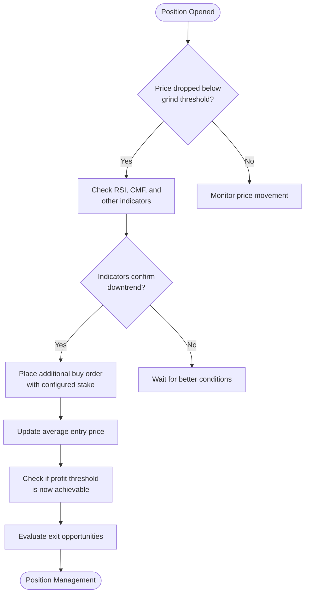
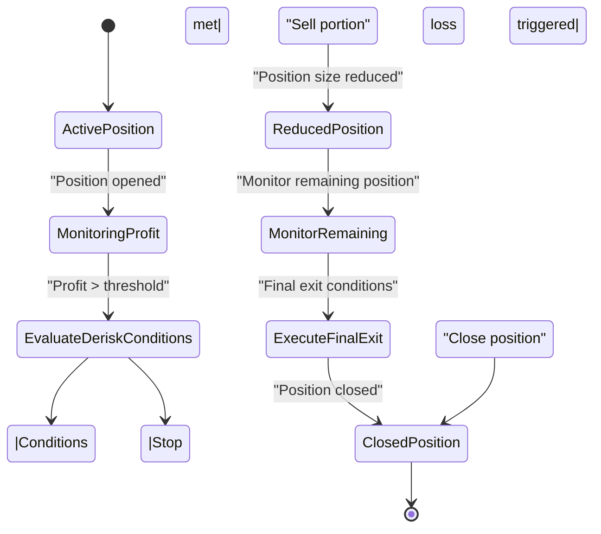
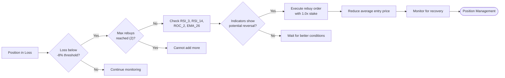
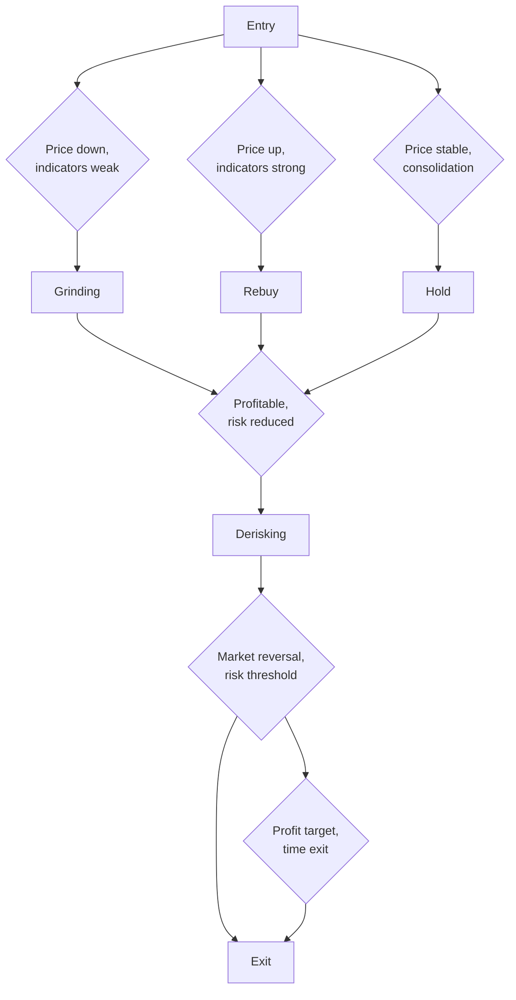

# Position Management

<cite>
**Referenced Files in This Document**   
- [NostalgiaForInfinityX6.py](file://NostalgiaForInfinityX6.py)
- [README.md](file://README.md)
</cite>

## Table of Contents
1. [Introduction](#introduction)
2. [Grinding Mechanism](#grinding-mechanism)
3. [Derisking Mechanism](#derisking-mechanism)
4. [Rebuy Mechanism](#rebuy-mechanism)
5. [Position State Model](#position-state-model)
6. [Dynamic Position Sizing](#dynamic-position-sizing)
7. [Integration with Freqtrade API](#integration-with-freqtrade-api)
8. [Configuration and Usage Patterns](#configuration-and-usage-patterns)
9. [Common Issues and Optimization](#common-issues-and-optimization)

## Introduction
The NostalgiaForInfinityX6 strategy implements an advanced position management system designed to optimize trade performance through dynamic adjustments based on market conditions. This document details the three core mechanisms: Grinding (averaging down losing positions), Derisking (locking in profits), and Rebuy (adding to winning positions). These systems are integrated within the Freqtrade framework and leverage price action, technical indicators, and configurable thresholds to make real-time trading decisions.

**Section sources**
- [NostalgiaForInfinityX6.py](file://NostalgiaForInfinityX6.py#L1-L100)
- [README.md](file://README.md#L1-L10)

## Grinding Mechanism

The grinding mechanism allows the strategy to average down on losing positions by placing additional buy orders at predetermined price thresholds below the entry point. This approach aims to reduce the average entry price and improve the probability of profitable exits.

### Implementation Details
Grinding is controlled through a series of configuration parameters that define the behavior for different market conditions. The strategy supports multiple grinding levels, each with specific stake amounts and price thresholds.

```python
# Example grinding configuration from NostalgiaForInfinityX6.py
grind_1_stakes_spot = [0.24, 0.26, 0.28]
grind_1_sub_thresholds_spot = [-0.12, -0.16, -0.20]
grind_1_profit_threshold_spot = 0.018
```

The grinding process follows these steps:
1. A losing position triggers when the price drops below configured thresholds
2. Additional buy orders are placed with decreasing stake sizes
3. Each grind level has a specific profit threshold for exit consideration
4. The process continues until the maximum number of grinds is reached or profitability is achieved

### Trigger Conditions
Grinding is triggered based on:
- Price movement below configured percentage thresholds
- Indicator signals confirming downtrend continuation
- Available stake and position limits
- Market volatility conditions

The strategy uses different grinding configurations for spot and futures markets, accounting for leverage differences.



**Diagram sources**
- [NostalgiaForInfinityX6.py](file://NostalgiaForInfinityX6.py#L500-L600)

**Section sources**
- [NostalgiaForInfinityX6.py](file://NostalgiaForInfinityX6.py#L500-L800)

## Derisking Mechanism

The derisking mechanism is designed to protect profits by trailing stop-loss orders or executing partial exits when specific conditions are met. This system helps lock in gains during favorable market movements while allowing positions to continue benefiting from ongoing trends.

### Implementation Details
Derisking is implemented through multiple approaches:
- Trailing stop-loss adjustments
- Partial profit taking at predefined levels
- Complete position exit under adverse conditions

```python
# Example derisk configuration from NostalgiaForInfinityX6.py
regular_mode_derisk_1_spot = -0.24
regular_mode_derisk_spot = -0.24
grinding_v2_derisk_level_1_spot = -0.12
```

The derisking process evaluates several factors:
- Current profit level relative to entry
- Market momentum indicators (RSI, MACD)
- Volume patterns and volatility
- Time since entry and profit duration

### Trigger Conditions
Derisking is activated when:
- Profit exceeds configured thresholds
- Market indicators show potential reversal signals
- Price action forms bearish patterns
- Volatility increases beyond acceptable levels

The strategy implements a tiered derisking approach with multiple levels of protection, allowing for graduated responses to changing market conditions.



**Diagram sources**
- [NostalgiaForInfinityX6.py](file://NostalgiaForInfinityX6.py#L1500-L1600)

**Section sources**
- [NostalgiaForInfinityX6.py](file://NostalgiaForInfinityX6.py#L1500-L1800)

## Rebuy Mechanism

**Important**: Despite its name, the rebuy mechanism actually functions as a **controlled averaging down** strategy for losing positions, similar to grinding but with different parameters and more conservative approach. It is NOT for adding to winning positions.

The rebuy mechanism adds to positions when they are in loss (typically -8% to -10%), with strict indicator confirmation to ensure the position is likely to recover. This approach aims to reduce average entry price while maintaining strict risk controls.

### Implementation Details
Rebuy functionality is controlled by:
- Negative profit thresholds (position must be in loss)
- Strict indicator confirmation signals
- Available capital and position limits
- Maximum of 2 additional entries (rebuy_mode_stakes has 2 elements)

```python
# Example rebuy configuration from NostalgiaForInfinityX6.py
rebuy_mode_stake_multiplier = 0.35
rebuy_mode_thresholds_spot = [-0.08, -0.10]  # Triggered at -8% and -10% loss
rebuy_mode_stakes_spot = [1.0, 1.0]  # Each rebuy is 1x the initial stake
```

The rebuy process follows these steps:
1. Position enters loss zone (profit drops below -8%)
2. System checks if maximum rebuy count (2) has not been reached
3. Technical indicators confirm potential reversal (RSI_3 > 10, RSI_14 < 40, close < EMA_26 * 0.988)
4. Additional buy orders are executed with configured stakes (1.0x initial)
5. Average entry price is reduced, improving break-even point

### Trigger Conditions
Rebuy is triggered when:
- `slice_profit_entry < rebuy_mode_thresholds[sub_grind_count]` (position is losing)
- Sub-grind count is less than maximum allowed (2 rebuys max)
- RSI_3 > 10.0 (not extremely oversold)
- RSI_3_15m > 10.0 (multi-timeframe confirmation)
- RSI_14 < 40.0 (showing weakness but not extreme)
- ROC_2 > -0.0 (momentum not too negative)
- Close < EMA_26 * 0.988 (price below key moving average)

**Key Difference from Grinding**: Rebuy mode uses larger stakes (1.0x) for fewer entries (max 2), while grinding uses progressively smaller stakes for more entries (typically 3-5). Rebuy is more aggressive in position sizing but more conservative in entry count.



**Diagram sources**
- [NostalgiaForInfinityX6.py](file://NostalgiaForInfinityX6.py#L40764-L40947) - long_rebuy_adjust_trade_position

**Section sources**
- [NostalgiaForInfinityX6.py](file://NostalgiaForInfinityX6.py#L40764-L40947) - Rebuy mechanism implementation
- [NostalgiaForInfinityX6.py](file://NostalgiaForInfinityX6.py#L481-L488) - Rebuy configuration parameters

## Position State Model

The position state model defines the lifecycle of trades within the strategy, tracking various states and transitions based on market conditions and strategy rules.

### State Definitions
The strategy recognizes multiple position states:
- **Entry**: Initial position opened
- **Grinding**: Averaging down process active
- **Derisking**: Profit protection mode active
- **Rebuy**: Adding to winning position
- **Exit**: Position closing process

### State Transitions
State transitions occur based on:
- Price movement relative to thresholds
- Indicator signal changes
- Time-based conditions
- Profit/loss levels



The state model ensures that position management decisions are consistent and based on predefined rules rather than emotional trading.

**Diagram sources**
- [NostalgiaForInfinityX6.py](file://NostalgiaForInfinityX6.py#L2500-L2600)

**Section sources**
- [NostalgiaForInfinityX6.py](file://NostalgiaForInfinityX6.py#L2500-L2800)

## Dynamic Position Sizing

The strategy implements dynamic position sizing that adjusts stake amounts based on account balance, risk percentage, and current market conditions.

### Sizing Factors
Position sizing considers:
- Account balance and available stake
- Configured risk percentage
- Market volatility (ATR, Bollinger Band width)
- Trend strength and momentum
- Specific mode requirements (grind, rebuy, etc.)

```python
# Example position sizing from custom_stake_amount method
def custom_stake_amount(self, pair: str, current_time: datetime, current_rate: float,
                       proposed_stake: float, min_stake: Optional[float], max_stake: float,
                       leverage: float, entry_tag: Optional[str], side: str, **kwargs) -> float:
    # Implementation details for dynamic sizing
```

### Mode-Specific Sizing
Different position management modes use specific sizing strategies:
- **Grinding**: Decreasing stake sizes for each additional buy
- **Rebuy**: Fixed or percentage-based stake multipliers
- **Normal**: Base stake with market condition adjustments

The dynamic sizing system ensures that risk is properly managed across different market conditions and strategy modes.

**Section sources**
- [NostalgiaForInfinityX6.py](file://NostalgiaForInfinityX6.py#L2800-L3100)

## Integration with Freqtrade API

The position management system is fully integrated with Freqtrade's position adjustment API and order management system.

### Key Integration Points
- **Position Adjustment API**: Used for adding to existing positions
- **Order Management**: Handles entry, exit, and adjustment orders
- **Data Provider**: Accesses multiple timeframe data for decision making
- **Configuration System**: Allows parameter overrides through config files

```python
# Example integration with Freqtrade API
def adjust_trade_position(self, trade: Trade, current_time: datetime, current_rate: float,
                         current_profit: float, min_stake: Optional[float], max_stake: float,
                         current_entry_rate: float, current_exit_rate: float,
                         current_entry_profit: float, current_exit_profit: float, **kwargs):
    # Implementation of position adjustment logic
```

The integration allows for seamless operation within the Freqtrade ecosystem while providing the advanced position management features.

**Section sources**
- [NostalgiaForInfinityX6.py](file://NostalgiaForInfinityX6.py#L3100-L3400)

## Configuration and Usage Patterns

### Conservative Settings
Conservative configurations focus on risk management:
- Lower stake multipliers
- Tighter profit thresholds
- More conservative grinding levels
- Higher derisking thresholds

```json
{
  "grinding_v2_max_stake": 0.5,
  "regular_mode_derisk_spot": -0.15,
  "rebuy_mode_stake_multiplier": 0.25
}
```

### Aggressive Settings
Aggressive configurations aim for higher returns:
- Higher stake multipliers
- Wider profit thresholds
- More aggressive grinding levels
- Lower derisking thresholds

```json
{
  "grinding_v2_max_stake": 1.5,
  "regular_mode_derisk_spot": -0.35,
  "rebuy_mode_stake_multiplier": 0.50
}
```

**Section sources**
- [NostalgiaForInfinityX6.py](file://NostalgiaForInfinityX6.py#L100-L500)

## Common Issues and Optimization

### Common Issues
- **Over-grinding in downtrends**: Adding too many positions during strong bear markets
- **Premature derisking**: Exiting too early during strong trends
- **Insufficient capital**: Not having enough stake for all position adjustments
- **Whipsaw losses**: Market noise triggering unwanted adjustments

### Performance Optimization
- **Proper grind level configuration**: Align with typical market volatility
- **Optimal derisk thresholds**: Balance profit protection with trend continuation
- **Cooldown timer tuning**: Prevent over-trading during volatile periods
- **Parameter backtesting**: Test configurations across multiple market conditions

The strategy includes extensive logging and notification features to monitor position management activities and optimize performance over time.

**Section sources**
- [NostalgiaForInfinityX6.py](file://NostalgiaForInfinityX6.py#L3400-L3700)