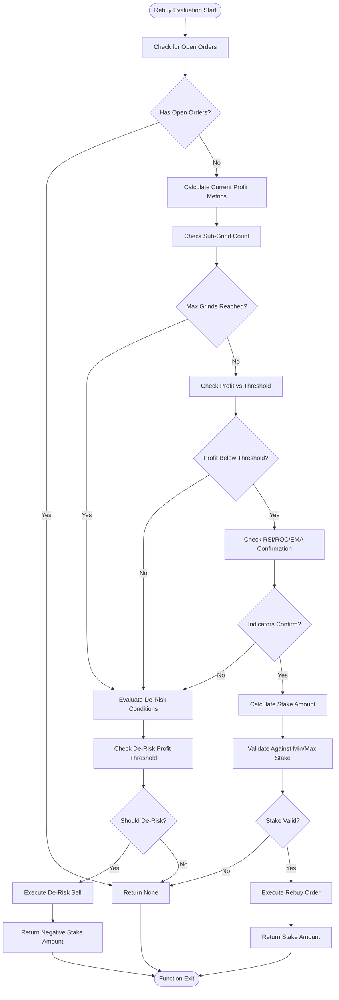
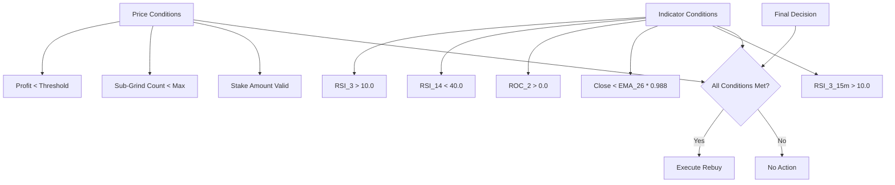

# Rebuy Logic

<cite>
**Referenced Files in This Document**
- [NostalgiaForInfinityX6.py](file://NostalgiaForInfinityX6.py#L40764-L40947) - long_rebuy_adjust_trade_position method
- [test_NFIX6.py](file://tests/unit/test_NFIX6.py#L58-L124)
- [exampleconfig-rebuy.json](file://configs/exampleconfig-rebuy.json#L1-L98)
</cite>

## Table of Contents
1. [Introduction](#introduction)
2. [Rebuy Mechanism Overview](#rebuy-mechanism-overview)
3. [Configuration Parameters](#configuration-parameters)
4. [Entry Conditions and Confirmation Requirements](#entry-conditions-and-confirmation-requirements)
5. [Position Sizing and Stake Management](#position-sizing-and-stake-management)
6. [Integration with Exchange Constraints](#integration-with-exchange-constraints)
7. [Performance Considerations](#performance-considerations)
8. [Best Practices and Tuning Guidelines](#best-practices-and-tuning-guidelines)
9. [Troubleshooting Common Issues](#troubleshooting-common-issues)

## Introduction
**Important Clarification**: Despite its name suggesting "buying back" into profitable positions, the rebuy logic in NostalgiaForInfinityX6 actually functions as a **controlled averaging down strategy** for losing positions. It adds to positions when they are in loss (typically -8% to -10%), not when winning.

The rebuy mechanism operates through the `long_rebuy_adjust_trade_position` method, which evaluates losing positions for additional entries based on profit degradation thresholds and strict technical indicator confirmations. This approach aims to reduce average entry price while maintaining disciplined risk management, deploying additional capital only when indicators suggest potential reversal. The system implements a conservative approach with maximum 2 additional entries, using larger position sizes (1.0x initial stake) compared to grinding strategies.

**Section sources**
- [NostalgiaForInfinityX6.py](file://NostalgiaForInfinityX6.py#L40764-L40947)

## Rebuy Mechanism Overview
The rebuy mechanism operates through the `long_rebuy_adjust_trade_position` method, which evaluates **losing positions** for additional entries when profit falls below negative thresholds (-8%, -10%). The system triggers rebuys when `slice_profit_entry < rebuy_mode_thresholds[sub_grind_count]`, meaning the position must be in loss before additional capital is deployed.

The rebuy process respects several critical constraints:
- **Loss Thresholds**: Only triggers when position profit is below -8% (first rebuy) or -10% (second rebuy)
- **Maximum Entries**: Limited to 2 additional rebuys (controlled by `rebuy_mode_stakes` array length)
- **Position Tracking**: Uses order tags and filled order analysis to track entry sequence and calculate current loss level
- **Strict Indicator Confirmation**: Requires RSI_3 > 10, RSI_3_15m > 10, RSI_14 < 40, ROC_2 > -0.0, and close < EMA_26 * 0.988
- **No Open Orders**: Cannot execute rebuy if there are pending orders



**Diagram sources**
- [NostalgiaForInfinityX6.py](file://NostalgiaForInfinityX6.py#L40764-L40947)

**Section sources**
- [NostalgiaForInfinityX6.py](file://NostalgiaForInfinityX6.py#L40764-L40947)

## Configuration Parameters
The rebuy functionality is controlled through several key configuration parameters that determine entry frequency, size, and risk management:

<details>
<summary>Rebuy Configuration Parameters</summary>

- **enable_rebuy**: Global toggle for rebuy functionality (default: enabled through position_adjustment_enable)
- **rebuy_limit**: Implicitly controlled through `rebuy_mode_stakes` array length (maximum 2 rebuys)
- **rebuy_pump_protection**: Implemented through BTC percentage thresholds in commented code section
- **rebuy_entry_count**: Tracked via `sub_grind_count` variable in the adjustment function
- **rebuy_price_deviation**: Controlled by `rebuy_mode_thresholds_spot/futures` arrays
- **rebuy_profit_threshold**: Defined in `rebuy_mode_derisk_spot/futures` parameters

</details>

The strategy configuration also includes exchange-specific settings that affect rebuy execution:

```json
{
  "position_adjustment_enable": true,
  "unfilledtimeout": {
    "entry": 3,
    "exit": 2,
    "unit": "minutes"
  },
  "order_types": {
    "entry": "limit",
    "exit": "limit"
  }
}
```

**Section sources**
- [NostalgiaForInfinityX6.py](file://NostalgiaForInfinityX6.py#L40764-L40947)
- [exampleconfig-rebuy.json](file://configs/exampleconfig-rebuy.json#L0-L98)

## Entry Conditions and Confirmation Requirements
The rebuy system requires multiple layers of confirmation before executing additional entries. These conditions ensure that rebuys occur only during sustained trends and not during temporary pullbacks or false breakouts.

### Primary Price Conditions
- **Profit Degradation**: Current entry profit must fall below threshold values defined in `rebuy_mode_thresholds`
- **Maximum Sub-Grinds**: Limited by the length of the `rebuy_mode_stakes` array (2 entries)
- **Stake Validation**: Buy amount must exceed minimum stake requirement (1.5x min_stake)

### Technical Indicator Confirmation
The system requires confirmation from three key indicators:
- **RSI_3** > 10.0 (5-minute timeframe)
- **RSI_14** < 40.0 (indicating room for upward movement)
- **ROC_2** > 0.0 (positive momentum)
- **Close Price** < EMA_26 * 0.988 (trading below slightly discounted EMA)

These multi-timeframe confirmations (RSI_3_15m also checked) provide robust validation across different market cycles, reducing the likelihood of entering during choppy or ranging markets.



**Diagram sources**
- [NostalgiaForInfinityX6.py](file://NostalgiaForInfinityX6.py#L40764-L40947)

**Section sources**
- [NostalgiaForInfinityX6.py](file://NostalgiaForInfinityX6.py#L40764-L40947)

## Position Sizing and Stake Management
The rebuy mechanism implements sophisticated position sizing that adapts to both spot and futures trading modes. The system calculates stake amounts based on the initial entry slice while respecting exchange-specific constraints.

### Stake Calculation Process
1. **Base Amount Determination**: Uses the cost of the first entry (`slice_amount`) as the reference point
2. **Multiplier Application**: Applies rebuy multipliers from `rebuy_mode_stakes` array (1.0, 1.0)
3. **Leverage Adjustment**: Divides stake by trade leverage for futures positions
4. **Minimum Validation**: Ensures buy amount exceeds 1.5x minimum stake requirement
5. **Maximum Validation**: Prevents stake from exceeding `max_stake` limit

### Dynamic Stake Parameters
- **rebuy_mode_stakes_spot**: [1.0, 1.0] - Equal-sized rebuys for spot trading
- **rebuy_mode_stakes_futures**: [1.0, 1.0] - Equal-sized rebuys for futures trading
- **rebuy_mode_thresholds_spot**: [-0.08, -0.10] - 8% and 10% profit degradation thresholds
- **rebuy_mode_thresholds_futures**: [-0.08, -0.10] - Same thresholds for futures

The system also implements de-risking when the total profit stake falls below the derisk threshold:
- **rebuy_mode_derisk_spot**: -0.60 (60% of initial slice amount)
- **rebuy_mode_derisk_futures**: -0.60 (60% of initial slice amount)

This dual approach allows the strategy to both scale into winning positions and systematically reduce exposure when market conditions deteriorate.

**Section sources**
- [NostalgiaForInfinityX6.py](file://NostalgiaForInfinityX6.py#L40764-L40947)

## Integration with Exchange Constraints
The rebuy mechanism is designed to operate within the constraints of various cryptocurrency exchanges, particularly regarding order execution, rate limiting, and API capabilities.

### Exchange-Specific Considerations
- **Rate Limiting**: The configuration includes CCXT rate limiting settings (60ms) to prevent API throttling
- **Order Types**: Uses limit orders for both entries and exits to maintain price control
- **Timeout Management**: 3-minute entry timeout prevents stale order execution
- **Price Precision**: Respects exchange-specific precision requirements through the trading engine

### Futures Mode Integration
The system adapts rebuy parameters for futures trading:
- **Leverage Handling**: Properly adjusts stake calculations by dividing by leverage factor
- **Margin Requirements**: Ensures sufficient margin availability before executing rebuys
- **Futures-Specific Parameters**: Uses separate threshold arrays for futures trading conditions

The strategy also accounts for exchange-specific candle data limitations:
- **Binance**: Standard startup requirement
- **OKX/OKEx**: Reduced to 480 candles due to API limitations
- **Kraken**: Increased to 710 candles for data completeness
- **Bybit**: Reduced to 199 candles based on API constraints

These adaptations ensure reliable indicator calculations across different exchange APIs.

**Section sources**
- [NostalgiaForInfinityX6.py](file://NostalgiaForInfinityX6.py#L40764-L40947)
- [exampleconfig-rebuy.json](file://configs/exampleconfig-rebuy.json#L0-L98)

## Performance Considerations
The rebuy mechanism introduces several performance factors that impact overall strategy returns and risk profile.

### Positive Effects
- **Compounding Gains**: Successful rebuys during strong trends significantly increase position size at favorable prices
- **Improved Risk-Reward**: Adding to winners allows for higher profit potential while maintaining controlled risk parameters
- **Trend Participation**: Enhances exposure during sustained directional moves, capturing more of the trend

### Potential Drawbacks
- **Slippage Risk**: Multiple entries may experience price degradation, especially in low-liquidity pairs
- **Fee Accumulation**: Additional trades increase fee costs, which can erode profits over time
- **Capital Efficiency**: Tied-up capital in multiple entries reduces available funds for other opportunities
- **Over-Exposure Risk**: Potential for excessive position sizing during extended trends

The system mitigates these risks through:
- **Strict Confirmation Requirements**: Multiple indicator validation reduces false signals
- **Limited Rebuy Count**: Maximum of two rebuys prevents over-commitment
- **Profit-Based De-Risking**: Automatic position reduction when profit targets are not met
- **Minimum Stake Enforcement**: Prevents uneconomical micro-transactions

**Section sources**
- [NostalgiaForInfinityX6.py](file://NostalgiaForInfinityX6.py#L40764-L40947)

## Best Practices and Tuning Guidelines
Optimal rebuy performance requires careful parameter tuning based on market conditions and trading objectives.

### Volatility-Based Tuning
- **High Volatility Markets**: Widen profit thresholds (e.g., -0.12, -0.15) to avoid premature rebuys
- **Low Volatility Markets**: Tighten thresholds (e.g., -0.06, -0.08) to capture smaller pullbacks
- **Trending Conditions**: Maintain default settings to fully participate in directional moves
- **Ranging Markets**: Consider disabling rebuy functionality to avoid whipsaw losses

### Trading Mode Adjustments
- **Spot Trading**: Can use slightly more aggressive rebuy parameters due to lower risk profile
- **Futures Trading**: Should maintain conservative parameters to account for leverage effects
- **High Leverage**: Reduce rebuy stake multipliers to prevent excessive exposure

### Recommended Configuration
```python
# Conservative settings for volatile markets
rebuy_mode_thresholds_spot = [-0.12, -0.15]
rebuy_mode_stakes_spot = [0.8, 0.8]

# Aggressive settings for confirmed trends
rebuy_mode_thresholds_spot = [-0.06, -0.08]
rebuy_mode_stakes_spot = [1.2, 1.2]

# Futures-specific conservative settings
rebuy_mode_thresholds_futures = [-0.10, -0.12]
rebuy_mode_stakes_futures = [0.7, 0.7]
```

Monitor the `rebuy_mode_min_free_slots` parameter (default: 2) to ensure sufficient capital allocation flexibility across the portfolio.

**Section sources**
- [NostalgiaForInfinityX6.py](file://NostalgiaForInfinityX6.py#L40764-L40947)

## Troubleshooting Common Issues
Several common issues may arise when implementing the rebuy logic, along with their solutions.

### Issue 1: Insufficient Free Slots
**Symptom**: Rebuys not executing despite favorable conditions  
**Cause**: `rebuy_mode_min_free_slots` constraint not met  
**Solution**: Adjust `rebuy_mode_min_free_slots` parameter or increase `max_open_trades`

### Issue 2: Excessive Rebuy Frequency
**Symptom**: Too many rebuy attempts in choppy markets  
**Cause**: Profit thresholds too tight for current volatility  
**Solution**: Widen `rebuy_mode_thresholds` values to match market conditions

### Issue 3: Failed Order Execution
**Symptom**: Rebuy orders created but not filled  
**Cause**: Limit price too aggressive or insufficient liquidity  
**Solution**: Adjust `max_slippage` parameter or modify order pricing strategy

### Issue 4: Over-Exposure During Trends
**Symptom**: Position size becomes too large relative to portfolio  
**Cause**: Successful rebuys compounding position size  
**Solution**: Implement position size limits or reduce `rebuy_mode_stakes` values

### Issue 5: Missed Rebuy Opportunities
**Symptom**: Market moves favorably but no rebuy triggered  
**Cause**: Indicator confirmation requirements too strict  
**Solution**: Review RSI/ROC/EMA conditions and adjust thresholds if necessary

The system includes comprehensive logging and notification features to help diagnose these issues:
- **Info Logs**: Detailed execution logs for each rebuy attempt
- **Notifications**: Real-time alerts for rebuy and de-risk events
- **Profit Tracking**: Comprehensive profit calculation and reporting

**Section sources**
- [NostalgiaForInfinityX6.py](file://NostalgiaForInfinityX6.py#L40764-L40947)
- [test_NFIX6.py](file://tests/unit/test_NFIX6.py#L58-L124)