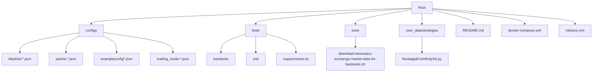
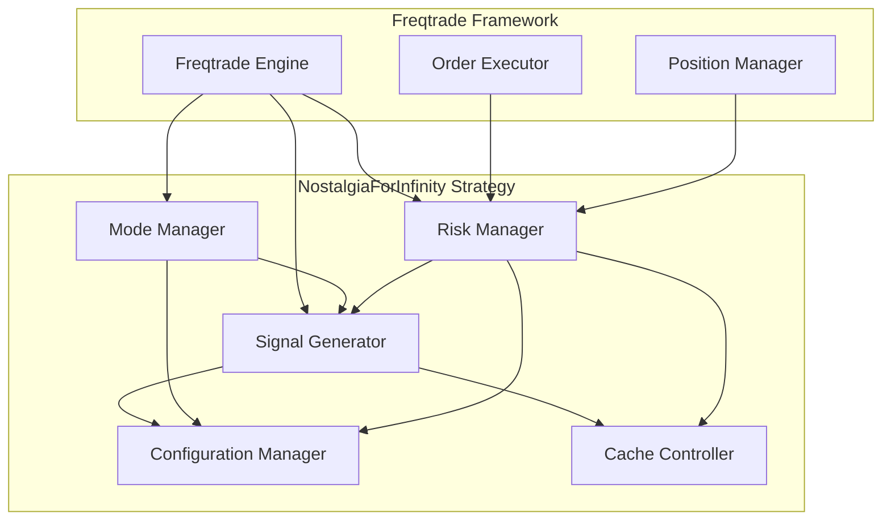
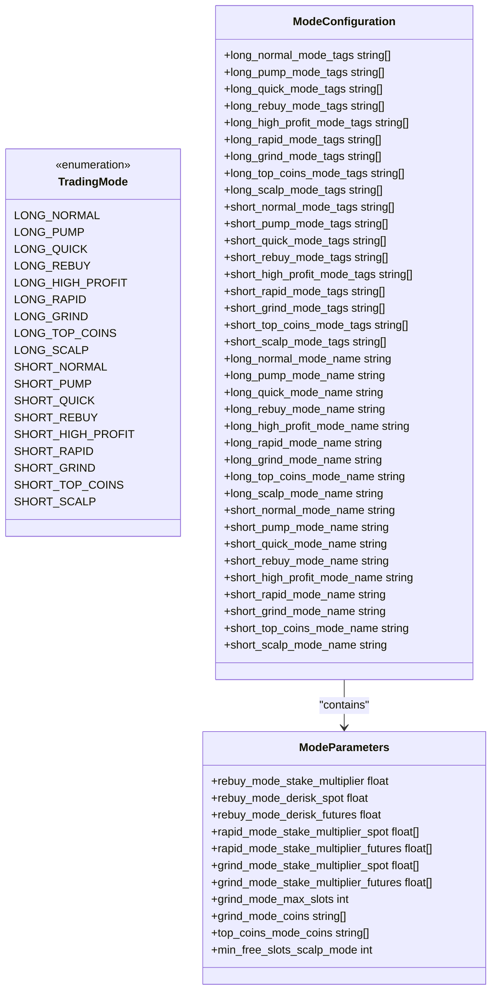
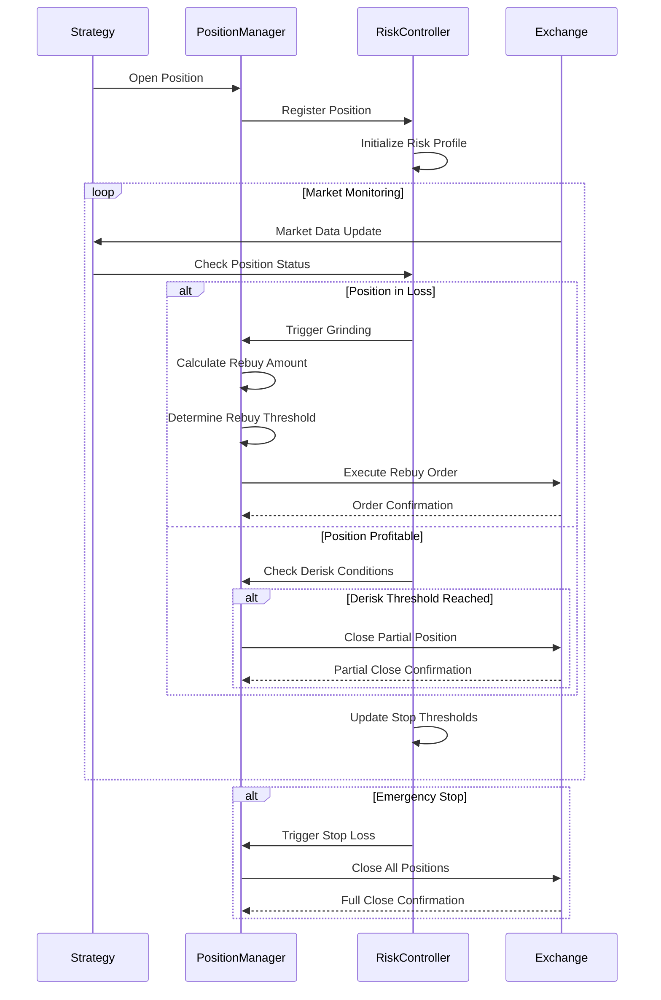
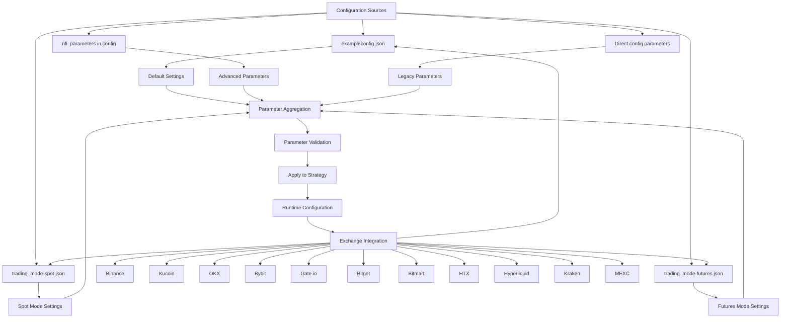
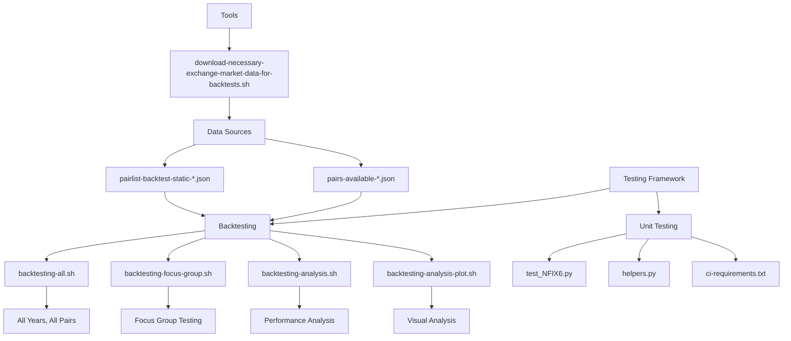

# Project Overview

<cite>
**Referenced Files in This Document**
- [README.md](file://README.md)
- [NostalgiaForInfinityX6.py](file://NostalgiaForInfinityX6.py)
- [configs/exampleconfig.json](file://configs/exampleconfig.json)
- [configs/trading_mode-spot.json](file://configs/trading_mode-spot.json)
- [configs/trading_mode-futures.json](file://configs/trading_mode-futures.json)
- [configs/pairlist-volume-binance-usdt.json](file://configs/pairlist-volume-binance-usdt.json)
</cite>

## Table of Contents
1. [Introduction](#introduction)
2. [Project Structure](#project-structure)
3. [Core Components](#core-components)
4. [Architecture Overview](#architecture-overview)
5. [Detailed Component Analysis](#detailed-component-analysis)
6. [Trading Modes and Strategy Patterns](#trading-modes-and-strategy-patterns)
7. [Position Management and Risk Control](#position-management-and-risk-control)
8. [Configuration and Integration](#configuration-and-integration)
9. [Backtesting and Testing Framework](#backtesting-and-testing-framework)
10. [Conclusion](#conclusion)

## Introduction

NostalgiaForInfinity is an advanced cryptocurrency trading strategy designed for the Freqtrade framework. It implements a sophisticated multi-mode trading system capable of executing long and short positions across various market conditions. The strategy supports multiple trading modes including normal, pump, quick, rebuy, rapid, grind, scalp, and top coins, enabling adaptive behavior based on market dynamics.

Targeted at algorithmic traders, Python developers, and Freqtrade users seeking advanced customization, this strategy emphasizes high adaptability, robust risk management through grinding and derisking mechanisms, and optimized performance across both spot and futures markets. The system integrates with major exchanges including Binance, Kucoin, OKX, Bybit, Gate.io, Bitget, Bitmart, HTX, Hyperliquid, Kraken, and MEXC.

The strategy processes market data through a comprehensive set of technical indicators and generates trading signals based on complex conditions. It manages positions dynamically using a position adjustment mechanism and executes trades according to predefined rules. The architecture employs design patterns such as the Strategy pattern for trading modes, Configuration pattern for parameter management, and Cache pattern for performance optimization.

**Section sources**
- [README.md](file://README.md)
- [NostalgiaForInfinityX6.py](file://NostalgiaForInfinityX6.py#L68-L173) - Class definition and trading mode tags

## Project Structure

The project follows a well-organized directory structure that separates configuration, testing, tools, and strategy components. The root directory contains documentation, configuration files, and deployment scripts, while specialized directories house specific functionality.

**Diagram sources**
- [configs](file://configs)
- [tests](file://tests)
- [tools](file://tools)
- [user_data/strategies](file://user_data/strategies)

**Section sources**
- [configs](file://configs)
- [tests](file://tests)
- [tools](file://tools)
- [user_data/strategies](file://user_data/strategies)

## Core Components

The core of the NostalgiaForInfinity strategy resides in the NostalgiaForInfinityX6.py file, which extends Freqtrade's IStrategy interface. The strategy implements comprehensive trading logic for both long and short positions across multiple modes. Key components include signal generation, entry/exit conditions, position adjustment mechanisms, and risk management features.

The strategy requires a 5-minute timeframe and uses multiple informative timeframes (15m, 1h, 4h, 1d) for multi-timeframe analysis. It processes market data using technical indicators from TA-Lib and pandas-ta libraries, including moving averages, RSI, MACD, and custom indicators. The system maintains a startup candle count of 800 to ensure sufficient historical data for indicator calculations.

Signal generation is controlled through configuration parameters that enable or disable specific entry conditions. The strategy supports position adjustment through rebuy, grinding, and derisking mechanisms that allow dynamic position sizing based on market conditions and performance.

**Section sources**
- [NostalgiaForInfinityX6.py](file://NostalgiaForInfinityX6.py#L68-L822) - Class definition, parameters, and initialization

## Architecture Overview

The NostalgiaForInfinity strategy follows a modular architecture that separates concerns and enables flexible configuration. The system integrates with Freqtrade's execution engine while maintaining its own specialized logic for signal generation and position management.

**Diagram sources**
- [NostalgiaForInfinityX6.py](file://NostalgiaForInfinityX6.py#L1-L1000)

**Section sources**
- [NostalgiaForInfinityX6.py](file://NostalgiaForInfinityX6.py#L1-L1000)

## Detailed Component Analysis

### Signal Generation Logic

The strategy implements a comprehensive signal generation system with separate conditions for long and short positions. Entry signals are controlled by configuration parameters that enable or disable specific conditions.

```mermaid
flowchart TD
Start([Entry Signal Check]) --> L1["Long Condition 1: Enable?"]
L1 --> |Yes| L1A["Evaluate Long Condition 1"]
L1 --> |No| L2["Long Condition 2: Enable?"]
L1A --> L2
L2 --> |Yes| L2A["Evaluate Long Condition 2"]
L2 --> |No| L3["Long Condition 3: Enable?"]
L2A --> L3
L3 --> |Yes| L3A["Evaluate Long Condition 3"]
L3 --> |No| L4["Long Condition 4: Enable?"]
L3A --> L4
L4 --> |Yes| L4A["Evaluate Long Condition 4"]
L4 --> |No| L5["Long Condition 5: Enable?"]
L4A --> L5
L5 --> |Yes| L5A["Evaluate Long Condition 5"]
L5 --> |No| L6["Long Condition 6: Enable?"]
L5A --> L6
L6 --> |Yes| L6A["Evaluate Long Condition 6"]
L6 --> |No| L21["Long Condition 21: Enable?"]
L6A --> L21
L21 --> |Yes| L21A["Evaluate Long Condition 21"]
L21 --> |No| L41["Long Condition 41: Enable?"]
L21A --> L41
L41 --> |Yes| L41A["Evaluate Long Condition 41"]
L41 --> |No| L42["Long Condition 42: Enable?"]
L41A --> L42
L42 --> |Yes| L42A["Evaluate Long Condition 42"]
L42 --> |No| L43["Long Condition 43: Enable?"]
L42A --> L43
L43 --> |Yes| L43A["Evaluate Long Condition 43"]
L43 --> |No| L44["Long Condition 44: Enable?"]
L43A --> L44
L44 --> |Yes| L44A["Evaluate Long Condition 44"]
L44 --> |No| L45["Long Condition 45: Enable?"]
L44A --> L45
L45 --> |Yes| L45A["Evaluate Long Condition 45"]
L45 --> |No| L46["Long Condition 46: Enable?"]
L45A --> L46
L46 --> |Yes| L46A["Evaluate Long Condition 46"]
L46 --> |No| L61["Long Condition 61: Enable?"]
L46A --> L61
L61 --> |Yes| L61A["Evaluate Long Condition 61"]
L61 --> |No| L62["Long Condition 62: Enable?"]
L61A --> L62
L62 --> |Yes| L62A["Evaluate Long Condition 62"]
L62 --> |No| L101["Long Condition 101: Enable?"]
L62A --> L101
L101 --> |Yes| L101A["Evaluate Long Condition 101"]
L101 --> |No| L102["Long Condition 102: Enable?"]
L101A --> L102
L102 --> |Yes| L102A["Evaluate Long Condition 102"]
L102 --> |No| L103["Long Condition 103: Enable?"]
L102A --> L103
L103 --> |Yes| L103A["Evaluate Long Condition 103"]
L103 --> |No| L104["Long Condition 104: Enable?"]
L103A --> L104
L104 --> |Yes| L104A["Evaluate Long Condition 104"]
L104 --> |No| L120["Long Condition 120: Enable?"]
L104A --> L120
L120 --> |Yes| L120A["Evaluate Long Condition 120"]
L120 --> |No| L141["Long Condition 141: Enable?"]
L120A --> L141
L141 --> |Yes| L141A["Evaluate Long Condition 141"]
L141 --> |No| L142["Long Condition 142: Enable?"]
L141A --> L142
L142 --> |Yes| L142A["Evaluate Long Condition 142"]
L142 --> |No| L143["Long Condition 143: Enable?"]
L142A --> L143
L143 --> |Yes| L143A["Evaluate Long Condition 143"]
L143 --> |No| L144["Long Condition 144: Enable?"]
L143A --> L144
L144 --> |Yes| L144A["Evaluate Long Condition 144"]
L144 --> |No| L161["Long Condition 161: Enable?"]
L144A --> L161
L161 --> |Yes| L161A["Evaluate Long Condition 161"]
L161 --> |No| L162["Long Condition 162: Enable?"]
L161A --> L162
L162 --> |Yes| L162A["Evaluate Long Condition 162"]
L162 --> |No| L163["Long Condition 163: Enable?"]
L162A --> L163
L163 --> |Yes| L163A["Evaluate Long Condition 163"]
L163 --> |No| End([All Long Conditions Processed])
L163A --> End
End --> ShortStart([Short Entry Signal Check])
ShortStart --> S501["Short Condition 501: Enable?"]
S501 --> |Yes| S501A["Evaluate Short Condition 501"]
S501 --> |No| S502["Short Condition 502: Enable?"]
S501A --> S502
S502 --> |Yes| S502A["Evaluate Short Condition 502"]
S502 --> |No| S542["Short Condition 542: Enable?"]
S502A --> S542
S542 --> |Yes| S542A["Evaluate Short Condition 542"]
S542 --> |No| S603["Short Condition 603: Enable?"]
S542A --> S603
S603 --> |Yes| S603A["Evaluate Short Condition 603"]
S603 --> |No| S641["Short Condition 641: Enable?"]
S603A --> S641
S641 --> |Yes| S641A["Evaluate Short Condition 641"]
S641 --> |No| S642["Short Condition 642: Enable?"]
S641A --> S642
S642 --> |Yes| S642A["Evaluate Short Condition 642"]
S642 --> |No| S661["Short Condition 661: Enable?"]
S642A --> S661
S661 --> |Yes| S661A["Evaluate Short Condition 661"]
S661 --> |No| End2([All Conditions Processed])
S661A --> End2
```

**Diagram sources**
- [NostalgiaForInfinityX6.py](file://NostalgiaForInfinityX6.py#L9091-L16871) - populate_entry_trend method

**Section sources**
- [NostalgiaForInfinityX6.py](file://NostalgiaForInfinityX6.py#L9091-L16871) - Entry signal generation logic

## Trading Modes and Strategy Patterns

The strategy implements a comprehensive set of trading modes through a tagging system that categorizes different trading approaches. Each mode has specific parameters and behaviors optimized for particular market conditions.

**Diagram sources**
- [NostalgiaForInfinityX6.py](file://NostalgiaForInfinityX6.py#L116-L173) - Trading mode tag definitions

**Section sources**
- [NostalgiaForInfinityX6.py](file://NostalgiaForInfinityX6.py#L116-L700) - Mode configuration and parameters

## Position Management and Risk Control

The strategy implements sophisticated position management and risk control mechanisms, including grinding, derisking, and stop-loss features. These systems work together to manage risk and optimize position performance.

**Diagram sources**
- [NostalgiaForInfinityX6.py](file://NostalgiaForInfinityX6.py#L1581-L2395) - Exit and position adjustment logic

**Section sources**
- [NostalgiaForInfinityX6.py](file://NostalgiaForInfinityX6.py#L1581-L2134) - custom_exit method
- [NostalgiaForInfinityX6.py](file://NostalgiaForInfinityX6.py#L2232-L2395) - adjust_trade_position method

## Configuration and Integration

The strategy integrates with Freqtrade through a comprehensive configuration system that allows extensive customization. Configuration can be managed through JSON files and supports both basic and advanced parameter settings.

**Diagram sources**
- [configs/exampleconfig.json](file://configs/exampleconfig.json#L1-L108)
- [configs/trading_mode-spot.json](file://configs/trading_mode-spot.json)
- [configs/trading_mode-futures.json](file://configs/trading_mode-futures.json)

**Section sources**
- [configs/exampleconfig.json](file://configs/exampleconfig.json#L1-L108)
- [configs/trading_mode-spot.json](file://configs/trading_mode-spot.json)
- [configs/trading_mode-futures.json](file://configs/trading_mode-futures.json)

## Backtesting and Testing Framework

The project includes a comprehensive testing framework with backtesting capabilities and unit tests. The backtesting system allows for extensive strategy evaluation across different time periods and market conditions.

**Diagram sources**
- [tests/backtests](file://tests/backtests)
- [tests/unit](file://tests/unit)
- [tools/download-necessary-exchange-market-data-for-backtests.sh](file://tools/download-necessary-exchange-market-data-for-backtests.sh)

**Section sources**
- [tests/backtests](file://tests/backtests)
- [tests/unit](file://tests/unit)
- [tools/download-necessary-exchange-market-data-for-backtests.sh](file://tools/download-necessary-exchange-market-data-for-backtests.sh)

## Conclusion

NostalgiaForInfinity represents a sophisticated cryptocurrency trading strategy built on the Freqtrade framework. Its comprehensive feature set, including multiple trading modes, advanced risk management, and multi-exchange compatibility, makes it a powerful tool for algorithmic trading. The strategy's modular architecture and extensive configuration options allow for significant customization and optimization.

The implementation demonstrates best practices in strategy design, with clear separation of concerns, comprehensive risk controls, and thorough testing infrastructure. The use of design patterns like Strategy, Configuration, and Cache enhances maintainability and performance. For users seeking a feature-rich, adaptable trading solution with robust risk management, NostalgiaForInfinity provides a solid foundation that can be further customized to meet specific trading objectives.
