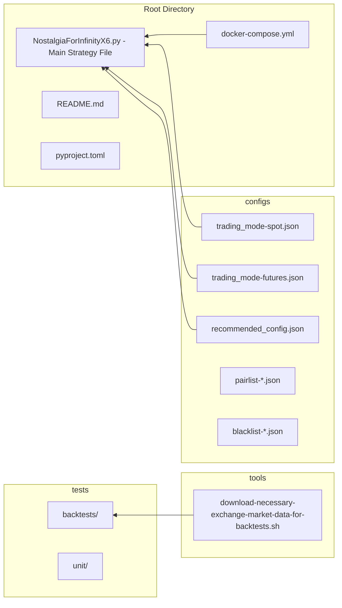
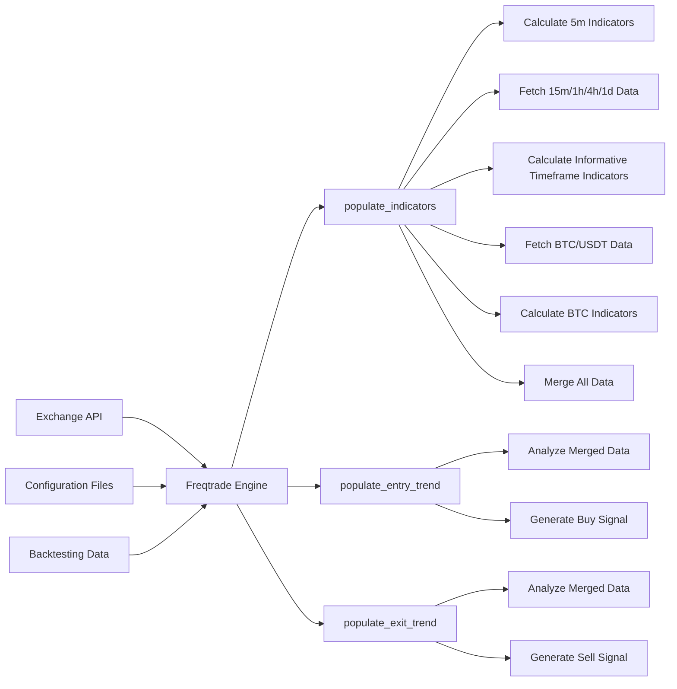
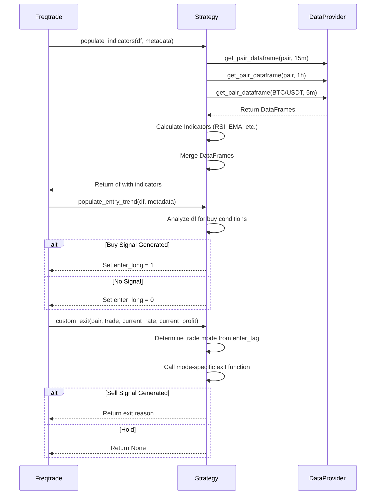
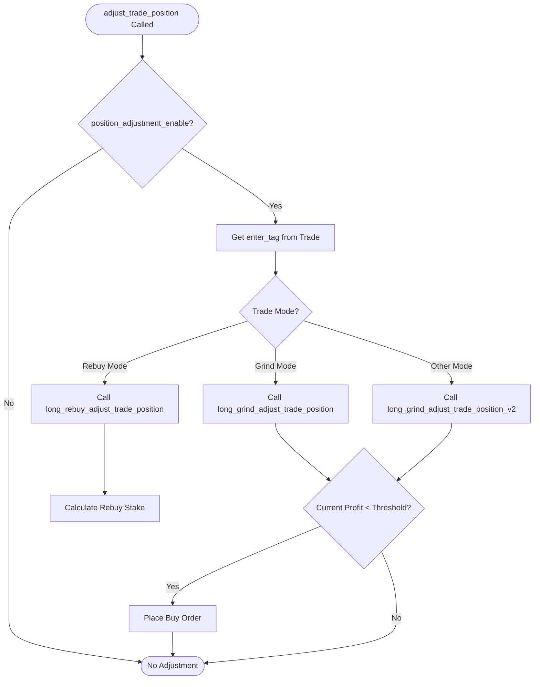
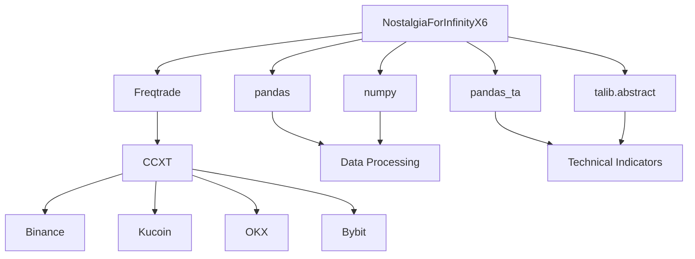

# Architecture Overview

<cite>
**Referenced Files in This Document**   
- [NostalgiaForInfinityX6.py](file://NostalgiaForInfinityX6.py)
- [README.md](file://README.md)
- [docker-compose.yml](file://docker-compose.yml)
- [configs/trading_mode-futures.json](file://configs/trading_mode-futures.json)
- [configs/trading_mode-spot.json](file://configs/trading_mode-spot.json)
- [configs/recommended_config.json](file://configs/recommended_config.json)
</cite>

## Table of Contents
1. [Introduction](#introduction)
2. [Project Structure](#project-structure)
3. [Core Components](#core-components)
4. [Architecture Overview](#architecture-overview)
5. [Detailed Component Analysis](#detailed-component-analysis)
6. [Dependency Analysis](#dependency-analysis)
7. [Performance Considerations](#performance-considerations)
8. [Troubleshooting Guide](#troubleshooting-guide)
9. [Conclusion](#conclusion)

## Introduction
The NostalgiaForInfinityX6 (NFI-X6) strategy is a sophisticated trading algorithm designed for the Freqtrade framework, a popular open-source cryptocurrency trading bot. This strategy implements the IStrategy interface, enabling it to integrate seamlessly with Freqtrade's trading engine for both backtesting and live trading operations. The primary objective of NFI-X6 is to generate profitable buy and sell signals for a wide range of cryptocurrency pairs across multiple exchanges, including Binance, Kucoin, OKX, and others. The strategy is highly configurable and supports both spot and futures trading modes, with a strong emphasis on risk management through features like position adjustment, grinding, and derisking. Its design goals center on modularity, reusability, and adaptability, allowing it to perform across diverse market conditions and asset classes. The strategy is deployed in various environments, from local development to cloud-based Docker containers, providing flexibility for users.

## Project Structure
The project is organized in a modular structure that separates configuration, code, and operational tools. The root directory contains the main strategy file (`NostalgiaForInfinityX6.py`), configuration files, and deployment scripts. The `configs` directory houses a comprehensive set of JSON files for different trading modes (spot vs. futures), exchange-specific pair lists, and blacklists to filter out undesirable assets. The `tests` directory includes backtesting scripts and unit tests for validation. The `tools` directory provides utilities for data management. The presence of `docker-compose.yml` and `docker-compose.tests.yml` indicates a containerized deployment model, while `pyproject.toml` and `mkdocs.yml` suggest the use of modern Python packaging and documentation tools.

**Diagram sources**
- [NostalgiaForInfinityX6.py](file://NostalgiaForInfinityX6.py)
- [configs/trading_mode-futures.json](file://configs/trading_mode-futures.json)
- [configs/trading_mode-spot.json](file://configs/trading_mode-spot.json)
- [configs/recommended_config.json](file://configs/recommended_config.json)
- [docker-compose.yml](file://docker-compose.yml)

**Section sources**
- [NostalgiaForInfinityX6.py](file://NostalgiaForInfinityX6.py)
- [README.md](file://README.md)

## Core Components
The NostalgiaForInfinityX6 strategy is built around several key components that work together to make trading decisions. The **Configuration Loader** ingests settings from JSON files and the Freqtrade configuration, allowing for dynamic parameter adjustment without code changes. The **Indicator Engine** is responsible for calculating a vast array of technical indicators (e.g., RSI, EMA, CMF, BBands) across multiple timeframes (5m, 15m, 1h, 4h, 1d) for both the primary trading pair and BTC/USDT. The **Signal Generator** uses these indicators to produce entry and exit signals based on a complex set of conditions defined for different trading modes (e.g., normal, pump, quick, rebuy). The **Position Manager** handles stateful aspects of trading, such as adjusting positions through the `adjust_trade_position` method, managing grinding strategies, and executing de-risking maneuvers. Finally, the **Order Executor** is implicitly managed by Freqtrade, which uses the signals and stake amounts provided by the strategy to place actual trades on the exchange.

**Section sources**
- [NostalgiaForInfinityX6.py](file://NostalgiaForInfinityX6.py#L116-L173)
- [NostalgiaForInfinityX6.py](file://NostalgiaForInfinityX6.py#L707-L822)
- [NostalgiaForInfinityX6.py](file://NostalgiaForInfinityX6.py#L3449-L8683)

## Architecture Overview
The NostalgiaForInfinityX6 strategy operates within the Freqtrade framework, which provides a well-defined lifecycle for trading strategies. The interaction between the strategy and Freqtrade is governed by specific lifecycle hooks. The `populate_indicators` method is called to calculate all necessary technical indicators for the current candle data. This method orchestrates the calculation of indicators on the primary 5-minute timeframe as well as on multiple informative timeframes (15m, 1h, 4h, 1d) and for BTC/USDT data, which is then merged into the main data frame. Following this, the `populate_entry_trend` and `populate_exit_trend` methods are invoked to generate buy and sell signals, respectively. These methods analyze the pre-calculated indicators to determine if the conditions for a trade are met. The strategy's design enforces a clear separation between core logic and exchange-specific configurations. The core logic, which includes the signal generation algorithms and risk management rules, is contained within the `NostalgiaForInfinityX6.py` file. Exchange-specific details, such as the number of candles to load due to API limitations (e.g., OKX, Kraken), are handled dynamically within the `__init__` method based on the configuration. This modular design allows the same core strategy to be deployed across different exchanges with minimal changes.

**Diagram sources**
- [NostalgiaForInfinityX6.py](file://NostalgiaForInfinityX6.py#L3449-L8683)
- [NostalgiaForInfinityX6.py](file://NostalgiaForInfinityX6.py#L9091-L16871)

## Detailed Component Analysis

### Signal Generation and Lifecycle Hooks
The signal generation process is the heart of the strategy and is stateless, meaning it does not retain memory between calls. Each time Freqtrade invokes `populate_entry_trend` or `populate_exit_trend`, the strategy analyzes the current state of the market data frame, which contains all the pre-calculated indicators from `populate_indicators`. This stateless design ensures that each signal is based solely on the available data, making the strategy predictable and easier to backtest. The entry conditions are defined in the `long_entry_signal_params` dictionary, where each condition can be toggled on or off. The exit logic is more complex and is handled by the `custom_exit` method, which routes the decision to mode-specific exit functions (e.g., `long_exit_normal`, `long_exit_rebuy`) based on the `enter_tag` of the trade. This allows for highly tailored exit strategies depending on how the position was initiated.

**Diagram sources**
- [NostalgiaForInfinityX6.py](file://NostalgiaForInfinityX6.py#L3449-L8683)
- [NostalgiaForInfinityX6.py](file://NostalgiaForInfinityX6.py#L9091-L16871)
- [NostalgiaForInfinityX6.py](file://NostalgiaForInfinityX6.py#L1581-L2395)

### Position Management and Stateful Logic
In contrast to the stateless signal generation, the position management component is stateful and maintains information about open trades. The `adjust_trade_position` method is a key feature that allows the strategy to add to a losing position (a practice known as "grinding" or "averaging down") in a controlled manner. This method is called by Freqtrade when a trade is open and the strategy has the `position_adjustment_enable` flag set to `True`. It evaluates the current profit, the number of existing entries, and predefined thresholds to decide whether to place a new buy order. The strategy defines multiple grinding modes with specific stake multipliers and profit thresholds, which are stored as class attributes (e.g., `grind_1_stakes_spot`, `grind_1_profit_threshold_spot`). This stateful logic is crucial for the strategy's risk management and profit-taking mechanisms, allowing it to recover from drawdowns and lock in profits at specific levels.

**Diagram sources**
- [NostalgiaForInfinityX6.py](file://NostalgiaForInfinityX6.py#L2232-L3448)
- [NostalgiaForInfinityX6.py](file://NostalgiaForInfinityX6.py#L707-L822)

## Dependency Analysis
The NostalgiaForInfinityX6 strategy has a well-defined set of dependencies that are critical to its operation. Its primary dependency is the **Freqtrade framework**, which provides the `IStrategy` interface, the `DataProvider` for market data, and the overall trading engine. The strategy relies heavily on data analysis libraries, including **pandas** for data manipulation, **numpy** for numerical operations, and **pandas_ta** for calculating technical indicators. It also uses **TA-Lib** (via `talib.abstract`) as an alternative source for some indicators. The strategy is designed to be modular, with low coupling between its internal components. For example, the indicator calculation functions for different timeframes are largely independent, and the signal generation logic is separated from the position management logic. The only significant external dependencies are the exchanges' APIs, which are abstracted by Freqtrade's CCXT integration, ensuring that the strategy code itself does not contain exchange-specific API calls.

**Diagram sources**
- [NostalgiaForInfinityX6.py](file://NostalgiaForInfinityX6.py#L1-L50)
- [NostalgiaForInfinityX6.py](file://NostalgiaForInfinityX6.py#L3449-L8683)

## Performance Considerations
The strategy's performance is influenced by several factors. The calculation of a large number of technical indicators across multiple timeframes is computationally intensive, which can lead to longer processing times, especially when trading a large number of pairs. The strategy attempts to mitigate this by allowing the use of multiple CPU cores for indicator calculations via the `num_cores_indicators_calc` parameter. The `process_only_new_candles` flag is set to `True`, which means the strategy only recalculates indicators when a new candle is formed, improving efficiency during live trading. For backtesting, the `startup_candle_count` is set to a high value (800) to ensure sufficient data for all indicators, which can slow down the initial phase of a backtest. Users are advised to use a volume-based pair list with 40-80 pairs for optimal performance, as this balances diversification with computational load. The use of stablecoin pairs (USDT, USDC) is also recommended to avoid the added volatility of BTC or ETH pairs.

## Troubleshooting Guide
Common issues with the NostalgiaForInfinityX6 strategy often stem from configuration errors. A primary recommendation is to ensure that the `timeframe` in the Freqtrade configuration is set to "5m", as the strategy is specifically designed for this interval. Users must also ensure that `use_exit_signal` is set to `True` and `exit_profit_only` is set to `False` to allow the strategy's exit logic to function correctly. Blacklisting leveraged tokens (e.g., *BULL, *BEAR) is highly recommended to prevent unwanted trades. If the strategy is not generating expected signals, users should verify that the pair list is correctly configured and that the exchange API keys have the necessary permissions. For issues related to position adjustment, checking the `position_adjustment_enable` flag and the relevant grinding thresholds is essential. The strategy's extensive logging, particularly the debug logs for indicator calculation times, can be invaluable for diagnosing performance bottlenecks.

**Section sources**
- [README.md](file://README.md#L15-L30)
- [NostalgiaForInfinityX6.py](file://NostalgiaForInfinityX6.py#L116-L173)

## Conclusion
The NostalgiaForInfinityX6 strategy is a robust and feature-rich trading algorithm that exemplifies a well-architected Freqtrade-compatible system. Its design successfully separates stateless signal generation from stateful position management, promoting modularity and maintainability. The strategy's adaptability to both spot and futures markets, along with its support for multiple deployment models (local, Docker, cloud), makes it a versatile tool for cryptocurrency traders. The extensive use of configuration files allows for fine-tuning without altering the core code, enhancing reusability. While the complexity of its logic and the computational demands of its indicator calculations present challenges, the strategy's comprehensive documentation and community support provide a solid foundation for successful implementation. Future improvements could focus on optimizing indicator calculation performance and expanding the suite of backtesting and analysis tools.