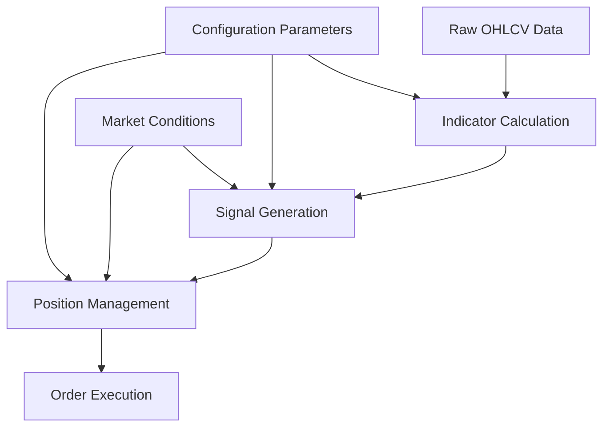

# Data Flow and Processing

<cite>
**Referenced Files in This Document**   
- [NostalgiaForInfinityX6.py](file://NostalgiaForInfinityX6.py)
- [NostalgiaForInfinityX6.py]</cite>

## Table of Contents
1. [Introduction](#introduction)
2. [Project Structure](#project-structure)
3. [Core Components](#core-components)
4. [Architecture Overview](#architecture-overview)
5. [Detailed Component Analysis](#detailed-component-analysis)
6. [Dependency Analysis](#dependency-analysis)
7. [Performance Considerations](#performance-considerations)
8. [Troubleshooting Guide](#troubleshooting-guide)
9. [Conclusion](#conclusion)

## Introduction
The NostalgiaForInfinityX6 (NFI-X6) strategy is a sophisticated trading algorithm designed for the Freqtrade framework. It processes market data across multiple timeframes to generate entry and exit signals for both long and short positions. The strategy leverages technical indicators from TA-Lib, pandas_ta, and numpy to analyze price movements, volatility, and momentum. It supports various trading modes such as normal, pump, quick, rebuy, rapid, grind, and scalp, each with distinct entry and exit conditions. The strategy also incorporates advanced features like position adjustment, grinding, derisking, and stop-loss mechanisms to manage risk and optimize returns. This document provides a comprehensive analysis of the data flow within the NFI-X6 strategy, detailing how raw OHLCV data is transformed into actionable trading signals.

## Project Structure
The project structure is organized into several directories, each serving a specific purpose:
- **configs**: Contains configuration files for different exchanges, pair lists, and trading modes.
- **tests**: Includes backtesting scripts, unit tests, and test data.
- **tools**: Houses utility scripts for downloading market data.
- **user_data/strategies**: Contains the main strategy file, NostalgiaForInfinityX6.py.
- **Root directory**: Includes documentation, Docker configurations, and project metadata.

The strategy file, NostalgiaForInfinityX6.py, is the core component of the project, implementing the trading logic and data processing pipeline.

**Section sources**
- [NostalgiaForInfinityX6.py](file://NostalgiaForInfinityX6.py)

## Core Components
The NostalgiaForInfinityX6 strategy is implemented as a Python class that inherits from Freqtrade's IStrategy interface. The core components include:
- **Configuration parameters**: Define the strategy's behavior, such as timeframe, stop-loss, and trading modes.
- **Indicator calculation**: Compute technical indicators like EMA, RSI, and custom volatility measures.
- **Signal generation**: Derive entry and exit signals based on configured thresholds and market conditions.
- **Position management**: Adjust trade positions through rebuys, grinds, and derisks.
- **Exit logic**: Determine when to exit trades based on profit targets, stop-losses, and market conditions.

The strategy processes data in a structured manner, starting with raw OHLCV data and progressing through multiple stages of analysis and decision-making.

**Section sources**
- [NostalgiaForInfinityX6.py](file://NostalgiaForInfinityX6.py)

## Architecture Overview
The NFI-X6 strategy follows a modular architecture, with distinct components responsible for different aspects of the trading process. The data flow begins with the ingestion of raw market data, which is then processed through a series of indicator calculations and signal generation steps. The architecture is designed to be flexible and extensible, allowing for easy customization and optimization.

**Diagram sources**
- [NostalgiaForInfinityX6.py](file://NostalgiaForInfinityX6.py)

## Detailed Component Analysis

### Indicator Calculation
The strategy calculates a wide range of technical indicators using TA-Lib, pandas_ta, and numpy. These indicators are computed for multiple timeframes, including 5m, 15m, 1h, 4h, and 1d. The indicators include:
- **RSI**: Relative Strength Index for momentum analysis.
- **EMA**: Exponential Moving Average for trend identification.
- **BB**: Bollinger Bands for volatility measurement.
- **MFI**: Money Flow Index for volume-weighted momentum.
- **CMF**: Chaikin Money Flow for volume and price analysis.
- **WILLR**: Williams %R for overbought/oversold conditions.
- **STOCHRSI**: Stochastic RSI for momentum and overbought/oversold conditions.
- **KST**: Know Sure Thing for trend confirmation.
- **ROC**: Rate of Change for momentum analysis.
- **AROON**: Aroon Indicator for trend strength and direction.

The indicators are calculated in a vectorized manner using pandas, ensuring efficient processing of large datasets.

**Section sources**
- [NostalgiaForInfinityX6.py](file://NostalgiaForInfinityX6.py)

### Signal Generation
Entry and exit signals are generated based on the calculated indicators and configured thresholds. The strategy supports multiple trading modes, each with its own set of conditions. The entry signals are derived from a combination of indicators and market conditions, while the exit signals are based on profit targets, stop-losses, and market trends.

The strategy uses a hierarchical approach to signal generation, with different modes having different priorities and conditions. For example, the long_normal_mode has a set of conditions that must be met for an entry signal, while the long_pump_mode has different conditions for rapid price increases.

**Section sources**
- [NostalgiaForInfinityX6.py](file://NostalgiaForInfinityX6.py)

### Position Management
The strategy includes advanced position management features, such as rebuys, grinds, and derisks. These features allow the strategy to adjust trade positions based on market conditions and performance. For example, the grinding feature enables the strategy to add to winning positions, while the derisk feature reduces exposure during adverse market conditions.

The position adjustment is controlled by configuration parameters, such as grinding_enable and derisk_enable, which can be set in the strategy's configuration file.

**Section sources**
- [NostalgiaForInfinityX6.py](file://NostalgiaForInfinityX6.py)

### Exit Logic
The exit logic is a critical component of the strategy, determining when to close trades to lock in profits or limit losses. The strategy uses a combination of profit targets, stop-losses, and market conditions to make exit decisions. The exit signals are generated by the custom_exit method, which evaluates the current profit, market conditions, and trade history.

The strategy supports different exit modes for different trading scenarios, such as normal exits, stop-loss exits, and profit-taking exits. The exit conditions are configurable, allowing users to tailor the strategy to their risk tolerance and trading goals.

**Section sources**
- [NostalgiaForInfinityX6.py](file://NostalgiaForInfinityX6.py)

## Dependency Analysis
The NFI-X6 strategy relies on several external libraries and frameworks:
- **Freqtrade**: Provides the trading framework and API for interacting with exchanges.
- **TA-Lib**: Offers a wide range of technical indicators for market analysis.
- **pandas_ta**: Extends pandas with additional technical analysis functions.
- **numpy**: Provides numerical computing capabilities for data processing.
- **pandas**: Enables efficient data manipulation and analysis.

The strategy also depends on configuration files and market data, which are loaded at runtime. The dependencies are managed through the project's configuration and setup files.

**Section sources**
- [NostalgiaForInfinityX6.py](file://NostalgiaForInfinityX6.py)

## Performance Considerations
The NFI-X6 strategy is designed to handle large datasets efficiently, making it suitable for backtesting with extensive pair lists. The use of vectorized operations in pandas and numpy ensures that indicator calculations are performed quickly, even on large datasets. The strategy also includes performance logging to monitor the execution time of different components.

To optimize performance, the strategy caches calculated indicators and reuses them when possible. This reduces the computational overhead of recalculating indicators for each new candle. Additionally, the strategy can be configured to use multiple cores for indicator calculations, further improving performance.

**Section sources**
- [NostalgiaForInfinityX6.py](file://NostalgiaForInfinityX6.py)

## Troubleshooting Guide
Common issues with the NFI-X6 strategy include:
- **Configuration errors**: Ensure that the configuration file is correctly set up, with the correct timeframe and trading mode.
- **Indicator calculation errors**: Verify that the required libraries (TA-Lib, pandas_ta, numpy) are installed and properly configured.
- **Data quality issues**: Check that the market data is complete and accurate, with no missing or corrupted candles.
- **Performance bottlenecks**: Monitor the performance logging output to identify slow components and optimize them.

For detailed troubleshooting, refer to the strategy's documentation and community forums.

**Section sources**
- [NostalgiaForInfinityX6.py](file://NostalgiaForInfinityX6.py)

## Conclusion
The NostalgiaForInfinityX6 strategy is a powerful and flexible trading algorithm that leverages advanced technical analysis and risk management techniques. By processing raw OHLCV data through a series of indicator calculations and signal generation steps, the strategy is able to generate actionable trading signals for both long and short positions. The modular architecture and extensive configuration options make it suitable for a wide range of trading scenarios and market conditions. With proper setup and optimization, the NFI-X6 strategy can be a valuable tool for automated trading.

**Section sources**
- [NostalgiaForInfinityX6.py](file://NostalgiaForInfinityX6.py)
