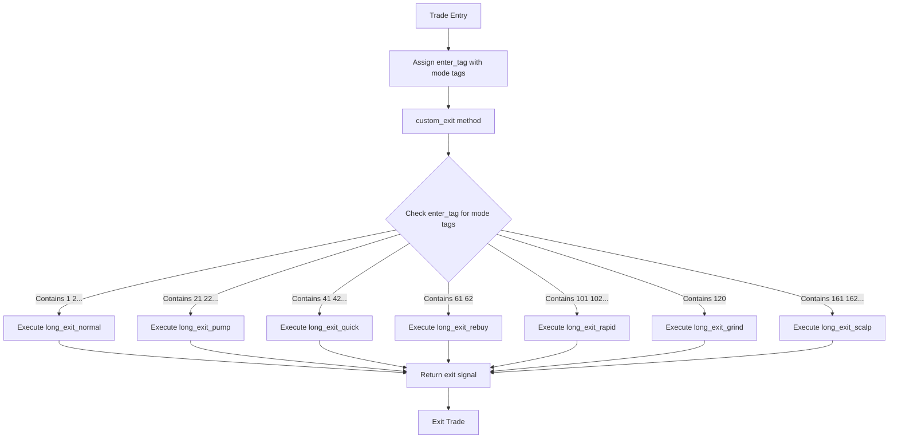
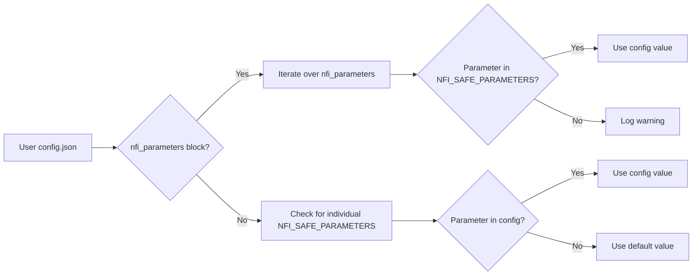
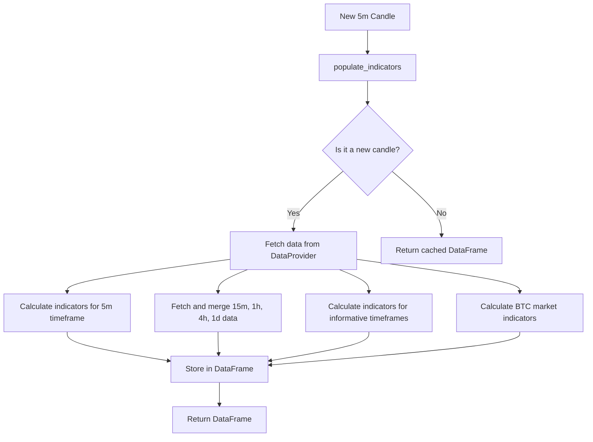

# Design Patterns

<cite>
**Referenced Files in This Document**   
- [NostalgiaForInfinityX6.py](file://NostalgiaForInfinityX6.py)
</cite>

## Table of Contents
1. [Introduction](#introduction)
2. [Strategy Pattern for Trading Modes](#strategy-pattern-for-trading-modes)
3. [Configuration Pattern for Runtime Parameters](#configuration-pattern-for-runtime-parameters)
4. [Cache Pattern for Indicator Optimization](#cache-pattern-for-indicator-optimization)
5. [Extensibility and Integration Points](#extensibility-and-integration-points)
6. [Conclusion](#conclusion)

## Introduction
The NostalgiaForInfinityX6 strategy is a sophisticated trading algorithm implemented within the Freqtrade framework. It leverages several key software design patterns to achieve a high degree of flexibility, maintainability, and performance. This document details the implementation of the Strategy, Configuration, and Cache patterns, which are central to its operation. These patterns enable the strategy to support multiple trading modes, allow for non-code customization via configuration files, and optimize computational performance through caching.

## Strategy Pattern for Trading Modes

The NostalgiaForInfinityX6 strategy employs the **Strategy pattern** to support multiple, distinct trading behaviors, referred to as "modes." These modes include Normal, Pump, Quick, Rebuy, Rapid, Grind, and Scalp, each designed for different market conditions and risk profiles.

The implementation of this pattern is centered around the use of **tag-based mode identification**. The strategy defines a series of class-level lists, such as `long_normal_mode_tags`, `long_pump_mode_tags`, and `long_scalp_mode_tags`, which contain string identifiers (e.g., "1", "21", "161"). When a trade is opened, an `enter_tag` is assigned to it, which is a space-separated string of these identifiers.

The core of the pattern is the `custom_exit` method, which acts as a **context** that dynamically selects the appropriate exit logic based on the trade's `enter_tag`. This method uses a series of `if` statements to check which mode tags are present in the `enter_tag` of the current trade.



**Diagram sources**
- [NostalgiaForInfinityX6.py](file://NostalgiaForInfinityX6.py#L1600-L2399)

For example, the code snippet below shows how the strategy routes to the `long_exit_normal` method if any of the normal mode tags are found in the `enter_tag`:

```python
# Long Normal mode
if any(c in self.long_normal_mode_tags for c in enter_tags):
    sell, signal_name = self.long_exit_normal(
        pair,
        current_rate,
        profit_stake,
        profit_ratio,
        profit_current_stake_ratio,
        profit_init_ratio,
        max_profit,
        max_loss,
        filled_entries,
        filled_exits,
        last_candle,
        previous_candle_1,
        previous_candle_2,
        previous_candle_3,
        previous_candle_4,
        previous_candle_5,
        trade,
        current_time,
        enter_tags,
    )
    if sell and (signal_name is not None):
        return f"{signal_name} ( {enter_tag})"
```

This approach allows the strategy to encapsulate the complex exit logic for each mode within its own dedicated method (e.g., `long_exit_normal`, `long_exit_pump`), promoting code organization and maintainability. The `custom_exit` method then acts as a dispatcher, ensuring the correct behavior is executed for each trade based on its configuration.

**Section sources**
- [NostalgiaForInfinityX6.py](file://NostalgiaForInfinityX6.py#L1600-L2399)

## Configuration Pattern for Runtime Parameters

The strategy implements a **Configuration pattern** that allows users to override default parameters at runtime without modifying the core strategy code. This is achieved through the use of JSON configuration files and a structured initialization process in the `__init__` method.

The pattern is based on two primary mechanisms: the `nfi_parameters` block in the config and a list of "safe" parameters. The strategy defines a list called `NFI_SAFE_PARAMETERS` which contains the names of parameters that can be safely changed via the configuration.



**Diagram sources**
- [NostalgiaForInfinityX6.py](file://NostalgiaForInfinityX6.py#L800-L1599)

During initialization, the strategy first checks for the presence of an `nfi_parameters` dictionary in the configuration. If found, it iterates over each parameter. If the parameter name is in the `NFI_SAFE_PARAMETERS` list (or if an advanced mode is enabled), the strategy uses the value from the config, overriding the default class attribute. This is done using Python's `setattr` function.

```python
# Configuration from the nfi_parameters block. New config style.
if "nfi_parameters" in self.config and type(self.config["nfi_parameters"]) is dict:
  for nfi_param in self.config["nfi_parameters"]:
    if nfi_param in ["long_entry_signal_params", "short_entry_signal_params"]:
      continue
    if (nfi_param in NFI_SAFE_PARAMETERS or is_config_advanced_mode) and hasattr(self, nfi_param):
      log.info(
        f'Parameter {nfi_param} changed from "{getattr(self, nfi_param)}" to "{self.config["nfi_parameters"][nfi_param]}".' 
      )
      setattr(self, nfi_param, self.config["nfi_parameters"][nfi_param])
    else:
      log.warning(f"Invalid or unsafe parameter: {nfi_param}.")
```

This pattern provides a powerful way for users to customize the strategy's behavior. For instance, a user can adjust the `futures_mode_leverage` or `stop_threshold_spot` directly from their configuration file, enabling non-code customization of critical trading logic. This separation of configuration from code enhances maintainability and allows for easy experimentation with different parameter sets.

**Section sources**
- [NostalgiaForInfinityX6.py](file://NostalgiaForInfinityX6.py#L800-L1599)

## Cache Pattern for Indicator Optimization

To optimize performance, especially during backtesting and live trading with large datasets, the strategy employs a **Cache pattern** for indicator calculations. This is primarily facilitated by Freqtrade's built-in `DataProvider` (accessed via `self.dp`) and a custom `Cache` object for storing profit targets.

The most significant use of caching is in the `populate_indicators` method. This method is responsible for calculating all technical indicators used by the strategy. To prevent redundant calculations, the method is designed to run only for new candles, as indicated by the class variable `process_only_new_candles = True`. This ensures that once an indicator value is calculated for a specific candle, it is not recalculated on subsequent ticks of the same candle.

The `DataProvider` is used to fetch and merge data from multiple timeframes (e.g., 15m, 1h, 4h, 1d). The `merge_informative_pair` function intelligently combines this data, and the `DataProvider` likely caches the results of these expensive API calls and calculations.



**Diagram sources**
- [NostalgiaForInfinityX6.py](file://NostalgiaForInfinityX6.py#L3200-L4799)

Furthermore, the strategy uses a dedicated `Cache` object to store profit targets. This is initialized in the `__init__` method and saved to a JSON file. This cache persists across bot restarts, allowing the strategy to remember its previous profit targets.

```python
if self.target_profit_cache is None:
  bot_name = ""
  if "bot_name" in self.config:
    bot_name = self.config["bot_name"] + "-"
  self.target_profit_cache = Cache(
    self.config["user_data_dir"]
    / (
      "nfix6-profit_max-"
      + bot_name
      + self.config["exchange"]["name"]
      + "-"
      + self.config["stake_currency"]
      + ("-(backtest)" if (self.config["runmode"].value == "backtest") else "")
      + ("-(hyperopt)" if (self.config["runmode"].value == "hyperopt") else "")
      + ".json"
    )
  )
```

By caching both the results of indicator calculations and persistent state data, the strategy significantly reduces computational overhead, leading to faster execution and more efficient backtesting.

**Section sources**
- [NostalgiaForInfinityX6.py](file://NostalgiaForInfinityX6.py#L3200-L4799)

## Extensibility and Integration Points

The design patterns used in NostalgiaForInfinityX6 create clear integration points for users who wish to extend the system.

1.  **Adding New Trading Modes:** Users can extend the strategy by defining new mode tags (e.g., `long_my_mode_tags = ["201", "202"]`) and creating corresponding `long_exit_my_mode` and `short_exit_my_mode` methods. The `custom_exit` method can then be updated to include a new `if` block that checks for these tags and calls the new exit logic. This leverages the existing Strategy pattern.

2.  **Adding New Indicators:** The modular structure of the `populate_indicators` method makes it easy to add new indicators. Users can create a new function (e.g., `my_custom_indicators`) and call it within the `base_tf_5m_indicators` or an informative timeframe method. The calculated values are automatically added to the DataFrame and can be used in entry and exit conditions.

3.  **Customizing Configuration:** The Configuration pattern allows users to add new parameters to the `NFI_SAFE_PARAMETERS` list and then use them in the strategy logic. By adding a new class-level variable (e.g., `my_new_parameter = 0.5`) and including its name in `NFI_SAFE_PARAMETERS`, users can control its value entirely from the JSON configuration file.

These integration points demonstrate how the patterns of Strategy, Configuration, and Caching work together to create a highly extensible and maintainable trading system.

## Conclusion
The NostalgiaForInfinityX6 strategy effectively utilizes the Strategy, Configuration, and Cache design patterns to create a robust and flexible trading algorithm. The Strategy pattern enables dynamic behavior selection through tag-based mode switching, allowing for diverse trading tactics. The Configuration pattern provides a safe and structured way to override parameters at runtime, facilitating easy customization without code changes. Finally, the Cache pattern optimizes performance by minimizing redundant calculations and persisting state, which is crucial for efficient backtesting and live trading. Together, these patterns ensure the strategy is both powerful and maintainable.