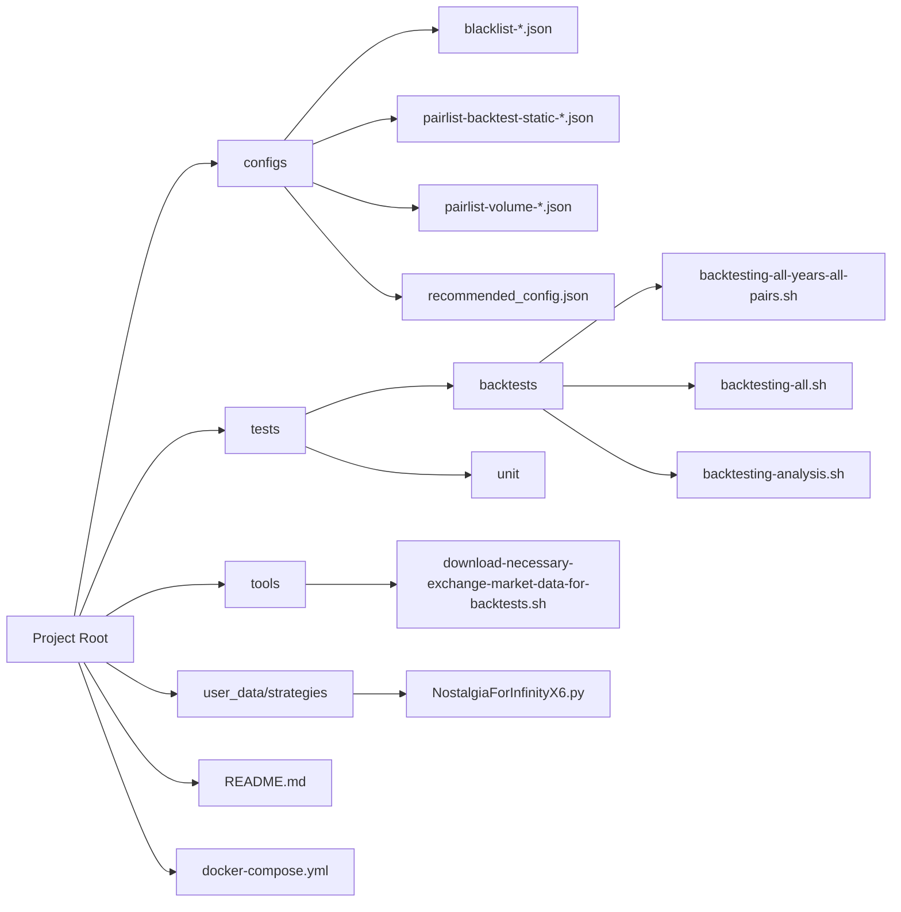
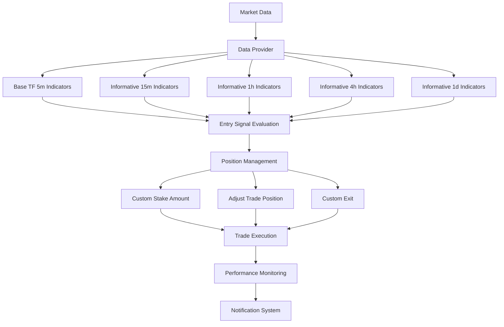
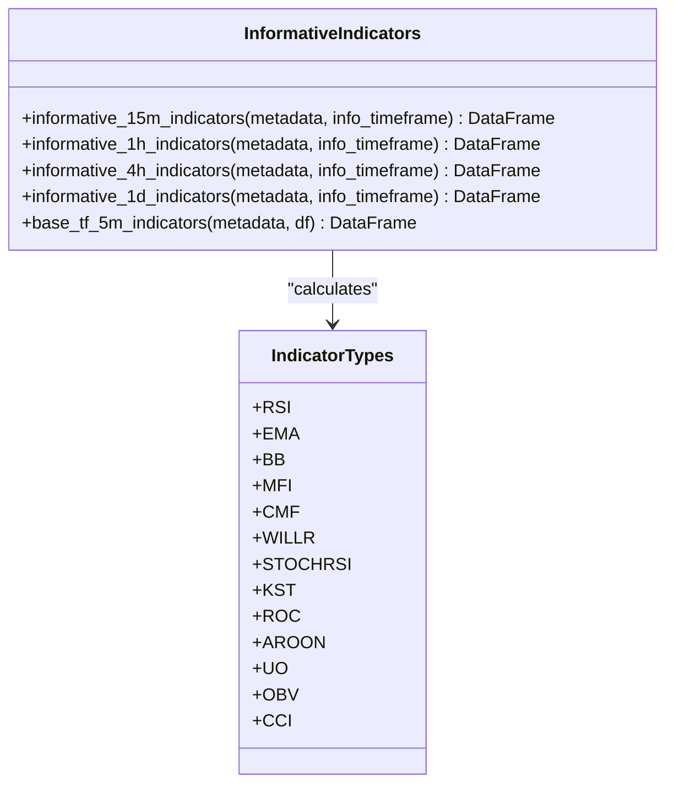
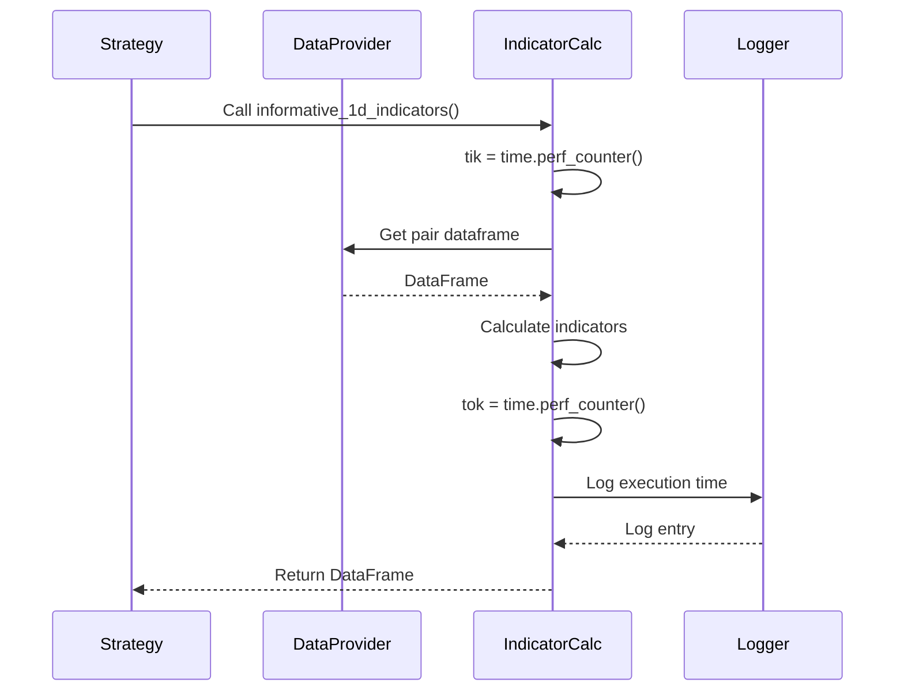
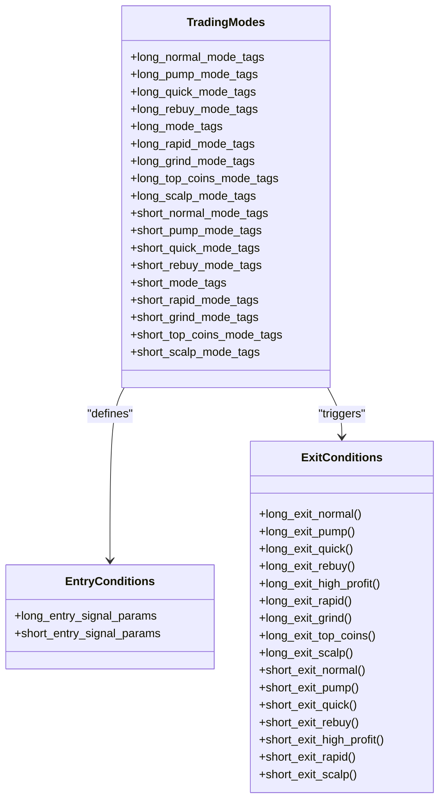
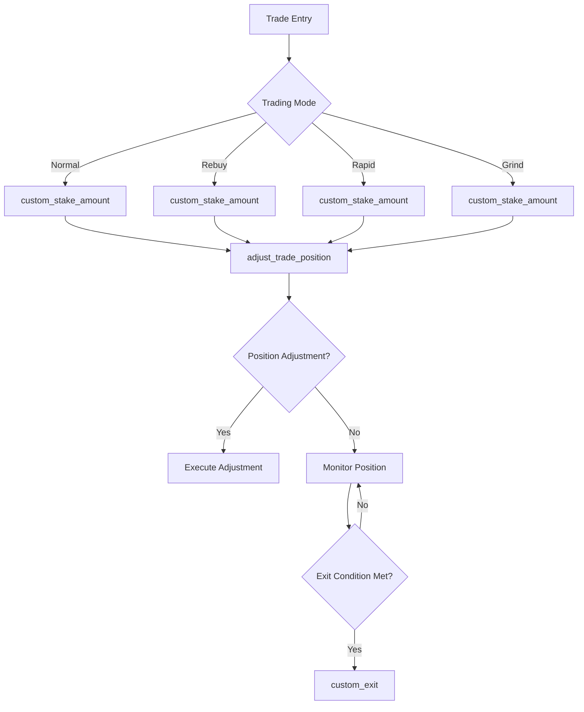

# Scalability and Performance

<cite>
**Referenced Files in This Document**   
- [NostalgiaForInfinityX6.py](file://NostalgiaForInfinityX6.py)
- [download-necessary-exchange-market-data-for-backtests.sh](file://tools/download-necessary-exchange-market-data-for-backtests.sh)
- [backtesting-all-years-all-pairs.sh](file://tests/backtests/backtesting-all-years-all-pairs.sh)
- [backtesting-all.sh](file://tests/backtests/backtesting-all.sh)
- [pairlist-backtest-static-binance-futures-usdt.json](file://configs/pairlist-backtest-static-binance-futures-usdt.json)
- [pairlist-backtest-static-binance-spot-usdt.json](file://configs/pairlist-backtest-static-binance-spot-usdt.json)
- [pairlist-backtest-static-bybit-spot-usdt.json](file://configs/pairlist-backtest-static-bybit-spot-usdt.json)
- [pairlist-backtest-static-gateio-futures-usdt.json](file://configs/pairlist-backtest-static-gateio-futures-usdt.json)
- [pairlist-backtest-static-gateio-spot-usdt.json](file://configs/pairlist-backtest-static-gateio-spot-usdt.json)
- [pairlist-backtest-static-kraken-spot-usdt.json](file://configs/pairlist-backtest-static-kraken-spot-usdt.json)
- [pairlist-backtest-static-kucoin-futures-usdt.json](file://configs/pairlist-backtest-static-kucoin-futures-usdt.json)
- [pairlist-backtest-static-kucoin-spot-usdt.json](file://configs/pairlist-backtest-static-kucoin-spot-usdt.json)
- [pairlist-backtest-static-okx-futures-usdt.json](file://configs/pairlist-backtest-static-okx-futures-usdt.json)
- [pairlist-backtest-static-okx-spot-usdt.json](file://configs/pairlist-backtest-static-okx-spot-usdt.json)
- [recommended_config.json](file://configs/recommended_config.json)
</cite>

## Table of Contents
1. [Introduction](#introduction)
2. [Project Structure](#project-structure)
3. [Core Components](#core-components)
4. [Architecture Overview](#architecture-overview)
5. [Detailed Component Analysis](#detailed-component-analysis)
6. [Performance Considerations](#performance-considerations)
7. [Troubleshooting Guide](#troubleshooting-guide)
8. [Conclusion](#conclusion)

## Introduction
This document provides a comprehensive analysis of the scalability and performance characteristics of the NostalgiaForInfinityX6 trading strategy. The strategy is designed for the Freqtrade crypto bot and implements a complex multi-mode trading system with various entry and exit conditions. The analysis focuses on performance bottlenecks in indicator calculation across large pair lists (e.g., 100+ pairs), optimization strategies, backtesting duration, parallel test execution, memory footprint, and real-time decision making in live trading. The document also covers the impact of configuration choices on computational load and provides benchmarking guidance and monitoring recommendations for production deployments.

## Project Structure
The project structure is organized into several key directories that support the strategy's functionality and testing infrastructure. The main components include configuration files, test scripts, tools for data management, and the core strategy implementation.

**Diagram sources**
- [NostalgiaForInfinityX6.py](file://NostalgiaForInfinityX6.py)
- [download-necessary-exchange-market-data-for-backtests.sh](file://tools/download-necessary-exchange-market-data-for-backtests.sh)
- [backtesting-all-years-all-pairs.sh](file://tests/backtests/backtesting-all-years-all-pairs.sh)
- [backtesting-all.sh](file://tests/backtests/backtesting-all.sh)

**Section sources**
- [NostalgiaForInfinityX6.py](file://NostalgiaForInfinityX6.py)
- [configs](file://configs)
- [tests](file://tests)
- [tools](file://tools)

## Core Components
The NostalgiaForInfinityX6 strategy is implemented as a Python class that inherits from Freqtrade's IStrategy interface. The strategy features multiple trading modes (normal, pump, quick, rebuy, rapid, grind, top coins, scalp) with distinct entry and exit conditions. The core functionality includes indicator calculation across multiple timeframes, position adjustment, custom exit logic, and stake amount calculation.

The strategy uses a comprehensive set of technical indicators including RSI, EMA, BB, MFI, CMF, Williams %R, Stochastic RSI, KST, ROC, AROON, UO, OBV, and CCI across various timeframes (5m, 15m, 1h, 4h, 1d). These indicators are calculated for both the primary trading pairs and BTC/ETH informative pairs to provide market context.

**Section sources**
- [NostalgiaForInfinityX6.py](file://NostalgiaForInfinityX6.py#L1-L100)

## Architecture Overview
The NostalgiaForInfinityX6 strategy follows a modular architecture with clear separation of concerns. The system processes market data through multiple timeframes, calculates indicators, evaluates entry and exit conditions, and manages position adjustments.

**Diagram sources**
- [NostalgiaForInfinityX6.py](file://NostalgiaForInfinityX6.py#L1-L100)

## Detailed Component Analysis

### Indicator Calculation System
The strategy implements a sophisticated indicator calculation system that operates across multiple timeframes. Each timeframe has dedicated indicator calculation functions that are optimized for performance.

#### Informative Timeframe Indicators
The strategy calculates indicators for multiple informative timeframes (15m, 1h, 4h, 1d) to provide context for the base 5m timeframe decisions. The indicator calculation is structured to minimize redundant computations.

**Diagram sources**
- [NostalgiaForInfinityX6.py](file://NostalgiaForInfinityX6.py#L2400-L3200)

#### Performance Monitoring
The strategy includes performance monitoring for each indicator calculation function, allowing for identification of performance bottlenecks.

**Diagram sources**
- [NostalgiaForInfinityX6.py](file://NostalgiaForInfinityX6.py#L2400-L3200)

### Trading Mode System
The strategy implements a comprehensive trading mode system with multiple distinct modes for different market conditions.

**Diagram sources**
- [NostalgiaForInfinityX6.py](file://NostalgiaForInfinityX6.py#L1-L1000)

### Position Management System
The position management system handles stake calculation, trade adjustment, and custom exit logic.

**Diagram sources**
- [NostalgiaForInfinityX6.py](file://NostalgiaForInfinityX6.py#L1600-L2400)

## Performance Considerations

### Indicator Calculation Optimization
The NostalgiaForInfinityX6 strategy faces significant performance challenges when processing large pair lists (100+ pairs) due to the extensive indicator calculations across multiple timeframes. The primary performance bottlenecks include:

1. **Multiple Timeframe Processing**: The strategy calculates indicators for five different timeframes (5m, 15m, 1h, 4h, 1d) for each pair, resulting in substantial computational overhead.

2. **Indicator Complexity**: The strategy uses a comprehensive set of technical indicators, with the 1d timeframe alone calculating 15 different indicators.

3. **Data Retrieval**: The `informative_pairs()` method generates a large number of data requests to the DataProvider, which can become a bottleneck with large pair lists.

To optimize performance, the following strategies can be implemented:

- **Selective Indicator Computation**: Only calculate indicators for timeframes and pairs that are actively used in the current trading mode.
- **Caching**: Implement caching for indicator calculations to avoid redundant computations across strategy iterations.
- **Parallel Processing**: Utilize the `num_cores_indicators_calc` parameter (currently set to 0) to enable multi-core processing of indicators.
- **Indicator Simplification**: Reduce the number of indicators calculated for less critical timeframes.

### Backtesting Performance
The repository includes a comprehensive backtesting infrastructure with shell scripts that enable parallel test execution:

- `backtesting-all-years-all-pairs.sh`: Executes backtests across multiple years and pair lists
- `backtesting-all.sh`: Runs comprehensive backtests
- `backtesting-analysis.sh`: Analyzes backtesting results

The backtesting duration scales with the number of pairs and historical data length. For optimal performance:
- Use volume-based pair lists (e.g., `pairlist-volume-binance-usdt.json`) which typically contain 40-80 pairs
- Limit the historical data period to the minimum necessary for indicator warm-up (startup_candle_count is 800 for most exchanges)
- Use the provided parallel execution scripts to distribute tests across multiple cores

### Memory Footprint
The memory footprint of the strategy is primarily determined by:
- The size of the pair list
- The number of timeframes processed
- The length of historical data stored
- The number of indicators calculated

Memory optimization strategies include:
- Using smaller pair lists (40-80 pairs recommended)
- Reducing the startup_candle_count when possible
- Implementing data pruning for older candles that are no longer needed
- Using efficient data types for indicator storage

### Real-time Processing
In live trading, the strategy must process data and make decisions within the 5m timeframe. The key considerations for real-time performance are:

- **Processing Latency**: The strategy should complete all calculations within a fraction of the 5m candle to ensure timely execution.
- **API Rate Limiting**: The frequent data requests for multiple timeframes and pairs must respect exchange API rate limits.
- **Network Latency**: Data retrieval from exchanges should be optimized to minimize network delays.

### Configuration Impact
Configuration choices significantly impact computational load:

- **Lookback Periods**: Longer lookback periods (e.g., for EMA, RSI) increase computational complexity and memory usage.
- **Indicator Complexity**: More complex indicators (e.g., KST, UO) require more processing time than simpler ones (e.g., SMA).
- **Pair List Size**: Larger pair lists linearly increase computational requirements.
- **Timeframe Count**: More informative timeframes increase data retrieval and processing overhead.

### Benchmarking and Monitoring
For production deployments, implement the following benchmarking and monitoring practices:

1. **Performance Benchmarking**:
   - Measure indicator calculation times for different pair list sizes
   - Monitor memory usage during extended backtests
   - Test response times in live trading conditions

2. **Monitoring Recommendations**:
   - Log execution times for key functions (already implemented with time.perf_counter())
   - Monitor system resource usage (CPU, memory, disk I/O)
   - Track API rate limit usage
   - Set up alerts for abnormal processing delays

3. **Optimization Testing**:
   - Compare performance with different pair list sizes
   - Test the impact of enabling/disabling specific indicators
   - Evaluate the benefits of multi-core processing

The backtesting infrastructure and data download tools (`download-necessary-exchange-market-data-for-backtests.sh`) form a critical part of the performance ecosystem, enabling comprehensive testing and optimization of the strategy under various conditions.

**Section sources**
- [NostalgiaForInfinityX6.py](file://NostalgiaForInfinityX6.py)
- [download-necessary-exchange-market-data-for-backtests.sh](file://tools/download-necessary-exchange-market-data-for-backtests.sh)
- [backtesting-all-years-all-pairs.sh](file://tests/backtests/backtesting-all-years-all-pairs.sh)
- [backtesting-all.sh](file://tests/backtests/backtesting-all.sh)
- [recommended_config.json](file://configs/recommended_config.json)

## Troubleshooting Guide
When experiencing performance issues with the NostalgiaForInfinityX6 strategy, consider the following troubleshooting steps:

1. **High CPU Usage**:
   - Check if `num_cores_indicators_calc` is set appropriately (0 disables multi-core processing)
   - Reduce the pair list size
   - Disable less critical informative timeframes

2. **Memory Issues**:
   - Reduce the pair list size
   - Decrease the startup_candle_count if market conditions allow
   - Monitor for memory leaks in long-running instances

3. **Slow Backtesting**:
   - Use smaller historical data periods for initial testing
   - Run tests in parallel using the provided shell scripts
   - Consider using hyperopt for parameter optimization instead of exhaustive backtesting

4. **Real-time Delays**:
   - Monitor the execution time logs to identify slow functions
   - Ensure adequate system resources are available
   - Check network connectivity to exchange APIs

5. **API Rate Limiting**:
   - Implement request throttling
   - Cache data when possible
   - Consider using exchange-specific optimizations (e.g., the startup_candle_count adjustments for OKX, Kraken, Bybit)

**Section sources**
- [NostalgiaForInfinityX6.py](file://NostalgiaForInfinityX6.py)
- [download-necessary-exchange-market-data-for-backtests.sh](file://tools/download-necessary-exchange-market-data-for-backtests.sh)

## Conclusion
The NostalgiaForInfinityX6 strategy is a sophisticated trading system with comprehensive features for different market conditions. While powerful, it presents significant performance challenges when scaling to large pair lists due to its extensive indicator calculations across multiple timeframes.

The key to successful deployment lies in careful configuration and optimization. Using the recommended pair list size of 40-80 pairs, leveraging the parallel backtesting infrastructure, and implementing the suggested performance optimizations can ensure the strategy operates efficiently in both backtesting and live trading environments.

Future improvements could include more sophisticated caching mechanisms, dynamic indicator loading based on market conditions, and enhanced parallel processing capabilities to further improve scalability and performance.