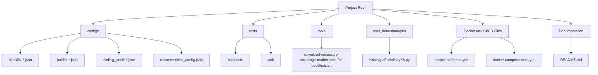
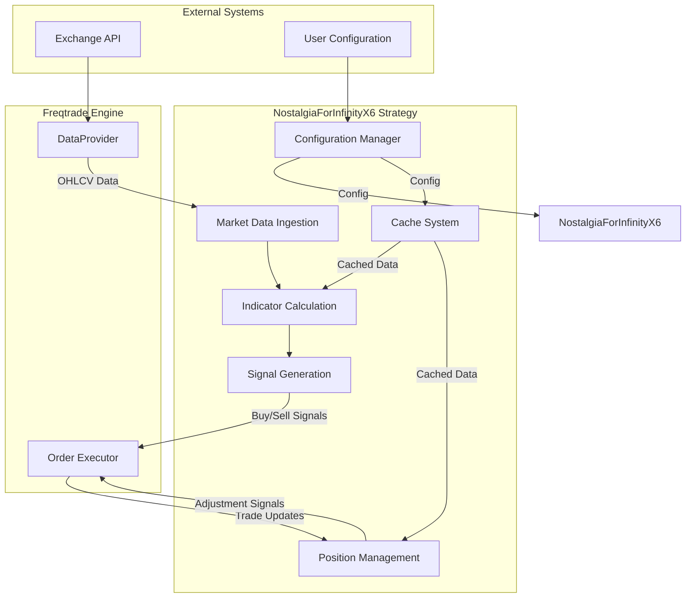
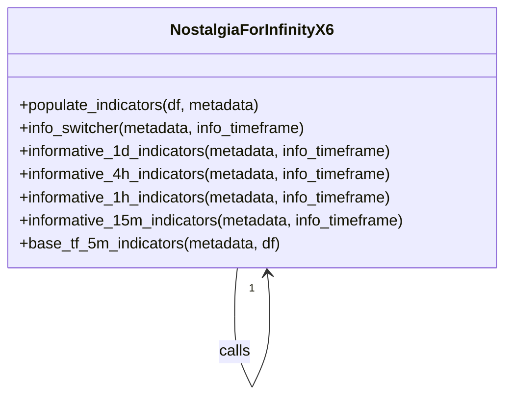
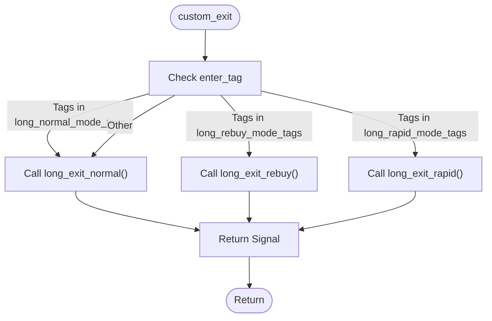
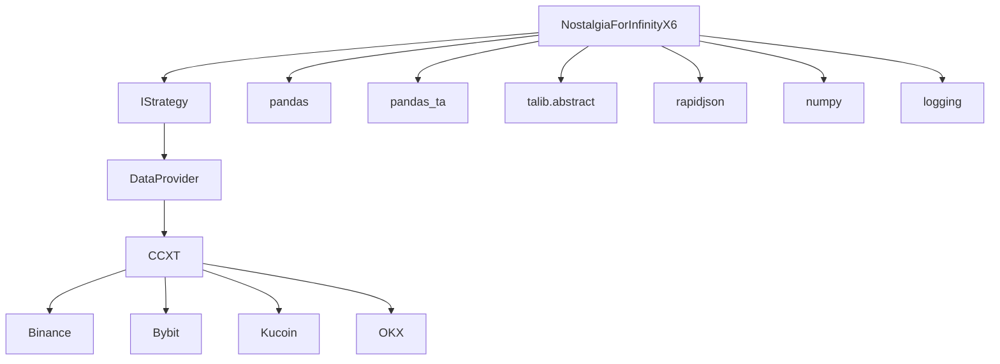

# Technical Architecture

<cite>
**Referenced Files in This Document**   
- [NostalgiaForInfinityX6.py](file://NostalgiaForInfinityX6.py)
- [README.md](file://README.md)
- [docker-compose.yml](file://docker-compose.yml)
- [configs/recommended_config.json](file://configs/recommended_config.json)
- [configs/trading_mode-futures.json](file://configs/trading_mode-futures.json)
- [configs/trading_mode-spot.json](file://configs/trading_mode-spot.json)
- [configs/pairlist-static-binance-spot-usdt.json](file://configs/pairlist-static-binance-spot-usdt.json)
- [configs/blacklist-binance.json](file://configs/blacklist-binance.json)
</cite>

## Table of Contents
1. [Introduction](#introduction)
2. [Project Structure](#project-structure)
3. [Core Components](#core-components)
4. [Architecture Overview](#architecture-overview)
5. [Detailed Component Analysis](#detailed-component-analysis)
6. [Dependency Analysis](#dependency-analysis)
7. [Performance Considerations](#performance-considerations)
8. [Troubleshooting Guide](#troubleshooting-guide)
9. [Conclusion](#conclusion)

## Introduction

The NostalgiaForInfinityX6 (NFI-X6) strategy is a sophisticated trading bot component designed for the Freqtrade framework, targeting cryptocurrency markets. It implements a modular, configuration-driven architecture that supports multiple trading modes, dynamic position adjustments, and advanced risk management. The strategy is engineered for high-frequency trading on 5-minute candlesticks, with support for both spot and futures trading across multiple exchanges. It leverages technical indicators from TA-Lib and pandas_ta to generate entry and exit signals, and incorporates a comprehensive position management system for grinding, rebuying, and de-risking open trades. This document provides a detailed technical analysis of its architecture, data flow, and key design patterns.

## Project Structure

The project follows a well-organized structure that separates configuration, strategy logic, testing, and infrastructure components. The primary organization is feature-based, with distinct directories for configurations, tests, tools, and the core strategy implementation.



**Diagram sources**
- [configs](file://configs)
- [tests](file://tests)
- [tools](file://tools)
- [user_data/strategies](file://user_data/strategies)
- [docker-compose.yml](file://docker-compose.yml)
- [README.md](file://README.md)

**Section sources**
- [configs](file://configs)
- [tests](file://tests)
- [tools](file://tools)
- [user_data/strategies](file://user_data/strategies)
- [docker-compose.yml](file://docker-compose.yml)
- [README.md](file://README.md)

## Core Components

The core of the NostalgiaForInfinityX6 strategy is the `NostalgiaForInfinityX6` class, which extends Freqtrade's `IStrategy` interface. This object-oriented design allows for a high degree of modularity and extensibility. The strategy is built around three key architectural patterns: the Strategy pattern for managing multiple trading modes, the Configuration pattern for JSON-based parameter overrides, and the Cache pattern for optimizing indicator calculations and profit tracking. The system is designed to be stateful, maintaining caches for hold trades and profit targets, and supports dynamic behavior through configuration files that can override default parameters at runtime.

**Section sources**
- [NostalgiaForInfinityX6.py](file://NostalgiaForInfinityX6.py)

## Architecture Overview

The NostalgiaForInfinityX6 strategy operates within the Freqtrade ecosystem, acting as a plug-in module that defines trading logic. The architecture is event-driven, with the Freqtrade engine calling specific hook methods at defined points in the trading cycle. The primary data flow begins with market data ingestion from an exchange via the Freqtrade DataProvider. This data is then processed through a series of indicator calculations on multiple timeframes (5m, 15m, 1h, 4h, 1d). The calculated indicators are used by the `populate_entry_trend` and `populate_exit_trend` methods to generate buy and sell signals. These signals are then acted upon by the Freqtrade engine, which manages order execution. The strategy also implements the `custom_stake_amount` and `adjust_trade_position` hooks to dynamically manage position sizing and perform in-trade adjustments like rebuys and grinds.



**Diagram sources**
- [NostalgiaForInfinityX6.py](file://NostalgiaForInfinityX6.py)
- [README.md](file://README.md)

## Detailed Component Analysis

### Strategy Class and Initialization

The `NostalgiaForInfinityX6` class is the central component, encapsulating all trading logic. Its `__init__` method is responsible for loading and applying configuration parameters. It supports two configuration modes: a backward-compatible style where parameters are set directly in the config file, and an advanced mode where parameters are nested under the `nfi_parameters` block. This dual-mode approach ensures backward compatibility while allowing for a more organized configuration structure. The initialization process also sets up a cache system for storing profit targets and handles exchange-specific configurations for CCXT.

```python
def __init__(self, config: dict) -> None:
    # A list of parameters that can be changed through the config.
    NFI_SAFE_PARAMETERS = [
      "num_cores_indicators_calc",
      "custom_fee_open_rate",
      "custom_fee_close_rate",
      # ... other parameters
    ]

    # Set up CCXT options
    if "ccxt_config" not in config["exchange"]:
      config["exchange"]["ccxt_config"] = {}
    # ... (rest of the initialization)
```

**Section sources**
- [NostalgiaForInfinityX6.py](file://NostalgiaForInfinityX6.py#L100-L200)

### Indicator Calculation System

The strategy employs a multi-timeframe indicator system to gain a comprehensive market view. It calculates indicators on the base 5-minute timeframe and on several "informative" timeframes (15m, 1h, 4h, 1d). A switch-case pattern implemented in the `info_switcher` method routes the calculation to the appropriate timeframe-specific function (e.g., `informative_1d_indicators`). This modular design allows for different sets of indicators to be calculated on different timeframes. The system uses pandas_ta for calculations and includes a performance logging mechanism to track the computational cost of each indicator set.



**Diagram sources**
- [NostalgiaForInfinityX6.py](file://NostalgiaForInfinityX6.py#L2400-L3200)

**Section sources**
- [NostalgiaForInfinityX6.py](file://NostalgiaForInfinityX6.py#L2400-L3200)

### Signal Generation and Trading Modes

The strategy implements a complex signal generation system based on the Strategy pattern. It defines multiple trading modes (e.g., long_normal, long_pump, long_rebuy) identified by unique tag numbers. The `populate_entry_trend` method uses these tags to enable or disable specific entry conditions. For exits, the `custom_exit` method acts as a router, delegating to mode-specific exit functions (e.g., `long_exit_normal`, `long_exit_rebuy`) based on the trade's entry tag. This design allows for highly specialized exit logic for each trading mode, enabling sophisticated risk management and profit-taking strategies.



**Diagram sources**
- [NostalgiaForInfinityX6.py](file://NostalgiaForInfinityX6.py#L1600-L2400)

**Section sources**
- [NostalgiaForInfinityX6.py](file://NostalgiaForInfinityX6.py#L1600-L2400)

### Position Management System

The position management system is one of the most advanced features of NFI-X6. It is enabled by the `position_adjustment_enable` flag and is implemented through the `adjust_trade_position` hook. This system allows the strategy to add to (rebuy, grind) or reduce (de-risk) an open position based on market conditions. The logic is highly configurable, with different parameters for spot and futures trading, and for different modes (e.g., rebuy_mode, grind_mode). The system uses a state machine approach, with functions like `long_rebuy_adjust_trade_position` and `long_grind_adjust_trade_position_v2` handling the specific logic for each adjustment type. This enables a dynamic trading approach that can adapt to changing market conditions without closing the original trade.

```python
def adjust_trade_position(
    self,
    trade: Trade,
    current_time: datetime,
    current_rate: float,
    current_profit: float,
    min_stake: Optional[float],
    max_stake: float,
    # ... other parameters
):
    if self.position_adjustment_enable == False:
      return None

    # ... logic to determine which adjustment function to call
    if not trade.is_short and (all(c in self.long_rebuy_mode_tags for c in enter_tags)):
      return self.long_rebuy_adjust_trade_position(...)
    elif not trade.is_short:
      if is_long_grind_mode or not is_v2_date:
        return self.long_grind_adjust_trade_position(...)
      else:
        return self.long_grind_adjust_trade_position_v2(...)
```

**Section sources**
- [NostalgiaForInfinityX6.py](file://NostalgiaForInfinityX6.py#L2400-L3200)

## Dependency Analysis

The NostalgiaForInfinityX6 strategy has a well-defined set of dependencies, primarily on the Freqtrade framework and data analysis libraries. Its core dependency is on Freqtrade's `IStrategy` interface, which it implements. It relies heavily on `pandas` for data manipulation and `pandas_ta` and `talib` for technical indicator calculations. The strategy is designed to be loosely coupled with the exchange layer through Freqtrade's DataProvider, which abstracts the interaction with different exchanges via CCXT. The configuration system is file-based, with JSON files for pair lists, blacklists, and trading parameters, which are loaded at runtime. This modular dependency structure makes the strategy portable across different exchanges and easy to configure.



**Diagram sources**
- [NostalgiaForInfinityX6.py](file://NostalgiaForInfinityX6.py#L1-L20)
- [requirements.txt](file://tests/requirements.txt)

**Section sources**
- [NostalgiaForInfinityX6.py](file://NostalgiaForInfinityX6.py#L1-L20)
- [tests/requirements.txt](file://tests/requirements.txt)

## Performance Considerations

The NostalgiaForInfinityX6 strategy is computationally intensive due to its multi-timeframe indicator calculations. To mitigate performance issues, it implements several optimizations. The `process_only_new_candles` flag ensures that the `populate_indicators` method is only run when a new candle is closed, preventing redundant calculations. The strategy also uses a caching system (`Cache` class) to store profit targets, avoiding recalculation on every tick. The `num_cores_indicators_calc` parameter allows users to leverage multiple CPU cores for parallel indicator calculations with pandas_ta. For exchanges with API limitations (e.g., OKX, Kraken), the `startup_candle_count` is dynamically adjusted to ensure sufficient data is available. Despite these measures, the strategy's complexity means it requires significant computational resources, especially when running with a large pair list.

**Section sources**
- [NostalgiaForInfinityX6.py](file://NostalgiaForInfinityX6.py)

## Troubleshooting Guide

Common issues with the NostalgiaForInfinityX6 strategy often stem from configuration errors. A primary recommendation is to ensure the `timeframe` is set to "5m", as the strategy is specifically designed for this interval. Users should also verify that the Freqtrade configuration options `use_exit_signal`, `exit_profit_only`, and `ignore_roi_if_entry_signal` are correctly set, as specified in the README. If the strategy is not generating trades, check the pair list and blacklist configuration files to ensure the desired trading pairs are included and leveraged tokens are excluded. For issues with position adjustments, verify that `position_adjustment_enable` is set to `True` and that the necessary configuration parameters are present. Performance issues can often be addressed by reducing the pair list size or increasing the available CPU resources.

**Section sources**
- [README.md](file://README.md)
- [NostalgiaForInfinityX6.py](file://NostalgiaForInfinityX6.py)

## Conclusion

The NostalgiaForInfinityX6 strategy is a highly sophisticated and modular trading system built on the Freqtrade framework. Its architecture demonstrates a strong adherence to object-oriented design principles, utilizing patterns like Strategy, Configuration, and Cache to create a flexible and maintainable codebase. The separation of concerns between market data ingestion, indicator calculation, signal generation, and position management allows for complex trading logic to be implemented in a structured way. The extensive use of configuration files enables users to fine-tune the strategy's behavior without modifying the code. While powerful, the strategy's complexity demands careful configuration and significant computational resources. Its design makes it a robust foundation for algorithmic trading in the volatile cryptocurrency markets.