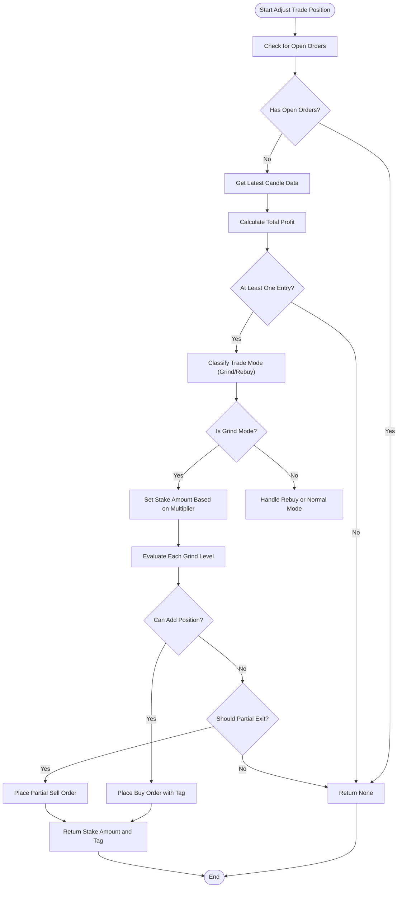

# Grind Long Mode

<cite>
**Referenced Files in This Document**   
- [NostalgiaForInfinityX6.py](file://NostalgiaForInfinityX6.py#L1-L65286)
</cite>

## Table of Contents
1. [Introduction](#introduction)
2. [Grind Long Mode Overview](#grind-long-mode-overview)
3. [Entry Signal Adaptation](#entry-signal-adaptation)
4. [Configuration Parameters](#configuration-parameters)
5. [Position Sizing and Distribution](#position-sizing-and-distribution)
6. [Exit Strategy and Profit Targets](#exit-strategy-and-profit-targets)
7. [Integration with Grinding Mechanism](#integration-with-grinding-mechanism)
8. [Derisking Mechanism](#derisking-mechanism)
9. [Practical Example on Kraken USDT Pairs](#practical-example-on-kraken-usdt-pairs)
10. [Common Pitfalls and Mitigation](#common-pitfalls-and-mitigation)
11. [Tuning Recommendations](#tuning-recommendations)
12. [Performance Considerations](#performance-considerations)

## Introduction
The Grind Long Mode is a specialized trading strategy within the NostalgiaForInfinityX6 (NFI-X6) framework designed to manage positions during slow, grinding uptrends characterized by frequent pullbacks. This mode enables incremental profit accumulation by allowing staggered entries and systematic exits. It is particularly effective in accumulation phases where price progresses upward with volatility, offering opportunities to average in at lower prices and scale out progressively.

This document provides a comprehensive analysis of the Grind Long Mode, detailing its logic, configuration, and practical application. The implementation is deeply integrated into the core functionality of NFI-X6, leveraging dynamic position adjustment and risk management mechanisms.

## Grind Long Mode Overview
The Grind Long Mode is activated when a trade's entry tag includes the identifier "120", which corresponds to the `long_grind_mode_tags` defined in the strategy. This mode is specifically engineered for prolonged bullish trends with high volatility, where the price frequently retraces before continuing upward.

The primary objective is to accumulate profit incrementally by entering additional positions during micro-dips and exiting portions of the position at predefined profit thresholds. This approach reduces reliance on a single exit point and allows the strategy to capture gains across multiple price levels.

The mode operates under the broader position adjustment framework of NFI-X6, where `position_adjustment_enable` must be set to `True`. The logic is executed within the `long_grind_adjust_trade_position` method, which evaluates current market conditions, profit levels, and historical entry points to determine whether to add to or reduce the position.

**Section sources**
- [NostalgiaForInfinityX6.py](file://NostalgiaForInfinityX6.py#L35655-L35854)

## Entry Signal Adaptation
Entry signals in Grind Long Mode are adapted to allow for staggered entries based on micro-dips or consolidation breaks. The strategy does not rely on a single entry but instead monitors for continued favorable conditions after the initial entry.

The entry logic is governed by the `long_entry_condition_120_enable` parameter, which must be set to `True` to activate the mode. Once the initial entry is made, subsequent entries are triggered when the price falls below a defined threshold relative to the last entry, indicating a potential dip to average down.

The code excerpt below illustrates the conditional check for enabling the Grind Long Mode entry:
```python
"long_entry_condition_120_enable": True,
```

After the first entry, the strategy evaluates whether additional entries are justified based on stake multipliers and price thresholds. The `grind_mode_stake_multiplier_spot` or `grind_mode_stake_multiplier_futures` arrays define the fraction of the initial stake to be used for each subsequent entry, depending on the trading mode (spot or futures).

**Section sources**
- [NostalgiaForInfinityX6.py](file://NostalgiaForInfinityX6.py#L333-L335)

## Configuration Parameters
Several key configuration parameters control the behavior of the Grind Long Mode. These parameters are defined at the class level and can be overridden via the strategy configuration.

### grind_mode_enabled
This boolean parameter enables or disables the Grind Long Mode. Although not explicitly named `grind_mode_enabled`, the mode is effectively controlled by the `position_adjustment_enable` flag and the presence of the "120" tag in the entry conditions.

### grind_entry_buffer
The buffer for entry is implicitly defined through the `grind_mode_first_entry_stop_threshold_spot` and `grind_mode_first_entry_stop_threshold_futures` parameters, which set the maximum drawdown allowed from the first entry before considering additional buys. For spot trading, this is set to -0.20 (20% loss), and for futures, it is also -0.20.

### grind_profit_ratio
The profit threshold for initiating partial exits is defined by `grind_mode_first_entry_profit_threshold_spot` and `grind_mode_first_entry_profit_threshold_futures`, both set to 0.018 (1.8%). This means that once the position reaches 1.8% profit, the strategy may begin scaling out.

### grind_max_positions
The maximum number of grind slots is controlled by `grind_mode_max_slots`, which limits the number of concurrent grind-mode trades. This prevents overexposure to a single asset during volatile periods.

Additional grind levels (e.g., `grind_1_stakes_spot`, `grind_2_stakes_spot`) define the stake distribution and thresholds for deeper averaging. Each grind level has its own stake size, profit threshold, and stop condition.

**Section sources**
- [NostalgiaForInfinityX6.py](file://NostalgiaForInfinityX6.py#L333-L360)

## Position Sizing and Distribution
Position sizing in Grind Long Mode is distributed across multiple entries using predefined stake multipliers. The initial entry uses the full stake, while subsequent entries use a fraction defined by the `grind_mode_stake_multiplier_spot` or `grind_mode_stake_multiplier_futures` array.

For example, in spot mode, the multiplier array is `[0.20, 0.30, 0.40, 0.50, 0.60, 0.70]`, meaning the second entry uses 20% of the initial stake, the third uses 30%, and so on. This progressive increase allows the strategy to commit more capital as the trend confirms, while still managing risk.

The actual stake for each grind level is calculated based on the slice amount (initial entry cost) and adjusted for minimum stake requirements:
```python
slice_amount /= (self.grind_mode_stake_multiplier_futures[0] if self.is_futures_mode else self.grind_mode_stake_multiplier_spot[0])
```

This ensures that even small accounts can participate in the grind process without violating exchange minimums.

**Section sources**
- [NostalgiaForInfinityX6.py](file://NostalgiaForInfinityX6.py#L35700-L35710)

## Exit Strategy and Profit Targets
The exit strategy in Grind Long Mode is segmented into partial exits at incremental profit targets. Each grind level has a corresponding profit threshold (`grind_X_profit_threshold`) that triggers a sell when reached.

For instance, `grind_1_profit_threshold_spot` is set to 0.018, meaning that once the first grind position reaches 1.8% profit, a partial exit is initiated. The strategy uses order tags like "gd1", "gd2", etc., to track which grind level is being exited.

The exit logic is implemented in the `custom_exit` method, which calls `long_exit_grind` when the trade's enter_tag includes "120". This function evaluates current profit and executes partial sells based on the configured thresholds.

Partial exits are also triggered by derisk conditions, where the position is reduced to lock in profits if the price retraces significantly.

**Section sources**
- [NostalgiaForInfinityX6.py](file://NostalgiaForInfinityX6.py#L35655-L35854)

## Integration with Grinding Mechanism
The Grind Long Mode is deeply integrated with the core grinding mechanism of NFI-X6. The `long_grind_adjust_trade_position` function is responsible for evaluating whether to add to or reduce the position based on current market data.

The function retrieves the latest candle data and calculates profit metrics using filled orders. It distinguishes between different grind levels by inspecting the `ft_order_tag` of filled buy orders. Tags like "gd2", "gd3", etc., indicate which grind level the order belongs to.

The grinding mechanism also accounts for fees and leverage, adjusting profit calculations accordingly. It ensures that each grind entry is only made if the potential profit exceeds transaction costs.



**Diagram sources**
- [NostalgiaForInfinityX6.py](file://NostalgiaForInfinityX6.py#L35655-L35854)

**Section sources**
- [NostalgiaForInfinityX6.py](file://NostalgiaForInfinityX6.py#L35655-L35854)

## Derisking Mechanism
The derisking mechanism in Grind Long Mode is designed to progressively reduce exposure as the position builds or when adverse price action occurs. Derisking is triggered when the current profit falls below a specified threshold, such as `regular_mode_derisk_spot` (-0.24 for spot) or `regular_mode_derisk_futures` (-0.60 for futures).

When derisking is activated, the strategy places sell orders to reduce the position size, locking in any remaining profit. This is particularly important in grind mode, where multiple entries increase exposure over time.

The derisk level can also be global, controlled by `grinding_v2_derisk_global_enable`, which applies a uniform derisk threshold across all grind levels. This provides an additional layer of risk management during market downturns.

**Section sources**
- [NostalgiaForInfinityX6.py](file://NostalgiaForInfinityX6.py#L35655-L35854)

## Practical Example on Kraken USDT Pairs
Consider a scenario on Kraken using the BTC/USDT pair during a prolonged accumulation phase. The price is in a slow uptrend with frequent 5-10% pullbacks.

1. **Initial Entry**: The strategy enters at $40,000 with a full stake.
2. **First Grind Entry**: Price drops to $38,000 (5% dip), triggering a second entry with 20% of the initial stake.
3. **Second Grind Entry**: Price dips to $36,500 (9% from initial), triggering a third entry with 30% of the initial stake.
4. **Partial Exits**: As price rises to $42,000 (5% gain), the first grind position is sold for a 1.8% profit. Further gains trigger additional partial exits.
5. **Derisking**: If price suddenly drops to $35,000, the strategy derisks by selling a portion of the position to prevent larger losses.

This approach allows the strategy to accumulate a larger position at lower average cost while systematically capturing profits.

**Section sources**
- [NostalgiaForInfinityX6.py](file://NostalgiaForInfinityX6.py#L35655-L35854)

## Common Pitfalls and Mitigation
### Over-Averaging in Downtrends
A major risk is over-averaging during a genuine downtrend, mistaking it for a pullback. This can lead to significant drawdowns if the trend reverses.

**Mitigation**: Use `grind_mode_coins` to limit grinding to high-liquidity, fundamentally strong assets. Additionally, set conservative `grind_mode_max_slots` to prevent excessive position buildup.

### Capital Lock-Up
Multiple entries can tie up capital across several grind levels, reducing flexibility for new opportunities.

**Mitigation**: Monitor `futures_max_open_trades_long` to limit concurrent grind trades. Use `min_free_slots_scalp_mode` to reserve capacity for other strategies.

### False Entry Signals
Volatility can trigger unnecessary grind entries during sideways movement.

**Mitigation**: Combine with higher timeframe trend filters (e.g., 1h or 4h) to ensure alignment with the overall trend.

**Section sources**
- [NostalgiaForInfinityX6.py](file://NostalgiaForInfinityX6.py#L333-L360)

## Tuning Recommendations
### Buffer Sizing
Adjust `grind_entry_buffer` (via `grind_mode_first_entry_stop_threshold`) based on asset volatility. For highly volatile assets, use a wider buffer (e.g., -0.25); for stable assets, use a tighter buffer (e.g., -0.15).

### Maximum Grind Levels
Set `grind_max_positions` conservatively. Start with 3-4 levels and increase only if backtesting shows improved risk-adjusted returns.

### Stake Multipliers
Tune `grind_mode_stake_multiplier_spot` to reflect risk tolerance. Aggressive traders may increase later multipliers; conservative traders should keep them flat or decreasing.

### Profit Thresholds
Adjust `grind_profit_ratio` based on trading frequency. Lower thresholds (e.g., 1.0%) increase turnover; higher thresholds (e.g., 2.5%) favor longer holds.

**Section sources**
- [NostalgiaForInfinityX6.py](file://NostalgiaForInfinityX6.py#L333-L360)

## Performance Considerations
### Balance Allocation
Ensure sufficient balance is allocated to accommodate multiple grind entries. The total potential exposure can reach several times the initial stake, especially in futures mode with leverage.

### Trade Frequency Management
High-frequency grinding can lead to excessive fees. Monitor `custom_fee_open_rate` and `custom_fee_close_rate` to ensure profitability after costs.

### Exchange Compatibility
Kraken and other exchanges with limited API candle data (e.g., 710 candles) require adjusting `startup_candle_count` to ensure sufficient data for indicator calculation.

### Backtesting Accuracy
Use realistic slippage settings (`max_slippage = 0.01`) to simulate actual execution conditions, especially during volatile grind entries.

**Section sources**
- [NostalgiaForInfinityX6.py](file://NostalgiaForInfinityX6.py#L333-L360)