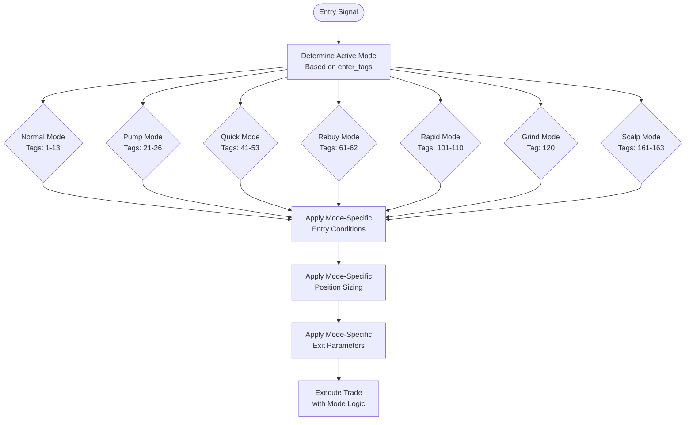
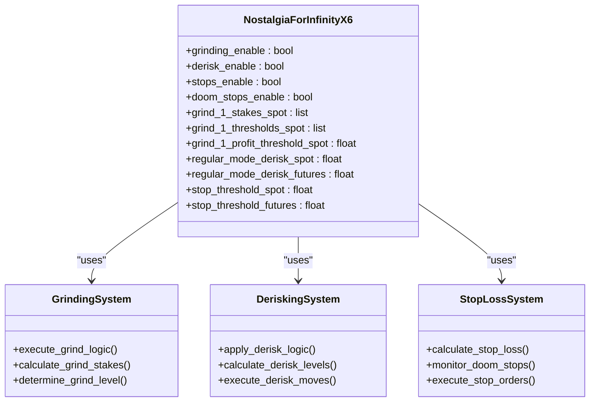

# Long Trading Modes

<cite>
**Referenced Files in This Document**   
- [NostalgiaForInfinityX6.py](file://NostalgiaForInfinityX6.py)
- [NostalgiaForInfinityX6.py]- [configs/recommended_config.json](file://configs/recommended_config.json)
- [tests/unit/test_NFIX6.py](file://tests/unit/test_NFIX6.py)
</cite>

## Table of Contents
1. [Introduction](#introduction)
2. [Long Trading Modes Overview](#long-trading-modes-overview)
3. [Normal Mode](#normal-mode)
4. [Pump Mode](#pump-mode)
5. [Quick Mode](#quick-mode)
6. [Rebuy Mode](#rebuy-mode)
7. [Rapid Mode](#rapid-mode)
8. [Grind Mode](#grind-mode)
9. [Scalp Mode](#scalp-mode)
10. [Shared Systems: Grinding and Derisking](#shared-systems-grinding-and-derisking)
11. [Performance Considerations and Tuning Tips](#performance-considerations-and-tuning-tips)
12. [Common Pitfalls and Best Practices](#common-pitfalls-and-best-practices)

## Introduction
The NostalgiaForInfinityX6 strategy implements a sophisticated multi-mode trading system designed for long positions in cryptocurrency markets. This document details the seven primary long trading modes: Normal, Pump, Quick, Rebuy, Rapid, Grind, and Scalp. Each mode is engineered to respond to specific market conditions, volatility profiles, and risk-reward parameters. The strategy leverages a tagging system where each entry signal is associated with numeric tags that determine which trading logic path to follow. These modes modify entry conditions, position sizing, and exit strategies to optimize performance under different market regimes. The implementation is highly configurable through strategy parameters that can be adjusted in the configuration file.

**Section sources**
- [NostalgiaForInfinityX6.py](file://NostalgiaForInfinityX6.py#L115-L131)
- [configs/recommended_config.json](file://configs/recommended_config.json#L1-L17)

## Long Trading Modes Overview
The NostalgiaForInfinityX6 strategy employs a modular approach to long trading through distinct operational modes, each identified by unique numeric tags. These modes are not mutually exclusive and can be combined through the enter_tag system, allowing for hybrid strategies. The core logic determines the active mode by checking which tags are present in the trade's enter_tags attribute. Each mode modifies the trading behavior in terms of entry sensitivity, position sizing, and exit parameters. The strategy supports both spot and futures trading with different parameter sets for each. The modes are designed to work in conjunction with shared systems like position adjustment (grinding), derisking, and stop-loss mechanisms. The configuration allows traders to enable or disable specific entry conditions for each mode through the long_entry_signal_params dictionary.

**Diagram sources**
- [NostalgiaForInfinityX6.py](file://NostalgiaForInfinityX6.py#L115-L131)
- [NostalgiaForInfinityX6.py](file://NostalgiaForInfinityX6.py#L897-L905)

## Normal Mode
Normal mode represents the baseline trading strategy with balanced risk parameters and conservative entry conditions. It is activated when any of the tags "1" through "13" are present in the enter_tags. This mode uses the standard entry conditions defined in long_entry_condition_1_enable through long_entry_condition_6_enable, which typically involve technical indicators like RSI, moving averages, and volume analysis. Position sizing follows the regular_mode_stake_multiplier, which defaults to 1.0 for both spot and futures trading. The exit strategy employs standard take-profit and stop-loss levels without aggressive acceleration. Normal mode is designed for stable market conditions with moderate volatility and is suitable for traders with average risk tolerance. It serves as the default fallback when no specialized mode conditions are met.

**Section sources**
- [NostalgiaForInfinityX6.py](file://NostalgiaForInfinityX6.py#L115)
- [NostalgiaForInfinityX6.py](file://NostalgiaForInfinityX6.py#L1593)

## Pump Mode
Pump mode is optimized for capturing upward price momentum during strong bullish movements. Activated by tags "21" through "26", this mode relaxes entry thresholds to enter positions more aggressively when a potential price pump is detected. The entry conditions (controlled by long_entry_condition_21_enable) typically look for rapid price increases, high volume spikes, and breakout patterns. Position sizing may be increased compared to normal mode to capitalize on strong trends. The stop-loss threshold is set to stop_threshold_spot (0.10 for spot, 0.10 for futures) to allow for volatility while protecting against false breakouts. Exit signals are designed to trail the price more closely to maximize gains during sustained pumps. This mode is particularly effective in trending markets but carries higher risk of entering during pump-and-dump schemes.

**Section sources**
- [NostalgiaForInfinityX6.py](file://NostalgiaForInfinityX6.py#L117)
- [NostalgiaForInfinityX6.py](file://NostalgiaForInfinityX6.py#L1619)
- [NostalgiaForInfinityX6.py](file://NostalgiaForInfinityX6.py#L615)

## Quick Mode
Quick mode is designed for fast, short-term trades that aim to capture quick profits from minor price movements. Triggered by tags "41" through "53", this mode accelerates entry triggers and uses tighter profit targets. The entry conditions (long_entry_condition_41_enable through long_entry_condition_46_enable) focus on short-term overbought/oversold conditions and micro-trend reversals. Position sizing is typically smaller than normal mode to allow for higher turnover. The exit strategy employs rapid take-profit levels, often in the range of 1-3%, to secure profits quickly. This mode is ideal for high-frequency trading in volatile markets but requires careful risk management to avoid being whipsawed by market noise. It works best when combined with adequate stop-loss protection and is less effective in ranging markets.

**Section sources**
- [NostalgiaForInfinityX6.py](file://NostalgiaForInfinityX6.py#L119)
- [NostalgiaForInfinityX6.py](file://NostalgiaForInfinityX6.py#L1645)
- [NostalgiaForInfinityX6.py](file://NostalgiaForInfinityX6.py#L616-L621)

## Rebuy Mode
Rebuy mode implements a position averaging strategy that allows for additional entries after the initial purchase. Activated by tags "61" and "62", this mode enables the position_adjustment_enable feature and uses specific rebuy parameters. The rebuy_mode_enabled configuration allows for additional entries when the price drops below certain thresholds, defined by rebuy_mode_thresholds_spot/futures. Position sizing for rebuys is controlled by rebuy_mode_stakes_spot/futures, typically representing a percentage of the initial stake. The strategy requires a minimum number of free slots (rebuy_mode_min_free_slots = 2) to activate rebuy logic. This mode is particularly effective in volatile markets where price retracements provide opportunities to lower the average entry price. It interacts closely with the grinding system and can be combined with other modes for enhanced performance.

**Section sources**
- [NostalgiaForInfinityX6.py](file://NostalgiaForInfinityX6.py#L121)
- [NostalgiaForInfinityX6.py](file://NostalgiaForInfinityX6.py#L1671-L1673)
- [tests/unit/test_NFIX6.py](file://tests/unit/test_NFIX6.py#L71-L107)

## Rapid Mode
Rapid mode is designed for high-velocity trading with accelerated position management. Activated by tags "101" through "110", this mode uses a reduced stake multiplier (rapid_mode_stake_multiplier_spot/futures = 0.75) to allow for faster position rotation. The entry conditions (long_entry_condition_101_enable through long_entry_condition_104_enable) focus on rapid price movements and short-term momentum. The stop-loss threshold is tightened to stop_threshold_rapid_spot/futures (0.20) to protect against sudden reversals. This mode is optimized for markets with high liquidity and volatility, where quick entries and exits can capitalize on short-term inefficiencies. It requires careful monitoring as the rapid turnover can lead to increased transaction costs and slippage. The mode works best when combined with low-latency execution and tight spread markets.

**Section sources**
- [NostalgiaForInfinityX6.py](file://NostalgiaForInfinityX6.py#L125)
- [NostalgiaForInfinityX6.py](file://NostalgiaForInfinityX6.py#L1726-L1731)
- [NostalgiaForInfinityX6.py](file://NostalgiaForInfinityX6.py#L624-L627)

## Grind Mode
Grind mode implements a sophisticated position averaging and profit-taking strategy for range-bound or slowly trending markets. Activated by tag "120", this mode uses the long_grind_adjust_trade_position function to manage position adjustments. It defines multiple grind levels (grind_1 through grind_6) with specific stake sizes, profit thresholds, and sub-thresholds for additional entries. The grind_mode_stake_multiplier_spot/futures defines progressive stake multipliers for each grind level. The strategy allows for a maximum of grind_mode_max_slots (1) concurrent grind positions. Grind mode is particularly effective for established coins listed in grind_mode_coins and works by systematically building positions at lower prices and taking partial profits at predefined levels. It requires sufficient market depth and works best in markets with moderate volatility and clear support/resistance levels.

**Section sources**
- [NostalgiaForInfinityX6.py](file://NostalgiaForInfinityX6.py#L127)
- [NostalgiaForInfinityX6.py](file://NostalgiaForInfinityX6.py#L1761)
- [NostalgiaForInfinityX6.py](file://NostalgiaForInfinityX6.py#L35655)
- [NostalgiaForInfinityX6.py](file://NostalgiaForInfinityX6.py#L37766)

## Scalp Mode
Scalp mode is optimized for very short-term trades that aim to capture small price movements with high frequency. Activated by tags "161" through "163", this mode uses the tightest stop-loss thresholds (stop_threshold_scalp_spot/futures = 0.20) to minimize risk exposure. The min_free_slots_scalp_mode parameter (1) ensures sufficient capacity for scalp trades. Entry conditions (long_entry_condition_161_enable through long_entry_condition_163_enable) focus on micro-price action, order book imbalances, and ultra-short-term indicators. Position sizing is typically small to allow for rapid turnover, and profit targets are in the range of 0.5-1.5%. This mode is designed for highly liquid pairs and requires low-latency execution to be effective. It is particularly suitable for traders with high risk tolerance and the ability to monitor markets closely, as the high frequency of trades can lead to significant transaction costs if not managed properly.

**Section sources**
- [NostalgiaForInfinityX6.py](file://NostalgiaForInfinityX6.py#L131)
- [NostalgiaForInfinityX6.py](file://NostalgiaForInfinityX6.py#L902-L905)
- [NostalgiaForInfinityX6.py](file://NostalgiaForInfinityX6.py#L633)

## Shared Systems: Grinding and Derisking
All long trading modes interact with the shared grinding and derisking systems that provide consistent risk management across different strategies. The grinding_enable and derisk_enable flags control these global features. The grinding system implements position averaging through multiple levels (grind_1 through grind_6) with specific stake sizes, thresholds, and profit targets defined for both spot and futures trading. The derisk system provides progressive risk reduction through derisk_1, derisk_2, and derisk_3 levels, with different thresholds for spot (e.g., regular_mode_derisk_spot = -0.24) and futures (regular_mode_derisk_futures = -0.60) trading. These systems work in conjunction with the specific mode parameters to provide a layered approach to risk management. The stops_enable and doom_stops_enable features provide additional protection against catastrophic losses, particularly in volatile market conditions.

**Diagram sources**
- [NostalgiaForInfinityX6.py](file://NostalgiaForInfinityX6.py#L135-L287)
- [NostalgiaForInfinityX6.py](file://NostalgiaForInfinityX6.py#L35655)
- [NostalgiaForInfinityX6.py](file://NostalgiaForInfinityX6.py#L59610)

## Performance Considerations and Tuning Tips
Optimal performance of the long trading modes requires careful configuration and tuning based on market conditions. For Normal mode, maintain standard parameters for balanced performance in stable markets. In Pump mode, consider tightening stop-loss levels during periods of extreme volatility to protect gains. For Quick and Scalp modes, ensure sufficient liquidity in traded pairs to minimize slippage, and consider reducing position sizes in low-volume markets. Rebuy and Grind modes benefit from wider thresholds during high-volatility periods to avoid premature entries. Rapid mode performs best with low-latency connections and should be used primarily on major exchanges with deep order books. All modes should be tested with adequate backtesting data, particularly across different market regimes (bull, bear, and ranging markets). Monitor the interaction between modes when using combined strategies, as overlapping logic can lead to unexpected behavior.

**Section sources**
- [NostalgiaForInfinityX6.py](file://NostalgiaForInfinityX6.py#L135-L318)
- [configs/recommended_config.json](file://configs/recommended_config.json#L1-L17)

## Common Pitfalls and Best Practices
Traders should be aware of several common pitfalls when using the long trading modes. Overtrading is a significant risk in Scalp and Quick modes due to their high-frequency nature; implement strict daily loss limits to prevent excessive drawdowns. False breakouts can trap Pump mode positions; combine with volume analysis to confirm momentum. Rebuy and Grind modes can lead to overexposure if not properly managed; monitor total portfolio risk and avoid applying these modes to highly correlated assets simultaneously. Rapid mode's accelerated triggers may generate whipsaw trades in ranging markets; use only in confirmed trending conditions. Always maintain adequate free slots for position adjustments, particularly when using Rebuy or Grind modes. Best practices include regular backtesting, starting with smaller position sizes when deploying new configurations, and maintaining detailed trade journals to analyze performance across different modes and market conditions.

**Section sources**
- [NostalgiaForInfinityX6.py](file://NostalgiaForInfinityX6.py#L115-L131)
- [NostalgiaForInfinityX6.py](file://NostalgiaForInfinityX6.py#L1593-L1761)
- [tests/unit/test_NFIX6.py](file://tests/unit/test_NFIX6.py#L166-L197)
