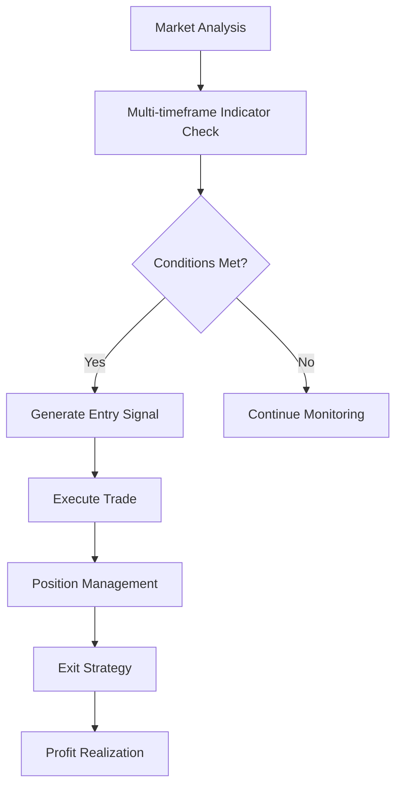
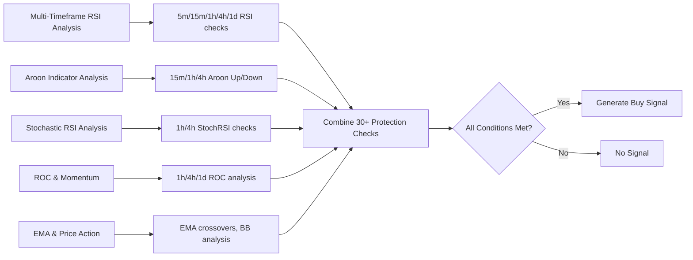
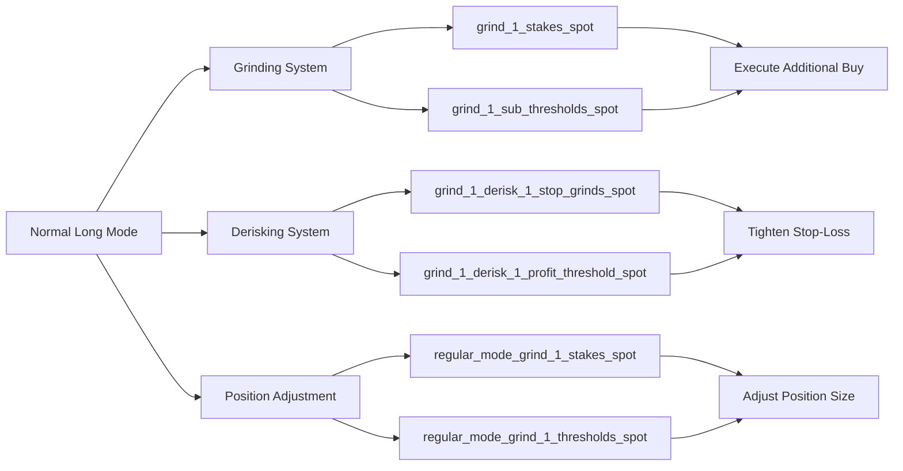

# Normal Long Mode

<cite>
**Referenced Files in This Document**   
- [NostalgiaForInfinityX6.py](file://NostalgiaForInfinityX6.py)
</cite>

## Table of Contents
1. [Introduction](#introduction)
2. [Core Functionality](#core-functionality)
3. [Entry Signal Logic](#entry-signal-logic)
4. [Configuration Parameters](#configuration-parameters)
5. [Exit Strategy](#exit-strategy)
6. [Integration with Position Management Systems](#integration-with-position-management-systems)
7. [Practical Deployment Example](#practical-deployment-example)
8. [Common Pitfalls and Tuning Tips](#common-pitfalls-and-tuning-tips)
9. [Performance Considerations](#performance-considerations)

## Introduction
The Normal Long Mode in the NostalgiaForInfinityX6 strategy serves as the baseline trading mode for standard market conditions. It is designed to capture steady trends with a balanced risk-reward profile. This mode is activated by default and forms the foundation for long positions across various cryptocurrency pairs, particularly on Binance USDT markets. The strategy leverages multiple technical indicators across different timeframes to generate robust entry and exit signals. It integrates seamlessly with advanced position management features such as grinding (position averaging) and derisking (trailing stop adjustments) to optimize trade outcomes.

**Section sources**
- [NostalgiaForInfinityX6.py](file://NostalgiaForInfinityX6.py#L68-L173)

## Core Functionality
The Normal Long Mode operates on a 5-minute timeframe and utilizes a combination of technical indicators to identify favorable entry points during sustained bullish trends. The strategy employs a multi-timeframe analysis approach, incorporating data from 15-minute, 1-hour, 4-hour, and daily charts to confirm trend strength and market conditions. Entry signals are generated when specific momentum and volume confirmation thresholds are met, ensuring that trades are initiated during periods of strong upward momentum. The mode is designed to work optimally with 6 to 12 open trades and performs best with a volume-based pair list containing 40 to 80 pairs. The strategy specifically recommends using stablecoin pairs (USDT, USDC, etc.) while avoiding leveraged tokens (*BULL, *BEAR, *UP, *DOWN, etc.).

**Diagram sources**
- [NostalgiaForInfinityX6.py](file://NostalgiaForInfinityX6.py#L68-L173)

**Section sources**
- [NostalgiaForInfinityX6.py](file://NostalgiaForInfinityX6.py#L68-L173)

## Entry Signal Logic
The entry signal generation in Normal Long Mode is based on six distinct conditions, each combining multiple technical indicators to confirm bullish momentum. These conditions use Exponential Moving Averages (EMA), Relative Strength Index (RSI), Aroon Indicator, and Stochastic RSI across various timeframes.

**Note**: The actual entry conditions are highly complex with 30+ protection checks per condition. Each condition uses combinations of:
- RSI at multiple timeframes (RSI_3, RSI_3_15m, RSI_3_1h, RSI_3_4h, RSI_3_1d, RSI_14, RSI_14_4h)
- Aroon indicators (AROONU_14, AROONU_14_15m, AROONU_14_1h, AROONU_14_4h)
- Stochastic RSI (STOCHRSIk_14_14_3_3_1h, STOCHRSIk_14_14_3_3_4h)
- ROC indicators (ROC_2, ROC_9_1h, ROC_9_4h, ROC_9_1d)
- EMA and Bollinger Band analysis
- CMF (Chaikin Money Flow)

The diagram below shows a simplified representation of the analysis flow. For exact implementation details, refer to the source code.

**Diagram sources**
- [NostalgiaForInfinityX6.py](file://NostalgiaForInfinityX6.py#L9149-L9400) - Long Condition #1 implementation

**Section sources**
- [NostalgiaForInfinityX6.py](file://NostalgiaForInfinityX6.py#L7934-L9500)

## Configuration Parameters
The Normal Long Mode is governed by several key configuration parameters that control its behavior. The `entry_wait_time` parameter determines how long the strategy waits before confirming an entry signal, though this specific parameter is not explicitly defined in the code and is likely controlled by the 5-minute timeframe. The `exit_profit_ratio` is managed through the `profit_max_thresholds` array, which sets profit targets at 1% for the first eight trades and 5% for subsequent trades. The `max_position_shift` parameter is controlled through the grinding and rebuy mechanisms, with specific stake multipliers defined for different market conditions. The strategy also includes parameters for controlling the number of open trades, with recommendations for 6-12 open positions for optimal performance. The `long_entry_signal_params` dictionary contains boolean flags to enable or disable each of the six entry conditions.

**Section sources**
- [NostalgiaForInfinityX6.py](file://NostalgiaForInfinityX6.py#L68-L173)

## Exit Strategy
The exit logic for Normal Long Mode applies standard take-profit and stop-loss levels while integrating with the strategy's derisking system. The strategy uses a combination of fixed profit targets and trailing stops to maximize gains while protecting against reversals. The `profit_max_thresholds` parameter defines the profit targets for closing positions, with a tiered approach that starts at 1% and increases to 5% for later trades. The stop-loss is controlled by the `stop_threshold_spot` parameter, set at 10% for spot trading. The derisking system, when enabled, adjusts stop-loss levels based on market conditions, with `derisk_enable` set to true by default. The strategy also incorporates a position adjustment feature that allows for averaging down through the grinding mechanism when prices move against the initial entry.

**Section sources**
- [NostalgiaForInfinityX6.py](file://NostalgiaForInfinityX6.py#L68-L173)

## Integration with Position Management Systems
The Normal Long Mode integrates with several advanced position management systems within the NostalgiaForInfinityX6 strategy. The grinding feature allows for position averaging through multiple entries, with specific parameters like `grind_1_stakes_spot` defining the stake amounts for additional buys. The derisking system adjusts trailing stops based on market conditions, with parameters like `grind_1_derisk_1_stop_grinds_spot` controlling when to tighten stops. The position adjustment feature is enabled by default through the `position_adjustment_enable` parameter. These systems work together to optimize risk management and profit potential, allowing the strategy to adapt to changing market conditions. The grinding system is particularly important for Normal Long Mode, as it enables the strategy to build positions gradually during favorable trends.

**Diagram sources**
- [NostalgiaForInfinityX6.py](file://NostalgiaForInfinityX6.py#L68-L173)

**Section sources**
- [NostalgiaForInfinityX6.py](file://NostalgiaForInfinityX6.py#L68-L173)

## Practical Deployment Example
A practical example of deploying the Normal Long Mode can be demonstrated during a sustained bullish trend on Binance USDT pairs. Consider a scenario where Bitcoin (BTC/USDT) is experiencing a steady upward trend after a period of consolidation. The strategy would first identify this trend through the multi-timeframe analysis, noting that the EMA-26 has crossed above the EMA-12 with sufficient spread. The RSI indicators across multiple timeframes would show the asset emerging from oversold conditions without being overbought. When the price touches the lower Bollinger Band while the Aroon Up indicator is below 25, the strategy would generate an entry signal. The trade would be executed with a stake according to the configured parameters, and the position would be managed through the grinding system, potentially adding to the position at predetermined thresholds. The exit would be triggered when the profit target of 1% is reached or if the price retraces by 10% from the entry point.

**Section sources**
- [NostalgiaForInfinityX6.py](file://NostalgiaForInfinityX6.py#L68-L173)

## Common Pitfalls and Tuning Tips
The Normal Long Mode can encounter several common pitfalls, particularly in choppy or sideways markets where delayed entries may occur due to the multiple confirmation requirements. To address this, traders can adjust the EMA periods or RSI thresholds based on market volatility. During high-volatility periods, increasing the RSI threshold from 30 to 35 can prevent premature entries, while during low-volatility periods, decreasing it to 25 can capture trends earlier. Adjusting the EMA periods from 12 and 26 to 10 and 20 can make the strategy more responsive to price changes. Traders should also consider modifying the `allowed_empty_candles_288` parameter based on the specific market conditions, as this affects how the strategy handles periods of low trading volume. Regular monitoring of the strategy's performance and adjustment of the profit targets based on market conditions can significantly improve results.

**Section sources**
- [NostalgiaForInfinityX6.py](file://NostalgiaForInfinityX6.py#L68-L173)

## Performance Considerations
The Normal Long Mode performs differently in spot and futures trading configurations. For spot trading, the strategy uses the `regular_mode_stake_multiplier_spot` parameter set to [1.0], meaning each trade uses the full configured stake. In futures mode, the same parameter is used but with leverage controlled by `futures_mode_leverage`, set at 3.0 by default. The strategy's performance is optimized for stablecoin pairs, as recommended in the documentation, due to their lower volatility compared to BTC or ETH pairs. The 5-minute timeframe provides a balance between responsiveness and noise reduction, making it suitable for capturing medium-term trends. The strategy's reliance on multiple timeframes and technical indicators requires sufficient historical data, with a startup candle count of 800 candles recommended for proper initialization. Performance can be further optimized by adjusting the number of open trades and the pair list composition based on market conditions.

**Section sources**
- [NostalgiaForInfinityX6.py](file://NostalgiaForInfinityX6.py#L68-L173)