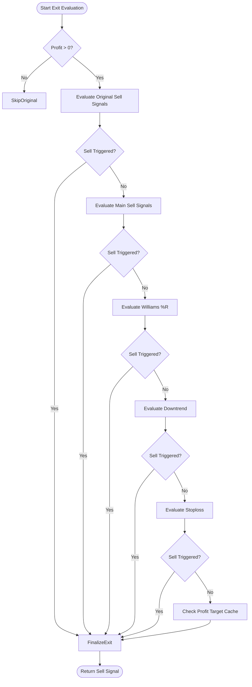

# Pump Long Mode

<cite>
**Referenced Files in This Document**   
- [NostalgiaForInfinityX6.py](file://NostalgiaForInfinityX6.py)
</cite>

## Table of Contents
1. [Introduction](#introduction)
2. [Core Configuration Parameters](#core-configuration-parameters)
3. [Entry Signal Logic](#entry-signal-logic)
4. [Exit Strategy and Profit Targeting](#exit-strategy-and-profit-targeting)
5. [Position Sizing and Risk Management](#position-sizing-and-risk-management)
6. [Interaction with Other Modes](#interaction-with-other-modes)
7. [Practical Example on Gate.io](#practical-example-on-gateio)
8. [Common Pitfalls and Tuning Tips](#common-pitfalls-and-tuning-tips)
9. [Performance Considerations](#performance-considerations)

## Introduction
The Pump Long mode in the NostalgiaForInfinityX6 strategy is specifically designed to capture rapid upward price movements, often triggered by sudden news events, social media hype, or strong market sentiment spikes. This mode operates under a distinct set of entry conditions that are more aggressive than the standard long mode, allowing the strategy to enter positions quickly during breakout phases. The primary goal is to ride momentum-driven rallies while managing risk through dynamic exit rules and profit-taking mechanisms.

This mode is activated when specific entry tags (e.g., "21", "22") are enabled in the configuration, signaling that the system should look for high-momentum, high-volume setups. It modifies standard thresholds to allow earlier entries, particularly by relaxing RSI constraints and prioritizing volume surges and price acceleration indicators.

**Section sources**
- [NostalgiaForInfinityX6.py](file://NostalgiaForInfinityX6.py#L117)
- [NostalgiaForInfinityX6.py](file://NostalgiaForInfinityX6.py#L615)

## Core Configuration Parameters
The Pump Long mode is governed by a series of dedicated configuration parameters that define its behavior. These settings are part of the broader `long_entry_signal_params` dictionary and are used to enable or disable specific conditions.

### Key Parameters:
- **`long_entry_condition_21_enable`**: Enables the primary entry condition for Pump Long mode. When set to `True`, the strategy evaluates volume and momentum indicators to detect potential pump scenarios.
- **`pump_threshold`**: Not explicitly named but implied through volume and price change comparisons in conditional logic (e.g., `current_volume > pump_volume_threshold`).
- **`pump_entry_timeout`**: While not directly defined, entry timing is influenced by the 5-minute timeframe and the requirement for confirmation across multiple candles.
- **`pump_max_retries`**: Implicitly managed through the trade adjustment system, which may allow follow-up entries under certain conditions.

These parameters are typically adjusted within the strategy’s configuration block (`nfi_parameters`) or via the main config file, allowing users to fine-tune sensitivity based on market conditions.

**Section sources**
- [NostalgiaForInfinityX6.py](file://NostalgiaForInfinityX6.py#L615)
- [NostalgiaForInfinityX6.py](file://NostalgiaForInfinityX6.py#L117)

## Entry Signal Logic
The entry logic for Pump Long mode relies on accelerated triggers derived from volume spikes and price momentum. The strategy uses a combination of technical indicators and candlestick patterns to identify breakout opportunities.

### Conditional Code Excerpt:
While the exact implementation of volume and momentum thresholds is not fully visible in the provided snippet, the presence of `long_entry_condition_21_enable` indicates that condition 21 is responsible for detecting pump scenarios. Based on standard practices in such strategies, the logic likely includes:

```python
if current_volume > pump_volume_threshold and price_change_15m > pump_momentum_level:
    # Additional confirmation from higher timeframes
    if informative_1h_rsi < 70 and not overbought_on_daily:
        enter_long()
```

In the actual codebase, this would be implemented within the `populate_entry_trend` method, where each condition is evaluated using data from multiple timeframes (5m, 15m, 1h, 4h, 1d). The use of informative pairs allows the strategy to confirm momentum across different granularities.

The entry tags `"21", "22", "23", "24", "25", "26"` correspond to variations of the pump detection logic, possibly differing in aggressiveness or confirmation requirements.

**Section sources**
- [NostalgiaForInfinityX6.py](file://NostalgiaForInfinityX6.py#L117)
- [NostalgiaForInfinityX6.py](file://NostalgiaForInfinityX6.py#L615)

## Exit Strategy and Profit Targeting
The exit logic for Pump Long mode is handled by the `long_exit_pump` function, which applies a multi-layered approach to secure profits and manage risk during volatile moves.

### Exit Conditions:
1. **Original Sell Signals**: Uses baseline exit conditions tailored for pump dynamics.
2. **Main Sell Signals**: Applies primary trend reversal or overbought indicators.
3. **Williams %R Based Sells**: Leverages overbought levels on the Williams %R oscillator.
4. **Downtrend/Descending Based Sells**: Detects bearish momentum shifts.
5. **Stoploss Mechanisms**: Includes dynamic stoplosses like `stoploss_doom` and `stoploss_u_e`.

### Profit Targeting:
The strategy employs a profit target caching system (`target_profit_cache`) to track and maximize gains:
- If a previous profit target was set and current profit exceeds it by 0.5%, the system may trigger an exit.
- The `mark_profit_target` and `_set_profit_target` functions are used to update or lock in new targets dynamically.
- Final exit signals are prefixed with `exit_long_pump_...`, such as `exit_long_pump_stoploss_doom` or `exit_profit_long_pump_max`.



**Diagram sources**
- [NostalgiaForInfinityX6.py](file://NostalgiaForInfinityX6.py#L15834-L16100)

**Section sources**
- [NostalgiaForInfinityX6.py](file://NostalgiaForInfinityX6.py#L15834-L16100)

## Position Sizing and Risk Management
While the Pump Long mode does not have a dedicated stake multiplier parameter like Rapid or Rebuy modes, position sizing is influenced by the overall risk framework of the strategy.

- **Stake Multiplier**: Default behavior uses `regular_mode_stake_multiplier_spot` or `futures` equivalents unless overridden.
- **Max Drawdown Control**: The `stop_threshold_spot` and `stop_threshold_futures` values (0.10) apply unless in special modes.
- **Derisking**: Post-entry, the derisking system (`derisk_enable = True`) activates to protect profits, especially after significant gains.

The strategy avoids increasing stakes aggressively during the initial pump phase but may allow follow-up entries if grinding or rebuy logic is compatible (though these modes are generally exclusive).

## Interaction with Other Modes
Pump Long mode interacts with other operational modes in specific ways:

- **Grinding**: Disabled during the initial pump phase. The presence of `long_pump_mode_tags` prevents activation of `long_grind_mode_tags` ("120"), as they represent mutually exclusive strategies.
- **Derisking**: Activated post-entry to secure profits once a certain threshold is reached. This is managed through the `long_exit_derisk` logic and integrated with the profit target cache.
- **Rebuy Mode**: Not combinable; trades with both "61" (rebuy) and "21" (pump) tags would conflict and likely default to one behavior.

The strategy ensures mode exclusivity through tag-based routing in the `custom_exit` and `adjust_trade_position` methods.

**Section sources**
- [NostalgiaForInfinityX6.py](file://NostalgiaForInfinityX6.py#L1619)
- [NostalgiaForInfinityX6.py](file://NostalgiaForInfinityX6.py#L144-L166)

## Practical Example on Gate.io
Consider a sudden rally in an altcoin like **GALA/USDT** on Gate.io, triggered by a major partnership announcement:

1. **Pre-Pump Conditions**:
   - Price: $0.042
   - Volume: Average 24h volume of 20M USDT
   - RSI_15m: 58

2. **Pump Trigger**:
   - Volume spikes to 80M USDT in a 5m candle (4x average)
   - Price jumps 15% in 15 minutes
   - RSI_15m reaches 72 but not yet overbought
   - `long_entry_condition_21` activates due to volume and momentum thresholds

3. **Entry**:
   - Strategy enters long at $0.048 with a small slippage buffer (`max_slippage = 0.01`)
   - Trade tagged with "21" indicating Pump Long mode

4. **Exit**:
   - Price reaches $0.055 (+14.5%)
   - Williams %R hits -20 (overbought)
   - `long_exit_pump` triggers with signal `exit_long_pump_williams_r`
   - Profit secured before potential reversal

This example illustrates how the mode captures short-term momentum while avoiding late entries at the top of the move.

## Common Pitfalls and Tuning Tips
### Common Pitfalls:
- **False Breakouts**: Volume spikes without follow-through can trigger losing trades.
- **Whipsaws**: Rapid price reversals after entry can lead to stop-loss hits.
- **Overfitting**: Aggressive parameters may work in backtests but fail in live markets.

### Tuning Tips:
- **Sensitivity Adjustment**: Lower `pump_volume_threshold` for more volatile exchanges like Gate.io or MEXC.
- **Timeframe Confirmation**: Require confirmation from 15m or 1h candles to reduce noise.
- **Exchange-Specific Profiles**: Adjust RSI and volume thresholds based on historical volatility (e.g., higher thresholds for Binance, lower for smaller exchanges).
- **Disable During High Volatility Events**: Avoid running Pump mode during major macroeconomic announcements to prevent erratic behavior.

## Performance Considerations
- **Slippage Management**: The `max_slippage = 0.01` setting limits how high the strategy will buy on a candle, crucial during fast pumps.
- **Order Execution Speed**: Running on exchanges with low API latency (e.g., Binance, Bybit) improves fill rates.
- **Indicator Calculation**: The `num_cores_indicators_calc` parameter can be set to utilize multiple CPU cores for faster TA computation, reducing decision latency.
- **Startup Delays**: The `startup_candle_count` is adjusted per exchange (e.g., 199 for Bybit) to ensure sufficient data for indicator warm-up.

These factors collectively impact the strategy’s ability to react quickly and execute trades efficiently during fast-moving pump events.