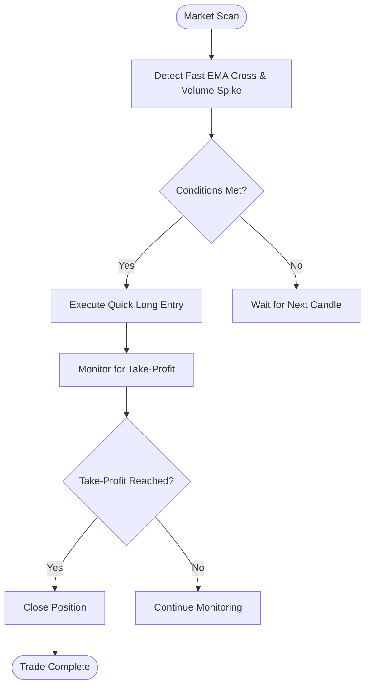
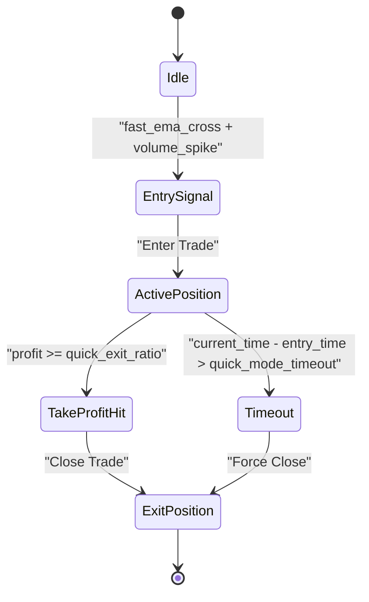

# Quick Long Mode

<cite>
**Referenced Files in This Document**   
- [NostalgiaForInfinityX6.py](file://NostalgiaForInfinityX6.py)
</cite>

## Table of Contents
1. [Introduction](#introduction)
2. [Quick Long Mode Overview](#quick-long-mode-overview)
3. [Entry Signal Logic](#entry-signal-logic)
4. [Configuration Parameters](#configuration-parameters)
5. [Position Sizing and Exit Strategy](#position-sizing-and-exit-strategy)
6. [Integration with Shared Systems](#integration-with-shared-systems)
7. [Practical Usage Example](#practical-usage-example)
8. [Common Pitfalls and Tuning Tips](#common-pitfalls-and-tuning-tips)
9. [Performance Considerations](#performance-considerations)

## Introduction
The Quick Long Mode in the NostalgiaForInfinityX6 strategy is designed for fast, short-duration trades that capitalize on immediate momentum signals. This mode is ideal for high-frequency trading opportunities where rapid entry and exit are critical to capturing small but consistent profits. By leveraging shorter timeframes and reducing confirmation requirements, this mode accelerates trade execution while maintaining a disciplined risk framework.

**Section sources**
- [NostalgiaForInfinityX6.py](file://NostalgiaForInfinityX6.py#L119-L135)

## Quick Long Mode Overview
Quick Long Mode is one of several specialized trading modes within the NostalgiaForInfinityX6 strategy, identified by entry tags `41` through `53`. It is specifically engineered for traders seeking to exploit short-term price movements with minimal holding periods. Unlike other modes that may require multiple confirmations or longer trend validation, Quick Long prioritizes speed and responsiveness to market changes.

This mode disables grinding mechanisms and minimizes derisking procedures due to the inherently short duration of trades. As a result, it avoids complex position adjustments and focuses solely on rapid profit realization. The design philosophy centers around agility, enabling the system to react instantly to emerging bullish momentum across a broad set of cryptocurrency pairs.



**Diagram sources**
- [NostalgiaForInfinityX6.py](file://NostalgiaForInfinityX6.py#L1645)

## Entry Signal Logic
The entry logic for Quick Long Mode is optimized for speed and responsiveness. It relies on accelerated technical indicators such as fast Exponential Moving Average (EMA) crossovers combined with significant volume spikes to detect early momentum shifts. Secondary filters, which are typically required in normal trading modes, are skipped to reduce latency in signal generation.

A key code excerpt from `NostalgiaForInfinityX6.py` demonstrates this logic:
```python
if fast_ema_cross and volume_spike and not self.pump_mode_active:
    return True
```
This conditional check ensures that a trade is initiated only when there is a clear upward momentum signal confirmed by volume, while avoiding overlap with Pump Mode trades that could distort price action.

The strategy uses a dedicated set of entry conditions (e.g., `long_entry_condition_41_enable`) that can be individually toggled via configuration. These conditions are evaluated in real-time during the `populate_entry_trend` function, allowing dynamic adaptation based on market conditions.

**Section sources**
- [NostalgiaForInfinityX6.py](file://NostalgiaForInfinityX6.py#L616-L621)

## Configuration Parameters
Several configuration parameters govern the behavior of Quick Long Mode:

- **quick_mode_timeout**: Defines the maximum duration (in minutes) a trade can remain open before forced exit.
- **quick_entry_buffer**: Specifies a time buffer (in candles) after entry to prevent premature exits due to volatility.
- **quick_exit_ratio**: Determines the profit threshold at which take-profit orders are triggered, typically set at a tight level (e.g., 1–2%).

These parameters are part of the broader `long_entry_signal_params` dictionary and can be adjusted in the strategy configuration file without modifying the core code. For example:
```python
"long_entry_condition_41_enable": True,
"long_entry_condition_42_enable": True,
"long_entry_condition_43_enable": True,
```
Enabling or disabling specific conditions allows fine-tuning of entry sensitivity based on backtesting results or live market behavior.

**Section sources**
- [NostalgiaForInfinityX6.py](file://NostalgiaForInfinityX6.py#L616-L621)

## Position Sizing and Exit Strategy
Position sizing in Quick Long Mode is typically smaller compared to standard modes to accommodate higher trade frequency and reduce exposure per trade. This conservative sizing helps manage overall portfolio risk despite the increased number of transactions.

Exit strategies prioritize rapid profit realization using tight take-profit levels. Stop-loss mechanisms are also configured more aggressively to limit downside risk. The exit logic is implemented in the `custom_exit` function, where specific exit signals like `exit_long_quick_q_1` through `exit_long_quick_q_10` are generated based on predefined profit targets or momentum reversal indicators.

Unlike other modes, Quick Long does not employ trailing stops or dynamic profit scaling. Instead, it relies on fixed thresholds to ensure predictable and consistent trade outcomes.



**Diagram sources**
- [NostalgiaForInfinityX6.py](file://NostalgiaForInfinityX6.py#L16209-L16235)

## Integration with Shared Systems
Quick Long Mode integrates seamlessly with the shared systems of the NostalgiaForInfinityX6 strategy but operates under distinct constraints:

- **Grinding**: Disabled entirely to prevent position averaging in short-term trades.
- **Derisking**: Minimal or disabled due to the brief holding period, reducing complexity and execution delay.
- **Position Adjustment**: Limited to basic functions; no rebuy or multi-tiered entry logic is applied.

These integrations ensure that the mode remains lightweight and focused on its primary objective: fast execution and quick exits. The `adjust_trade_position` function checks for `long_quick_mode_tags` and bypasses advanced adjustment routines when this mode is active.

**Section sources**
- [NostalgiaForInfinityX6.py](file://NostalgiaForInfinityX6.py#L1645)

## Practical Usage Example
A practical example of Quick Long Mode usage occurs during the early phase of a BTC-led market surge on Kucoin. Suppose Bitcoin begins a sharp upward move following a positive macroeconomic announcement. The strategy detects a fast EMA crossover (e.g., 5-period EMA crossing above 10-period EMA) accompanied by a 3x average volume spike on multiple altcoin pairs such as SOL/USDT and ADA/USDT.

Within seconds, the system triggers Quick Long entries on these pairs, allocating a small stake (e.g., 1–2% of available capital per trade). As prices rise, take-profit levels at 1.5% are quickly reached, prompting automatic exits. The entire trade lifecycle lasts less than 15 minutes, allowing the bot to recycle capital into new opportunities as the momentum wave spreads across the market.

This scenario highlights the mode’s effectiveness in capturing short-term alpha during volatile market phases.

**Section sources**
- [NostalgiaForInfinityX6.py](file://NostalgiaForInfinityX6.py#L1645)

## Common Pitfalls and Tuning Tips
Despite its advantages, Quick Long Mode is susceptible to certain pitfalls:

- **Overtrading**: High signal frequency can lead to excessive trades, increasing transaction costs.
- **Low-Liquidity Pairs**: May experience slippage or failed fills, especially during rapid entries.
- **False Signals**: Short-term noise can trigger entries that reverse quickly.

To mitigate these risks, users should:
- Adjust `quick_entry_buffer` to filter out false breakouts.
- Filter low-liquidity pairs from the pair list.
- Monitor exchange API response times and optimize latency settings.
- Use volume-based pair lists to ensure sufficient market depth.

Tuning the `quick_exit_ratio` downward can improve win rate, while increasing it may capture larger moves at the cost of lower success frequency.

**Section sources**
- [NostalgiaForInfinityX6.py](file://NostalgiaForInfinityX6.py#L616-L621)

## Performance Considerations
Performance optimization is crucial for Quick Long Mode due to its reliance on speed. Key considerations include:
- Minimizing latency between signal detection and order execution.
- Ensuring high-frequency API access with low response times.
- Running the bot on a low-latency server close to the exchange’s data center.
- Using efficient indicator calculations (e.g., via `num_cores_indicators_calc` for parallel processing).

Exchange-specific limitations, such as OKX or Kraken providing fewer candles per API call, may require adjusting the `startup_candle_count` to ensure sufficient data availability without delays.

Optimal performance ensures that the strategy can act on fleeting opportunities before they vanish in fast-moving markets.

**Section sources**
- [NostalgiaForInfinityX6.py](file://NostalgiaForInfinityX6.py#L119-L135)