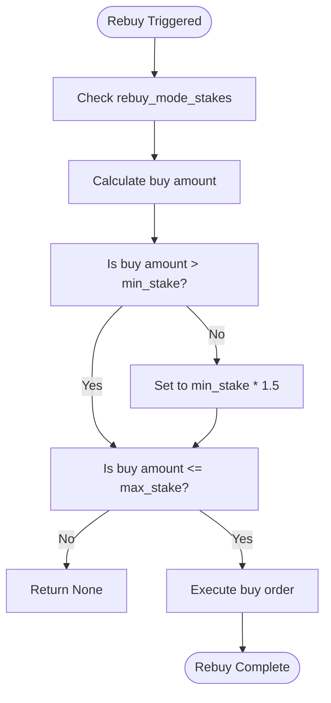

# Rebuy Long Mode

<cite>
**Referenced Files in This Document**
- [NostalgiaForInfinityX6.py](file://NostalgiaForInfinityX6.py#L40764-L40947) - long_rebuy_adjust_trade_position method
- [NostalgiaForInfinityX6.py](file://NostalgiaForInfinityX6.py#L481-L488) - Rebuy configuration parameters
- [exampleconfig-rebuy.json](file://configs/exampleconfig-rebuy.json)
</cite>

## Table of Contents
1. [Rebuy Long Mode](#rebuy-long-mode)
2. [Functionality and Purpose](#functionality-and-purpose)
3. [Entry Signal Logic and Rebuy Triggers](#entry-signal-logic-and-rebuy-triggers)
4. [Configuration Parameters](#configuration-parameters)
5. [Position Sizing and Trade Management](#position-sizing-and-trade-management)
6. [Exit Strategy Coordination](#exit-strategy-coordination)
7. [Interaction with Grinding and Derisking](#interaction-with-grinding-and-derisking)
8. [Practical Example: Volatile Sideways Market](#practical-example-volatile-sideways-market)
9. [Common Pitfalls and Risk Management](#common-pitfalls-and-risk-management)
10. [Tuning Recommendations](#tuning-recommendations)
11. [Performance Considerations](#performance-considerations)

## Functionality and Purpose

**Important Clarification**: Despite its name, the Rebuy Long Mode does NOT re-enter positions after exits. Instead, it functions as a **controlled averaging down strategy** for losing positions, adding capital when the initial position falls into loss (-8% to -10%).

The Rebuy Long Mode in the NostalgiaForInfinityX6 strategy enables the system to add to existing long positions when they enter loss territory, using strict technical indicator confirmation to identify potential reversal points. This functionality is particularly useful in volatile markets where initial entries may face temporary drawdowns before recovering. By allowing additional entries at lower prices with disciplined risk management, the strategy aims to reduce average entry price and improve the break-even point.

The rebuy mechanism implements a conservative approach with maximum 2 additional entries, using larger position sizes (1.0x initial stake) compared to grinding strategies. It is activated when the position's profit falls below negative thresholds: -8% for first rebuy, -10% for second rebuy.

**Section sources**
- [NostalgiaForInfinityX6.py](file://NostalgiaForInfinityX6.py#L40764-L40947)

## Entry Signal Logic and Rebuy Triggers

The rebuy logic is implemented in the `long_rebuy_adjust_trade_position` method. This function evaluates whether a rebuy should be executed based on several criteria, including the number of previous entries and exits, current profit, and technical indicators.

Key logic from the code:
```python
if (
    ((0 <= sub_grind_count < max_sub_grinds) and (slice_profit_entry < rebuy_mode_sub_thresholds[sub_grind_count]))
    and (
        (last_candle["RSI_3"] > 10.0)
        and (last_candle["RSI_3_15m"] > 10.0)
        and (last_candle["RSI_14"] < 40.0)
        and (last_candle["ROC_2"] > -0.0)
        and (last_candle["close"] < (last_candle["EMA_26"] * 0.988))
    )
):
```

This condition checks:
- The number of existing sub-grinds is below the maximum allowed
- The current entry profit is below the rebuy threshold
- RSI indicators are in oversold territory
- Price is below the EMA-26, indicating a potential pullback

If these conditions are met, a rebuy order is placed with a stake amount determined by the `rebuy_mode_stakes` parameter.

**Section sources**
- [NostalgiaForInfinityX6.py](file://NostalgiaForInfinityX6.py#L40764-L40947)

## Configuration Parameters

The Rebuy Long Mode is controlled by several configuration parameters that can be adjusted in the strategy settings:

- **rebuy_mode_enabled**: Enables or disables the rebuy functionality
- **rebuy_threshold**: Defines the price deviation threshold that must be exceeded to trigger a rebuy
- **rebuy_max_times**: Limits the number of times a rebuy can be executed for a single trade
- **rebuy_price_deviation**: Specifies the maximum allowable price deviation for rebuy execution
- **rebuy_mode_stakes_spot/futures**: Stake amounts for rebuy orders in spot and futures markets
- **rebuy_mode_thresholds_spot/futures**: Profit thresholds that must be breached to trigger a rebuy
- **rebuy_mode_derisk_spot/futures**: Derisk thresholds for closing positions when profit falls below a certain level

These parameters are typically set in the strategy configuration file or via the `nfi_parameters` block in the config.

**Section sources**
- [NostalgiaForInfinityX6.py](file://NostalgiaForInfinityX6.py#L2248)
- [exampleconfig-rebuy.json](file://configs/exampleconfig-rebuy.json)

## Position Sizing and Trade Management

Position sizing in Rebuy Long Mode is managed through a multiplier system. The `rebuy_mode_stake_multiplier` parameter determines the size of each rebuy relative to the initial stake. For example, a multiplier of 0.35 means each rebuy will be 35% of the original stake.

The strategy tracks the cost basis across multiple entries and adjusts position sizing accordingly. Each rebuy increases the total position size, but the average entry price is lowered, improving the overall cost basis. The system ensures that rebuy orders do not exceed the maximum allowed stake and respects minimum stake requirements.



**Diagram sources**
- [NostalgiaForInfinityX6.py](file://NostalgiaForInfinityX6.py#L40764-L40947)

**Section sources**
- [NostalgiaForInfinityX6.py](file://NostalgiaForInfinityX6.py#L40764-L40947)

## Exit Strategy Coordination

Exit strategies are coordinated across both the original and rebought portions of a position. The strategy uses a unified profit calculation that considers all filled entries and exits. When a de-risk condition is met, the system can partially or fully exit the position based on the overall profit.

The derisk logic is implemented as:
```python
if self.derisk_enable and (
    profit_stake
    < (
        slice_amount * (self.rebuy_mode_derisk_futures if self.is_futures_mode else self.rebuy_mode_derisk_spot)
    )
):
```

This condition triggers a sell order when the total profit falls below the derisk threshold, helping to protect capital in adverse market conditions.

**Section sources**
- [NostalgiaForInfinityX6.py](file://NostalgiaForInfinityX6.py#L40764-L40947)

## Interaction with Grinding and Derisking

Rebuy Long Mode works synergistically with the grinding and derisking features of the strategy:

- **Grinding**: Complements rebuy by allowing additional entries at lower prices, effectively averaging down the position. The rebuy mechanism can be seen as a form of strategic grinding after a partial exit.
- **Derisking**: Applied cumulatively across all entries. When the overall profit of the position (including rebought portions) falls below the derisk threshold, the system initiates a de-risk exit to protect capital.

The interaction between these features is managed through shared parameters and coordinated logic in the `adjust_trade_position` method, which routes calls to the appropriate adjustment function based on the trade's enter tags.

**Section sources**
- [NostalgiaForInfinityX6.py](file://NostalgiaForInfinityX6.py#L2248)
- [NostalgiaForInfinityX6.py](file://NostalgiaForInfinityX6.py#L40764-L40947)

## Practical Example: Volatile Sideways Market

Consider a scenario on Binance Futures where BTC/USDT is oscillating in a sideways range between $40,000 and $42,000:

1. The strategy enters a long position at $40,500
2. Price rises to $41,500 and the system executes a partial exit
3. Price retraces to $40,800, triggering the rebuy condition
4. The RSI-14 is below 40 and price is below EMA-26, confirming the pullback
5. A rebuy order is executed at $40,800 with a stake of 35% of the original
6. Price resumes upward movement, and the combined position achieves higher overall profitability

This example demonstrates how Rebuy Long Mode can enhance returns in range-bound markets by capitalizing on predictable price oscillations.

**Section sources**
- [NostalgiaForInfinityX6.py](file://NostalgiaForInfinityX6.py#L40764-L40947)

## Common Pitfalls and Risk Management

Common pitfalls when using Rebuy Long Mode include:

- **Chasing losses**: Executing rebuys too aggressively during strong downtrends, leading to increased losses
- **Over-concentration**: Allowing rebuys to create excessive exposure to a single asset
- **Ignoring market context**: Failing to account for broader market conditions that may invalidate the rebuy thesis

Risk management measures include:
- Setting appropriate rebuy thresholds to avoid premature entries
- Limiting the number of rebuy attempts
- Using derisking to protect profits
- Monitoring overall portfolio exposure

**Section sources**
- [NostalgiaForInfinityX6.py](file://NostalgiaForInfinityX6.py#L40764-L40947)

## Tuning Recommendations

To optimize Rebuy Long Mode performance:

- **Rebuy window duration**: Set based on the asset's volatility. More volatile assets may require shorter windows (e.g., 30-60 minutes), while less volatile assets can use longer windows (e.g., 2-4 hours).
- **Deviation limits**: Adjust based on historical price action. Typical values range from 8-12% for spot markets and 6-10% for futures.
- **Stake multipliers**: Start with conservative values (0.25-0.35) and increase only after thorough backtesting.
- **Indicator thresholds**: Fine-tune RSI and EMA parameters based on the asset's behavior.

Regular backtesting across different market conditions is essential to find optimal parameter values.

**Section sources**
- [NostalgiaForInfinityX6.py](file://NostalgiaForInfinityX6.py#L40764-L40947)
- [exampleconfig-rebuy.json](file://configs/exampleconfig-rebuy.json)

## Performance Considerations

Performance considerations for Rebuy Long Mode include:

- **Cost basis tracking**: The system must accurately track the average entry price across multiple buys, which requires careful calculation of weighted averages.
- **Trade frequency**: Rebuy logic can increase trade frequency, potentially leading to higher fees. This should be factored into profit calculations.
- **Computational overhead**: The rebuy conditions require additional indicator calculations, which may impact performance on lower-end hardware.
- **Slippage management**: Rebuy orders should be placed with appropriate slippage limits to avoid unfavorable fills.

The strategy includes optimizations such as caching profit calculations and using efficient data structures to minimize performance impact.

**Section sources**
- [NostalgiaForInfinityX6.py](file://NostalgiaForInfinityX6.py#L40764-L40947)