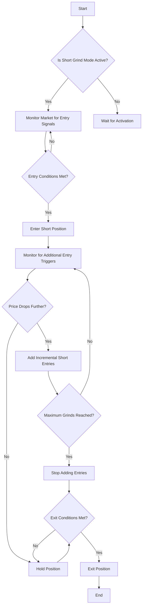

# Short Grind Mode

<cite>
**Referenced Files in This Document**   
- [NostalgiaForInfinityX6.py](file://NostalgiaForInfinityX6.py)
</cite>

## Table of Contents
1. [Introduction](#introduction)
2. [Short Grind Mode Overview](#short-grind-mode-overview)
3. [Entry Logic and Trigger Conditions](#entry-logic-and-trigger-conditions)
4. [Position Scaling and Incremental Entries](#position-scaling-and-incremental-entries)
5. [Configuration Parameters](#configuration-parameters)
6. [Risk Management and Derisking](#risk-management-and-derisking)
7. [Spot vs. Futures Market Behavior](#spot-vs-futures-market-behavior)
8. [Common Pitfalls and Mitigation Strategies](#common-pitfalls-and-mitigation-strategies)
9. [Conclusion](#conclusion)

## Introduction
The Short Grind Mode is a dynamic trading strategy implemented within the NostalgiaForInfinityX6 trading bot. It is designed to improve average entry prices during sustained downtrends by executing incremental short entries as the price declines. This approach allows traders to scale into positions gradually, reducing the risk of entering at a local high and improving overall profitability when the downtrend continues. The strategy is particularly effective in volatile markets where sharp price drops are common.

**Section sources**
- [NostalgiaForInfinityX6.py](file://NostalgiaForInfinityX6.py#L158)

## Short Grind Mode Overview
The Short Grind Mode is a specialized trading mode that focuses on shorting assets during downtrends. It uses a series of predefined conditions to determine when to enter and exit trades, with the goal of maximizing profits while minimizing risk. The strategy is based on the principle of averaging down, where additional positions are opened as the price moves in the desired direction. This allows the trader to lower the average entry price and increase the potential for profit.

The mode is activated by specific tags in the trading configuration, such as "620" for the short grind mode. Once activated, the strategy will monitor the market for entry signals based on a combination of technical indicators and price action. The entry conditions are designed to ensure that the trade is only taken when there is a high probability of a continued downtrend.

**Diagram sources**
- [NostalgiaForInfinityX6.py](file://NostalgiaForInfinityX6.py#L158)

## Entry Logic and Trigger Conditions
The entry logic for the Short Grind Mode is defined in the `short_grind_entry` and `short_grind_entry_v2` functions within the NostalgiaForInfinityX6.py file. These functions evaluate a series of technical indicators and market conditions to determine whether an entry signal is present.

The primary entry conditions include:
- RSI_14 > 64.0
- RSI_3 < 90.0
- RSI_3_15m < 90.0
- AROOND_14 < 25.0
- STOCHRSIk_14_14_3_3_1h > 30.0
- STOCHRSIk_14_14_3_3_4h > 30.0
- Close > (EMA_16 * 1.012)

These conditions are designed to identify overbought conditions in the market, which are often followed by price corrections. The strategy also includes additional conditions for different market timeframes, such as 15m, 1h, and 4h, to ensure that the entry signal is confirmed across multiple timeframes.

The `short_grind_entry_v2` function includes additional conditions that are more stringent, such as:
- RSI_14 > 54.0
- ROC_2_1h < 10.0
- ROC_2_4h < 10.0
- Close < (close_min_48 * 1.10)
- Close > (EMA_16 * 1.032)

These conditions are designed to filter out false signals and ensure that the trade is only taken when there is a high probability of a continued downtrend.

**Section sources**
- [NostalgiaForInfinityX6.py](file://NostalgiaForInfinityX6.py#L61659-L61758)
- [NostalgiaForInfinityX6.py](file://NostalgiaForInfinityX6.py#L59329-L59428)

## Position Scaling and Incremental Entries
The Short Grind Mode uses a position scaling strategy to add incremental entries as the price declines. This is achieved through the use of predefined stake multipliers and thresholds. The strategy allows for multiple grinds, each with its own stake size and entry threshold.

The position scaling is controlled by the following parameters:
- `grind_mode_stake_multiplier_spot`: Stake multipliers for spot markets
- `grind_mode_stake_multiplier_futures`: Stake multipliers for futures markets
- `grind_mode_max_slots`: Maximum number of grinds allowed

The stake multipliers determine the size of each incremental entry. For example, if the first entry is 1.0, the second entry might be 0.3, the third 0.4, and so on. This allows the trader to scale into the position gradually, reducing the risk of entering at a local high.

The entry thresholds are defined by the `grind_1_sub_thresholds_spot` and `grind_1_sub_thresholds_futures` parameters. These thresholds determine how far the price must drop before an additional entry is made. For example, if the first entry is made at a price of 100, the second entry might be made at 95, the third at 90, and so on.

The maximum number of grinds is controlled by the `grind_mode_max_slots` parameter. Once this limit is reached, no further entries will be made, regardless of how far the price drops.

**Section sources**
- [NostalgiaForInfinityX6.py](file://NostalgiaForInfinityX6.py#L7732)
- [NostalgiaForInfinityX6.py](file://NostalgiaForInfinityX6.py#L58080)

## Configuration Parameters
The Short Grind Mode is highly configurable, with a range of parameters that can be adjusted to suit different market conditions and trading styles. The key configuration parameters include:

- `short_grind_step_threshold`: The price threshold that must be met before an additional entry is made.
- `short_grind_max_grinds`: The maximum number of incremental entries allowed.
- `short_grind_exit_delay`: The delay before an exit signal is acted upon.

These parameters can be adjusted in the trading configuration file to optimize the strategy for different market conditions. For example, in a highly volatile market, the `short_grind_step_threshold` might be set to a lower value to allow for more frequent entries. In a less volatile market, the threshold might be set higher to reduce the number of entries.

The `short_grind_max_grinds` parameter is particularly important, as it determines the maximum number of incremental entries that can be made. This parameter should be set based on the trader's risk tolerance and the available capital. A higher value allows for more entries, but also increases the risk of overexposure.

The `short_grind_exit_delay` parameter is used to prevent premature exits in response to short-term price fluctuations. By introducing a delay, the strategy can avoid exiting a position during a temporary price rebound, allowing the trade to continue if the downtrend resumes.

**Section sources**
- [NostalgiaForInfinityX6.py](file://NostalgiaForInfinityX6.py#L158)
- [NostalgiaForInfinityX6.py](file://NostalgiaForInfinityX6.py#L7732)

## Risk Management and Derisking
Risk management is a critical component of the Short Grind Mode. The strategy includes several mechanisms to control risk and protect against large losses. These include stop-loss orders, position sizing, and derisking triggers.

The stop-loss is defined by the `stoploss` parameter, which is set to -0.99 by default. This means that if the price moves against the position by 99%, the trade will be automatically closed to prevent further losses. While this is an extreme value, it allows the strategy to remain flexible and adapt to different market conditions.

Position sizing is controlled by the stake multipliers and thresholds discussed earlier. By scaling into the position gradually, the strategy reduces the risk of entering at a local high and increases the potential for profit.

Derisking triggers are used to reduce the position size when certain conditions are met. For example, if the price moves in the desired direction by a certain amount, the strategy may close a portion of the position to lock in profits. This is controlled by the `derisk_enable` parameter, which can be set to true or false depending on the trader's risk tolerance.

The strategy also includes a `grinding_enable` parameter, which allows the trader to disable the grinding feature if desired. This can be useful in markets where the price is moving too quickly for the strategy to keep up.

**Section sources**
- [NostalgiaForInfinityX6.py](file://NostalgiaForInfinityX6.py#L158)
- [NostalgiaForInfinityX6.py](file://NostalgiaForInfinityX6.py#L61659-L61758)

## Spot vs. Futures Market Behavior
The Short Grind Mode behaves differently in spot and futures markets due to the differences in margin efficiency and liquidation risks. In spot markets, the trader must have the full amount of capital available to open a position. This means that the position size is limited by the available capital, and there is no risk of liquidation.

In futures markets, the trader can use leverage to open larger positions with a smaller amount of capital. This increases the potential for profit, but also increases the risk of liquidation. If the price moves against the position by a certain amount, the position may be automatically closed to prevent further losses.

The strategy accounts for these differences by using different stake multipliers and thresholds for spot and futures markets. For example, the `grind_mode_stake_multiplier_futures` parameter is typically set to a lower value than the `grind_mode_stake_multiplier_spot` parameter to reduce the risk of overexposure in futures markets.

The strategy also includes a `futures_mode_leverage` parameter, which determines the amount of leverage used in futures markets. This parameter can be adjusted to suit the trader's risk tolerance and the market conditions.

**Section sources**
- [NostalgiaForInfinityX6.py](file://NostalgiaForInfinityX6.py#L158)
- [NostalgiaForInfinityX6.py](file://NostalgiaForInfinityX6.py#L61659-L61758)

## Common Pitfalls and Mitigation Strategies
One of the main pitfalls of the Short Grind Mode is the risk of "catching a falling knife" in a reversal scenario. This occurs when the price appears to be in a downtrend, but then suddenly reverses and moves sharply in the opposite direction. If the strategy has scaled into a short position, this can result in large losses.

To mitigate this risk, the strategy includes several filters to confirm the trend before entering a trade. These include the RSI, ROC, and AROON indicators, which are designed to identify overbought conditions and confirm the presence of a downtrend.

Another common pitfall is overexposure, where the strategy opens too many positions and becomes overleveraged. This can be mitigated by setting appropriate limits on the number of grinds and the size of each entry. The `grind_mode_max_slots` parameter can be used to limit the number of incremental entries, while the stake multipliers can be adjusted to control the size of each entry.

Finally, the strategy includes a `hold_support_enabled` parameter, which allows the trader to pause the strategy during periods of high volatility or uncertainty. This can be useful in preventing trades during news events or other market disruptions.

**Section sources**
- [NostalgiaForInfinityX6.py](file://NostalgiaForInfinityX6.py#L158)
- [NostalgiaForInfinityX6.py](file://NostalgiaForInfinityX6.py#L61659-L61758)

## Conclusion
The Short Grind Mode is a powerful trading strategy that can be used to improve average entry prices during sustained downtrends. By scaling into positions gradually, the strategy reduces the risk of entering at a local high and increases the potential for profit. The strategy is highly configurable, with a range of parameters that can be adjusted to suit different market conditions and trading styles.

However, like any trading strategy, the Short Grind Mode is not without risks. Traders must be aware of the potential for large losses, particularly in reversal scenarios, and take steps to mitigate these risks through the use of trend confirmation filters and position sizing controls. With careful management, the Short Grind Mode can be a valuable tool in any trader's arsenal.