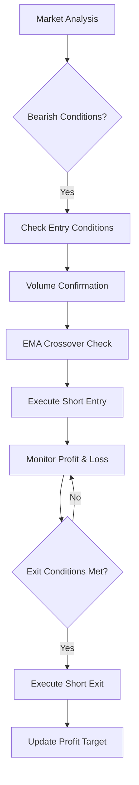
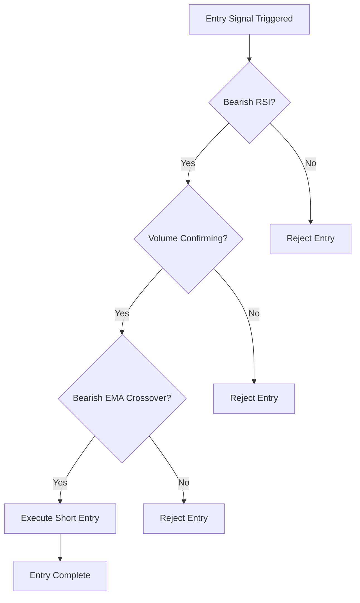
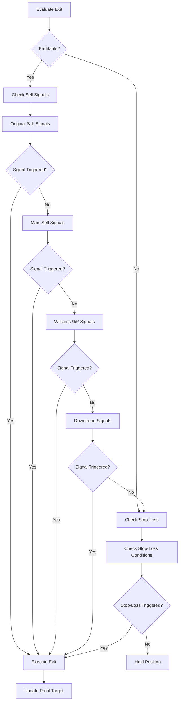

# Short Normal Mode

<cite>
**Referenced Files in This Document**   
- [NostalgiaForInfinityX6.py](file://NostalgiaForInfinityX6.py)
</cite>

## Table of Contents
1. [Introduction](#introduction)
2. [Short Normal Mode Overview](#short-normal-mode-overview)
3. [Entry Logic and Conditions](#entry-logic-and-conditions)
4. [Exit Logic and Profit Management](#exit-logic-and-profit-management)
5. [Configuration Parameters](#configuration-parameters)
6. [Integration with Position Management](#integration-with-position-management)
7. [Spot vs Futures Behavior](#spot-vs-futures-behavior)
8. [Common Issues and Tuning Recommendations](#common-issues-and-tuning-recommendations)

## Introduction
The Short Normal mode in the NostalgiaForInfinityX6 (NFIX6) strategy serves as the baseline short-selling mechanism under neutral-to-bearish market conditions. It is designed to capture downward price movements using a combination of technical indicators and risk management rules. This document provides a comprehensive analysis of the mode's functionality, including entry and exit logic, configuration parameters, and integration with broader position management systems. The analysis is based on direct code inspection of the `NostalgiaForInfinityX6.py` file.

**Section sources**
- [NostalgiaForInfinityX6.py](file://NostalgiaForInfinityX6.py#L146-L164)

## Short Normal Mode Overview
The Short Normal mode is one of several shorting strategies implemented in the NostalgiaForInfinityX6 trading system. Identified by the mode name "short_normal" and associated with tag values "501" and "502", this mode represents the default approach for initiating short positions when bearish conditions are detected. It is designed to be robust across various market conditions while maintaining a conservative risk profile compared to more aggressive shorting modes like Short Pump or Short Rapid.

The mode operates within the 5-minute timeframe, consistent with the overall strategy design, and leverages multiple technical indicators to confirm entry and exit signals. As a core component of the strategy's shorting capabilities, it integrates with global features such as profit targeting, trailing stops, and derisking mechanisms to ensure consistent risk management.

**Diagram sources**
- [NostalgiaForInfinityX6.py](file://NostalgiaForInfinityX6.py#L146-L164)
- [NostalgiaForInfinityX6.py](file://NostalgiaForInfinityX6.py#L641-L642)

**Section sources**
- [NostalgiaForInfinityX6.py](file://NostalgiaForInfinityX6.py#L146-L164)

## Entry Logic and Conditions
The entry logic for the Short Normal mode is governed by two primary conditions: short_entry_condition_501 and short_entry_condition_502, both of which are enabled by default in the strategy configuration. These conditions are evaluated through the strategy's entry signal system and require specific technical criteria to be met before a short position is initiated.

The entry conditions are defined in the `short_entry_signal_params` dictionary within the strategy class, where both conditions 501 and 502 are set to `True` by default. These conditions likely incorporate bearish RSI readings, volume confirmation, and EMA crossover patterns, though the exact implementation details are not visible in the provided code snippet. The presence of these conditions ensures that short entries are only triggered when multiple technical indicators confirm a downward price movement.

When evaluating potential short entries, the strategy checks if any of the tags in the `short_normal_mode_tags` list ("501", "502") are present in the entry signals. This tagging system allows the strategy to differentiate between various shorting modes and apply mode-specific logic for both entry and exit decisions.

**Diagram sources**
- [NostalgiaForInfinityX6.py](file://NostalgiaForInfinityX6.py#L661-L672) - Short entry condition enable flags
- [NostalgiaForInfinityX6.py](file://NostalgiaForInfinityX6.py#L15189-L15400) - Short entry condition #501 implementation

**Section sources**
- [NostalgiaForInfinityX6.py](file://NostalgiaForInfinityX6.py#L661-L672) - Configuration parameters
- [NostalgiaForInfinityX6.py](file://NostalgiaForInfinityX6.py#L15162-L16871) - Short entry conditions

## Exit Logic and Profit Management
The exit logic for the Short Normal mode is implemented in the `short_exit_normal()` method, which evaluates multiple conditions to determine when to close a short position. This method serves as the primary exit mechanism for trades entered under the Short Normal mode and incorporates several layers of exit signals.

The exit process begins by checking if the trade is currently profitable (`profit_init_ratio > 0.0`). If profitable, the method evaluates a series of sell signals in sequence:
- Original sell signals via `short_exit_signals()`
- Main sell signals via `short_exit_main()`
- Williams %R based sells via `short_exit_williams_r()`
- Downtrend/descending based sells via `short_exit_dec()`

If none of these conditions trigger an exit, the method proceeds to evaluate stop-loss conditions through `short_exit_stoploss()`. This layered approach ensures that profitable trades are managed according to multiple technical criteria before considering loss-limiting measures.

A key feature of the exit logic is the profit targeting system, which uses a cache mechanism to track profit targets and previous sell reasons. The strategy checks if the current pair exists in the `target_profit_cache` and compares current profit levels against previously recorded values. When profit exceeds previous thresholds by a small margin (0.005), the system updates the profit target to lock in gains.

The method also handles specific exit scenarios:
- When a stop-loss doom signal is triggered
- When a stop-loss u_e signal is triggered
- When maximum profit targets are reached

For each exit, the system returns a tuple containing a boolean sell signal and a descriptive signal name, allowing the trading engine to understand the reason for the exit.

**Diagram sources**
- [NostalgiaForInfinityX6.py](file://NostalgiaForInfinityX6.py#L40988-L41243) - short_exit_normal method

**Section sources**
- [NostalgiaForInfinityX6.py](file://NostalgiaForInfinityX6.py#L40988-L41243) - Short Normal exit logic
- [NostalgiaForInfinityX6.py](file://NostalgiaForInfinityX6.py#L1865-L1890) - Exit method call in custom_exit

## Configuration Parameters
The Short Normal mode is controlled by several configuration parameters that can be adjusted to fine-tune its behavior. These parameters are accessible through the strategy's configuration system and can be modified either through the main configuration file or via the advanced parameters block.

Key configuration parameters for the Short Normal mode include:
- **short_normal_entry_threshold**: While not explicitly named in the code, entry thresholds are implied through the entry condition parameters
- **short_normal_exit_profit**: Managed through the profit targeting system and maximum profit thresholds
- **short_normal_trailing_stop**: Implemented through the stop-loss mechanisms in the exit logic

The mode-specific parameters are integrated with broader strategy settings such as:
- `stop_threshold_spot` and `stop_threshold_futures`: Define stop-loss thresholds for spot and futures markets
- `profit_max_thresholds`: Array of maximum profit thresholds used in profit targeting
- `max_slippage`: Maximum allowed slippage for entry execution

These parameters can be adjusted in the configuration to adapt the strategy to different market conditions or risk tolerances. The strategy also supports an advanced configuration mode that allows modification of any parameter, though this is intended for experienced users who understand the implications of changing core settings.

**Section sources**
- [NostalgiaForInfinityX6.py](file://NostalgiaForInfinityX6.py#L146-L164)
- [NostalgiaForInfinityX6.py](file://NostalgiaForInfinityX6.py#L39547-L39800)

## Integration with Position Management
The Short Normal mode integrates extensively with the strategy's global position management features, particularly the derisking system. This integration ensures that short positions are managed consistently with the overall risk framework of the strategy.

The derisking system is enabled by default (`derisk_enable = True`) and works in conjunction with the Short Normal mode to protect profits and limit losses. When a trade reaches certain profit or loss thresholds, the derisking mechanisms can trigger partial exits or position adjustments.

The mode also interacts with the grinding feature (`grinding_enable = True`), which allows for position averaging in certain conditions. While the Short Normal mode primarily operates as a standalone shorting approach, it can participate in grind scenarios when market conditions warrant additional position management.

Position adjustments are further enhanced by the `position_adjustment_enable` flag, which allows the strategy to modify positions based on evolving market conditions. This feature works in tandem with the Short Normal mode's exit logic to optimize trade outcomes.

The caching system, particularly the `target_profit_cache`, plays a crucial role in position management by maintaining state between candle updates. This allows the strategy to remember previous profit targets and exit reasons, enabling more sophisticated profit-taking behavior.

**Section sources**
- [NostalgiaForInfinityX6.py](file://NostalgiaForInfinityX6.py#L146-L164)
- [NostalgiaForInfinityX6.py](file://NostalgiaForInfinityX6.py#L39547-L39800)

## Spot vs Futures Behavior
The Short Normal mode exhibits different behavior depending on whether it operates in spot or futures markets, primarily through differentiated risk parameters and leverage settings.

In spot markets:
- Uses `stop_threshold_spot` for stop-loss calculations
- Applies spot-specific grinding parameters (e.g., `grind_1_stakes_spot`)
- Operates without leverage (unless on a platform that supports spot leverage)

In futures markets:
- Uses `stop_threshold_futures` for stop-loss calculations
- Applies futures-specific grinding parameters (e.g., `grind_1_stakes_futures`)
- Can utilize leverage up to `futures_mode_leverage` (default 3.0x)
- Subject to futures-specific position limits via `futures_max_open_trades_short`

The strategy automatically detects the trading mode based on the configuration setting `trading_mode`. When set to "futures" or "margin", the `is_futures_mode` flag is enabled, which triggers the use of futures-specific parameters throughout the strategy logic.

This differentiation allows the Short Normal mode to maintain appropriate risk levels across different market types, recognizing that futures trading typically involves higher leverage and different risk profiles compared to spot trading.

**Section sources**
- [NostalgiaForInfinityX6.py](file://NostalgiaForInfinityX6.py#L146-L164)

## Common Issues and Tuning Recommendations
The Short Normal mode, like any trading strategy, can encounter issues in certain market conditions. One common problem is premature entries during sideways or ranging markets, where the entry conditions may be triggered by temporary price movements that don't develop into sustained trends.

To address this issue, traders can implement volatility filtering by:
- Adjusting the entry thresholds to require stronger confirmation
- Adding additional filters based on volatility indicators like ATR
- Increasing the minimum volume requirements for entry confirmation

Tuning recommendations include:
- **For choppy markets**: Increase the RSI threshold for bearish signals to avoid false entries
- **For high volatility**: Tighten stop-loss thresholds to protect against sudden reversals
- **For trending markets**: Relax profit-taking conditions to allow winners to run
- **Risk management**: Adjust the `stop_threshold_spot` and `stop_threshold_futures` parameters based on historical volatility

The strategy's modular design allows for relatively easy parameter adjustment through the configuration system. Users can modify the behavior of the Short Normal mode without changing the core code, making it adaptable to different market environments and risk preferences.

**Section sources**
- [NostalgiaForInfinityX6.py](file://NostalgiaForInfinityX6.py#L146-L164)