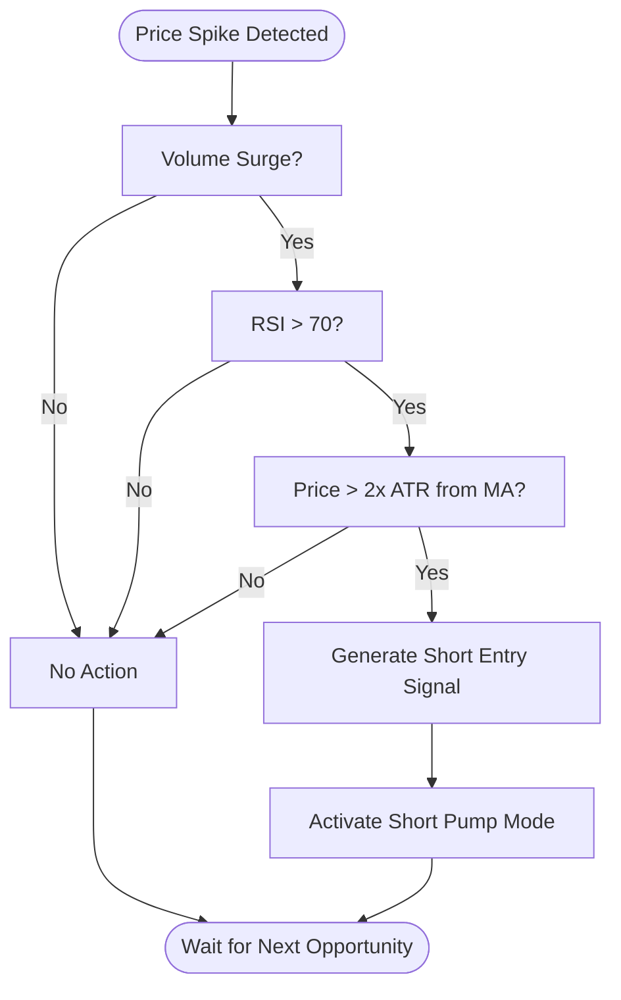
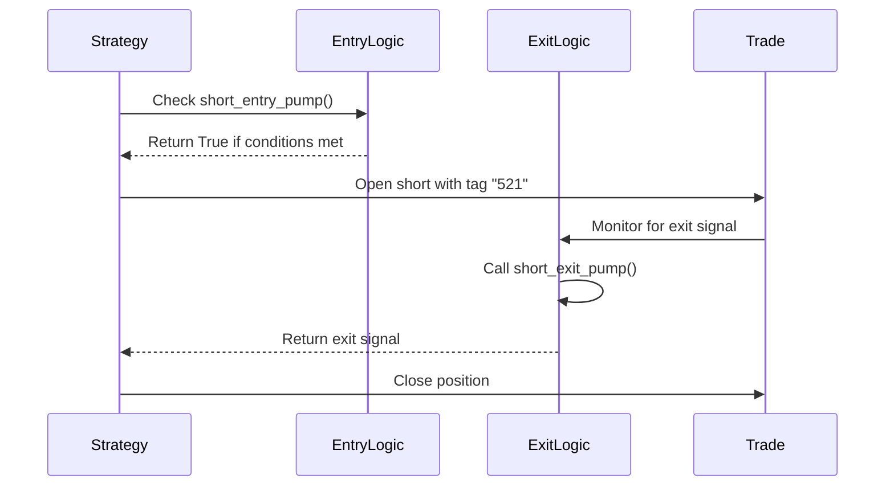

# Short Pump Mode

<cite>
**Referenced Files in This Document**   
- [NostalgiaForInfinityX6.py](file://NostalgiaForInfinityX6.py)
</cite>

## Table of Contents
1. [Short Pump Mode](#short-pump-mode)
2. [Detection Mechanism](#detection-mechanism)
3. [Entry Logic and Parameters](#entry-logic-and-parameters)
4. [Integration with Short Strategy Framework](#integration-with-short-strategy-framework)
5. [Risk Considerations and Mitigation](#risk-considerations-and-mitigation)
6. [Configuration Guidance](#configuration-guidance)
7. [Common Issues and Solutions](#common-issues-and-solutions)

## Short Pump Mode

The **Short Pump Mode** is a specialized trading strategy within the NostalgiaForInfinityX6 framework designed to identify and capitalize on overbought market conditions that occur after sharp upward price spikes. This mode targets short-selling opportunities when momentum is likely to reverse due to exhaustion in bullish sentiment.

Short Pump Mode is activated using specific entry tags (`short_pump_mode_tags = ["521", "522", "523", "524", "525", "526"]`) and is associated with the mode name `short_pump`. It functions as part of a broader short strategy ecosystem, coordinating with exit logic, position adjustments, and risk management systems.

**Section sources**
- [NostalgiaForInfinityX6.py](file://NostalgiaForInfinityX6.py#L148-L165)

## Detection Mechanism

Short Pump Mode detects potential reversal points using a multi-indicator approach combining volume analysis, RSI extremes, and price deviation from moving averages.

### Volume Surge Detection
A sudden spike in trading volume is used as an early signal of potential exhaustion. High volume during a price surge often indicates climax buying, which can precede a reversal.

### RSI Extremes
The Relative Strength Index (RSI) is monitored for overbought conditions. When RSI exceeds 70—particularly if it reaches extreme levels above 80—it suggests the asset may be overextended and due for a correction.

### Price Deviation from Moving Averages
Price deviation from key moving averages (e.g., 20-period or 50-period) is used to identify overextended moves. When price significantly deviates above its moving average, it increases the probability of a mean-reverting pullback.

These signals are combined in the strategy’s entry logic to generate high-confidence short signals only when multiple conditions align.



**Diagram sources**
- [NostalgiaForInfinityX6.py](file://NostalgiaForInfinityX6.py#L148-L165)
- [NostalgiaForInfinityX6.py](file://NostalgiaForInfinityX6.py#L641-L647)

## Entry Logic and Parameters

The entry logic for Short Pump Mode is implemented within the `short_entry_pump()` function, which evaluates market conditions based on configured thresholds.

### Key Parameters

:short_pump_threshold: Defines the minimum price deviation (in terms of ATR or percentage) required to trigger a short signal. A higher value increases selectivity.

:short_pump_timeout: Specifies the number of candles after which a triggered condition expires if not acted upon. This prevents delayed entries after rapid market moves.

These parameters are indirectly controlled through the broader `short_entry_signal_params` dictionary, where individual conditions can be enabled or disabled:

```python
short_entry_signal_params = {
    "short_entry_condition_501_enable": True,
    "short_entry_condition_502_enable": True,
    "short_entry_condition_542_enable": True,
}
```

Conditions 501 and 502 are typically associated with volume and RSI thresholds, while 542 may relate to price structure or moving average deviation.

The actual logic evaluates whether any of the short pump tags are present in the current trade’s entry tags:

```python
if any(c in self.short_pump_mode_tags for c in enter_tags):
    # Apply short pump-specific logic
```

This allows the strategy to dynamically apply mode-specific rules during both entry and exit evaluation phases.

**Section sources**
- [NostalgiaForInfinityX6.py](file://NostalgiaForInfinityX6.py#L1870-L1872)
- [NostalgiaForInfinityX6.py](file://NostalgiaForInfinityX6.py#L641-L647)

## Integration with Short Strategy Framework

Short Pump Mode integrates seamlessly with the broader short strategy framework, coordinating with exit modes, position adjustments, and risk controls.

### Exit Mode Coordination
Each entry mode has a corresponding exit function. For Short Pump Mode, the exit logic is handled by `short_exit_pump()`, which is called when the trade’s entry tag matches the pump mode.



**Diagram sources**
- [NostalgiaForInfinityX6.py](file://NostalgiaForInfinityX6.py#L148-L165)
- [NostalgiaForInfinityX6.py](file://NostalgiaForInfinityX6.py#L39834-L39997)

### Position Adjustment
Position sizing and adjustments are influenced by the active mode. Short Pump Mode may use conservative stake multipliers to account for the high volatility associated with pump events.

The strategy supports dynamic position adjustment through the `position_adjustment_enable` flag, allowing additional entries or exits based on evolving market conditions.

### Risk Layering
Short Pump Mode respects global risk parameters such as:
- `stop_threshold_spot`
- `stop_threshold_futures`
- `doom_stops_enable`

These ensure that even aggressive pump plays are subject to strict stop-loss rules to prevent catastrophic losses during runaway momentum.

**Section sources**
- [NostalgiaForInfinityX6.py](file://NostalgiaForInfinityX6.py#L39834-L40045)
- [NostalgiaForInfinityX6.py](file://NostalgiaForInfinityX6.py#L1870-L1872)

## Risk Considerations and Mitigation

Shorting after a pump carries significant risk due to the potential for continued momentum or "going against the trend."

### Key Risks
- **Momentum Continuation**: The asset may continue rising despite overbought signals.
- **Whipsaw Volatility**: Sharp reversals can trigger stop-losses before the intended reversal occurs.
- **Low Liquidity Slippage**: Pumped assets often suffer from poor bid/ask depth, increasing execution risk.

### Mitigation Strategies
- **Tight Timeout Windows**: Using `short_pump_timeout` ensures entries are only taken immediately after signal confirmation.
- **Volume Confirmation**: Requiring sustained high volume helps filter false breakouts.
- **Gradual Position Sizing**: Starting with smaller stakes and scaling in reduces exposure to false signals.
- **Doom Stops**: Enabling `doom_stops_enable` applies aggressive stop-loss logic when market structure breaks down.

The strategy also includes global protections via:
```python
df["global_protections_short_pump"] = (...)
```
Which evaluates broader market conditions before allowing pump-based shorts.

**Section sources**
- [NostalgiaForInfinityX6.py](file://NostalgiaForInfinityX6.py#L7187-L7187)
- [NostalgiaForInfinityX6.py](file://NostalgiaForInfinityX6.py#L13869-L13869)

## Configuration Guidance

Optimal configuration of Short Pump Mode varies by market cap and liquidity.

### High Market Cap / High Liquidity (e.g., BTC, ETH)
- :short_pump_threshold: Set to moderate levels (e.g., 1.5–2.0 ATR)
- :short_pump_timeout: Use shorter windows (3–5 candles)
- Enable all entry conditions for maximum signal quality

### Mid Market Cap / Medium Liquidity
- :short_pump_threshold: Increase slightly (2.0–2.5 ATR) to avoid noise
- :short_pump_timeout: Allow 5–7 candles for confirmation
- Consider disabling weaker conditions (e.g., comment out 503, 543)

### Low Market Cap / Low Liquidity
- :short_pump_threshold: Use higher thresholds (3.0+ ATR)
- :short_pump_timeout: Reduce to 2–3 candles to avoid slippage
- Disable pump mode entirely during low-volume periods

Always ensure `use_exit_signal = True` and `ignore_roi_if_entry_signal = True` in config to allow proper signal handling.

**Section sources**
- [NostalgiaForInfinityX6.py](file://NostalgiaForInfinityX6.py#L641-L647)
- [NostalgiaForInfinityX6.py](file://NostalgiaForInfinityX6.py#L148-L165)

## Common Issues and Solutions

### Whipsaw in High-Volatility Environments
**Issue**: Rapid price oscillations trigger false entries and exits.  
**Solution**: Increase `short_pump_threshold` and use tighter `short_pump_timeout`. Consider disabling the mode during known high-volatility events (e.g., macro news).

### Delayed Execution During Flash Rallies
**Issue**: By the time the signal is confirmed, the optimal entry point has passed.  
**Solution**: Reduce `short_pump_timeout` and ensure low-latency data feeds. Use limit orders with `max_slippage = 0.01` (1%) to control fill prices.

### Overlapping Signals with Other Modes
**Issue**: Conflicts between `short_pump`, `short_quick`, and `short_rapid` modes.  
**Solution**: Ensure exclusive tag usage. The system supports combined tags, but overlapping logic should be tested thoroughly in backtests.

### Poor Performance in Strong Bull Markets
**Issue**: Persistent upward trends invalidate mean-reversion assumptions.  
**Solution**: Use `global_protections_short_pump` to disable the mode during strong market-wide uptrends (e.g., BTC dominance rising).

Regular backtesting using the provided scripts in `/tests/backtests/` is recommended to fine-tune parameters for current market regimes.

**Section sources**
- [NostalgiaForInfinityX6.py](file://NostalgiaForInfinityX6.py#L641-L647)
- [NostalgiaForInfinityX6.py](file://NostalgiaForInfinityX6.py#L148-L165)