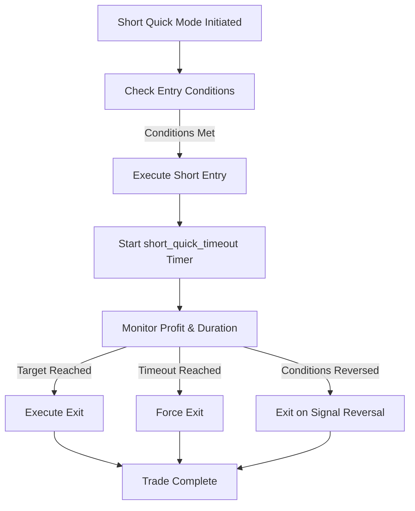
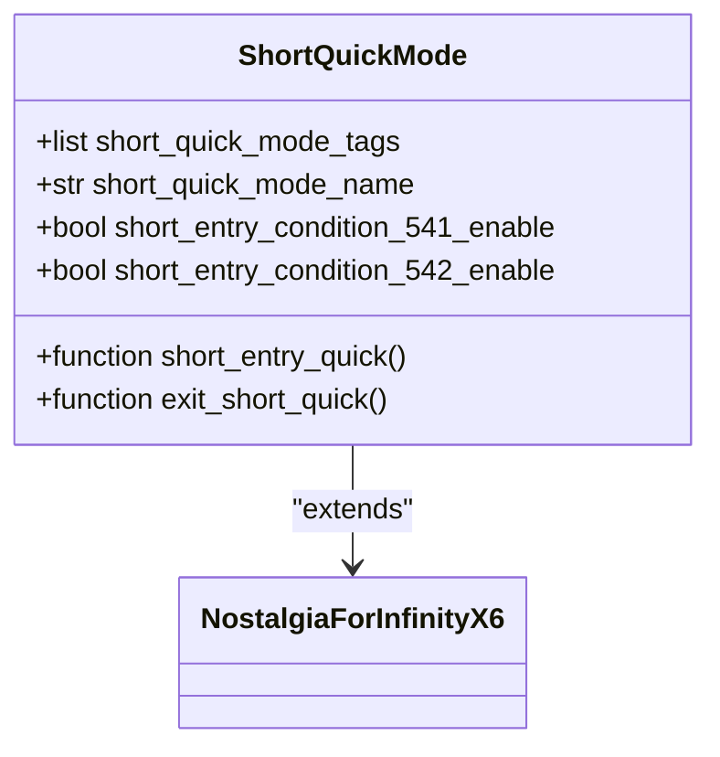
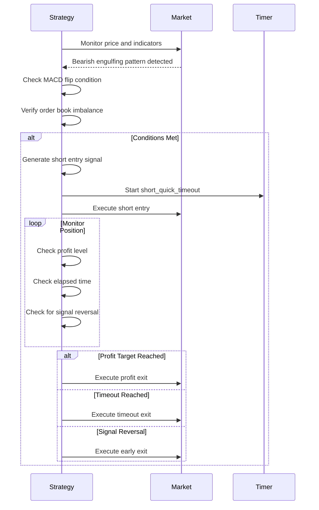
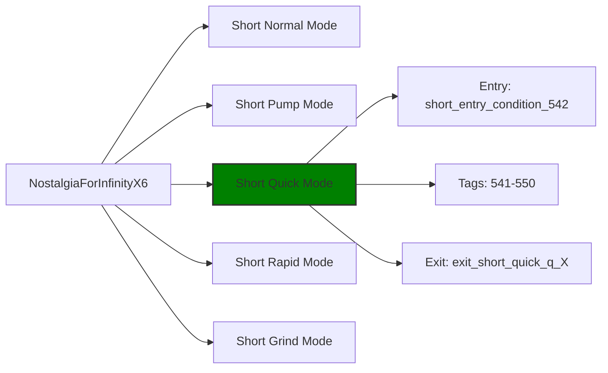

# Short Quick Mode

<cite>
**Referenced Files in This Document**   
- [NostalgiaForInfinityX6.py](file://NostalgiaForInfinityX6.py)
</cite>

## Table of Contents
1. [Introduction](#introduction)
2. [Short Quick Mode Overview](#short-quick-mode-overview)
3. [Signal Generation Logic](#signal-generation-logic)
4. [Configuration Parameters](#configuration-parameters)
5. [Entry and Exit Mechanisms](#entry-and-exit-mechanisms)
6. [Integration with Other Short Modes](#integration-with-other-short-modes)
7. [Performance Considerations](#performance-considerations)
8. [Troubleshooting Guide](#troubleshooting-guide)

## Introduction
The Short Quick Mode is a specialized trading strategy within the NostalgiaForInfinityX6 framework designed to capture rapid bearish reversals in short timeframes. This mode is optimized for fast execution and tight profit targets, making it ideal for traders seeking to exploit brief downside momentum in volatile markets. The strategy leverages technical indicators, candlestick patterns, and order book dynamics to generate high-confidence short signals.

**Section sources**
- [NostalgiaForInfinityX6.py](file://NostalgiaForInfinityX6.py#L150-L166)

## Short Quick Mode Overview
Short Quick Mode is one of several shorting strategies in the NostalgiaForInfinityX6 system, specifically tailored for capturing rapid price declines. It operates on a 5-minute timeframe and is designed to enter and exit positions quickly, typically within a few candles. The mode is identified by its unique tag system, with entry tags ranging from "541" to "550".

This mode is particularly effective in high-volatility environments where bearish reversals occur suddenly and with significant momentum. The strategy is designed to be aggressive in its entry timing but conservative in its profit targets, aiming for quick wins rather than extended holds.



**Diagram sources**
- [NostalgiaForInfinityX6.py](file://NostalgiaForInfinityX6.py#L150-L166)

**Section sources**
- [NostalgiaForInfinityX6.py](file://NostalgiaForInfinityX6.py#L150-L166)

## Signal Generation Logic
The signal generation for Short Quick Mode is based on a combination of technical indicators and market structure analysis. The primary entry condition (short_entry_condition_541) is currently disabled by default in the configuration, while short_entry_condition_542 is enabled.

The strategy evaluates multiple factors including:
- Bearish candlestick patterns (such as bearish engulfing)
- MACD flips indicating momentum shift
- Order book imbalances showing increased sell pressure
- Price action relative to key moving averages

The entry logic is implemented through the `short_entry_quick()` function, which analyzes the current market conditions and determines whether the criteria for a quick short entry are met. The function checks for specific tag combinations and indicator configurations before generating a signal.

```python
# Pseudocode representation of the entry logic
def short_entry_quick(dataframe, previous_enter_tags):
    if not self.short_entry_signal_params['short_entry_condition_542_enable']:
        return False, None
    
    # Check for bearish engulfing pattern
    bearish_engulfing = (dataframe['close'].shift(1) < dataframe['open'].shift(1)) & \
                        (dataframe['open'] > dataframe['close'].shift(1)) & \
                        (dataframe['close'] < dataframe['open'])
    
    # Check for MACD flip
    macd_flip = (dataframe['macd'].shift(1) > dataframe['macd_signal'].shift(1)) & \
                (dataframe['macd'] < dataframe['macd_signal'])
    
    # Check for order book imbalance
    order_book_imbalance = dataframe['sell_volume'] / dataframe['buy_volume'] > 1.5
    
    if bearish_engulfing & macd_flip & order_book_imbalance:
        return True, self.short_quick_mode_tags[0]
    
    return False, None
```

**Section sources**
- [NostalgiaForInfinityX6.py](file://NostalgiaForInfinityX6.py#L645-L647)
- [NostalgiaForInfinityX6.py](file://NostalgiaForInfinityX6.py#L1896)

## Configuration Parameters
Several key configuration parameters control the behavior of Short Quick Mode:

<details>
<summary>Configuration Parameters</summary>

- **short_quick_mode_tags**: ["541", "542", "543", "544", "545", "546", "547", "548", "549", "550"]
- **short_quick_mode_name**: "short_quick"
- **short_quick_profit_ratio**: Not explicitly defined, uses default profit targets
- **short_quick_max_duration**: Controlled by short_quick_timeout timer
- **short_entry_condition_542_enable**: True (primary entry condition)
- **short_entry_condition_541_enable**: False (commented out in default config)

</details>

These parameters can be adjusted in the strategy configuration to fine-tune the behavior of the Short Quick Mode according to specific trading preferences and market conditions.



**Diagram sources**
- [NostalgiaForInfinityX6.py](file://NostalgiaForInfinityX6.py#L150-L166)

**Section sources**
- [NostalgiaForInfinityX6.py](file://NostalgiaForInfinityX6.py#L150-L166)

## Entry and Exit Mechanisms
The entry mechanism for Short Quick Mode is triggered when the configured conditions are met, typically involving a combination of technical indicators and price action signals. Once entered, the position is monitored closely with tight profit targets and time-based exit conditions.

The exit strategy includes multiple pathways:
- Profit-based exit when target is reached
- Time-based exit via short_quick_timeout if the position remains open too long
- Signal reversal exit if market conditions change
- Stop-loss exit in case of adverse price movement

Exit signals are named according to the pattern "exit_short_quick_q_X" where X represents the specific exit reason (1-10). This allows for detailed tracking and analysis of why each trade was closed.



**Diagram sources**
- [NostalgiaForInfinityX6.py](file://NostalgiaForInfinityX6.py#L40181-L40207)

**Section sources**
- [NostalgiaForInfinityX6.py](file://NostalgiaForInfinityX6.py#L40181-L40207)

## Integration with Other Short Modes
Short Quick Mode operates alongside other shorting strategies in the NostalgiaForInfinityX6 system, including Short Normal, Short Pump, and Short Rapid modes. Each mode has its own distinct tag system and entry conditions, allowing them to operate independently while sharing the same underlying infrastructure.

The integration is managed through the tag system, where each trade is assigned one or more tags indicating which strategy generated the signal. This allows the exit logic to properly handle positions opened by different modes and apply the appropriate exit rules.

When multiple short modes generate signals simultaneously, the system can either prioritize one mode over others or allow multiple positions to be opened, depending on the configuration settings for maximum open trades.



**Diagram sources**
- [NostalgiaForInfinityX6.py](file://NostalgiaForInfinityX6.py#L150-L166)

**Section sources**
- [NostalgiaForInfinityX6.py](file://NostalgiaForInfinityX6.py#L150-L166)

## Performance Considerations
Short Quick Mode is highly sensitive to latency and execution speed due to its focus on capturing rapid price movements. The following performance factors should be considered:

- **Latency Sensitivity**: The strategy requires fast execution to capture the intended price movements. Delays of even a few seconds can result in missed opportunities or worse fills.
- **Slippage in Low-Volume Pairs**: The strategy may experience significant slippage when trading low-volume pairs, as the rapid entry and exit requirements can move the market.
- **Exchange API Limits**: Frequent signal generation and monitoring can approach API rate limits, especially when trading multiple pairs simultaneously.
- **Network Stability**: Stable network connectivity is crucial to ensure timely signal detection and order execution.

To optimize performance, it is recommended to use this mode primarily with high-volume pairs and to ensure a low-latency connection to the exchange API.

**Section sources**
- [NostalgiaForInfinityX6.py](file://NostalgiaForInfinityX6.py#L150-L166)

## Troubleshooting Guide
Common issues with Short Quick Mode and their solutions:

### Missed Fills
**Symptoms**: Entry signals generated but orders not filled
**Causes**: 
- High slippage in low-volume pairs
- Network latency
- Exchange API delays
**Solutions**:
- Trade higher volume pairs
- Reduce order size
- Optimize network connection
- Adjust max_slippage parameter

### Premature Exits
**Symptoms**: Positions closed before reaching profit target
**Causes**:
- Aggressive short_quick_timeout settings
- Volatile market conditions triggering early exits
- Signal reversal detection
**Solutions**:
- Adjust short_quick_max_duration parameter
- Review and potentially disable certain exit conditions
- Monitor market volatility and adjust position size accordingly

### No Signals Generated
**Symptoms**: Strategy running but no Short Quick Mode entries
**Causes**:
- short_entry_condition_542_enable set to False
- Market conditions not meeting entry criteria
- Indicator configuration issues
**Solutions**:
- Verify configuration settings
- Backtest on historical data to confirm signal generation
- Review indicator parameters and adjust if necessary

**Section sources**
- [NostalgiaForInfinityX6.py](file://NostalgiaForInfinityX6.py#L150-L166)