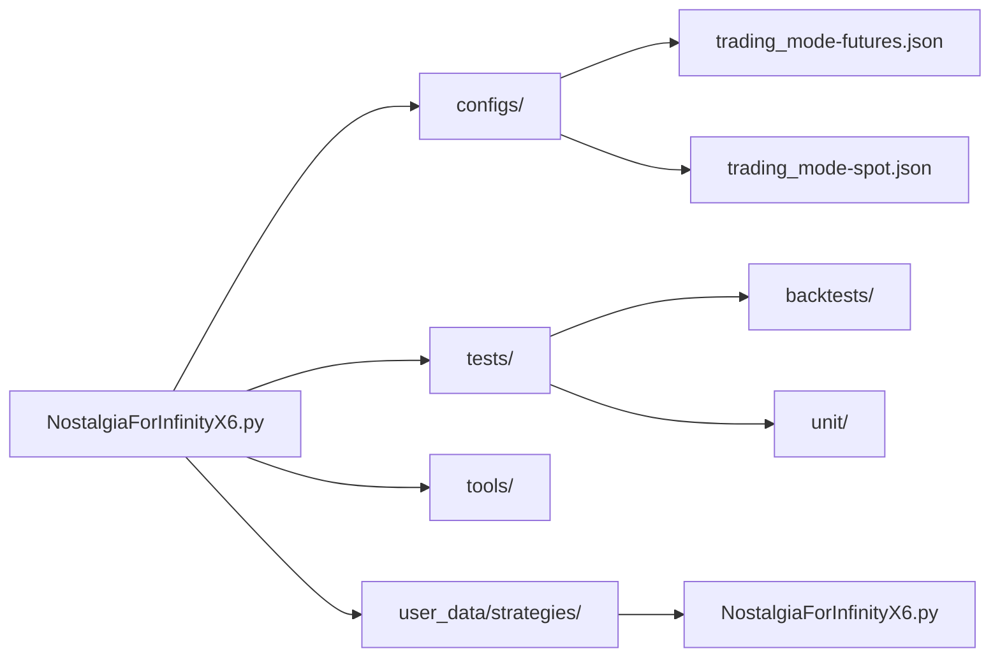
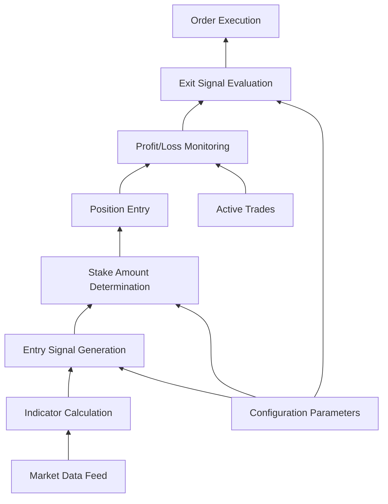
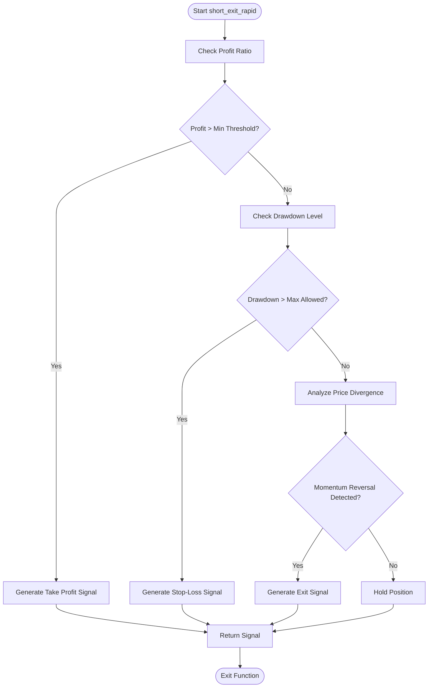

# Short Rapid Mode

<cite>
**Referenced Files in This Document**   
- [NostalgiaForInfinityX6.py](file://NostalgiaForInfinityX6.py)
</cite>

## Table of Contents
1. [Introduction](#introduction)
2. [Project Structure](#project-structure)
3. [Core Components](#core-components)
4. [Architecture Overview](#architecture-overview)
5. [Detailed Component Analysis](#detailed-component-analysis)
6. [Performance Considerations](#performance-considerations)
7. [Troubleshooting Guide](#troubleshooting-guide)
8. [Conclusion](#conclusion)

## Introduction
The Short Rapid Mode is a specialized trading strategy within the NostalgiaForInfinityX6 system designed for high-frequency, algorithmic shorting during periods of high market volatility. This mode leverages tick-level data and real-time order flow analysis to capture micro-trends using tight stop-losses and rapid position turnover. It integrates statistical arbitrage signals to identify short-term price divergences and volume acceleration patterns. The implementation emphasizes execution speed, memory efficiency, and coordination with other shorting modes to prevent conflicting trades. Configuration parameters such as `short_rapid_timeout`, `short_rapid_max_orders`, and `short_rapid_min_profit` allow fine-tuning of behavior based on market conditions and risk tolerance.

## Project Structure
The project follows a modular structure with configuration files, test scripts, and core strategy logic separated into distinct directories. The main trading logic resides in the `NostalgiaForInfinityX6.py` file located in the `user_data/strategies` directory, which is symlinked from the root. Configuration files are organized under the `configs` directory, including exchange-specific blacklists, pair lists, and trading mode settings. The `tests` directory contains backtesting scripts and unit tests for validation. This organization supports both spot and futures trading modes across multiple exchanges.

**Diagram sources**
- [NostalgiaForInfinityX6.py](file://NostalgiaForInfinityX6.py#L0-L100)

**Section sources**
- [NostalgiaForInfinityX6.py](file://NostalgiaForInfinityX6.py#L0-L200)

## Core Components
The core functionality of the Short Rapid Mode is implemented within the `NostalgiaForInfinityX6` class. Key components include entry and exit signal evaluation, stake amount customization, and integration with higher-level trading logic. The mode uses tag-based identification (`short_rapid_mode_tags = ["601", "602", ..., "610"]`) to determine trade context and apply appropriate rules. Entry conditions are controlled via the `short_entry_signal_params` dictionary, where individual conditions can be enabled or disabled. The exit logic is handled by the `short_exit_rapid()` method, which evaluates profit levels, loss thresholds, and market indicators to determine optimal exit points.

**Section sources**
- [NostalgiaForInfinityX6.py](file://NostalgiaForInfinityX6.py#L150-L200)

## Architecture Overview
The architecture of the Short Rapid Mode is built on the Freqtrade framework, extending the `IStrategy` interface to implement custom trading logic. It processes candlestick data at a 5-minute timeframe while incorporating informative timeframes (15m, 1h, 4h, 1d) for trend confirmation. The system uses a modular design where different trading modes (normal, pump, quick, rapid, etc.) are isolated through tag-based routing. This allows concurrent operation of multiple strategies without interference. The flow begins with indicator calculation, followed by entry signal generation, stake determination, and finally exit decision making based on dynamic market conditions.

**Diagram sources**
- [NostalgiaForInfinityX6.py](file://NostalgiaForInfinityX6.py#L0-L1000)

## Detailed Component Analysis

### Short Rapid Mode Entry Logic
The entry logic for Short Rapid Mode is governed by conditions defined in the `short_entry_signal_params` configuration block. Although several conditions are commented out in the default configuration, `short_entry_condition_501_enable` and `short_entry_condition_502_enable` are active. These conditions likely evaluate momentum divergence and volume acceleration patterns using technical indicators. The system checks for the presence of any tag from the `short_rapid_mode_tags` list (601–610) in the trade's entry tags to activate rapid mode-specific logic. This tag-based approach enables flexible combination with other modes while maintaining clear separation of concerns.

**Section sources**
- [NostalgiaForInfinityX6.py](file://NostalgiaForInfinityX6.py#L640-L650)
- [NostalgiaForInfinityX6.py](file://NostalgiaForInfinityX6.py#L156-L169)

### Short Rapid Mode Exit Logic
The exit logic for Short Rapid Mode is executed through the `short_exit_rapid()` function, which is called when a trade's entry tags contain any of the rapid mode identifiers. The function evaluates multiple factors including current profit ratio, maximum profit achieved, drawdown levels, and recent price action across multiple timeframes. Exit signals are generated based on predefined thresholds and market conditions, with specific signal names formatted as `exit_short_rapid_rpd_X` (where X ranges from 1 to 10). Additionally, stop-loss mechanisms such as `exit_short_rapid_stoploss_doom` provide protection against adverse price movements.

**Diagram sources**
- [NostalgiaForInfinityX6.py](file://NostalgiaForInfinityX6.py#L40919-L40942)

**Section sources**
- [NostalgiaForInfinityX6.py](file://NostalgiaForInfinityX6.py#L1974-L1985)
- [NostalgiaForInfinityX6.py](file://NostalgiaForInfinityX6.py#L40919-L41006)

### Stake Management
The stake amount for Short Rapid Mode trades is determined by the `custom_stake_amount()` method, which applies a multiplier to the proposed stake based on the trading mode. For rapid mode trades, the `rapid_mode_stake_multiplier_spot` and `rapid_mode_stake_multiplier_futures` parameters control position sizing. By default, these are set to 0.75, meaning positions are sized at 75% of the standard stake. This conservative sizing aligns with the high-turnover nature of rapid trading, helping manage risk exposure during volatile market conditions.

**Section sources**
- [NostalgiaForInfinityX6.py](file://NostalgiaForInfinityX6.py#L2083-L2100)

## Performance Considerations
The Short Rapid Mode is optimized for low-latency execution and efficient memory usage. Indicator calculations leverage the `pandas_ta` library with optional multi-core processing controlled by `num_cores_indicators_calc`. The strategy processes only new candles (`process_only_new_candles = True`), reducing unnecessary computation. For exchanges with limited API data returns (e.g., OKX, Kraken), the `startup_candle_count` is adjusted downward to ensure compatibility. The use of pre-calculated tags and early-exit conditions minimizes processing overhead during high-frequency trading operations.

**Section sources**
- [NostalgiaForInfinityX6.py](file://NostalgiaForInfinityX6.py#L100-L120)
- [NostalgiaForInfinityX6.py](file://NostalgiaForInfinityX6.py#L1700-L1750)

## Troubleshooting Guide
Common issues with Short Rapid Mode typically involve order throttling, synchronization problems in multi-threaded environments, or misconfigured parameters. Ensure that `use_exit_signal` is set to `true` and `exit_profit_only` is `false` in the configuration to enable proper signal processing. Verify that the exchange rate limits are not being exceeded by monitoring API call frequency. If trades are not being executed as expected, check that the relevant entry conditions (e.g., `short_entry_condition_501_enable`) are enabled in the configuration. For futures trading, confirm that `is_futures_mode` is properly set based on the trading mode configuration.

**Section sources**
- [NostalgiaForInfinityX6.py](file://NostalgiaForInfinityX6.py#L180-L200)
- [NostalgiaForInfinityX6.py](file://NostalgiaForInfinityX6.py#L640-L650)

## Conclusion
The Short Rapid Mode in NostalgiaForInfinityX6 provides a sophisticated mechanism for capturing short-term downward price movements during volatile market conditions. By combining technical analysis of momentum divergence and volume acceleration with tight risk controls, it enables high-frequency algorithmic shorting with defined parameters. The modular design allows seamless integration with other trading modes while maintaining independent risk management. Proper configuration of timeout, order limit, and profit threshold parameters is essential for optimal performance. Continuous monitoring and adjustment based on market conditions will help maintain profitability while managing execution risks.