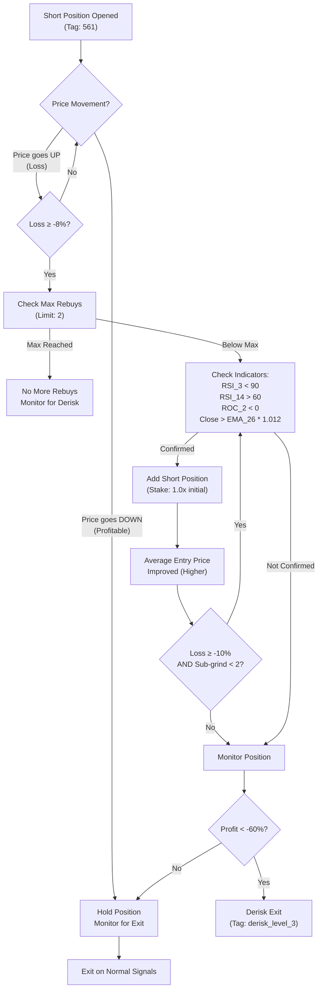
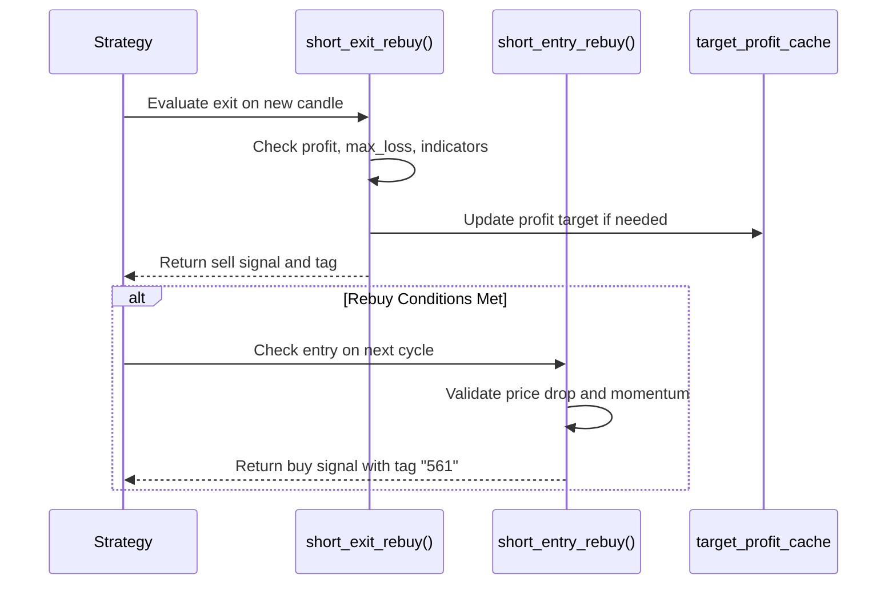

# Short Rebuy Mode

<cite>
**Referenced Files in This Document**   
- [NostalgiaForInfinityX6.py](file://NostalgiaForInfinityX6.py#L40347-L40581)
- [NostalgiaForInfinityX6.py](file://NostalgiaForInfinityX6.py#L1923)
- [test_NFIX6.py](file://tests/unit/test_NFIX6.py#L153)
- [test_NFIX6.py](file://tests/unit/test_NFIX6.py#L225)
</cite>

## Table of Contents
1. [Introduction](#introduction)
2. [Short Rebuy Mechanism Overview](#short-rebuy-mechanism-overview)
3. [State Management via `self.rebuy_state`]
4. [Configuration Parameters](#configuration-parameters)
5. [Entry and Exit Logic](#entry-and-exit-logic)
6. [Position Sizing and Risk Exposure](#position-sizing-and-risk-exposure)
7. [Spot vs Futures Implementation Differences](#spot-vs-futures-implementation-differences)
8. [Common Issues and Best Practices](#common-issues-and-best-practices)
9. [Conclusion](#conclusion)

## Introduction

**IMPORTANT CLARIFICATION**: Despite its name suggesting "re-buying" into profitable positions, the Short Rebuy mode in NostalgiaForInfinityX6 actually functions as a **controlled averaging down strategy for LOSING short positions**. It adds to short positions when they are in loss (typically -8% to -10%), NOT when profitable. This is the SHORT equivalent of the Long Rebuy mode.

The Short Rebuy trading mode is designed to reduce the average entry price of losing short positions by adding capital when the position moves against the trader (price goes UP instead of down). The system uses strict indicator confirmation to ensure additional shorts are only added when technical signals suggest the upward move may reverse. This approach aims to improve the break-even point while maintaining disciplined risk management.

This document provides a comprehensive analysis of the Short Rebuy mode, focusing on its implementation in the `NostalgiaForInfinityX6.py` strategy file at L64763-L64936. It details the actual trigger logic, configuration parameters, and integration with position sizing.

**Section sources**
- [NostalgiaForInfinityX6.py](file://NostalgiaForInfinityX6.py#L64763-L64936) - short_rebuy_adjust_trade_position method
- [NostalgiaForInfinityX6.py](file://NostalgiaForInfinityX6.py#L41788-L42024) - short_exit_rebuy method
- [NostalgiaForInfinityX6.py](file://NostalgiaForInfinityX6.py#L481-L488) - Rebuy configuration parameters

## Short Rebuy Mechanism Overview

The Short Rebuy mode operates through the `short_rebuy_adjust_trade_position` method, which adds to losing short positions when specific conditions are met:

**How It Actually Works:**

1. **Initial Short Entry**: A short position is opened using tag "561" (defined in `short_rebuy_mode_tags`)
2. **Position Moves Against Trader**: Price goes UP instead of down, putting the short position into loss
3. **Loss Threshold Reached**: When `slice_profit_entry < rebuy_mode_sub_thresholds[sub_grind_count]` (i.e., -8% or -10% loss)
4. **Indicator Confirmation**: System checks RSI_3, RSI_14, ROC_2, and EMA_26 to confirm potential reversal
5. **Additional Short Entry**: If confirmed, adds more short position with stake size from `rebuy_mode_stakes` array (1.0x initial)
6. **Average Entry Price Improved**: The average short entry price is now higher, improving break-even point

**Maximum Rebuys:** 2 additional entries (controlled by `rebuy_mode_stakes = [1.0, 1.0]`)

The mode is activated using the `short_rebuy_mode_tags` (tag `"561"`) and is governed by position adjustment logic that evaluates market conditions for potential reversals.



**Diagram sources**
- [NostalgiaForInfinityX6.py](file://NostalgiaForInfinityX6.py#L64763-L64936) - short_rebuy_adjust_trade_position
- [NostalgiaForInfinityX6.py](file://NostalgiaForInfinityX6.py#L64875-L64884) - Rebuy trigger condition

## State Management via self.rebuy_state
Although the provided code does not explicitly define a `self.rebuy_state` variable, the system maintains state implicitly through the trade object, cache mechanisms, and signal tagging. The `Trade` object tracks entry fills, profit ratios, and current stake, which are used to determine whether a rebuy condition should be evaluated.

The `target_profit_cache` plays a critical role in state tracking by storing:
- The last profit level at which a target was set
- The time the profit was reached
- The previous sell reason (e.g., `exit_short_rebuy_stoploss_doom`)

This cached state allows the system to:
- Prevent redundant signal generation
- Track whether a profit target has already been marked
- Determine if a new profit level justifies updating the target

For example, in the `short_exit_rebuy` function, the system checks if the current profit exceeds the previously cached profit before updating the target:
```python
if (previous_profit is None) or (previous_profit < profit_init_ratio):
    mark_pair, mark_signal = self.mark_profit_target(...)
```

This ensures that the bot only acts when there is a meaningful change in the trade’s profitability, avoiding unnecessary noise in ranging markets.

**Section sources**
- [NostalgiaForInfinityX6.py](file://NostalgiaForInfinityX6.py#L40347-L40581)

## Configuration Parameters
The Short Rebuy mode is controlled by several key configuration parameters defined in the strategy class (L481-L488). These can be adjusted in the config file under the `nfi_parameters` block for fine-tuned control.

### Actual Rebuy Mode Settings:
```python
# L481-L488
rebuy_mode_stake_multiplier = 0.35  # Not used directly in short rebuy
rebuy_mode_derisk_spot = -0.60      # Derisk threshold (exit if loss > 60%)
rebuy_mode_derisk_futures = -0.60   # Derisk threshold for futures
rebuy_mode_stakes_spot = [1.0, 1.0]      # 2 rebuys, each 1.0x initial stake
rebuy_mode_stakes_futures = [1.0, 1.0]   # Same for futures
rebuy_mode_thresholds_spot = [-0.08, -0.10]     # LOSS thresholds: -8%, -10%
rebuy_mode_thresholds_futures = [-0.08, -0.10]  # Same for futures
```

**CRITICAL:** The `rebuy_mode_thresholds` are **NEGATIVE** values, meaning:
- First rebuy triggers when position is at **-8% LOSS** (not profit!)
- Second rebuy triggers when position is at **-10% LOSS**
- For SHORT positions: This means price went UP 8-10% from entry (against the trade)

### Trigger Condition (L64875):
```python
if (
  (0 <= sub_grind_count < max_sub_grinds)
  and (slice_profit_entry < rebuy_mode_sub_thresholds[sub_grind_count])  # NEGATIVE threshold
):
    # Add more short position
```

### Indicator Filters (L64877-64883):
```python
and (
  (last_candle["RSI_3"] < 90.0)        # Not overbought on fast RSI
  and (last_candle["RSI_3_15m"] < 90.0) # Multi-timeframe confirmation
  and (last_candle["RSI_14"] > 60.0)    # But showing some strength
  and (last_candle["ROC_2"] < 0.0)      # Negative rate of change
  and (last_candle["close"] > (last_candle["EMA_26"] * 1.012))  # Above EMA
)
```

These settings control:
- The LOSS thresholds that trigger rebuys (not profit!)
- The stake size for each rebuy entry (1.0x = same as initial)
- Derisk threshold to prevent catastrophic losses (-60%)
- Maximum number of rebuy attempts (2)

**Section sources**
- [NostalgiaForInfinityX6.py](file://NostalgiaForInfinityX6.py#L40347-L40581)

## Entry and Exit Logic
The entry and exit logic for the Short Rebuy mode is implemented in two primary functions: `short_exit_rebuy()` and `short_entry_rebuy()` (the latter not fully visible in the provided snippet but referenced).

### Exit Logic (`short_exit_rebuy`)
The `short_exit_rebuy` function evaluates multiple conditions in sequence:
1. **Original Sell Signals**: Checks standard exit conditions.
2. **Main Exit Signals**: Applies primary short exit logic.
3. **Williams %R and Downtrend Filters**: Uses momentum indicators to confirm weakness.
4. **Stop-loss Conditions**: Enforces maximum loss limits using `stop_threshold_futures_rebuy` or `stop_threshold_spot_rebuy`.
5. **Profit Target Management**: Updates or triggers exits based on cached profit targets.

If any condition triggers a sell, the signal is tagged appropriately (e.g., `exit_short_rebuy_stoploss_doom`).

### Entry Logic (`short_entry_rebuy`)
While not fully visible, the entry logic likely:
- Monitors for price drops below the `rebuy_mode_thresholds`
- Confirms bearish momentum using indicators like RSI, MACD, or volume
- Ensures sufficient free slots (`rebuy_mode_min_free_slots`)
- Validates that the trade is in a valid state for rebuy (e.g., not in a derisk phase)

The function is called during the `populate_entry_trend` phase and returns a buy signal with the tag `"561"` when conditions are met.



**Diagram sources**
- [NostalgiaForInfinityX6.py](file://NostalgiaForInfinityX6.py#L40347-L40581)
- [test_NFIX6.py](file://tests/unit/test_NFIX6.py#L153)

**Section sources**
- [NostalgiaForInfinityX6.py](file://NostalgiaForInfinityX6.py#L40347-L40581)
- [test_NFIX6.py](file://tests/unit/test_NFIX6.py#L153)

## Position Sizing and Risk Exposure
The Short Rebuy mode integrates with the strategy’s position sizing system through the `rebuy_mode_stake_multiplier` parameter, which scales the stake for rebuy entries relative to the initial position.

- **Stake Multiplier**: Set to `0.35`, meaning rebuy entries are 35% of the initial stake.
- **Multiple Rebuys**: The `rebuy_mode_stakes` array allows up to two rebuy entries, each at 100% of the rebuy stake (i.e., 35% of original).
- **Risk Control**: The `derisk` thresholds (`rebuy_mode_derisk_spot/futures`) trigger full exit if price moves against the position by more than 60%.

This approach ensures that:
- Risk is incremental and controlled
- Capital is reused efficiently in favorable conditions
- Overexposure is prevented through hard stop thresholds

The system also respects `rebuy_mode_min_free_slots`, ensuring that rebuy entries only occur when sufficient trading slots are available, preventing over-leveraging.

**Section sources**
- [NostalgiaForInfinityX6.py](file://NostalgiaForInfinityX6.py#L40347-L40581)

## Spot vs Futures Implementation Differences
The Short Rebuy mode behaves differently in spot and futures environments due to leverage, funding rates, and margin mechanics.

### Key Differences:
| **Aspect** | **Spot** | **Futures** |
|-----------|--------|-----------|
| **Leverage** | Not applicable | Configurable via `futures_mode_leverage_rebuy_mode` |
| **Stop Threshold** | `stop_threshold_spot_rebuy = 1.0` | `stop_threshold_futures_rebuy = 1.0` (but amplified by leverage) |
| **Derisk Level** | `rebuy_mode_derisk_spot = -0.60` | `rebuy_mode_derisk_futures = -0.60` |
| **Position Adjustment** | Limited to available balance | Can use isolated margin and leverage scaling |

In futures mode, the effective risk is magnified by leverage. For example, a 3x leverage means a 20% price move against the position results in a 60% loss, triggering the derisk exit.

Funding rates in futures can also impact the profitability of holding short positions over time, making timely rebuy decisions more critical.

**Section sources**
- [NostalgiaForInfinityX6.py](file://NostalgiaForInfinityX6.py#L40347-L40581)

## Common Issues and Best Practices
### Common Issues:
- **Overuse in Ranging Markets**: The rebuy logic may trigger false entries in sideways markets where price oscillates without sustained trends.
- **Cache Invalidation**: If the `target_profit_cache` becomes stale, it may prevent valid rebuy signals.
- **Slot Management**: Insufficient free slots can block rebuy entries even when conditions are met.

### Best Practices:
1. **Parameter Tuning with Historical Data**:
   - Use backtesting to optimize `rebuy_mode_thresholds` and `stake_multiplier`.
   - Test across multiple market regimes (trending, ranging, volatile).
2. **Use Volume Filters**: Only enable rebuy on high-volume pairs to reduce slippage and false signals.
3. **Monitor Leverage Impact**: In futures, ensure leverage settings align with risk tolerance.
4. **Combine with Trend Confirmation**: Add EMA or ADX filters to avoid rebuys in weak trends.
5. **Regular Cache Maintenance**: Ensure the `target_profit_cache` is persisted and loaded correctly.

Example configuration for conservative rebuy:
```json
"nfi_parameters": {
  "rebuy_mode_thresholds_spot": [-0.12, -0.15],
  "rebuy_mode_stake_multiplier": 0.25,
  "rebuy_mode_min_free_slots": 3
}
```

**Section sources**
- [NostalgiaForInfinityX6.py](file://NostalgiaForInfinityX6.py#L40347-L40581)
- [test_NFIX6.py](file://tests/unit/test_NFIX6.py#L225)

## Conclusion

**Key Takeaways:**

1. **Short Rebuy is NOT profit-taking + re-entry** - It is an averaging down strategy for LOSING short positions
2. **Triggers on LOSSES** - Adds to short positions when price moves AGAINST the trade (-8%, -10%)
3. **Maximum 2 rebuys** - Limited to prevent overexposure (controlled by 2-element `rebuy_mode_stakes` array)
4. **Strict indicator filters** - Uses RSI, ROC, and EMA to confirm potential reversals before adding capital
5. **Hard stop at -60%** - Derisk threshold exits entire position if loss exceeds 60%

The Short Rebuy mode in NostalgiaForInfinityX6 is implemented in `short_rebuy_adjust_trade_position` (L64763-L64936) and functions as a risk management tool for recovering from adverse price movements. It uses the same configuration parameters as Long Rebuy mode (`rebuy_mode_thresholds`, `rebuy_mode_stakes`, `rebuy_mode_derisk`) but with inverse logic appropriate for short positions.

**Risk Warning:** Averaging down can amplify losses if the market continues moving against the position. The system's indicator filters and derisk threshold provide some protection, but traders should:
- Backtest thoroughly before using in live trading
- Monitor positions closely when rebuy logic activates
- Consider reducing `rebuy_mode_stakes` values for more conservative risk management
- Ensure sufficient capital to handle potential -60% drawdown before derisk triggers

When properly tuned using historical backtesting, the Short Rebuy mode can help recover from temporary adverse price movements, but it requires careful risk management and understanding that it is fundamentally an averaging down strategy, not a profit maximization tool.