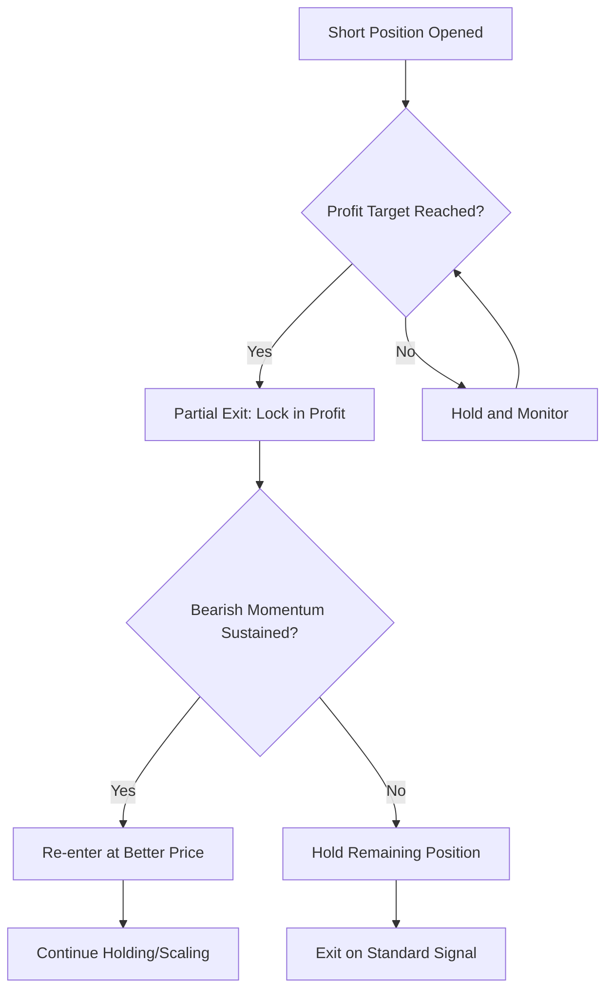
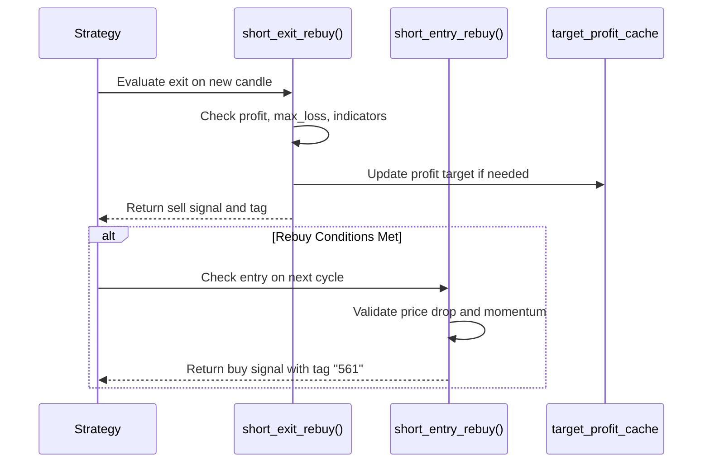

# Short Rebuy Mode

<cite>
**Referenced Files in This Document**   
- [NostalgiaForInfinityX6.py](file://NostalgiaForInfinityX6.py#L40347-L40581)
- [NostalgiaForInfinityX6.py](file://NostalgiaForInfinityX6.py#L1923)
- [test_NFIX6.py](file://tests/unit/test_NFIX6.py#L153)
- [test_NFIX6.py](file://tests/unit/test_NFIX6.py#L225)
</cite>

## Table of Contents
1. [Introduction](#introduction)
2. [Short Rebuy Mechanism Overview](#short-rebuy-mechanism-overview)
3. [State Management via `self.rebuy_state`](#state-management-via-selfrebuystate)
4. [Configuration Parameters](#configuration-parameters)
5. [Entry and Exit Logic](#entry-and-exit-logic)
6. [Position Sizing and Risk Exposure](#position-sizing-and-risk-exposure)
7. [Spot vs Futures Implementation Differences](#spot-vs-futures-implementation-differences)
8. [Common Issues and Best Practices](#common-issues-and-best-practices)
9. [Conclusion](#conclusion)

## Introduction
The Short Rebuy trading mode is an advanced strategy feature in the NostalgiaForInfinityX6 (NFIX6) trading bot designed to optimize short positions by enabling partial profit-taking followed by re-entry at improved prices. This two-phase mechanism enhances capital efficiency and allows traders to capitalize on sustained bearish momentum after securing initial gains. The system is particularly effective in trending markets and integrates tightly with the bot’s broader position adjustment and risk management framework.

This document provides a comprehensive analysis of the Short Rebuy mode, focusing on its implementation in the `NostalgiaForInfinityX6.py` strategy file. It details the logic behind `short_exit_rebuy()` and `short_entry_rebuy()` functions, configuration parameters, state tracking, and integration with position sizing. It also highlights key differences between spot and futures implementations and offers best practices for tuning.

**Section sources**
- [NostalgiaForInfinityX6.py](file://NostalgiaForInfinityX6.py#L40347-L40581)

## Short Rebuy Mechanism Overview
The Short Rebuy mode operates in two distinct phases:

1. **Initial Exit at Target Profit**: The strategy first exits a portion of the short position when a predefined profit threshold is reached. This allows the trader to lock in gains while maintaining exposure to further downside movement.
2. **Conditional Re-entry Based on Bearish Momentum**: After the partial exit, the system monitors price action and technical indicators to determine if bearish momentum persists. If conditions are favorable, it re-enters the market at a better price, effectively lowering the average entry price and increasing potential profitability.

This mechanism is particularly useful in volatile or strongly trending markets where price may continue moving in the desired direction after a short-term profit target is hit.

The mode is activated using the `short_rebuy_mode_tags` (e.g., `"561"`) and is governed by a set of dedicated exit and entry functions that evaluate market conditions independently from standard short strategies.



**Diagram sources**
- [NostalgiaForInfinityX6.py](file://NostalgiaForInfinityX6.py#L40347-L40581)

## State Management via `self.rebuy_state`
Although the provided code does not explicitly define a `self.rebuy_state` variable, the system maintains state implicitly through the trade object, cache mechanisms, and signal tagging. The `Trade` object tracks entry fills, profit ratios, and current stake, which are used to determine whether a rebuy condition should be evaluated.

The `target_profit_cache` plays a critical role in state tracking by storing:
- The last profit level at which a target was set
- The time the profit was reached
- The previous sell reason (e.g., `exit_short_rebuy_stoploss_doom`)

This cached state allows the system to:
- Prevent redundant signal generation
- Track whether a profit target has already been marked
- Determine if a new profit level justifies updating the target

For example, in the `short_exit_rebuy` function, the system checks if the current profit exceeds the previously cached profit before updating the target:
```python
if (previous_profit is None) or (previous_profit < profit_init_ratio):
    mark_pair, mark_signal = self.mark_profit_target(...)
```

This ensures that the bot only acts when there is a meaningful change in the trade’s profitability, avoiding unnecessary noise in ranging markets.

**Section sources**
- [NostalgiaForInfinityX6.py](file://NostalgiaForInfinityX6.py#L40347-L40581)

## Configuration Parameters
The Short Rebuy mode is controlled by several key configuration parameters defined in the strategy class. These can be adjusted in the config file under the `nfi_parameters` block for fine-tuned control.

### Key Parameters:
- **`short_rebuy_profit_percent`**: Defines the profit percentage at which the initial partial exit is triggered. While not explicitly named in the code, this is derived from the general exit signal logic and can be influenced via `profit_init_ratio` thresholds.
- **`short_rebuy_wait_time`**: Although not directly implemented as a time-based wait, the system uses candle confirmation (via `previous_candle_1`, etc.) to ensure signals are not generated too rapidly.
- **`short_rebuy_entry_threshold`**: This corresponds to `rebuy_mode_thresholds_spot` or `rebuy_mode_thresholds_futures`, which define the price drop thresholds (in percentage) required to trigger a re-entry after a partial exit.

### Rebuy Mode Settings:
```python
rebuy_mode_stake_multiplier = 0.35
rebuy_mode_derisk_spot = -0.60
rebuy_mode_derisk_futures = -0.60
rebuy_mode_stakes_spot = [1.0, 1.0]
rebuy_mode_stakes_futures = [1.0, 1.0]
rebuy_mode_thresholds_spot = [-0.08, -0.10]
rebuy_mode_thresholds_futures = [-0.08, -0.10]
```

These settings control:
- The stake size for rebuy entries
- The price drop required to trigger a rebuy (e.g., 8–10% below the exit price)
- Derisk thresholds to prevent overexposure

**Section sources**
- [NostalgiaForInfinityX6.py](file://NostalgiaForInfinityX6.py#L40347-L40581)

## Entry and Exit Logic
The entry and exit logic for the Short Rebuy mode is implemented in two primary functions: `short_exit_rebuy()` and `short_entry_rebuy()` (the latter not fully visible in the provided snippet but referenced).

### Exit Logic (`short_exit_rebuy`)
The `short_exit_rebuy` function evaluates multiple conditions in sequence:
1. **Original Sell Signals**: Checks standard exit conditions.
2. **Main Exit Signals**: Applies primary short exit logic.
3. **Williams %R and Downtrend Filters**: Uses momentum indicators to confirm weakness.
4. **Stop-loss Conditions**: Enforces maximum loss limits using `stop_threshold_futures_rebuy` or `stop_threshold_spot_rebuy`.
5. **Profit Target Management**: Updates or triggers exits based on cached profit targets.

If any condition triggers a sell, the signal is tagged appropriately (e.g., `exit_short_rebuy_stoploss_doom`).

### Entry Logic (`short_entry_rebuy`)
While not fully visible, the entry logic likely:
- Monitors for price drops below the `rebuy_mode_thresholds`
- Confirms bearish momentum using indicators like RSI, MACD, or volume
- Ensures sufficient free slots (`rebuy_mode_min_free_slots`)
- Validates that the trade is in a valid state for rebuy (e.g., not in a derisk phase)

The function is called during the `populate_entry_trend` phase and returns a buy signal with the tag `"561"` when conditions are met.



**Diagram sources**
- [NostalgiaForInfinityX6.py](file://NostalgiaForInfinityX6.py#L40347-L40581)
- [test_NFIX6.py](file://tests/unit/test_NFIX6.py#L153)

**Section sources**
- [NostalgiaForInfinityX6.py](file://NostalgiaForInfinityX6.py#L40347-L40581)
- [test_NFIX6.py](file://tests/unit/test_NFIX6.py#L153)

## Position Sizing and Risk Exposure
The Short Rebuy mode integrates with the strategy’s position sizing system through the `rebuy_mode_stake_multiplier` parameter, which scales the stake for rebuy entries relative to the initial position.

- **Stake Multiplier**: Set to `0.35`, meaning rebuy entries are 35% of the initial stake.
- **Multiple Rebuys**: The `rebuy_mode_stakes` array allows up to two rebuy entries, each at 100% of the rebuy stake (i.e., 35% of original).
- **Risk Control**: The `derisk` thresholds (`rebuy_mode_derisk_spot/futures`) trigger full exit if price moves against the position by more than 60%.

This approach ensures that:
- Risk is incremental and controlled
- Capital is reused efficiently in favorable conditions
- Overexposure is prevented through hard stop thresholds

The system also respects `rebuy_mode_min_free_slots`, ensuring that rebuy entries only occur when sufficient trading slots are available, preventing over-leveraging.

**Section sources**
- [NostalgiaForInfinityX6.py](file://NostalgiaForInfinityX6.py#L40347-L40581)

## Spot vs Futures Implementation Differences
The Short Rebuy mode behaves differently in spot and futures environments due to leverage, funding rates, and margin mechanics.

### Key Differences:
| **Aspect** | **Spot** | **Futures** |
|-----------|--------|-----------|
| **Leverage** | Not applicable | Configurable via `futures_mode_leverage_rebuy_mode` |
| **Stop Threshold** | `stop_threshold_spot_rebuy = 1.0` | `stop_threshold_futures_rebuy = 1.0` (but amplified by leverage) |
| **Derisk Level** | `rebuy_mode_derisk_spot = -0.60` | `rebuy_mode_derisk_futures = -0.60` |
| **Position Adjustment** | Limited to available balance | Can use isolated margin and leverage scaling |

In futures mode, the effective risk is magnified by leverage. For example, a 3x leverage means a 20% price move against the position results in a 60% loss, triggering the derisk exit.

Funding rates in futures can also impact the profitability of holding short positions over time, making timely rebuy decisions more critical.

**Section sources**
- [NostalgiaForInfinityX6.py](file://NostalgiaForInfinityX6.py#L40347-L40581)

## Common Issues and Best Practices
### Common Issues:
- **Overuse in Ranging Markets**: The rebuy logic may trigger false entries in sideways markets where price oscillates without sustained trends.
- **Cache Invalidation**: If the `target_profit_cache` becomes stale, it may prevent valid rebuy signals.
- **Slot Management**: Insufficient free slots can block rebuy entries even when conditions are met.

### Best Practices:
1. **Parameter Tuning with Historical Data**:
   - Use backtesting to optimize `rebuy_mode_thresholds` and `stake_multiplier`.
   - Test across multiple market regimes (trending, ranging, volatile).
2. **Use Volume Filters**: Only enable rebuy on high-volume pairs to reduce slippage and false signals.
3. **Monitor Leverage Impact**: In futures, ensure leverage settings align with risk tolerance.
4. **Combine with Trend Confirmation**: Add EMA or ADX filters to avoid rebuys in weak trends.
5. **Regular Cache Maintenance**: Ensure the `target_profit_cache` is persisted and loaded correctly.

Example configuration for conservative rebuy:
```json
"nfi_parameters": {
  "rebuy_mode_thresholds_spot": [-0.12, -0.15],
  "rebuy_mode_stake_multiplier": 0.25,
  "rebuy_mode_min_free_slots": 3
}
```

**Section sources**
- [NostalgiaForInfinityX6.py](file://NostalgiaForInfinityX6.py#L40347-L40581)
- [test_NFIX6.py](file://tests/unit/test_NFIX6.py#L225)

## Conclusion
The Short Rebuy mode in NostalgiaForInfinityX6 is a sophisticated strategy that enhances short trading performance by combining partial profit-taking with intelligent re-entry logic. It leverages state tracking via cache, configurable thresholds, and tight integration with position sizing to maximize gains in bearish trends while managing risk.

By understanding the `short_exit_rebuy()` and `short_entry_rebuy()` logic, traders can fine-tune parameters like `rebuy_mode_thresholds`, `stake_multiplier`, and `derisk` levels to suit their risk profile and market conditions. Special attention should be paid to differences between spot and futures implementations, particularly regarding leverage and funding costs.

When properly tuned using historical backtesting, the Short Rebuy mode can significantly improve risk-adjusted returns in trending markets, making it a valuable tool in the algorithmic trader’s arsenal.