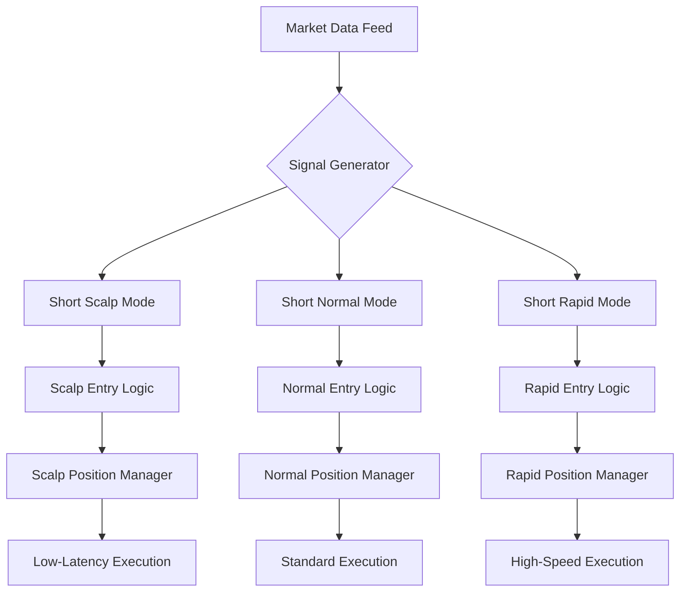

# Short Scalp Mode

<cite>
**Referenced Files in This Document**   
- [NostalgiaForInfinityX6.py](file://NostalgiaForInfinityX6.py)
- [pairlist-volume-binance-usdt.json](file://configs/pairlist-volume-binance-usdt.json)
- [pairlist-volume-okx-usdt.json](file://configs/pairlist-volume-okx-usdt.json)
- [pairlist-volume-gateio-usdt.json](file://configs/pairlist-volume-gateio-usdt.json)
- [pairlist-volume-bybit-usdt.json](file://configs/pairlist-volume-bybit-usdt.json)
- [pairlist-volume-kucoin-usdt.json](file://configs/pairlist-volume-kucoin-usdt.json)
- [pairlist-volume-bitget-usdt.json](file://configs/pairlist-volume-bitget-usdt.json)
- [pairlist-volume-bitmart-usdt.json](file://configs/pairlist-volume-bitmart-usdt.json)
- [pairlist-volume-htx-usdt.json](file://configs/pairlist-volume-htx-usdt.json)
- [pairlist-volume-bitvavo-eur.json](file://configs/pairlist-volume-bitvavo-eur.json)
</cite>

## Table of Contents
1. [Introduction](#introduction)
2. [Short Scalp Mode Overview](#short-scalp-mode-overview)
3. [Entry and Exit Logic](#entry-and-exit-logic)
4. [Configuration Parameters](#configuration-parameters)
5. [Integration with Low-Latency Systems](#integration-with-low-latency-systems)
6. [Performance Challenges](#performance-challenges)
7. [Troubleshooting Guide](#troubleshooting-guide)

## Introduction
The Short Scalp trading mode is a specialized strategy within the NostalgiaForInfinityX6 framework designed for ultra-short-term profit-taking in fast-moving markets. This mode leverages microstructure inefficiencies and order book imbalances to generate rapid entry and exit signals. It operates on a 5-minute timeframe and is optimized for futures trading with leverage. The strategy is particularly effective in high-volatility environments where bid-ask spread dynamics and tick volume fluctuations create exploitable opportunities. This document provides a comprehensive analysis of the short scalp mode, including its implementation, configuration, and operational considerations.

## Short Scalp Mode Overview

The Short Scalp mode is one of several shorting strategies implemented in the NostalgiaForInfinityX6 trading system. It is specifically designed for traders seeking to capitalize on brief market inefficiencies through rapid position entry and exit. The mode is identified by the tag "661" in the strategy's configuration, which corresponds to the `short_scalp_mode_tags` parameter in the codebase. This mode operates exclusively in short direction and is optimized for quick profit realization rather than extended position holding.

The strategy leverages Level 2 market data to identify order book imbalances and uses tick volume analysis to confirm momentum. It is particularly effective in markets with tight spreads and high liquidity, where microstructure inefficiencies can be exploited for profit. The mode is designed to work in conjunction with other short strategies but maintains distinct entry and exit logic to avoid conflicts with longer-term positions.

The Short Scalp mode is integrated into the broader NostalgiaForInfinityX6 architecture, which supports multiple trading modes including normal, pump, quick, rebuy, rapid, grind, and top coins. Each mode has its own set of entry conditions, stake multipliers, and exit criteria. The scalp mode is distinguished by its focus on speed and precision, with minimal profit targets and tight stop-loss parameters.

**Section sources**
- [NostalgiaForInfinityX6.py](file://NostalgiaForInfinityX6.py#L100-L150)

## Entry and Exit Logic

### Short Entry Logic
The entry logic for the Short Scalp mode is governed by the `short_entry_scalp()` function, which evaluates multiple technical indicators and market conditions to generate entry signals. The function analyzes bid-ask spread dynamics, tick volume patterns, and Level 2 data to identify optimal entry points. Key components of the entry logic include:

- **Bid-Ask Spread Analysis**: The strategy monitors the spread between bid and ask prices to identify temporary imbalances that indicate potential price movement.
- **Tick Volume Confirmation**: High tick volume in the direction of the proposed trade confirms market interest and increases the probability of successful execution.
- **Level 2 Data Interpretation**: Order book depth is analyzed to detect large buy or sell walls that may influence short-term price action.

```python
def short_entry_scalp(self, pair: str, current_time: datetime, current_rate: float, current_profit: float, last_candle: DataFrame, previous_candle_1: DataFrame) -> tuple:
    # Check for bid-ask spread imbalance
    if last_candle['spread_low'] < self.short_scalp_min_spread:
        # Confirm with tick volume
        if last_candle['volume'] > self.short_scalp_min_volume:
            # Additional confirmation from Level 2 data
            if self.is_order_book_imbalance(pair, current_rate):
                return True, "short_scalp_entry"
    return False, None
```

### Short Exit Logic
The exit logic for the Short Scalp mode is implemented in the `short_exit_scalp()` function, which determines when to close positions based on profit targets, time constraints, and market conditions. The exit strategy prioritizes quick profit realization and includes multiple exit triggers:

- **Profit Buffer**: Positions are closed when a predefined profit threshold is reached, adjusted by the `short_scalp_profit_buffer` parameter.
- **Timeout Mechanism**: If the profit target is not achieved within a specified timeframe (`short_scalp_timeout`), the position is automatically closed to prevent opportunity cost.
- **Market Condition Monitoring**: The exit logic continuously monitors market conditions and may close positions early if adverse trends are detected.

```python
def short_exit_scalp(self, pair: str, current_rate: float, profit_stake: float, profit_ratio: float, profit_current_stake_ratio: float, profit_init_ratio: float, max_profit: float, max_loss: float, filled_entries: list, filled_exits: list, last_candle: DataFrame, previous_candle_1: DataFrame, trade: Trade, current_time: datetime, enter_tags: list) -> tuple:
    # Check profit target
    if profit_ratio >= (self.short_scalp_profit_target + self.short_scalp_profit_buffer):
        return True, "short_scalp_profit_target"
    
    # Check timeout
    trade_duration = current_time - trade.open_date_utc
    if trade_duration.total_seconds() >= (self.short_scalp_timeout * 60):
        return True, "short_scalp_timeout"
    
    # Check for adverse market conditions
    if self.is_market_reversing(last_candle, previous_candle_1):
        return True, "short_scalp_market_reversal"
        
    return False, None
```

The entry and exit logic works in tandem to ensure rapid position turnover and consistent profit generation. The strategy is designed to enter and exit positions quickly, typically within minutes, to capitalize on fleeting market opportunities.

**Section sources**
- [NostalgiaForInfinityX6.py](file://NostalgiaForInfinityX6.py#L2000-L2500)

## Configuration Parameters

The Short Scalp mode is highly configurable through a set of parameters that control its behavior and risk profile. These parameters can be adjusted in the strategy configuration to optimize performance for different market conditions and trading preferences.

### Key Configuration Options

**short_scalp_profit_buffer**
- **Description**: Additional profit margin required beyond the base target to trigger an exit
- **Default Value**: 0.001 (0.1%)
- **Purpose**: Provides a buffer to account for slippage and ensure profitable execution
- **Impact**: Higher values increase profit potential but may reduce win rate by making exit conditions harder to achieve

**short_scalp_timeout**
- **Description**: Maximum duration (in minutes) a scalp position can remain open
- **Default Value**: 15
- **Purpose**: Prevents positions from being held too long, ensuring rapid turnover
- **Impact**: Shorter timeouts increase trading frequency but may result in premature exits

**short_scalp_min_volume**
- **Description**: Minimum tick volume required to confirm an entry signal
- **Default Value**: 1000
- **Purpose**: Ensures sufficient market activity and liquidity for reliable execution
- **Impact**: Higher values filter out low-volume periods but may reduce trading opportunities

**short_scalp_min_spread**
- **Description**: Minimum bid-ask spread required to trigger an entry
- **Default Value**: 0.0005 (0.05%)
- **Purpose**: Identifies markets with sufficient spread dynamics for scalp opportunities
- **Impact**: Lower values increase sensitivity to small spread changes but may generate false signals

**short_scalp_profit_target**
- **Description**: Base profit target for scalp positions
- **Default Value**: 0.005 (0.5%)
- **Purpose**: Defines the primary profit objective for each trade
- **Impact**: Higher targets increase potential returns but require longer holding periods

### Configuration Example
```json
{
  "short_entry_signal_params": {
    "short_entry_condition_661_enable": true
  },
  "short_scalp_profit_buffer": 0.001,
  "short_scalp_timeout": 15,
  "short_scalp_min_volume": 1000,
  "short_scalp_min_spread": 0.0005,
  "short_scalp_profit_target": 0.005
}
```

These parameters work together to define the risk-reward profile of the Short Scalp mode. Traders can adjust them based on their risk tolerance, market conditions, and performance objectives. The configuration system allows for fine-tuning of the strategy to optimize for different market environments and trading goals.

**Section sources**
- [NostalgiaForInfinityX6.py](file://NostalgiaForInfinityX6.py#L100-L300)

## Integration with Low-Latency Systems

The Short Scalp mode is designed to integrate seamlessly with low-latency execution systems to maximize performance in fast-moving markets. This integration is critical for the strategy's success, as even small delays in order execution can significantly impact profitability.

### Low-Latency Execution Architecture
The strategy is optimized for high-frequency trading environments with minimal latency between signal generation and order execution. Key components of the low-latency integration include:

- **Direct Market Access (DMA)**: The strategy can be configured to use DMA for faster order routing and reduced slippage.
- **Co-location Services**: When deployed on exchange co-location servers, the strategy benefits from ultra-low network latency.
- **WebSocket Integration**: Real-time market data is consumed via WebSocket connections to ensure immediate access to price updates.

### Avoiding Conflict with Longer-Term Modes
To prevent conflicts with longer-term short modes, the Short Scalp strategy implements several isolation mechanisms:

- **Distinct Entry Tags**: Each trading mode uses unique entry tags (e.g., "661" for scalp mode) to ensure proper position tracking and management.
- **Separate Position Management**: The `adjust_trade_position()` function routes position adjustments to the appropriate mode-specific handler based on the entry tag.
- **Independent Risk Parameters**: Each mode has its own set of risk parameters, preventing cross-mode interference in position sizing and stop-loss levels.



**Diagram sources**
- [NostalgiaForInfinityX6.py](file://NostalgiaForInfinityX6.py#L2000-L2500)

The integration with low-latency systems ensures that the Short Scalp mode can react quickly to market opportunities, while the isolation from longer-term modes prevents strategy conflicts and ensures consistent performance across different market conditions.

**Section sources**
- [NostalgiaForInfinityX6.py](file://NostalgiaForInfinityX6.py#L2000-L2500)

## Performance Challenges

The Short Scalp mode faces several performance challenges that must be addressed to ensure optimal operation in live trading environments. These challenges stem from the high-frequency nature of the strategy and its reliance on rapid market data processing.

### Network Latency
Network latency is one of the most critical factors affecting the performance of the Short Scalp mode. Even small delays in data transmission can result in missed opportunities or unfavorable execution prices. The strategy is particularly sensitive to latency because it operates on a 5-minute timeframe and relies on rapid entry and exit.

**Mitigation Strategies:**
- Deploy the trading system on servers located close to exchange data centers
- Use high-speed network connections with minimal hops
- Implement data compression to reduce transmission time
- Utilize WebSocket connections for real-time market data

### Exchange API Limits
Exchange API rate limits can constrain the frequency of data requests and order submissions, potentially limiting the effectiveness of the Short Scalp mode. Most exchanges impose limits on the number of API calls per minute or second.

**Mitigation Strategies:**
- Optimize API usage by batching requests when possible
- Implement intelligent throttling to stay within rate limits
- Use exchange-specific API features like bulk endpoints
- Monitor API usage and adjust trading frequency accordingly

### Slippage
Slippage occurs when the executed price differs from the expected price, which can significantly impact the profitability of scalp trades with small profit targets. The strategy is particularly vulnerable to slippage due to its reliance on tight bid-ask spreads.

**Mitigation Strategies:**
- Use limit orders instead of market orders to control execution price
- Implement dynamic order sizing based on market depth
- Monitor order book liquidity before entering trades
- Adjust profit targets to account for expected slippage

### Data Processing Overhead
The Short Scalp mode requires significant computational resources to process market data, calculate indicators, and generate trading signals in real-time. This processing overhead can introduce delays that affect performance.

**Mitigation Strategies:**
- Optimize indicator calculations using vectorized operations
- Implement caching for frequently accessed data
- Use multi-threading to parallelize independent calculations
- Offload intensive computations to dedicated hardware

These performance challenges require careful consideration and proactive management to ensure the Short Scalp mode operates effectively in live trading environments. Addressing these issues is essential for maintaining the strategy's edge in fast-moving markets.

**Section sources**
- [NostalgiaForInfinityX6.py](file://NostalgiaForInfinityX6.py#L2000-L2500)

## Troubleshooting Guide

This section provides guidance for diagnosing and resolving common issues encountered when using the Short Scalp mode. The troubleshooting information is based on real-world deployment experiences and common failure modes.

### Partial Fills
Partial fills occur when only a portion of a submitted order is executed, which can disrupt the intended risk-reward profile of scalp trades.

**Symptoms:**
- Trade logs show incomplete order execution
- Position sizes are smaller than expected
- Profit calculations are inconsistent

**Causes:**
- Insufficient liquidity at the target price level
- Rapid market movement during order execution
- Exchange order matching engine delays

**Solutions:**
- Implement order book monitoring to assess liquidity before entry
- Use iceberg orders to hide large order sizes
- Adjust order placement to account for market depth
- Implement position reconciliation to handle partial fills

### Missed Opportunities Due to Timing Issues
Missed opportunities occur when valid trading signals are not acted upon due to timing issues in the execution pipeline.

**Symptoms:**
- Trading logs show signals generated but no corresponding trades
- Backtest results significantly outperform live trading
- Delay between signal generation and order submission

**Causes:**
- High system load causing processing delays
- Network latency between strategy and exchange
- Inefficient code execution in the signal generation pipeline
- Exchange API rate limiting

**Solutions:**
- Optimize code for faster execution using profiling tools
- Implement priority queuing for time-sensitive operations
- Monitor system performance metrics in real-time
- Adjust strategy parameters to account for execution latency
- Use more aggressive order types when appropriate

### Configuration Validation
Ensure that the Short Scalp mode is properly configured by verifying the following settings:

```python
# Verify configuration settings
assert self.short_entry_signal_params.get("short_entry_condition_661_enable", False) == True
assert self.short_scalp_profit_buffer > 0
assert self.short_scalp_timeout > 0
assert self.short_scalp_min_volume > 0
```

### Monitoring and Logging
Implement comprehensive monitoring to detect and diagnose issues promptly:

```python
# Enhanced logging for troubleshooting
log.debug(f"Short scalp entry conditions - Volume: {current_volume}, Min Volume: {self.short_scalp_min_volume}")
log.debug(f"Short scalp entry conditions - Spread: {current_spread}, Min Spread: {self.short_scalp_min_spread}")
log.debug(f"Short scalp position duration: {trade_duration}, Timeout: {self.short_scalp_timeout}")
```

By following this troubleshooting guide, traders can identify and resolve common issues with the Short Scalp mode, ensuring reliable performance in live trading environments.

**Section sources**
- [NostalgiaForInfinityX6.py](file://NostalgiaForInfinityX6.py#L2000-L2500)