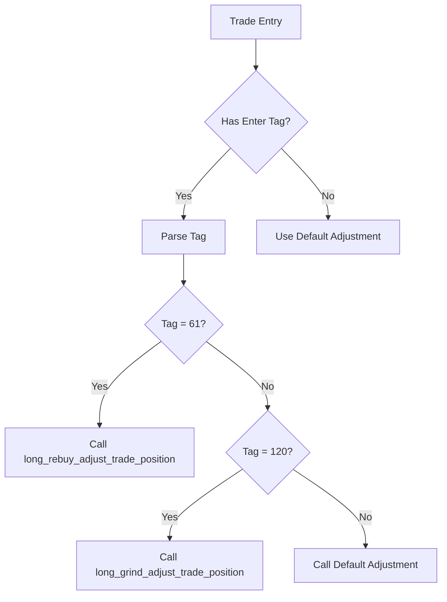

# Troubleshooting

<cite>
**Referenced Files in This Document**   
- [NostalgiaForInfinityX6.py](file://NostalgiaForInfinityX6.py)
- [test_NFIX6.py](file://tests/unit/test_NFIX6.py)
- [pytest.ini](file://pytest.ini)
- [recommended_config.json](file://configs/recommended_config.json)
</cite>

## Table of Contents
1. [No Trades Generated](#no-trades-generated)
2. [Position Not Adjusting](#position-not-adjusting)
3. [Configuration Not Loading](#configuration-not-loading)
4. [Backtest Results Differ from Live Trading](#backtest-results-differ-from-live-trading)
5. [Testing and Validation](#testing-and-validation)

## No Trades Generated

When the strategy fails to generate any trades, the most common causes are overly strict entry conditions or an incorrect pair list configuration.

### Root Causes
- **Overly strict entry conditions**: Entry signal parameters may be disabled or thresholds too high.
- **Incorrect pair list**: The configured pair list might not contain suitable trading pairs or may be empty.
- **Missing timeframe data**: Required candle data might not be available for the specified timeframe (5m).
- **Blacklisted pairs**: Target pairs might be excluded by the blacklist configuration.

### Debugging Steps
1. **Check logs for entry signal evaluation**:
   ```bash
   grep "long_entry_condition" user_data/logs/freqtrade.log
   ```
2. **Validate pair list availability**:
   - Confirm that the pair list file (e.g., `pairlist-volume-binance-usdt.json`) exists and contains valid pairs.
   - Verify the exchange supports the listed pairs.
3. **Test entry conditions in isolation**:
   - Temporarily enable all entry conditions in `long_entry_signal_params`.
   - Use `test_NFIX6.py` to validate signal generation logic.
4. **Verify configuration loading**:
   - Ensure `strategy` is set to `NostalgiaForInfinityX6` in config.
   - Confirm `timeframe` is set to `5m`.

### Solutions
- **Relax entry thresholds**: Set all `long_entry_condition_*_enable` parameters to `True` temporarily.
- **Use recommended pair list**: Employ `pairlist-volume-binance-usdt.json` or similar volume-based pair lists.
- **Validate pair availability**: Use exchange API to confirm pairs exist and are tradable.
- **Check data availability**: Ensure sufficient historical data exists for the 5m timeframe.

**Section sources**
- [NostalgiaForInfinityX6.py](file://NostalgiaForInfinityX6.py#L68-L173)
- [recommended_config.json](file://configs/recommended_config.json#L1-L17)

## Position Not Adjusting

When position adjustments (grinding/derisking) fail to trigger, it typically indicates issues with the adjustment logic or configuration.

### Root Causes
- **Position adjustment disabled**: `position_adjustment_enable` set to `False`.
- **Incorrect entry tags**: Trade enter tags don't match expected values for adjustment functions.
- **Grinding logic not triggered**: Profit thresholds or stop conditions not met.
- **Insufficient free slots**: Rebuy mode requires minimum free slots (`rebuy_mode_min_free_slots`).

### Debugging Steps
1. **Check adjustment enable flag**:
   ```python
   print(strategy.position_adjustment_enable)  # Should be True
   ```
2. **Verify enter tags in logs**:
   ```bash
   grep "enter_tag" user_data/logs/freqtrade.log
   ```
3. **Test adjustment logic with unit tests**:
   ```bash
   pytest tests/unit/test_NFIX6.py::test_adjust_trade_position -v
   ```
4. **Inspect grinding parameters**:
   - Check `grind_*` and `derisk_*` threshold values.
   - Verify `grinding_enable` and `derisk_enable` are `True`.

### Solutions
- **Enable position adjustment**: Set `position_adjustment_enable = True`.
- **Ensure correct tagging**: Confirm trades have appropriate tags (e.g., "61" for rebuy, "120" for grind).
- **Adjust thresholds**: Modify `grind_*_thresholds` to more achievable levels.
- **Increase free slots**: Reduce `rebuy_mode_min_free_slots` if necessary.



**Diagram sources**
- [NostalgiaForInfinityX6.py](file://NostalgiaForInfinityX6.py#L9091-L16871)
- [test_NFIX6.py](file://tests/unit/test_NFIX6.py#L46-L107)

**Section sources**
- [NostalgiaForInfinityX6.py](file://NostalgiaForInfinityX6.py#L300-L350)
- [test_NFIX6.py](file://tests/unit/test_NFIX6.py#L46-L107)

## Configuration Not Loading

Configuration loading issues typically stem from JSON syntax errors or incorrect file paths.

### Root Causes
- **JSON syntax errors**: Invalid JSON in configuration files.
- **File path issues**: Incorrect relative paths in `add_config_files`.
- **Missing required files**: Essential configuration files not present.
- **Permission issues**: Unable to read configuration files.

### Debugging Steps
1. **Validate JSON syntax**:
   ```bash
   python -m json.tool configs/recommended_config.json
   ```
2. **Check file paths**:
   - Verify all paths in `add_config_files` are correct.
   - Confirm files exist at specified locations.
3. **Test configuration loading**:
   ```bash
   freqtrade trade --config user_data/config.json --dry-run
   ```
4. **Check file permissions**:
   ```bash
   ls -la configs/
   ```

### Solutions
- **Fix JSON syntax**: Use JSON validator to correct syntax errors.
- **Use relative paths**: Ensure paths in `add_config_files` are relative to config file location.
- **Include all required files**: Make sure `exampleconfig.json` and secret files are properly configured.
- **Verify file existence**: Confirm all referenced files are present in the filesystem.

**Section sources**
- [recommended_config.json](file://configs/recommended_config.json#L1-L17)

## Backtest Results Differ from Live Trading

Discrepancies between backtest and live trading results are commonly caused by data quality or fee model differences.

### Root Causes
- **Data quality differences**: Backtest data may have gaps or inaccuracies.
- **Fee model discrepancies**: Different fee structures between backtest and live environments.
- **Slippage differences**: Backtest may not account for real-world slippage.
- **Order execution differences**: Market conditions affect actual execution prices.

### Debugging Steps
1. **Compare data sources**:
   - Verify backtest data is up-to-date and complete.
   - Check for missing candles in the dataset.
2. **Validate fee configuration**:
   ```python
   # In strategy
   custom_fee_open_rate = None  # Uses exchange fees
   custom_fee_close_rate = None
   ```
3. **Analyze execution differences**:
   - Compare entry/exit prices between backtest and live trades.
   - Check for significant price movements during order execution.
4. **Run consistency tests**:
   ```bash
   pytest tests/backtests/test_winrate_and_drawdown.py
   ```

### Solutions
- **Update market data**: Download latest market data using:
  ```bash
  ./tools/download-necessary-exchange-market-data-for-backtests.sh
  ```
- **Align fee models**: Set `custom_fee_open_rate` and `custom_fee_close_rate` to match exchange fees.
- **Account for slippage**: Adjust `max_slippage` parameter to reflect real-world conditions.
- **Use consistent timeframes**: Ensure backtest and live trading use identical timeframes and data sources.

**Section sources**
- [NostalgiaForInfinityX6.py](file://NostalgiaForInfinityX6.py#L250-L260)
- [test_winrate_and_drawdown.py](file://tests/backtests/test_winrate_and_drawdown.py#L0-L49)

## Testing and Validation

Systematic testing is crucial for validating strategy logic and ensuring reliable operation.

### Unit Testing
The strategy includes comprehensive unit tests in `tests/unit/test_NFIX6.py` for validating core logic.

#### Running Unit Tests
```bash
# Run all unit tests
pytest tests/unit/

# Test specific functionality
pytest tests/unit/test_NFIX6.py::test_adjust_trade_position -v
pytest tests/unit/test_NFIX6.py::test_custom_exit_calls_correct_functions -v
```

#### Key Test Areas
- **Adjust trade position logic**: Validates correct adjustment function is called based on enter tags.
- **Custom exit functions**: Ensures proper exit functions are invoked for different entry conditions.
- **Signal updates**: Tests configuration-driven updates to entry signal parameters.

### Configuration Testing
Use `pytest.ini` to configure test execution:
```ini
[pytest]
addopts=-n 5 -rA -vv -s -p no:cacheprovider -p no:random_order
```

### Recommended Testing Approach
1. **Start with dry runs**: Test strategy with `dry_run = true`.
2. **Proceed to paper trading**: Validate in live market conditions without real funds.
3. **Gradual live deployment**: Start with small position sizes and monitor performance.
4. **Systematic validation**: Use unit tests and backtests to verify each component.

### Diagnostic Commands
```bash
# Check indicator outputs
grep "indicator" user_data/logs/freqtrade.log

# Analyze signal generation
grep -E "entry_signal|exit_signal" user_data/logs/freqtrade.log

# Monitor position adjustments
grep "adjust_trade_position" user_data/logs/freqtrade.log
```

**Section sources**
- [test_NFIX6.py](file://tests/unit/test_NFIX6.py#L0-L315)
- [pytest.ini](file://pytest.ini#L0-L9)